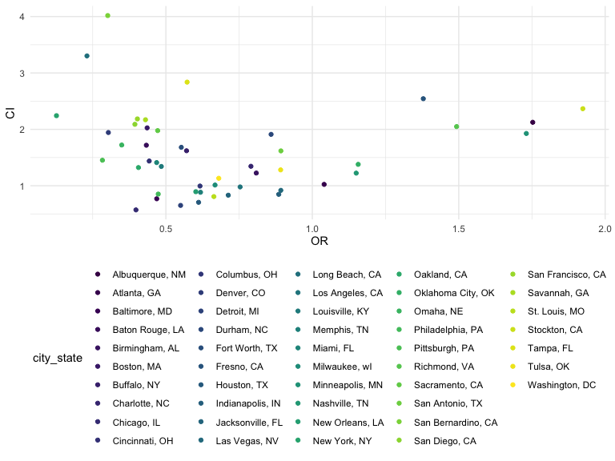
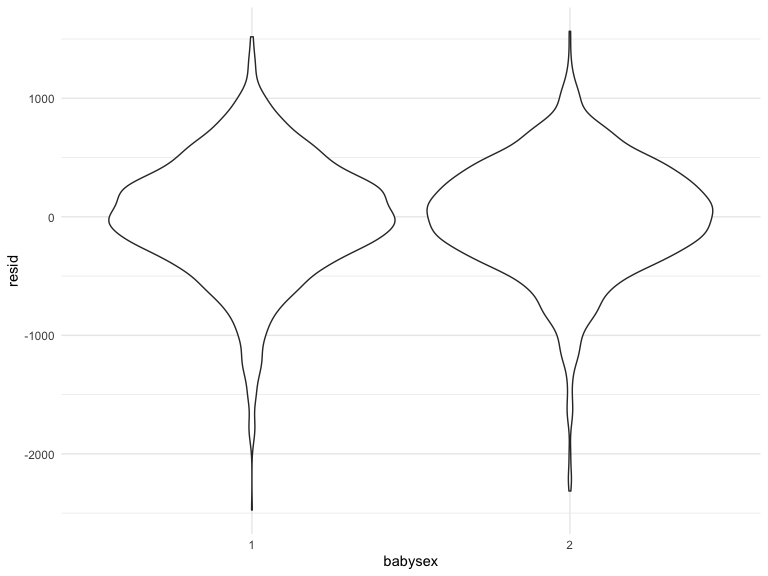
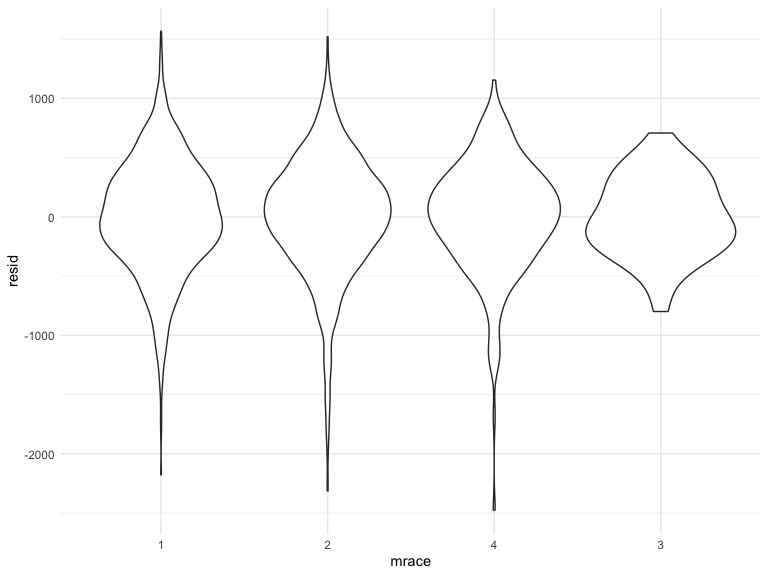
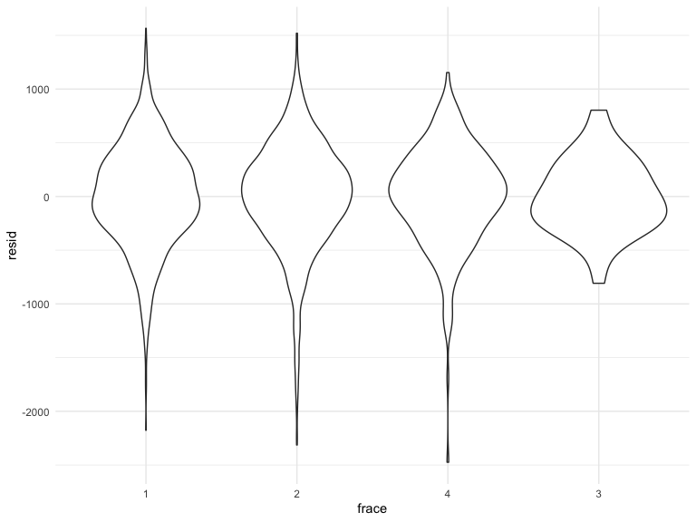
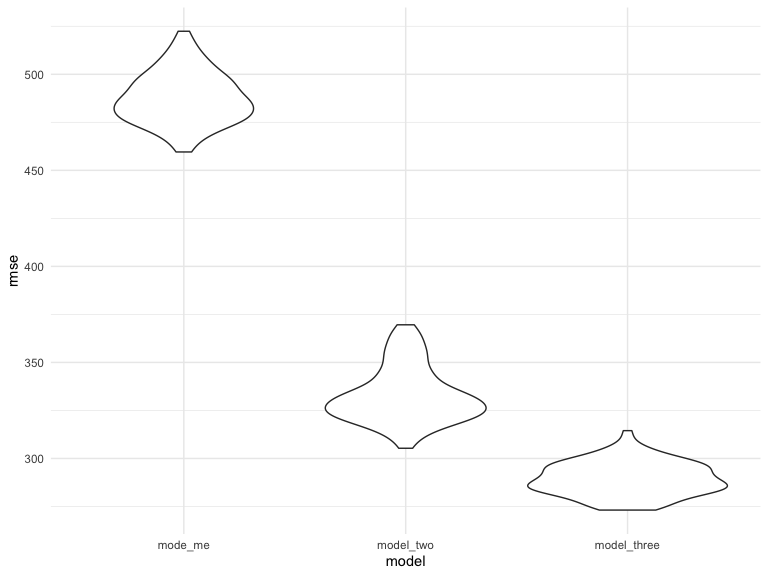

Homework 6
================
Erfan Faridmoayer

### Problem 1

To obtain a distribution for $\hat{r}^2$, we’ll follow basically the
same procedure we used for regression coefficients: draw bootstrap
samples; the a model to each; extract the value I’m concerned with; and
summarize. Here, we’ll use `modelr::bootstrap` to draw the samples and
`broom::glance` to produce `r.squared` values.

``` r
weather_df = 
  rnoaa::meteo_pull_monitors(
    c("USW00094728"),
    var = c("PRCP", "TMIN", "TMAX"), 
    date_min = "2017-01-01",
    date_max = "2017-12-31") %>%
  mutate(
    name = recode(id, USW00094728 = "CentralPark_NY"),
    tmin = tmin / 10,
    tmax = tmax / 10) %>%
  select(name, id, everything())
```

    ## Registered S3 method overwritten by 'hoardr':
    ##   method           from
    ##   print.cache_info httr

    ## using cached file: ~/Library/Caches/R/noaa_ghcnd/USW00094728.dly

    ## date created (size, mb): 2022-10-04 09:44:45 (8.408)

    ## file min/max dates: 1869-01-01 / 2022-10-31

``` r
weather_df %>% 
  modelr::bootstrap(n = 5000) %>% 
  mutate(
    models = map(strap, ~lm(tmax ~ tmin, data = .x) ),
    results = map(models, broom::glance)) %>% 
  select(-strap, -models) %>% 
  unnest(results) %>% 
  ggplot(aes(x = r.squared)) + geom_density()
```


In this example, the $\hat{r}^2$ value is high, and the upper bound at 1
may be a cause for the generally skewed shape of the distribution. If we
wanted to construct a confidence interval for $R^2$, we could take the
2.5% and 97.5% quantiles of the estimates across bootstrap samples.
However, because the shape isn’t symmetric, using the mean +/- 1.96
times the standard error probably wouldn’t work well.

We can produce a distribution for $\log(\beta_0 * \beta1)$ using a
similar approach, with a bit more wrangling before we make our plot.

``` r
weather_df %>% 
  modelr::bootstrap(n = 5000) %>% 
  mutate(
    models = map(strap, ~lm(tmax ~ tmin, data = .x) ),
    results = map(models, broom::tidy)) %>% 
  select(-strap, -models) %>% 
  unnest(results) %>% 
  select(id = `.id`, term, estimate) %>% 
  pivot_wider(
    names_from = term, 
    values_from = estimate) %>% 
  rename(beta0 = `(Intercept)`, beta1 = tmin) %>% 
  mutate(log_b0b1 = log(beta0 * beta1)) %>% 
  ggplot(aes(x = log_b0b1)) + geom_density()
```


As with $r^2$, this distribution is somewhat skewed and has some
outliers.

The point of this is not to say you should always use the bootstrap –
it’s possible to establish “large sample” distributions for strange
parameters / values / summaries in a lot of cases, and those are great
to have. But it is helpful to know that there’s a way to do inference
even in tough cases.

### Problem 2

``` r
homocide_df = 
read_csv("./data/homicide-data.csv") %>% 
  janitor::clean_names() %>% 
  mutate(
    city_state = str_c(city, ", ", state),
    resolved = ifelse(disposition == "Closed by arrest", 1, 0)
    ) %>%
  filter(!city_state == "Dallas, Tx", !city_state == "Phoenix, AZ", !city_state == "Kansas City, MO", !city_state == "Tulsa, AL", !victim_age == "Unknown") %>% 
    mutate(victim_age = as.numeric(victim_age)) %>% 
  filter(victim_race == c("Black", "White"))
```

    ## Rows: 52179 Columns: 12
    ## ── Column specification ────────────────────────────────────────────────────────
    ## Delimiter: ","
    ## chr (9): uid, victim_last, victim_first, victim_race, victim_age, victim_sex...
    ## dbl (3): reported_date, lat, lon
    ## 
    ## ℹ Use `spec()` to retrieve the full column specification for this data.
    ## ℹ Specify the column types or set `show_col_types = FALSE` to quiet this message.

In the code chunk above, I used the `homocide-data` database to create a
dataframe, added the `city_state` variable, removed Tulsa, Kansas City,
Phoenix, and Dallas using `filter()` function, created a new variable
`solved` to post whether a case was solved or not, with 1 showing
solved, and 0 showing not. The `victim_age` column was converted to
numerical vector after tidy of unknown variables. Lastly, Black and
White races were filtered.

``` r
fit_logistic = 
  homocide_df %>% 
  filter(city_state == "Baltimore, MD") %>% 
  mutate(victim_sex = fct_relevel(victim_sex, "Male")) %>% 
  glm(resolved ~ victim_age + victim_race + victim_sex, data = ., family = binomial()) 
```

In the code chunk above, I filtered out Baltimore, MD from `city_state`
variable. I then used the `glm` function to fit a logistic regression
with resolved vs unresolved as the outcome and victim, age, sex, and
race as predictors. The output of the model was saved as an object in
`fit_logistic`.

``` r
fit_logistic %>% 
  broom::tidy() %>% 
  mutate(OR = exp(estimate)) %>%
  mutate(
    ci_lower = exp(estimate-1.96*std.error),
    ci_upper = exp(estimate+1.96*std.error)
  ) %>% 
  knitr::kable(digits = 3)
```

| term             | estimate | std.error | statistic | p.value |    OR | ci_lower | ci_upper |
|:-----------------|---------:|----------:|----------:|--------:|------:|---------:|---------:|
| (Intercept)      |   -0.639 |     0.149 |    -4.277 |   0.000 | 0.528 |    0.394 |    0.708 |
| victim_age       |   -0.003 |     0.005 |    -0.662 |   0.508 | 0.997 |    0.988 |    1.006 |
| victim_raceWhite |    0.779 |     0.239 |     3.256 |   0.001 | 2.179 |    1.364 |    3.482 |
| victim_sexFemale |    0.758 |     0.196 |     3.869 |   0.000 | 2.133 |    1.453 |    3.132 |

Above, I used the `broom::tidy` package to tidy the object, and obtained
OR based on the estimate, as well as the confidence intervals. Based on
the results, we can tell that female victims had a lower likelihood of
having their case resolved compared to male victims when keeping all
other variables fixed.

``` r
city_glm =
homocide_df %>% 
  nest(data = -city_state) %>% 
  mutate(
    models = map(data, ~glm(resolved ~ victim_age + victim_race + victim_sex, data = ., family = binomial())),
    results = map(models, broom::tidy, conf.int = TRUE)
  ) %>% 
  select(-data, -models) %>% 
  unnest(results) %>% 
  mutate(
    OR = exp(estimate),
    CI = conf.high - conf.low) %>% 
  filter(term == "victim_sexMale") %>% 
  arrange(OR)

city_glm %>% 
  ggplot(aes(x = OR, y = CI, color = city_state)) +
  geom_point()
```



Based on the code chunk above, we used the `purrr::map` function to
calculate the OR and CI based on the previous code chunk on the cities
in the dataset. When organized by OR, we can see that Stockton, CA had
the highest likelihood of having their case resolved if the victim was
male, and New York, NY had the least likelihood of having the case
resolved if the victim was male among those who identify as either black
or white. Lastly, we used `ggplot()` to map out CI and OR among
different cities, coding them by their color.

### Problem 3

``` r
weight_df = 
read.csv("./data/birthweight.csv") %>% 
  janitor::clean_names() %>% 
  mutate(
   frace = fct_infreq(as.character(frace)),
   mrace = fct_infreq(as.character(mrace)),
   babysex = fct_infreq(as.character(babysex))
  ) %>% 
  filter(!frace == "8", !frace == "9", !mrace == "8") %>% 
  drop_na()

fit = lm(bwt ~ babysex + frace + mrace, data = weight_df)

fit %>% 
  broom::tidy() %>% 
  mutate(
    term = str_replace(term, "frace2", "frace: Black"),
    term = str_replace(term, "frace3", "frace: Asian"),
    term = str_replace(term, "frace4", "frace: PR")
    ) %>% 
  select(term, estimate, p.value) %>% 
  knitr::kable(digits = 3)
```

| term         | estimate | p.value |
|:-------------|---------:|--------:|
| (Intercept)  | 3305.956 |   0.000 |
| babysex2     |  -80.642 |   0.000 |
| frace: Black |  -38.987 |   0.646 |
| frace: PR    |  -31.690 |   0.692 |
| frace: Asian |   -2.904 |   0.982 |
| mrace2       | -277.777 |   0.001 |
| mrace4       | -175.947 |   0.029 |
| mrace3       | -130.198 |   0.325 |

Above, I imported and tidied the `birthweight.csv` file. Paternal races
were recategorized as a factor, and “other” or “unknown” values were
filtered out. Subsequently, a `fit` model was developed for baby weight
on birth based on baby gender, family income, race, maternal BMI, and
smoking status.

``` r
weight_df %>% 
  modelr::add_residuals(fit) %>% 
  ggplot(aes(x = babysex, y = resid)) + geom_violin()
```



``` r
weight_df %>% 
  modelr::add_residuals(fit) %>% 
  ggplot(aes(x = mrace, y = resid)) + geom_violin()
```



``` r
weight_df %>% 
  modelr::add_residuals(fit) %>% 
  ggplot(aes(x = frace, y = resid)) + geom_violin()
```



``` r
modelr::add_predictions(weight_df, fit)
```

    ##      babysex bhead blength  bwt delwt fincome frace gaweeks malform menarche
    ## 1          2    34      51 3629   177      35     1    39.9       0       13
    ## 2          1    34      48 3062   156      65     2    25.9       0       14
    ## 3          2    36      50 3345   148      85     1    39.9       0       12
    ## 4          1    34      52 3062   157      55     1    40.0       0       14
    ## 5          2    34      52 3374   156       5     1    41.6       0       13
    ## 6          1    33      52 3374   129      55     1    40.7       0       12
    ## 7          2    33      46 2523   126      96     2    40.3       0       14
    ## 8          2    33      49 2778   140       5     1    37.4       0       12
    ## 9          1    36      52 3515   146      85     1    40.3       0       11
    ## 10         1    33      50 3459   169      75     2    40.7       0       12
    ## 11         2    35      51 3317   130      55     1    43.4       0       13
    ## 12         1    35      51 3459   146      55     1    39.4       0       12
    ## 13         2    35      48 3175   158      75     1    39.7       0       13
    ## 14         1    36      53 3629   147      75     1    41.3       0       11
    ## 15         1    35      51 3544   129      65     1    39.6       0       12
    ## 16         2    33      49 2551   120      75     2    38.1       0       11
    ## 17         1    35      56 3232   147      55     1    42.1       0       13
    ## 18         2    36      52 3629   154      65     1    40.3       0       11
    ## 19         2    35      57 3374   147      45     1    39.6       0       12
    ## 20         2    35      53 3345   127      65     2    39.7       0       14
    ## 21         1    34      52 3203   134      25     1    41.1       0       14
    ## 22         2    35      50 3175   140      85     2    40.6       0       14
    ## 23         1    34      49 3175   148      96     2    39.7       0       10
    ## 24         2    36      51 2977   135      45     1    41.7       0       13
    ## 25         2    36      56 3685   170      95     1    40.3       0       12
    ## 26         1    34      63 3175   143      25     1    41.9       0       13
    ## 27         1    36      52 3629   152      45     1    39.6       0       11
    ## 28         2    33      49 2948   129      25     1    41.0       0       13
    ## 29         1    35      51 3345   145      75     1    41.3       0       12
    ## 30         2    35      52 3289   135      55     1    40.6       0       13
    ## 31         2    34      49 3118   161      45     2    38.9       0       10
    ## 32         2    34      52 3629   112      25     1    38.0       0       10
    ## 33         1    36      54 3402   161      95     1    40.1       0       11
    ## 34         2    35      51 3827   130      45     1    41.3       0       12
    ## 35         1    38      53 3799   167      75     1    39.9       0       12
    ## 36         2    33      54 3062   134      65     1    40.4       0       12
    ## 37         1    35      55 3856   171      85     1    41.1       0       13
    ## 38         2    34      51 3005   149      85     1    39.3       0       14
    ## 39         1    35      53 3175   130      45     1    40.4       0       13
    ## 40         2    34      54 3345   130      95     1    42.1       0       10
    ## 41         2    35      53 3600   141      35     1    42.3       0       14
    ## 42         2    34      51 3232   155      55     1    41.6       0       15
    ## 43         1    35      52 3232   121      75     3    42.3       0       13
    ## 44         2    34      51 3175   142      96     1    42.3       0       17
    ## 45         2    33      49 3147   140      45     1    40.6       0       12
    ## 46         2    34      49 3317   142      35     1    40.4       0       12
    ## 47         2    34      49 2948   135      75     1    42.7       0       12
    ## 48         2    34      49 3033   128      25     1    41.1       0       12
    ## 49         1    33      51 3345   140      85     1    38.6       0       13
    ## 50         1    34      53 3232   150      35     1    39.6       0       12
    ## 51         2    36      51 3317   136      65     1    42.6       0       14
    ## 52         1    35      51 3147   165      65     1    40.1       0       13
    ## 53         1    34      52 3118   130      75     1    41.0       0       12
    ## 54         1    33      50 3175   168      25     1    40.0       0       13
    ## 55         2    32      48 2551   170      35     1    39.9       0        8
    ## 56         2    33      51 3289   155      65     1    41.6       0       15
    ## 57         2    34      54 3402   154      75     1    40.7       0       14
    ## 58         2    35      52 3487   121      45     1    39.9       0       11
    ## 59         2    34      51 3203   132      85     1    43.7       0       13
    ## 60         1    37      54 3515   143      15     1    41.7       0       12
    ## 61         1    34      51 2920   129      45     1    39.4       0       11
    ## 62         2    30      42 2013   150      65     2    37.7       0       13
    ## 63         1    34      52 3033   172      85     1    41.1       0       16
    ## 64         1    31      46 2381   139      75     1    34.7       0       12
    ## 65         2    33      52 3118   155      45     1    37.9       0       11
    ## 66         2    34      53 3600   148      45     1    40.9       0       13
    ## 67         2    33      54 3402   150      45     1    41.4       0       14
    ## 68         1    34      51 3459   123      45     1    40.0       0       12
    ## 69         1    36      53 3203   140      55     2    39.7       0       14
    ## 70         1    35      50 3289   155      85     1    39.0       0       11
    ## 71         1    34      53 3544   128      35     1    40.4       0       13
    ## 72         2    36      52 4224   178      35     1    41.6       0       13
    ## 73         1    34      47 3090   147      85     1    42.1       0       12
    ## 74         1    35      56 3912   150      65     1    40.6       0       12
    ## 75         1    34      53 3459   150      35     1    41.7       0       13
    ## 76         1    34      50 3374   132      55     1    41.4       0       12
    ## 77         2    35      52 2778   165      25     2    30.4       0       13
    ## 78         1    33      48 2551   157      35     1    37.9       0       13
    ## 79         2    34      51 3232   123      96     1    38.4       0       11
    ## 80         1    35      52 3544   137      65     1    42.7       0       13
    ## 81         2    33      49 2920   135      45     1    38.6       0       10
    ## 82         2    34      51 3430   172      45     1    40.9       0       12
    ## 83         2    35      53 3799   189      96     1    44.6       0       14
    ## 84         1    32      47 2438   137      25     2    39.0       0       13
    ## 85         1    34      51 2977   149      15     3    40.3       0       13
    ## 86         2    34      50 3005   137      35     2    35.9       0       15
    ## 87         2    34      46 2977   145      75     2    47.7       0       11
    ## 88         1    35      50 3118   137      15     1    40.7       0       12
    ## 89         2    35      51 3062   115      96     3    41.4       0       13
    ## 90         1    34      50 3062   140      95     1    41.4       0       13
    ## 91         2    36      56 3969   160      96     2    42.6       0       12
    ## 92         1    35      51 3090   190      35     1    39.3       0       18
    ## 93         2    33      54 3175   173      75     1    35.1       0       12
    ## 94         2    33      48 2438   138      96     1    42.6       0       13
    ## 95         2    33      45 2211   129      65     1    40.3       0       13
    ## 96         1    35      55 3572   182      75     1    40.1       0       13
    ## 97         1    35      52 3487   138      55     1    40.0       0       13
    ## 98         1    34      52 3118   124      65     1    38.7       0       13
    ## 99         2    32      49 2778   140      55     1    38.3       0       12
    ## 100        2    35      51 3515   160      25     1    40.0       0       13
    ## 101        1    35      56 3487   142      45     1    40.4       0       12
    ## 102        2    31      48 2722   121      65     1    39.4       0       13
    ## 103        2    36      53 3799   135      55     1    40.3       0       12
    ## 104        2    32      49 3374   121      85     1    37.3       0       13
    ## 105        1    33      52 2835   140      35     1    40.7       0       12
    ## 106        2    35      55 3487   170      55     1    43.4       0        9
    ## 107        2    33      48 3685   135      55     1    39.7       0       12
    ## 108        1    37      58 4791   144      45     1    40.7       0       12
    ## 109        1    32      47 2693   149      65     1    35.0       0       12
    ## 110        1    33      49 2722   143      55     1    39.6       0       10
    ## 111        2    34      50 3459   145      35     1    41.1       0       13
    ## 112        2    36      50 3515   138       5     1    40.3       0       16
    ## 113        1    36      49 2863   138      96     2    41.6       0       13
    ## 114        1    35      53 3629   141      95     1    42.1       0       10
    ## 115        1    32      48 2637   120      65     1    35.7       0       15
    ## 116        1    33      50 3118   145      55     1    39.3       0       13
    ## 117        2    32      48 2665   145      15     1    38.3       0       15
    ## 118        1    32      46 2211   143      65     2    36.4       0       14
    ## 119        2    34      53 3317   143      35     1    40.3       0       11
    ## 120        2    33      50 2580   137      55     1    39.6       0       13
    ## 121        2    35      53 3912   145      55     1    40.1       0       11
    ## 122        1    35      52 3884   131      45     1    39.7       0       11
    ## 123        1    31      46 2126   118      75     1    36.3       0       11
    ## 124        2    34      52 3175   130      25     1    39.9       1       10
    ## 125        2    33      48 2778   175      35     2    30.6       0       12
    ## 126        1    34      52 3005   125       5     1    36.9       0       12
    ## 127        2    34      46 2750   127      75     1    37.0       0       13
    ## 128        2    33      52 2892   126      25     1    42.0       0       13
    ## 129        1    35      57 3147   125      96     1    41.6       0       14
    ## 130        2    35      53 3657   146      55     1    40.1       0       13
    ## 131        1    34      49 3090   152      96     1    38.7       0       13
    ## 132        1    36      55 4082   177      65     1    40.3       0       11
    ## 133        2    34      50 3090   145      85     1    38.4       0       12
    ## 134        2    32      48 2523   140      45     1    40.9       0       13
    ## 135        2    33      47 2977   137      65     1    41.6       0       13
    ## 136        1    35      51 3742   150      85     1    40.4       0       12
    ## 137        2    33      50 3090   130      25     1    42.0       0       12
    ## 138        2    34      55 3374   136      75     1    38.3       0       12
    ## 139        1    33      47 2750   149      95     1    36.9       0       15
    ## 140        1    35      46 3203   126      55     1    39.0       0       12
    ## 141        2    33      52 3600   152      96     1    40.6       0       12
    ## 142        1    35      49 3090   146      96     1    40.0       0       14
    ## 143        1    35      49 4082   156      35     1    38.7       0       12
    ## 144        1    33      48 2098   130      35     2    35.6       0       12
    ## 145        2    30      45 2325   118      15     1    36.4       0       13
    ## 146        2    35      53 3317   135      96     1    39.1       0       12
    ## 147        1    34      51 3515   149      75     1    40.6       0       12
    ## 148        2    35      55 3685   143      96     1    40.4       0       12
    ## 149        1    35      48 3969   154      45     1    48.3       0       14
    ## 150        1    34      52 2977   143      75     1    38.0       0       14
    ## 151        1    35      49 3430   133      55     1    40.9       0       14
    ## 152        2    34      53 3317   142      45     1    37.0       0       11
    ## 153        1    37      54 3515   176      85     1    40.4       0       13
    ## 154        1    34      56 3317   134      35     1    39.9       0       13
    ## 155        1    35      51 3402   195      75     1    42.0       0        9
    ## 156        1    33      52 3856   141      45     1    41.7       0       13
    ## 157        1    34      51 3203   118      35     1    40.0       0        9
    ## 158        2    33      48 2977   128      65     1    46.0       0       13
    ## 159        1    24      37 1049   143      15     2    27.1       0       13
    ## 160        2    33      53 3544   121      25     1    39.1       0       12
    ## 161        1    37      53 3685   156      75     1    41.4       0       13
    ## 162        2    37      57 3799   142      65     1    41.7       0       13
    ## 163        2    36      48 2778   133      75     1    35.3       0       12
    ## 164        2    34      52 3742   159      75     1    43.1       0       13
    ## 165        1    35      52 3912   144      35     1    41.1       0       14
    ## 166        2    33      49 3232   132      75     1    38.0       0       13
    ## 167        2    35      49 3685   130      55     1    39.9       0       12
    ## 168        2    34      53 3487   120      15     1    40.1       0       11
    ## 169        1    32      48 2608   141      75     1    37.1       0       10
    ## 170        2    34      50 2665   132      75     1    40.7       0       13
    ## 171        2    34      48 3515   141      75     1    40.7       0       12
    ## 172        1    33      48 2892   145      35     2    39.0       0       14
    ## 173        1    35      50 3175   140      15     1    39.6       0       10
    ## 174        2    35      52 3742   142      55     1    40.7       0       14
    ## 175        2    35      50 3515   132      45     1    42.0       0       12
    ## 176        2    35      50 3033   148      45     1    40.4       0       12
    ## 177        2    32      48 2948   151      75     1    40.1       0       12
    ## 178        2    34      50 3147   131      55     2    41.3       0       12
    ## 179        2    32      49 3005   145      45     2    39.1       0       12
    ## 180        1    33      48 3005   130      95     1    39.3       0       15
    ## 181        2    34      51 3232   116      35     1    39.6       0       14
    ## 182        1    36      51 3629    96      35     1    42.0       0       13
    ## 183        1    35      51 3685   138      35     1    41.6       0       11
    ## 184        1    34      51 3430   166      25     1    39.1       0       13
    ## 185        2    34      48 2948   139      25     1    38.0       0       11
    ## 186        1    35      55 4252   130      55     1    41.7       0       13
    ## 187        1    34      51 3090   144      15     1    38.9       0       13
    ## 188        2    33      49 3203   115      96     1    40.0       0       13
    ## 189        2    34      51 3742   124      55     1    40.3       0       12
    ## 190        1    34      51 3062   131      75     1    42.3       0       13
    ## 191        2    35      51 3742   135      55     1    41.6       0       13
    ## 192        2    32      48 2608   138      85     2    43.0       0       11
    ## 193        1    33      48 2892   139      75     1    38.7       0       13
    ## 194        2    31      46 2325   157      75     1    37.1       0       14
    ## 195        2    34      53 3459   147      65     1    41.9       0       12
    ## 196        2    32      48 2693   157      35     2    37.0       0       13
    ## 197        2    33      51 3175   115      35     1    39.0       0       12
    ## 198        1    35      51 3714   169      85     1    41.4       0       12
    ## 199        1    35      51 3544   142      55     1    39.7       0       16
    ## 200        2    33      50 3147   143      85     2    40.9       0       13
    ## 201        2    32      51 3005   120      35     1    40.3       0       13
    ## 202        1    34      54 3770   136      35     1    39.3       0       13
    ## 203        2    36      53 3629   145      95     1    40.6       0       15
    ## 204        2    34      50 3430   145      95     1    40.1       0       10
    ## 205        1    36      48 3345   140      55     1    41.1       0       15
    ## 206        2    33      51 3090   174      35     1    39.3       0       14
    ## 207        1    35      54 3969   137      75     1    41.3       0       10
    ## 208        1    34      51 3033   122      15     1    40.1       0       14
    ## 209        2    34      51 3317   162      15     1    40.3       0       11
    ## 210        2    33      48 3005   124      45     1    38.9       0       12
    ## 211        1    32      49 2523   132      75     1    38.3       0       16
    ## 212        1    36      50 3884   117      75     1    41.4       0       15
    ## 213        2    33      57 3827   145      25     2    38.7       0       12
    ## 214        2    34      50 3317   161      55     1    41.0       0       12
    ## 215        2    34      51 3515   139      55     1    42.6       0       14
    ## 216        1    33      47 2977   158      35     1    40.1       0       12
    ## 217        2    33      48 2438   125      96     1    38.1       0       12
    ## 218        2    33      50 3714   144      25     2    40.6       0       11
    ## 219        2    34      49 2948   127      35     1    35.6       0       12
    ## 220        2    34      48 3005   119      35     2    41.3       0       12
    ## 221        1    33      49 3118   139      15     1    39.3       0       13
    ## 222        1    34      54 3544   154      45     1    40.4       0       12
    ## 223        1    34      50 3203   175      45     1    40.1       0       13
    ## 224        1    34      49 2722   137      55     1    40.6       0       12
    ## 225        2    29      52 2892   127      45     2    40.0       0       12
    ## 226        1    35      51 3544   147      96     1    40.3       0       11
    ## 227        1    35      52 3572   201      65     1    41.1       0       10
    ## 228        1    35      50 3515   146      75     1    40.1       0       12
    ## 229        1    35      45 3402   139      45     1    39.9       0       13
    ## 230        2    33      53 3572   157      45     1    40.4       0       13
    ## 231        1    34      47 2211   149      25     1    34.3       0       11
    ## 232        1    35      50 3175   156      75     1    39.4       0       13
    ## 233        2    35      53 3912   156      35     1    42.4       0       12
    ## 234        2    35      54 3827   169      25     1    42.1       0       12
    ## 235        2    33      50 2948   146      45     1    39.0       0       15
    ## 236        1    35      53 3459   112      55     1    39.0       0       11
    ## 237        2    33      49 2778   133      75     3    39.7       0       12
    ## 238        1    35      52 3289   144      75     1    40.4       0       12
    ## 239        1    36      52 3374   157      55     1    42.1       0       13
    ## 240        2    35      54 3884   162      35     1    40.4       0       15
    ## 241        1    34      53 3487   137      55     1    39.6       0       13
    ## 242        1    35      48 2948   127      85     1    39.9       0       12
    ## 243        1    35      54 3770   129      65     1    42.1       0       12
    ## 244        1    36      49 3005   151      65     1    40.3       0       12
    ## 245        1    36      54 3997   132      65     1    42.0       0       13
    ## 246        2    36      52 3742   187      35     1    41.9       0       12
    ## 247        1    34      48 2835   104      55     1    42.1       0       14
    ## 248        1    35      55 3685   155      55     1    39.4       0       11
    ## 249        1    34      49 2665   137      45     1    39.7       0       13
    ## 250        1    34      51 2920   161      35     1    41.0       0       11
    ## 251        2    33      50 3090   133      55     1    40.3       0       12
    ## 252        1    36      54 4054   168      15     1    40.9       0       12
    ## 253        2    32      49 2948   134      25     1    39.3       0       10
    ## 254        1    34      52 3487   130      25     1    40.1       0       16
    ## 255        2    32      48 2353   140      35     1    38.0       0       13
    ## 256        1    29      42 1814   140      75     1    33.6       0       13
    ## 257        2    35      52 3544   143      15     1    40.4       0       14
    ## 258        1    34      50 3118   136      45     1    38.9       0       14
    ## 259        1    33      52 3033   169      75     2    39.4       0       11
    ## 260        1    36      51 3969   156      45     2    39.6       0       11
    ## 261        2    33      47 2608   117      96     2    33.4       0       13
    ## 262        1    35      53 3827   146      35     1    42.6       0       11
    ## 263        2    35      50 3374   131      45     3    42.3       0       13
    ## 264        1    31      47 2580   142      35     1    36.9       0       14
    ## 265        2    34      48 3260   138      75     1    38.4       0       13
    ## 266        2    36      54 4252   131      75     1    42.6       0       13
    ## 267        1    34      52 3374   139      85     1    43.7       0       12
    ## 268        1    33      52 2892   157      35     1    39.1       0       12
    ## 269        2    35      51 3770   156      75     1    42.4       0       12
    ## 270        1    35      50 3090   158      35     3    41.0       0       12
    ## 271        2    34      53 3118   156      75     1    39.3       0       13
    ## 272        1    34      50 3062   143      35     1    38.4       0       13
    ## 273        1    37      54 3770   215      35     1    46.4       0       16
    ## 274        1    35      50 3175   149      15     1    42.0       0       16
    ## 275        2    34      48 3544   158      96     1    44.7       0       16
    ## 276        2    33      47 3289   201      85     1    41.1       0       12
    ## 277        1    35      53 3544   123      65     1    40.6       0       14
    ## 278        1    36      52 3345   162      96     1    42.6       0       12
    ## 279        1    33      49 3232   168      96     2    38.0       0       15
    ## 280        1    36      52 3487   128      45     1    38.9       0       15
    ## 281        2    32      44 2183   133      65     1    35.3       0       10
    ## 282        2    36      52 3289   155      96     2    41.7       0       13
    ## 283        1    35      51 3203   127      35     1    44.1       0       16
    ## 284        1    35      52 3997   128      65     1    42.6       0       12
    ## 285        2    33      49 3147   128      65     2    42.0       0       11
    ## 286        1    32      49 2495   121      65     2    39.9       0       12
    ## 287        1    35      51 3175   145      45     1    41.0       0       13
    ## 288        2    34      50 3487   159      85     1    41.4       0       13
    ## 289        2    34      54 3714   138      15     1    35.9       0       10
    ## 290        1    32      49 2580   136      55     1    39.9       0       14
    ## 291        1    35      51 3402   120      85     1    40.1       0       15
    ## 292        1    34      53 3515   124      45     3    41.3       0       14
    ## 293        1    35      56 4111   184      75     1    41.0       0        8
    ## 294        1    34      54 3203   144      35     1    40.6       0       14
    ## 295        1    34      48 3005   144      35     1    38.7       0       11
    ## 296        1    33      48 3147   127       5     1    45.3       0       11
    ## 297        2    35      51 3402   128      65     1    40.1       0       14
    ## 298        1    36      51 3572   140      15     1    38.7       0       15
    ## 299        2    35      54 3260   163      75     1    39.7       0       15
    ## 300        2    33      48 3147   132      45     1    38.3       0       11
    ## 301        2    33      50 3317   129      55     1    43.1       0       14
    ## 302        2    34      48 3090   148      45     1    39.1       0       12
    ## 303        2    34      52 3799   137      75     1    40.7       0       12
    ## 304        1    32      50 2637   135       5     1    46.0       0       13
    ## 305        2    35      52 3345   123      65     1    39.3       0       11
    ## 306        2    33      53 3430   168      75     2    39.4       0       16
    ## 307        1    34      49 3374   120      45     1    41.9       0       12
    ## 308        2    31      49 2665   158      85     2    36.7       0       15
    ## 309        1    33      50 3005   140      96     2    39.6       0       12
    ## 310        1    34      55 3969   149      15     1    41.0       0        9
    ## 311        1    33      47 2750   137      85     1    39.9       0       11
    ## 312        2    34      53 3742   127      85     1    38.9       0       16
    ## 313        2    34      51 3572   131      95     1    41.7       0       13
    ## 314        1    35      53 3629   161      75     1    42.4       0       13
    ## 315        1    35      53 3657   135      35     1    39.0       0       14
    ## 316        2    33      49 2948   123      85     1    38.3       0       12
    ## 317        2    34      48 2948   143      45     1    39.1       0       12
    ## 318        2    34      50 3572   122      75     1    41.6       0       12
    ## 319        2    34      49 2750   147      35     2    39.7       0       14
    ## 320        1    35      53 4082   145      85     1    41.0       0       12
    ## 321        2    31      47 2637   128      85     1    36.6       0       15
    ## 322        2    32      48 2920   163      65     1    40.7       0       14
    ## 323        2    33      56 3714   163      65     1    41.3       0       13
    ## 324        1    35      52 3487   138      75     1    48.4       0       12
    ## 325        2    35      54 3827   153      25     1    41.7       0       13
    ## 326        1    34      50 3402   165      85     2    39.0       0        9
    ## 327        1    34      51 3685   150      85     1    37.4       0       14
    ## 328        1    34      51 3175   148      25     1    43.4       0       15
    ## 329        1    34      52 3317   145      15     2    43.0       0       12
    ## 330        1    33      50 2977   206      95     2    37.7       0       14
    ## 331        1    33      50 2410   137      75     2    40.3       0       19
    ## 332        2    34      51 3629   130      65     1    39.9       0       14
    ## 333        2    34      51 3912   145      95     1    39.4       0       10
    ## 334        2    34      49 2637   115       5     1    39.9       0       11
    ## 335        1    34      49 3203   128      45     1    40.0       0       12
    ## 336        1    35      54 3572   155      55     1    40.4       0       16
    ## 337        1    34      48 2863   148      25     1    42.1       0       11
    ## 338        1    33      51 3260   144      55     1    39.4       0       12
    ## 339        1    33      51 3175   168      45     1    39.0       0       11
    ## 340        1    31      46 2070   148      75     1    33.6       0       13
    ## 341        1    35      49 3685   140      75     1    38.3       0       13
    ## 342        1    34      52 3232   134      85     1    40.7       0       17
    ## 343        2    34      51 3175   125      95     1    39.9       0       12
    ## 344        2    33      48 2778   129      65     1    41.1       0       12
    ## 345        2    33      49 3544   153      95     1    37.9       0       12
    ## 346        2    33      51 3714   144      25     2    42.7       0       14
    ## 347        2    34      48 2948   135      45     1    39.1       0       13
    ## 348        2    35      49 3260   146       5     1    40.3       0       12
    ## 349        2    35      51 3629   142      95     1    43.0       0       12
    ## 350        1    35      50 3203   169      45     1    40.0       0       13
    ## 351        2    34      52 3459   143      35     1    40.1       0       13
    ## 352        2    34      51 3827   183       5     1    41.4       0       11
    ## 353        1    34      52 3232   148      15     1    40.4       0       13
    ## 354        1    35      51 3260   135      45     1    40.7       0       13
    ## 355        2    35      51 3203   179      65     1    39.3       0       12
    ## 356        2    29      42 1899   131      55     1    31.3       0       13
    ## 357        1    34      52 3317   107      55     1    40.7       0       12
    ## 358        2    33      50 3515   126      65     1    41.4       0       15
    ## 359        2    33      51 3260   142      85     1    38.9       0       11
    ## 360        1    35      51 3629   131      15     1    37.6       0       12
    ## 361        2    34      52 3033   149      45     1    37.6       0       12
    ## 362        2    34      49 3289   146      35     1    33.1       0       12
    ## 363        2    33      51 3402   142      75     1    38.4       0       13
    ## 364        1    36      52 3856   140      65     1    40.3       0       13
    ## 365        1    35      52 4111   184      45     1    49.1       1       13
    ## 366        1    33      50 3090   176      65     1    40.0       0       12
    ## 367        2    32      46 2381   121      75     1    34.1       0       14
    ## 368        2    31      49 2608   146      45     1    38.6       0       13
    ## 369        2    32      48 2665   129      95     1    38.1       0       12
    ## 370        1    33      47 2665   100      35     1    39.4       0       13
    ## 371        1    35      51 3317   153      95     1    40.0       0       17
    ## 372        2    34      49 3203   152      96     1    39.3       0       11
    ## 373        2    34      51 3175   140      75     1    39.1       0       12
    ## 374        1    34      51 2835   136      75     1    41.0       0       14
    ## 375        1    35      50 3289   167      35     1    39.7       0       10
    ## 376        2    34      48 3232   136      95     1    41.7       0       11
    ## 377        2    32      48 2863   139      55     1    41.0       0       13
    ## 378        1    34      51 3969   140      85     1    41.9       0       12
    ## 379        1    35      54 3515   134      35     1    39.9       0       13
    ## 380        1    33      47 2580   146      85     1    39.4       0       16
    ## 381        2    33      52 3033   154      55     1    41.1       0       11
    ## 382        2    32      49 3147   129      45     1    37.7       0       12
    ## 383        2    33      51 2722   132      65     1    41.6       0       14
    ## 384        1    34      49 2920   118      65     3    39.0       0       13
    ## 385        1    34      52 3090   132      35     1    40.4       0       12
    ## 386        1    34      50 3033   154      55     1    40.6       0       12
    ## 387        2    35      51 3289   134      45     1    41.9       0       13
    ## 388        2    35      52 3289   156      85     2    40.7       0       16
    ## 389        1    34      54 3459   160      45     1    45.7       0       15
    ## 390        2    37      53 3572   163      75     1    42.1       0       13
    ## 391        2    33      51 3033   122      55     1    41.6       0       10
    ## 392        2    34      48 2637   180      25     1    45.0       0       13
    ## 393        2    32      48 2863   118      96     1    38.3       0       13
    ## 394        2    36      46 2608   120      85     1    41.1       0       13
    ## 395        1    36      51 3600   135      25     1    40.1       0       11
    ## 396        2    34      49 3090   134      35     1    40.3       0       13
    ## 397        2    35      47 3175   177      45     1    42.4       0       12
    ## 398        2    33      51 3232   143      55     1    39.6       0       11
    ## 399        2    34      51 3232   140      65     1    43.7       0       12
    ## 400        2    30      46 2126   116      15     1    39.7       0       12
    ## 401        1    35      51 3345   136      15     1    37.3       0       14
    ## 402        1    33      49 3005   146      25     2    40.0       0       14
    ## 403        2    33      51 3062   140      55     1    41.6       0       13
    ## 404        2    36      51 3799   169      45     1    40.0       0       16
    ## 405        2    35      53 3374   155      25     1    42.4       0       12
    ## 406        1    34      50 2920   149      55     1    40.1       0       12
    ## 407        2    35      53 3714   146      45     1    41.3       0       13
    ## 408        2    34      49 3118   152      35     1    41.7       0       11
    ## 409        1    35      52 3912   169      96     1    39.9       0       13
    ## 410        1    34      50 3090   146      75     1    39.6       0       13
    ## 411        2    34      50 2920   125      15     1    40.1       0       14
    ## 412        1    33      50 2977   152       5     1    35.1       0       12
    ## 413        2    34      53 3402   151      55     1    40.7       0       13
    ## 414        1    35      52 3487   143      96     1    41.0       0       12
    ## 415        1    34      51 3600   141      75     1    40.0       0       12
    ## 416        1    35      52 3402   120      35     1    40.3       0       14
    ## 417        2    33      52 3544   177      75     1    40.7       0       13
    ## 418        1    34      51 2722   135      25     1    37.7       0       10
    ## 419        1    34      49 2750   151      25     1    41.4       0       10
    ## 420        1    34      52 3005   141      85     1    39.4       0       13
    ## 421        1    32      47 2466   162      96     1    36.6       0       11
    ## 422        1    34      49 3005   158      75     1    36.4       0       14
    ## 423        1    34      49 3005   133      35     1    40.3       0       11
    ## 424        1    34      53 3175   140      65     1    41.0       0       16
    ## 425        2    35      52 3515   134      55     1    40.0       0       12
    ## 426        2    35      51 3515   141      35     1    45.7       0       13
    ## 427        2    32      49 2523   135      95     1    37.9       0       12
    ## 428        2    34      51 3572   120      45     3    41.1       0       14
    ## 429        2    36      56 4281   185      45     1    42.6       0       12
    ## 430        1    35      52 3714   129      85     1    39.3       0       11
    ## 431        1    35      50 3260   142      55     1    40.1       0       12
    ## 432        2    34      49 3487   201      85     1    41.0       0       14
    ## 433        2    32      45 2296   150      65     2    35.0       0       13
    ## 434        1    34      51 3232   144      85     1    40.4       0       12
    ## 435        2    34      54 3402   133      96     1    40.4       0       11
    ## 436        1    33      49 3118   152      35     1    36.3       0       14
    ## 437        2    34      53 4252   154      45     1    41.6       0       13
    ## 438        2    35      52 3232   135      65     1    41.1       0       12
    ## 439        1    35      53 3742   142      45     1    41.4       0       13
    ## 440        2    32      51 3402   144      25     1    40.6       0       12
    ## 441        1    35      52 3289   143      25     1    40.4       0       11
    ## 442        1    36      51 3997   146      35     1    38.6       0       13
    ## 443        1    33      47 2325   126      75     1    39.3       0       12
    ## 444        1    34      54 3941   129      85     1    36.6       0       12
    ## 445        2    35      48 3289   153      35     2    40.0       0       15
    ## 446        2    34      47 2807   150      15     1    35.9       0       11
    ## 447        1    33      52 3459   189      55     1    42.4       0       11
    ## 448        1    34      48 3118   143      35     1    38.1       0       14
    ## 449        2    33      52 3062   122      75     1    39.7       0       12
    ## 450        2    32      49 2778   178      65     1    38.9       0       13
    ## 451        1    33      49 3203   170      35     1    41.3       0       13
    ## 452        1    35      51 2835   141       5     1    40.3       0       17
    ## 453        1    36      52 3856   143      25     1    36.9       0       13
    ## 454        2    34      53 3260   121      55     1    40.7       0       13
    ## 455        1    35      57 3742   175      35     1    39.7       0       11
    ## 456        1    34      52 3742   143      65     1    40.3       0       13
    ## 457        1    33      49 2835   129      55     1    38.7       0       12
    ## 458        2    35      55 3884   125      65     1    40.7       0       13
    ## 459        2    32      51 3402   204      65     2    38.9       0       12
    ## 460        2    31      48 2041   116      75     1    40.1       0       12
    ## 461        2    33      49 3062   135      55     1    39.0       0       13
    ## 462        1    34      48 3203   145      15     1    38.6       0       10
    ## 463        1    33      50 3260   161      25     1    39.0       0       13
    ## 464        1    35      51 3317   151      35     1    36.1       0       13
    ## 465        2    31      52 2665   121      45     1    39.1       0       13
    ## 466        1    33      52 3062   137      55     1    40.4       0       14
    ## 467        1    33      49 3062   138      45     1    39.1       0       12
    ## 468        2    33      45 2438   149      65     1    42.3       0       12
    ## 469        1    33      48 2722   130      35     1    40.7       0       14
    ## 470        1    33      50 3090   114      75     1    38.7       0       13
    ## 471        1    36      51 3884   137      45     1    41.4       0       14
    ## 472        1    34      50 3090   159      65     1    41.3       0       11
    ## 473        1    34      53 3374   145      55     1    38.9       0       11
    ## 474        1    34      49 2977   156      35     1    39.6       0       12
    ## 475        1    33      53 3232   166      35     1    35.1       0       11
    ## 476        1    35      53 4054   118      35     1    41.3       0       13
    ## 477        2    34      49 3147   146      85     1    40.9       0       12
    ## 478        2    35      47 3629   164      96     1    41.1       0       12
    ## 479        1    35      54 3827   147      75     1    41.7       0       13
    ## 480        1    34      51 3515   149      65     1    39.4       0       11
    ## 481        1    34      50 3260   140      75     1    40.9       0       17
    ## 482        1    34      52 3289   159      35     1    38.1       0       16
    ## 483        1    33      47 2495   141      25     1    36.9       0       11
    ## 484        1    32      48 2665   122      35     1    38.7       0       13
    ## 485        2    32      49 2637   145      45     1    39.4       0       13
    ## 486        1    37      56 3912   114       5     1    40.9       0       11
    ## 487        2    34      49 3033   164      96     1    41.6       0       13
    ## 488        1    36      53 4026   177      55     4    40.6       0       13
    ## 489        1    37      54 3969   145      85     1    42.9       0       14
    ## 490        2    35      51 3714   167      25     1    39.7       0       13
    ## 491        2    34      53 3203   136      96     1    40.1       0       11
    ## 492        2    31      46 2381   112      65     2    36.9       0       13
    ## 493        1    37      53 3912   164      55     1    40.7       0       16
    ## 494        1    34      53 3487   160      85     1    41.1       0       13
    ## 495        1    36      52 3232   143      45     1    41.0       0       11
    ## 496        1    35      52 3430   135      25     1    40.3       0       15
    ## 497        2    33      50 2835   145      25     1    40.9       0       14
    ## 498        1    35      20 3459   152      25     1    38.7       0       10
    ## 499        2    35      52 2778   153      35     1    41.4       0       10
    ## 500        2    35      51 3345   133      65     1    40.1       0       12
    ## 501        2    34      49 3430   162      65     1    40.0       0       11
    ## 502        2    33      50 3459   138      65     1    38.9       0       13
    ## 503        2    35      52 3884   156      45     1    41.9       0       12
    ## 504        1    35      55 3572   150      95     1    40.7       0       12
    ## 505        1    31      44 2183   112      75     1    36.7       0       13
    ## 506        2    32      50 2948   124      65     1    40.7       0       11
    ## 507        1    36      55 3657   124      55     4    40.6       0       13
    ## 508        2    35      53 3459   135      55     1    42.3       0       14
    ## 509        2    34      46 3062   178       5     1    39.1       0       10
    ## 510        2    35      51 3629   134      65     1    40.0       0       12
    ## 511        2    34      51 2778   180      95     1    40.3       0       10
    ## 512        1    34      51 3317   136      45     1    36.9       0       12
    ## 513        1    35      51 3118   135      95     1    39.1       0       12
    ## 514        1    34      53 3572   160      65     2    40.6       0       11
    ## 515        2    31      45 2466   147      85     1    37.3       0       13
    ## 516        1    35      50 3232   136      95     1    41.6       0       14
    ## 517        1    34      53 3430   149      55     1    41.4       0       11
    ## 518        2    35      52 3685   137      95     1    42.0       0       12
    ## 519        1    36      51 3685   126      45     1    40.0       0       11
    ## 520        2    32      47 2410   118      85     1    37.1       0       13
    ## 521        1    36      54 4167   129      85     1    39.7       0       13
    ## 522        1    38      54 4451   155      96     1    43.3       0       14
    ## 523        1    36      51 3260   120      95     2    39.3       0       13
    ## 524        2    35      53 3685   142      25     1    41.1       0       12
    ## 525        1    35      55 3572   141      45     1    41.3       0       12
    ## 526        1    35      53 3260   168      75     1    41.6       0       11
    ## 527        2    33      52 3629   156      35     1    41.7       0       12
    ## 528        2    34      49 2778   149       5     1    40.4       0       10
    ## 529        2    35      50 2835   133       5     1    42.6       0       14
    ## 530        2    32      50 2920   132      25     4    36.1       0       12
    ## 531        1    33      50 3430   164      75     2    38.4       0       12
    ## 532        1    32      48 2750   102      35     1    38.0       0       10
    ## 533        2    33      51 3147   122      15     1    38.6       0       12
    ## 534        2    30      46 2211   137      65     1    39.9       0       12
    ## 535        1    32      45 2410   119      55     1    37.7       0       11
    ## 536        1    35      49 3090   123      55     1    37.0       0       13
    ## 537        2    34      52 3941   134      65     1    36.9       0       14
    ## 538        2    33      52 3459   123      96     1    36.4       0       13
    ## 539        2    36      50 3317   173      85     1    38.1       0       13
    ## 540        2    32      46 2466   172      96     1    36.3       0       12
    ## 541        2    32      47 2835   146      85     1    37.0       0       13
    ## 542        1    34      49 3203   155      65     1    36.0       0       13
    ## 543        1    34      50 3203   146      25     1    35.6       0       16
    ## 544        2    34      47 3345   124      96     1    37.1       0       13
    ## 545        2    33      48 3374   141      96     1    36.9       0       12
    ## 546        2    33      52 3629   136      75     1    36.6       0       15
    ## 547        1    33      50 3090   148      96     1    37.0       0       12
    ## 548        2    35      54 3912   135      65     1    38.9       0       11
    ## 549        2    34      51 3572   167      55     1    41.3       0       14
    ## 550        1    33      49 3572   127      95     1    38.7       0       13
    ## 551        1    35      52 3685   153      65     1    40.4       0       12
    ## 552        2    32      50 2892   165      85     1    39.3       0       14
    ## 553        2    33      48 3033   133      45     1    39.9       0       13
    ## 554        2    34      52 3714   192      85     1    42.3       0       12
    ## 555        1    36      53 3827   139      45     1    39.3       0       12
    ## 556        1    35      51 3685   145      35     1    42.1       0       14
    ## 557        1    38      57 4026   186      45     1    41.9       0       11
    ## 558        1    33      51 3685   123      65     1    34.3       0       12
    ## 559        1    33      50 2948   143      35     1    40.9       0       12
    ## 560        2    32      49 3232   154      35     1    36.9       0       12
    ## 561        1    33      49 2892   130      96     1    39.3       0       12
    ## 562        1    35      53 3289   143      45     2    34.6       0       13
    ## 563        1    34      50 3515   150      65     1    40.7       0       13
    ## 564        1    34      50 3317   126      15     1    39.1       0       14
    ## 565        2    33      48 2948   130      45     1    39.0       0       13
    ## 566        2    33      49 2863   140      45     1    40.6       0       16
    ## 567        1    32      51 3289   147      65     1    42.9       0       13
    ## 568        2    38      51 4196   122      35     1    41.6       0       13
    ## 569        1    35      51 3969   196      55     1    41.4       0       13
    ## 570        2    31      44 2211   147      55     2    41.6       0       16
    ## 571        1    35      56 3600   142      85     1    40.6       0       12
    ## 572        2    33      51 2977   141      35     1    41.9       0       14
    ## 573        2    34      52 3118   148      96     1    39.6       0       13
    ## 574        1    33      53 3203   142      25     1    40.7       0       10
    ## 575        1    35      50 3629   155      25     1    39.6       0       14
    ## 576        2    34      53 3487   144      85     1    42.7       0       15
    ## 577        1    34      48 3005   185      75     1    40.1       0       13
    ## 578        1    33      51 3005   114      45     3    37.6       0       11
    ## 579        2    33      52 3487   193      55     2    40.1       0       15
    ## 580        1    34      53 3770   154      35     1    46.3       0       11
    ## 581        2    32      50 2835   133      15     1    40.3       0       13
    ## 582        2    37      55 4026   150      45     1    42.3       0       14
    ## 583        1    32      53 3118   135      55     1    41.0       0       14
    ## 584        2    34      56 3856   150      45     1    42.1       0       12
    ## 585        1    36      53 3402   165      85     1    41.4       0       12
    ## 586        1    31      48 2580   135      55     1    38.3       0       11
    ## 587        1    33      51 2920   119      25     3    39.7       0       13
    ## 588        2    32      50 2637   128      55     3    37.6       0       12
    ## 589        1    35      52 3742   202      96     2    42.3       0       14
    ## 590        2    34      48 3203   130      85     1    42.3       0       13
    ## 591        2    35      52 4252   169      55     1    41.4       0       14
    ## 592        1    35      51 3742   144      35     1    38.7       0       14
    ## 593        1    32      50 2750   129      55     1    38.1       0       12
    ## 594        1    36      52 3827   186      55     2    41.1       0       12
    ## 595        2    35      50 3487   142      25     1    44.0       0       13
    ## 596        1    38      56 4196   129      25     1    41.0       0       13
    ## 597        1    35      50 3175   162      35     1    41.0       0       13
    ## 598        1    34      51 3175   146      75     1    41.9       0       12
    ## 599        2    32      49 2948   225      45     2    39.3       0       11
    ## 600        2    34      53 3742   145      96     1    41.0       0       13
    ## 601        2    35      47 2977   140      85     1    39.7       0       15
    ## 602        1    34      50 3232   141      25     3    40.1       0       12
    ## 603        2    33      51 3232   155      45     1    41.1       0       14
    ## 604        1    32      51 3260   134      75     1    39.6       0       11
    ## 605        1    35      51 3203   143      55     2    39.6       0       13
    ## 606        1    33      48 3033   134      25     1    37.6       0       13
    ## 607        1    35      53 4252   144      15     1    42.0       0       15
    ## 608        1    35      50 3147   172      45     1    33.1       0       12
    ## 609        2    33      47 2580   128      35     1    38.9       0       15
    ## 610        1    35      51 3714   140      25     1    39.9       0       12
    ## 611        1    36      50 2977   113      55     1    39.3       0       15
    ## 612        1    38      53 3430   191      55     1    39.7       0       12
    ## 613        1    32      50 3062   139      65     1    40.3       0       13
    ## 614        2    34      51 3345   123      35     1    37.1       0       13
    ## 615        2    34      49 2948   137      95     1    40.3       0       11
    ## 616        2    35      53 3685   150      45     1    42.1       0       13
    ## 617        1    35      53 3629   183      55     1    42.9       0       11
    ## 618        1    36      49 3459   165      35     1    40.7       0       13
    ## 619        1    31      49 2495   132      15     1    41.6       0       12
    ## 620        1    33      48 3260   162      45     1    39.1       0       13
    ## 621        1    35      52 3629   152      35     2    40.4       0       16
    ## 622        1    35      51 3317   129      85     1    37.6       0       12
    ## 623        2    35      51 3572   148      45     1    41.9       0       14
    ## 624        2    36      51 3515   137      75     1    40.7       0       13
    ## 625        2    33      49 2722   134      85     1    39.6       0       12
    ## 626        1    35      54 3685   154      75     1    40.6       0       14
    ## 627        2    35      52 3685   160      25     1    40.3       0       13
    ## 628        2    34      49 2948   143      15     1    37.9       0       14
    ## 629        1    35      53 3629   136      45     1    41.4       0       12
    ## 630        1    34      52 3629   164      45     2    38.7       0       14
    ## 631        2    32      47 3005   127      65     1    39.9       0       13
    ## 632        2    36      51 3317   120      75     1    40.7       0       14
    ## 633        1    34      50 3629   129      75     1    41.7       0       15
    ## 634        1    35      48 3118   133      35     1    39.6       0       13
    ## 635        2    34      51 3600   152      65     1    39.3       0       13
    ## 636        1    35      51 3289   173      65     1    37.0       0       10
    ## 637        1    34      51 3515   144      95     1    43.4       0       13
    ## 638        1    34      50 3147   128      85     1    39.3       0       14
    ## 639        2    32      46 2665   123      15     2    38.1       0       11
    ## 640        1    34      51 3345   121      45     1    40.3       0       11
    ## 641        2    33      46 2665   122       5     1    39.9       0       12
    ## 642        1    34      51 3969   129      75     1    47.3       0       14
    ## 643        2    34      48 3232   140      35     1    39.4       0       11
    ## 644        1    36      52 3685   174      95     1    41.3       0       14
    ## 645        2    36      53 3742   168      55     1    39.9       0       12
    ## 646        1    35      52 3827   159      35     1    41.3       0       12
    ## 647        1    35      53 3572   174       5     2    35.9       0       14
    ## 648        2    32      49 2948   165       5     1    41.9       0       13
    ## 649        1    33      49 3005   128      45     1    38.7       0       16
    ## 650        1    37      51 3770   135      75     1    39.4       0       14
    ## 651        1    35      53 3685   129      25     1    41.9       0       12
    ## 652        1    36      50 3260   126      15     2    39.7       0       13
    ## 653        2    35      52 3912   157      75     1    41.3       0       12
    ## 654        1    34      52 3289   130      95     1    42.0       0       12
    ## 655        2    33      49 3799   114      65     3    38.7       0       12
    ## 656        1    32      49 2495   119      35     3    37.6       0       14
    ## 657        1    33      49 3090   124      55     1    39.9       0       15
    ## 658        1    32      53 3629   145      95     1    39.3       0       12
    ## 659        1    34      50 3147   126      35     1    43.4       0       13
    ## 660        1    34      48 2722   146      96     1    38.6       0       13
    ## 661        1    36      49 3487   162      85     1    40.6       0       14
    ## 662        2    35      51 3856   169      25     1    39.1       0       14
    ## 663        1    35      54 3459   123      45     1    34.3       0       12
    ## 664        1    35      51 3827   143      85     1    40.0       0       13
    ## 665        2    34      53 3515   150       5     1    36.4       0       14
    ## 666        2    34      48 3005   134      96     1    38.3       0       11
    ## 667        1    36      52 3175   140      65     1    40.6       0       15
    ## 668        1    34      53 3572   168      15     1    40.1       0       11
    ## 669        2    34      48 3629   130      55     1    40.0       0       14
    ## 670        2    35      52 3289   190      75     1    44.9       0       11
    ## 671        1    34      49 2977   115      35     1    40.4       0       13
    ## 672        2    33      51 3147   136      45     1    38.7       0       13
    ## 673        2    33      48 2863   152      35     1    41.0       0       12
    ## 674        1    32      46 2155   111      25     1    37.4       0       12
    ## 675        2    34      53 4054   154      45     1    40.3       0       13
    ## 676        1    33      54 3374   150      45     1    39.0       0       14
    ## 677        2    35      50 3203   128      85     1    40.7       0       11
    ## 678        2    34      50 3232   191      85     1    40.3       0       15
    ## 679        1    35      55 3657   172      55     1    40.1       0       12
    ## 680        2    31      51 2778   146      25     1    38.0       0       13
    ## 681        1    34      50 3459   145      35     1    42.4       0       12
    ## 682        2    33      48 2948   118      35     2    38.7       0       14
    ## 683        1    36      50 3118   140      95     1    40.1       0       11
    ## 684        2    35      50 3118   162      25     1    41.1       0       11
    ## 685        2    34      51 3317   133      75     2    39.7       0       12
    ## 686        2    33      51 3118   128      55     1    40.1       0       13
    ## 687        2    33      51 3685   123      96     1    39.1       0       14
    ## 688        1    32      48 2693   168      65     2    37.9       0       11
    ## 689        2    33      51 3289   132      75     1    42.4       0       13
    ## 690        1    33      49 2381   172      85     1    37.7       0       13
    ## 691        1    32      48 2381   143      85     1    37.4       0       14
    ## 692        2    34      52 3402   164      65     1    41.7       0       12
    ## 693        1    35      55 3402   153      65     1    39.9       0       14
    ## 694        1    35      51 3402   164      85     1    40.0       0       13
    ## 695        1    33      49 3033   117      65     1    38.9       0       14
    ## 696        1    35      52 3685   142      25     1    42.1       0       13
    ## 697        2    33      50 2835   149       5     1    33.6       0       11
    ## 698        2    34      54 3629   150      55     1    41.3       0       11
    ## 699        1    33      51 3714   195      15     1    39.0       0       11
    ## 700        1    33      49 2920   155      55     1    40.3       0       13
    ## 701        2    34      52 3175   151      65     1    39.7       0       10
    ## 702        1    35      48 2948   135      25     1    41.7       0       13
    ## 703        2    35      50 3515   146      35     1    40.4       0       14
    ## 704        1    34      50 2920   117      15     3    39.3       0       14
    ## 705        2    36      49 2948   142      35     1    40.4       0       13
    ## 706        1    35      49 3515   181      75     1    36.4       0       13
    ## 707        1    33      60 2977   137      75     2    39.7       0       13
    ## 708        1    35      53 3856   158      25     1    39.1       0       11
    ## 709        1    34      52 3062   124      45     1    40.1       0        9
    ## 710        2    33      53 3572   143      35     2    41.0       0       13
    ## 711        1    33      52 2948   138      25     1    38.6       0       14
    ## 712        2    35      50 3005   177      85     1    37.0       0       15
    ## 713        2    34      49 3147   139      65     1    40.6       0       11
    ## 714        2    35      51 3260   143      85     1    39.7       0       14
    ## 715        1    35      51 3147   133      15     1    41.0       0       14
    ## 716        2    33      50 2835   127      65     1    38.9       0       13
    ## 717        2    34      50 3374   136      65     2    49.3       0       16
    ## 718        1    30      46 1956   120      65     1    36.1       0       12
    ## 719        1    32      50 3033   131      55     1    39.7       0       13
    ## 720        2    35      51 3203   156      85     1    39.6       0        9
    ## 721        2    34      53 3515   137      45     1    40.7       0       14
    ## 722        2    35      52 3203   116      85     1    40.1       0       13
    ## 723        2    33      51 3289   133      35     2    39.4       0       12
    ## 724        1    35      49 3062   138      45     3    41.6       0       16
    ## 725        1    33      45 2495   175       5     1    34.6       0       12
    ## 726        2    33      49 3033   150      25     1    39.4       0       15
    ## 727        1    33      48 2637   142      25     1    37.6       0       13
    ## 728        1    34      49 3118   119      45     1    37.9       0       12
    ## 729        1    35      53 3997   145      55     1    40.0       0       12
    ## 730        2    31      43 2126   141      75     1    28.4       0        9
    ## 731        1    32      45 1928   137      55     1    40.0       0       14
    ## 732        1    35      54 3941   205      15     1    42.3       0       13
    ## 733        2    34      47 3062   152      85     2    41.4       0       10
    ## 734        2    33      51 3203   158      45     1    39.9       0       12
    ## 735        2    33      51 3118   123      65     1    38.1       0       14
    ## 736        1    33      50 2920   170      75     1    41.9       0       12
    ## 737        1    35      52 3515   158      65     1    42.1       0       14
    ## 738        1    35      51 3317   179      65     1    39.0       0       11
    ## 739        2    35      54 4252   145       5     1    41.9       0       12
    ## 740        1    36      51 3487   120      45     1    37.9       0       12
    ## 741        1    35      51 3175   160      35     1    39.9       0       11
    ## 742        2    33      49 3374   142       5     1    40.1       0       14
    ## 743        2    33      51 3544   144      96     1    39.7       0       11
    ## 744        1    33      48 3175   139      55     1    39.4       0       12
    ## 745        2    36      49 3459   155      75     1    43.0       0       12
    ## 746        1    35      51 3260   168      45     1    39.7       0       13
    ## 747        1    37      52 4196   157      75     1    41.0       0       12
    ## 748        1    35      51 3544   140      25     1    40.1       0       13
    ## 749        1    36      52 3459   122      65     1    38.7       0       10
    ## 750        1    32      45 2268   140      65     1    35.0       0       13
    ## 751        2    34      50 3430   130      25     3    40.4       0       15
    ## 752        2    34      52 2977   134      65     1    37.9       0       13
    ## 753        1    35      54 3884   163      45     1    40.3       0       11
    ## 754        1    35      54 3714   186      35     1    43.3       0       12
    ## 755        2    33      49 3175   149      65     1    41.6       0       11
    ## 756        1    35      51 3430   160      75     2    43.6       0       12
    ## 757        1    35      49 3203   163      85     1    41.4       0       10
    ## 758        1    34      50 3033   153      35     1    37.9       0       12
    ## 759        2    35      53 3317   140      45     1    40.1       0       14
    ## 760        1    36      55 3856   142      55     1    41.6       0       13
    ## 761        2    33      47 3118   150      25     1    40.1       0       12
    ## 762        1    35      51 3515   167      35     1    40.7       0       12
    ## 763        2    31      44 2296   122      35     1    39.1       0       12
    ## 764        1    34      51 3515   164      35     1    41.3       0       12
    ## 765        1    35      52 3600   145      75     1    40.1       0       15
    ## 766        2    33      50 3289   140      85     1    38.7       0       13
    ## 767        1    35      51 3090   148      45     1    44.0       0       13
    ## 768        2    31      46 2778   150      95     2    37.0       0       14
    ## 769        1    34      50 3600   158      65     1    39.9       0       16
    ## 770        1    34      51 3402   163      65     1    40.6       0       12
    ## 771        1    35      50 3203   144      15     1    38.7       0       12
    ## 772        1    33      46 2722   211      55     1    43.1       0       13
    ## 773        1    33      53 3515   124      65     1    39.1       0       14
    ## 774        1    35      51 3260   119      95     1    43.1       0       13
    ## 775        2    30      49 2381   125      75     1    37.0       0       11
    ## 776        1    33      51 3203   134      45     1    38.1       0       13
    ## 777        1    32      51 3175   148      96     1    41.4       0       12
    ## 778        1    35      49 2892   132      85     1    42.6       0       17
    ## 779        1    34      49 2722   142      25     1    41.4       0       13
    ## 780        1    33      48 2722   132      45     1    40.9       0       15
    ## 781        1    32      50 2523    99      85     1    40.6       0       10
    ## 782        2    32      45 2863   157      75     1    38.0       0       11
    ## 783        1    35      51 3317   146      75     1    39.0       0       13
    ## 784        1    34      50 3175   139      85     1    40.4       0       12
    ## 785        1    34      51 3090   142       5     1    41.9       0       13
    ## 786        1    37      48 4196   157      55     1    40.4       0       13
    ## 787        2    36      53 3487   136      55     1    40.9       0       13
    ## 788        2    33      51 3203   143      65     1    40.4       0       12
    ## 789        1    35      49 3544   137      95     1    39.7       0       11
    ## 790        1    36      54 3572   165      45     1    42.4       0       14
    ## 791        2    32      50 2807   122      35     1    41.0       0       15
    ## 792        2    35      53 3515   154      65     1    42.6       0        9
    ## 793        2    30      46 2126   136      65     1    35.1       0       11
    ## 794        1    36      52 3090   164      35     1    37.9       0       11
    ## 795        1    36      56 3600   119      45     1    42.9       0       11
    ## 796        1    35      54 3317   134      96     1    37.9       0       13
    ## 797        2    33      48 2977   147      95     1    41.3       0       14
    ## 798        1    36      51 4111   169      65     1    40.9       0       11
    ## 799        2    33      46 2580   173      55     2    35.7       0       11
    ## 800        1    32      47 2608   134       5     1    36.6       0       11
    ## 801        1    35      52 3345   198      85     1    38.7       0       12
    ## 802        1    35      52 2807   137      55     1    41.0       0       12
    ## 803        2    35      53 3515   135      96     1    39.9       0       13
    ## 804        2    36      50 3033   149      96     2    42.9       0       11
    ## 805        1    35      51 2863   143      55     1    39.6       0       12
    ## 806        1    32      49 2551   133      65     1    35.0       0       12
    ## 807        1    35      54 3799   139      15     1    40.9       0       13
    ## 808        2    36      51 3572   125      45     1    40.6       0       12
    ## 809        2    35      54 3544   110      96     1    42.7       0       14
    ## 810        1    36      50 3345   145      45     2    39.1       0       15
    ## 811        1    35      50 3345   135      15     1    41.1       0       14
    ## 812        1    33      52 3175   165      95     4    41.1       0       13
    ## 813        2    35      53 3118   112      25     2    39.6       0       13
    ## 814        1    32      46 2070   134      45     1    32.3       0       12
    ## 815        1    35      48 3118   160      95     1    38.9       0       12
    ## 816        2    34      51 3260   153      96     1    41.7       0       16
    ## 817        1    33      50 3232   125      45     1    40.3       0       13
    ## 818        2    32      49 3118   139      65     1    40.3       0       11
    ## 819        1    38      53 4082   126      96     1    42.1       0       14
    ## 820        1    32      46 2296   144      35     1    39.0       0       13
    ## 821        1    34      49 3175   138      96     1    37.3       0       11
    ## 822        2    33      50 2948   158      96     1    41.1       0       12
    ## 823        2    34      51 3260   152      25     1    39.7       0       12
    ## 824        2    36      48 3118   134      96     1    34.9       0       13
    ## 825        1    35      51 3203   142      85     1    37.3       0       10
    ## 826        1    32      46 2296   113      85     1    36.0       0       14
    ## 827        1    31      44 1814   120      35     1    30.1       0       12
    ## 828        1    35      53 3515   160      75     1    41.9       0       11
    ## 829        2    33      32 2750   151      55     4    37.4       0       11
    ## 830        2    34      49 3090   141      45     1    39.4       0       11
    ## 831        2    34      50 2750   163      96     2    38.1       0       13
    ## 832        2    35      51 3856   134      35     1    41.0       0       12
    ## 833        1    35      49 3260   146      85     1    40.9       0       13
    ## 834        1    36      52 3941   214      25     1    42.7       0       11
    ## 835        2    33      48 2693   148      96     1    39.4       0       14
    ## 836        2    33      50 3544   177      95     1    41.4       0       13
    ## 837        2    34      48 2722   151      65     2    40.4       0       13
    ## 838        2    35      49 3118   133      85     1    40.7       0       13
    ## 839        1    35      52 3572   143      75     1    39.4       0       12
    ## 840        2    34      52 3544   153      96     1    40.9       0       11
    ## 841        2    36      52 3515   139      35     1    42.0       0       15
    ## 842        2    33      52 3033   144      96     1    41.3       0       13
    ## 843        2    34      49 3175   159      35     1    33.6       0       13
    ## 844        2    36      49 3289   134      75     1    41.9       0       13
    ## 845        2    36      53 3572   160      35     1    41.9       0       12
    ## 846        1    34      49 2693   128      35     1    38.4       0       10
    ## 847        2    35      52 3856   134      45     1    35.9       0       12
    ## 848        1    34      51 3714   148      35     1    39.3       0       12
    ## 849        2    35      53 3600   155      35     1    40.4       0       13
    ## 850        2    32      49 2892   155      15     1    41.6       0        9
    ## 851        1    35      47 3118   138      95     1    39.9       0       11
    ## 852        1    28      40 1474   164      85     2    35.3       0       13
    ## 853        2    36      54 4139   125      45     1    39.4       0       10
    ## 854        2    34      49 3175   129      35     1    41.6       0       11
    ## 855        2    34      52 3147   191      95     1    40.7       0       15
    ## 856        2    33      48 2580   112      65     1    37.9       0       12
    ## 857        1    32      48 2750   115      75     2    44.4       0       11
    ## 858        2    32      47 2580   139      55     1    39.1       0       12
    ## 859        1    35      52 3657   175      35     1    43.7       0       13
    ## 860        1    36      52 3856   140      55     1    41.0       0       13
    ## 861        1    35      50 3600   133      96     1    40.9       0       10
    ## 862        2    34      53 3374   144      95     1    41.6       0       12
    ## 863        2    29      45 1871   118      55     1    33.1       0       14
    ## 864        1    34      51 3487   238      25     2    39.4       0       14
    ## 865        1    30      47 1899   141      25     1    39.3       0       12
    ## 866        2    32      47 2155   144      85     2    35.1       0       11
    ## 867        1    38      52 4139   156      35     1    39.7       0       11
    ## 868        2    35      51 3147   120      35     1    40.3       0       12
    ## 869        1    36      53 4054   139      25     1    42.7       0       13
    ## 870        1    37      56 3742   166      45     4    40.3       0       12
    ## 871        1    34      51 3629   133      55     1    41.1       0       14
    ## 872        1    33      53 3572   155      55     1    42.0       0       14
    ## 873        1    31      37 2693   169      45     1    36.3       0       13
    ## 874        2    33      50 3515   170      35     1    40.9       0       14
    ## 875        2    34      52 3289   156      65     1    37.0       0       11
    ## 876        2    33      48 2608   113      55     1    36.7       0       12
    ## 877        1    35      50 3685   145      85     1    41.7       0       13
    ## 878        1    34      50 3175   129      25     1    39.0       0       10
    ## 879        1    34      50 2637   168      25     1    41.4       0       12
    ## 880        1    34      47 2637   114      85     1    38.9       0        9
    ## 881        2    32      49 3062   127      15     1    34.1       0       12
    ## 882        2    35      51 3203   129      85     1    40.9       0       11
    ## 883        2    31      48 2325   131      96     1    38.3       0       14
    ## 884        2    34      52 2920   161      25     1    35.3       0       14
    ## 885        2    33      48 3232   130      35     1    38.7       0       16
    ## 886        1    37      56 4706   169      25     1    41.9       0       13
    ## 887        2    34      51 3374   185      85     1    41.4       0       11
    ## 888        1    32      44 2296   140      85     1    36.0       0       12
    ## 889        1    33      49 2665   125      95     1    35.0       0       12
    ## 890        1    35      50 3260   136      65     1    40.3       0       13
    ## 891        2    34      52 3629   146      96     1    40.3       0       13
    ## 892        2    33      50 2835   117      75     1    39.9       0       14
    ## 893        1    34      50 3005   138      55     1    40.7       0       10
    ## 894        1    35      50 3770   153       5     1    43.1       0       12
    ## 895        2    35      52 3742   152      96     1    40.9       0       13
    ## 896        2    34      53 3969   147      96     1    41.1       0       11
    ## 897        2    33      49 2722   149      85     1    41.1       0       13
    ## 898        1    32      49 2750   122      96     1    38.7       0       13
    ## 899        2    33      53 3402   146      96     1    40.6       0       13
    ## 900        2    33      49 3374   152      35     1    41.0       0       11
    ## 901        2    33      49 3260   142      96     1    39.7       0       12
    ## 902        2    34      51 3374   132      96     1    40.1       0       13
    ## 903        1    34      48 2948   161      85     1    39.6       0       11
    ## 904        2    36      51 4026   170      96     1    42.6       0       13
    ## 905        1    35      52 3742   168      65     1    40.7       0       12
    ## 906        2    32      46 3005   159      85     1    38.7       0       12
    ## 907        1    32      45 2580   102      96     1    43.0       0       12
    ## 908        1    36      53 3317   152      96     1    40.3       0       14
    ## 909        1    35      50 3260   145      35     1    40.1       0       13
    ## 910        2    30      50 3175   127      65     1    41.0       0       11
    ## 911        1    34      49 3430   144      45     1    39.6       0       13
    ## 912        2    33      51 3402   138      55     1    41.7       0       12
    ## 913        2    29      50 2353   162      65     1    37.6       0       11
    ## 914        1    33      47 3090   170      35     1    41.0       0       11
    ## 915        1    36      52 4026   157      85     1    41.7       0       12
    ## 916        2    33      47 3090   136      95     1    38.7       0       13
    ## 917        2    34      49 2551   162      96     1    39.1       0       13
    ## 918        2    34      48 3005   173      45     1    39.6       0       12
    ## 919        2    32      46 2410   133      95     1    34.0       0       12
    ## 920        2    35      51 3232   136      85     1    42.4       0       11
    ## 921        1    35      50 3572   166      95     1    40.7       0       12
    ## 922        1    36      50 3856   146      45     1    38.9       0       12
    ## 923        2    36      49 3657   160      85     1    41.7       0       14
    ## 924        2    33      49 3260   163      75     1    40.1       0       12
    ## 925        1    33      47 3175   141      75     1    40.6       0        9
    ## 926        2    33      47 3175   142      96     1    40.4       0       11
    ## 927        1    36      52 3941   147      96     1    38.9       0       12
    ## 928        1    33      47 2807   132      85     1    39.1       0       13
    ## 929        2    34      50 3487   124      35     1    43.1       0       12
    ## 930        2    34      49 2920   125      95     1    38.9       0       14
    ## 931        1    34      49 3430   152      75     1    39.7       0       11
    ## 932        1    36      50 3657   150      85     1    41.3       0       10
    ## 933        2    32      54 3175   129      96     1    41.3       0       11
    ## 934        1    34      49 2920   115      96     1    41.0       0       12
    ## 935        1    33      49 2977   139      75     1    40.3       0       13
    ## 936        2    34      49 2977   149      65     4    34.3       0       11
    ## 937        2    33      47 3118   142      55     1    39.7       0       12
    ## 938        1    32      49 2892   131      96     1    36.3       0       14
    ## 939        1    35      52 3770   133      96     1    41.3       0       13
    ## 940        1    34      49 2750   150      75     1    39.3       0       13
    ## 941        1    32      49 2580   126      65     1    40.0       0       12
    ## 942        2    33      48 3232   155      96     1    43.0       0       13
    ## 943        1    33      48 3062   130      75     1    39.9       0       12
    ## 944        1    34      54 3799   146      85     1    41.0       0       12
    ## 945        2    34      48 3062   136      65     1    40.3       0       12
    ## 946        2    34      50 3289   157      85     1    40.4       0       14
    ## 947        1    31      44 2211   125      96     1    33.9       0       11
    ## 948        2    33      48 2637   150      96     1    39.7       0       13
    ## 949        2    34      50 3657   127      75     1    40.9       0       12
    ## 950        2    35      50 3884   174      96     1    40.9       0       12
    ## 951        1    34      49 3232   151      85     1    37.0       0       10
    ## 952        1    35      48 3459   135      96     1    40.1       0       10
    ## 953        2    34      48 2778   151      35     1    38.1       0       13
    ## 954        1    35      52 3714   143      96     1    41.7       0       13
    ## 955        1    34      48 3203   147      96     1    37.9       0       12
    ## 956        2    34      50 2863   127      95     1    42.0       0       13
    ## 957        2    32      48 3147   143      55     1    38.9       0       13
    ## 958        1    32      47 3203   126      75     1    37.6       0       12
    ## 959        2    33      48 2920   155      95     1    41.1       0       13
    ## 960        2    33      46 2750   159      65     1    40.4       0       12
    ## 961        2    32      46 2778   123      15     1    38.1       0       11
    ## 962        2    34      48 3005   140      55     1    39.1       0       14
    ## 963        1    34      47 2948   163      95     1    40.4       0       11
    ## 964        2    33      50 3459   160      65     1    39.9       0       13
    ## 965        2    32      46 2948   144      96     1    38.0       0       13
    ## 966        2    32      47 2778   136      96     1    38.6       0       12
    ## 967        1    35      51 3969   117      75     1    40.0       0       14
    ## 968        1    35      50 3430   150      55     1    39.0       0       11
    ## 969        1    36      51 3714   159      75     1    40.0       0       15
    ## 970        2    31      46 2155   127      65     1    36.0       0       13
    ## 971        1    35      52 4139   155      75     1    40.4       0       11
    ## 972        1    35      50 3515   146      96     1    41.4       0       11
    ## 973        2    34      49 3118   170      45     1    37.3       0       12
    ## 974        1    33      47 2920   149      45     1    39.4       0       13
    ## 975        2    33      49 3345   188      85     2    42.0       0       12
    ## 976        2    34      51 3402   128      85     1    39.7       0       13
    ## 977        2    35      50 4054   133      45     1    42.0       0       12
    ## 978        2    33      47 2948   129      85     1    39.9       0       12
    ## 979        1    35      52 4082   135      96     1    42.0       0       12
    ## 980        2    35      50 4082   162      96     1    40.7       0       13
    ## 981        1    36      51 3515   113      96     1    44.7       0       17
    ## 982        1    33      49 3005   150      45     2    40.6       0       11
    ## 983        2    34      50 3402   133      35     1    41.7       0       13
    ## 984        2    35      51 4167   166      96     1    42.9       0       13
    ## 985        1    37      52 3884   183      75     1    41.7       0       14
    ## 986        1    34      51 2977   125      96     1    39.1       0       12
    ## 987        1    33      48 2863   182      75     1    39.9       0       11
    ## 988        2    33      48 3629   147      25     1    44.4       0       13
    ## 989        2    33      49 3487   138      55     1    40.3       0       12
    ## 990        2    34      50 3402   145       5     1    40.4       0       13
    ## 991        2    32      49 2892   110      96     1    39.0       0       12
    ## 992        1    34      49 2722   144      75     1    43.3       0       13
    ## 993        1    35      50 3657   148      75     1    39.4       0       13
    ## 994        1    35      49 3289   144      85     1    39.6       0       10
    ## 995        2    36      50 4139   136      65     1    42.6       0       12
    ## 996        1    35      50 3941   160      96     1    39.1       0       12
    ## 997        2    34      49 3685   141      75     1    40.3       0       13
    ## 998        1    33      47 2920   132      96     1    39.7       0       11
    ## 999        2    37      51 4082   188      45     1    41.6       0       13
    ## 1000       2    33      50 3515   152      45     1    43.1       0       11
    ## 1001       2    33      46 2948   122      65     1    39.4       0       11
    ## 1002       1    35      52 3544   148      96     1    40.9       0       11
    ## 1003       2    34      50 3402   162      96     1    38.7       0       13
    ## 1004       1    33      48 3487   179      85     1    39.6       0       13
    ## 1005       1    36      54 3742   154      95     1    42.3       0       13
    ## 1006       1    35      49 3345   155      75     1    40.3       0       11
    ## 1007       1    34      50 3884   128       5     1    39.6       0       11
    ## 1008       1    35      52 3544   145      96     1    42.7       0       14
    ## 1009       2    34      49 3402   125      96     1    41.3       0       10
    ## 1010       1    33      49 3203   176      96     1    41.4       0       13
    ## 1011       1    33      47 3260   157      25     1    38.7       0       11
    ## 1012       1    35      51 3260   133      45     1    42.9       0       13
    ## 1013       2    34      50 3289   158      75     1    40.1       0       13
    ## 1014       1    36      52 4082   144      45     1    39.6       0       12
    ## 1015       2    36      50 4224   150      25     1    42.0       0       15
    ## 1016       2    35      52 3345   128      85     1    41.1       0       12
    ## 1017       1    33      51 3515   147      55     1    38.6       0       12
    ## 1018       1    34      49 3515   128      75     1    43.0       0       13
    ## 1019       1    33      46 2693   121      96     1    39.3       0       10
    ## 1020       1    33      50 3232   122      96     1    40.1       0       12
    ## 1021       1    34      50 3600   141      96     1    42.1       0       14
    ## 1022       2    34      50 3600   171      85     1    41.4       0       12
    ## 1023       1    30      44 1928   169      75     1    32.4       0       10
    ## 1024       2    34      50 3147   160      96     1    41.0       0        8
    ## 1025       1    35      53 4082   180      96     1    41.0       0       14
    ## 1026       2    34      49 3289   118      55     1    41.7       0       13
    ## 1027       2    34      48 3118   115      96     1    41.4       0       11
    ## 1028       1    33      48 2778   151      96     1    39.0       0       12
    ## 1029       2    35      51 3856   150      45     1    44.6       0       12
    ## 1030       2    31      46 2381   136      45     1    39.4       0       12
    ## 1031       1    36      54 4026   139      75     1    41.3       0       12
    ## 1032       1    34      49 3175   141      65     1    40.3       0       11
    ## 1033       2    33      47 2948   147      55     1    40.4       0       13
    ## 1034       1    36      51 3856   153      35     1    41.3       0       15
    ## 1035       1    34      51 3317   118      96     1    40.4       0       11
    ## 1036       1    33      48 2637   144      96     1    39.7       0       14
    ## 1037       1    34      48 3033   125      75     1    40.3       0       15
    ## 1038       2    32      46 2495   133      65     1    41.6       0       13
    ## 1039       2    34      51 3657   172      75     1    41.6       0       12
    ## 1040       1    34      49 3232   202      75     1    39.3       0       13
    ## 1041       1    35      54 3742   132      75     1    43.3       0       12
    ## 1042       1    36      52 3912   152      75     1    40.4       0       12
    ## 1043       1    35      52 4281   155      65     1    41.7       0       12
    ## 1044       1    34      52 3884   162      65     1    40.4       0       10
    ## 1045       1    35      53 3799   209      96     1    39.3       0       12
    ## 1046       1    33      50 3289   125      75     1    40.1       0       13
    ## 1047       2    35      50 3260   122      85     1    40.4       0       11
    ## 1048       1    35      51 3657   134      75     1    40.0       0       11
    ## 1049       2    33      51 3629   164      55     1    41.0       0       12
    ## 1050       2    33      51 3345   124      95     1    40.4       0       13
    ## 1051       1    33      51 3260   129      55     1    38.9       0       12
    ## 1052       1    35      50 3770   180      65     1    40.4       0       13
    ## 1053       1    34      50 3515   144      95     1    40.3       0       15
    ## 1054       2    34      51 3005   137      96     1    42.6       0       16
    ## 1055       2    33      49 3317   140      96     1    40.0       0       13
    ## 1056       1    36      53 4139   145      85     1    41.0       0       12
    ## 1057       2    34      52 3742   139      96     1    41.6       0       13
    ## 1058       2    34      51 3714   173      96     1    40.0       0       10
    ## 1059       2    35      48 3430   220      96     1    42.6       0       11
    ## 1060       2    33      50 3203   139      96     1    40.3       0       11
    ## 1061       2    34      49 3232   147      65     1    40.7       0       15
    ## 1062       1    35      52 3799   141      96     1    41.1       0       14
    ## 1063       1    33      58 3714    95      45     1    40.6       0       10
    ## 1064       2    32      46 2665   122      95     1    39.3       0       13
    ## 1065       2    34      50 3515   141      85     1    41.0       0       10
    ## 1066       1    33      49 3317   132      96     1    39.6       0       15
    ## 1067       1    35      49 3430   123      96     1    40.0       0       16
    ## 1068       2    36      51 3884   143      45     1    40.7       0       13
    ## 1069       1    34      50 3515   133      75     1    39.1       0       12
    ## 1070       2    33      50 3260   120      45     1    40.9       0       11
    ## 1071       2    33      48 2438   124      96     1    40.6       0       12
    ## 1072       1    32      47 2693   106      96     1    41.0       0       11
    ## 1073       2    35      51 3657   154      95     1    40.1       0       11
    ## 1074       1    34      51 3799   143      96     1    40.7       0       13
    ## 1075       2    32      48 3090   179      65     1    37.7       0       11
    ## 1076       1    33      51 3402   164      65     1    35.3       0       11
    ## 1077       1    33      51 3629   140      85     1    40.9       0       13
    ## 1078       1    33      50 2920   134      75     1    40.4       0       14
    ## 1079       2    33      49 2750   149      96     1    38.3       0       13
    ## 1080       1    34      50 3515   154      96     1    36.4       0       13
    ## 1081       2    34      50 3799   130      55     1    40.0       0       12
    ## 1082       1    31      45 2211   134      75     1    38.9       0       16
    ## 1083       2    33      48 2948   131      95     1    40.6       0       13
    ## 1084       2    35      49 3572   148      96     1    40.7       0       13
    ## 1085       1    35      48 3118   151      96     1    40.0       0       12
    ## 1086       1    33      51 3544   140      96     1    40.4       0       12
    ## 1087       1    34      51 3203   165      96     1    38.0       0       14
    ## 1088       2    33      48 3232   123      96     1    39.3       0       13
    ## 1089       1    33      50 3062   154      95     1    39.7       0       12
    ## 1090       1    35      50 4082   140      96     1    41.0       0       12
    ## 1091       1    35      52 3289   119      85     1    41.1       0       11
    ## 1092       1    33      50 3317   130      75     1    40.9       0       11
    ## 1093       1    37      52 3856   193      85     1    37.3       0        9
    ## 1094       2    33      48 3147   166      96     1    38.9       0       12
    ## 1095       1    34      51 3629   156      96     1    40.0       0       14
    ## 1096       2    31      46 2523   154      25     1    35.7       0       14
    ## 1097       2    32      48 2892   136      75     1    40.3       0       14
    ## 1098       1    35      49 3232   137      95     1    35.1       0       16
    ## 1099       2    34      50 3969   135      95     1    42.1       0       11
    ## 1100       1    33      48 2948   145      75     1    38.9       0       12
    ## 1101       1    34      51 3515   127      15     1    40.1       0       11
    ## 1102       2    34      50 3629   141      75     1    40.7       0       14
    ## 1103       2    34      47 3147   139      55     1    41.6       0       12
    ## 1104       2    34      50 3345   131      35     1    40.9       0       11
    ## 1105       2    32      50 3090   155      96     1    41.1       0       11
    ## 1106       1    34      50 3600   143      85     1    41.3       0       14
    ## 1107       2    34      49 3459   131      85     1    40.3       0       11
    ## 1108       2    33      50 3374   179      96     1    39.7       0       13
    ## 1109       1    34      49 3289   128      96     1    40.0       0       13
    ## 1110       2    35      50 3232   144      96     1    41.7       0       14
    ## 1111       2    35      51 3969   145      96     1    39.6       0       13
    ## 1112       2    33      47 2608   122      95     1    36.6       0       12
    ## 1113       1    33      48 3118   124       5     1    40.7       0       11
    ## 1114       2    32      51 3005   130      65     1    40.0       0       14
    ## 1115       1    35      52 3515   161      45     1    42.1       0       10
    ## 1116       1    34      51 3572   136      96     1    41.6       0       12
    ## 1117       2    35      52 3572   152      95     1    40.9       0       12
    ## 1118       1    33      47 2807   129      55     1    39.9       0       11
    ## 1119       1    34      52 3884   141      45     1    37.9       0       15
    ## 1120       2    33      47 2722   150      35     1    41.1       0       10
    ## 1121       2    34      51 3430   139      96     1    40.1       0       13
    ## 1122       2    35      51 3997   153      96     1    40.0       0       11
    ## 1123       1    33      52 3997   163      75     1    41.3       0       10
    ## 1124       1    33      48 3118   142      35     1    44.6       0       12
    ## 1125       1    35      51 3600   149      55     1    40.6       0       10
    ## 1126       1    34      51 3487   183      96     1    32.3       0       15
    ## 1127       2    35      51 3969   197      96     1    44.1       0       13
    ## 1128       1    34      51 3600   166      45     1    39.4       0       11
    ## 1129       2    33      50 3260   128      96     1    41.3       0       10
    ## 1130       2    34      51 3374   140      25     1    41.1       0       11
    ## 1131       2    35      50 3742   136      96     1    45.1       0       14
    ## 1132       1    35      50 3260   166      96     1    39.7       0       10
    ## 1133       1    33      48 2807   152      65     1    37.7       0       13
    ## 1134       2    34      51 3685   147      96     1    41.0       0       12
    ## 1135       1    35      49 3487   150      96     1    39.0       0       13
    ## 1136       1    34      51 3147   143      96     1    40.4       0       12
    ## 1137       1    33      48 2750   119      85     1    40.0       0       13
    ## 1138       2    32      50 3260   159      96     1    40.1       0       12
    ## 1139       1    32      46 2580   140      65     1    39.0       0       12
    ## 1140       2    31      50 2835   177      95     1    40.9       0       12
    ## 1141       1    32      46 2693   134      75     1    37.9       0       12
    ## 1142       2    33      51 3572   200      96     1    39.1       0       13
    ## 1143       1    34      51 3515   157      96     1    40.1       0       13
    ## 1144       1    35      51 3374   152      55     1    40.7       0       13
    ## 1145       2    34      47 2948   149      96     1    40.6       0       13
    ## 1146       1    34      52 3969   172      85     1    40.4       0       13
    ## 1147       2    34      47 2892   151      96     1    38.9       0       13
    ## 1148       1    34      50 3374   165      85     1    39.1       0       11
    ## 1149       1    33      51 3232   140      25     1    39.6       0       13
    ## 1150       1    35      51 3742   146      55     1    41.1       0       12
    ## 1151       2    35      49 3430   135      95     1    39.4       0       14
    ## 1152       2    34      50 3714   195      96     1    41.6       0       12
    ## 1153       2    32      50 2863   139      95     1    40.4       0       14
    ## 1154       1    32      48 2381   113      96     1    37.3       0       13
    ## 1155       1    33      50 3459   135      85     1    39.4       0       12
    ## 1156       2    33      49 3090   130      15     1    37.4       0       12
    ## 1157       1    35      51 3515   265      85     1    40.6       0       12
    ## 1158       2    31      46 2580   119      96     1    38.1       0       14
    ## 1159       1    34      48 3175   155      85     1    38.7       0       12
    ## 1160       1    36      52 3856   152      85     1    39.0       0       10
    ## 1161       2    33      48 2835   146      55     1    38.6       0       13
    ## 1162       1    35      52 3856   154      96     1    42.0       0       14
    ## 1163       1    33      49 3033   171      96     1    40.1       0        9
    ## 1164       2    35      53 4054   146      95     1    42.3       0       15
    ## 1165       1    35      51 3317   117      75     1    41.4       0       14
    ## 1166       2    33      50 3345   156      96     1    39.7       0       13
    ## 1167       2    36      53 4196   153      96     1    42.0       0       11
    ## 1168       1    34      50 3203   143      75     1    43.0       0       14
    ## 1169       1    34      49 2948   128      95     1    45.1       0       12
    ## 1170       1    35      52 3799   163      35     1    42.3       0       15
    ## 1171       1    32      46 2523   141      75     1    39.3       0       16
    ## 1172       1    35      49 3203   148      96     1    39.6       0       12
    ## 1173       2    34      52 3487   135      96     1    42.0       0       14
    ## 1174       2    34      51 3062   141      75     1    42.3       0       12
    ## 1175       2    33      48 3374   135      96     1    39.3       0       13
    ## 1176       1    34      48 3005   154      45     1    35.9       0       11
    ## 1177       1    35      50 3062   118      95     1    38.6       0       12
    ## 1178       1    34      50 3260   135      95     1    38.9       0       16
    ## 1179       1    34      49 3175   137      45     1    38.9       0       14
    ## 1180       2    33      48 3203   181      35     1    42.0       0       13
    ## 1181       1    36      54 4196   151      96     1    40.9       0       11
    ## 1182       1    33      51 3515   124      96     1    41.9       0       12
    ## 1183       2    33      50 3345   187      96     1    40.1       0       13
    ## 1184       1    36      53 3997   141      96     1    40.4       0       13
    ## 1185       2    33      47 3033   136      85     1    39.4       0       12
    ## 1186       1    34      50 3175   134      95     1    41.4       0       12
    ## 1187       1    36      52 3884   165      55     1    43.4       0       12
    ## 1188       1    34      47 2920   147      85     1    37.4       0       11
    ## 1189       2    35      50 3572   133      96     1    43.0       0       13
    ## 1190       2    33      50 3289   140      96     1    40.9       0       11
    ## 1191       1    34      50 3402   147      75     1    40.1       0       14
    ## 1192       1    34      49 2722   148      96     2    39.1       0        9
    ## 1193       2    35      52 3544   145      55     1    40.4       0       12
    ## 1194       1    33      50 3402   145      95     1    39.9       0       11
    ## 1195       1    33      49 3260   115      85     1    39.6       0       12
    ## 1196       1    35      52 3685   156      96     1    40.0       0       14
    ## 1197       1    33      47 3289   146      75     1    38.9       0        8
    ## 1198       2    33      46 2948   168      96     1    39.9       0       14
    ## 1199       1    35      50 3345   140      96     1    43.6       0       14
    ## 1200       2    33      50 2778   140      45     1    41.0       0       12
    ## 1201       1    34      50 3118   132      85     1    40.3       0       14
    ## 1202       2    35      51 3175   143      75     1    40.1       0       12
    ## 1203       2    36      51 3430   133      85     1    41.1       0       14
    ## 1204       2    34      49 3742   190      75     1    40.4       0       10
    ## 1205       2    33      48 2920   146      75     1    37.6       0       11
    ## 1206       1    34      49 2977   147      75     1    41.3       0       12
    ## 1207       1    34      48 2892   137      95     1    40.3       0       11
    ## 1208       2    35      52 3657   161      96     1    41.7       0       14
    ## 1209       2    34      49 3147   150      96     1    37.1       0       11
    ## 1210       1    35      47 2807   145      75     1    41.7       0       12
    ## 1211       1    35      51 3600   138      96     2    37.3       0       11
    ## 1212       1    34      47 2807   163      96     1    35.1       0       13
    ## 1213       2    33      49 2948   142      85     1    41.1       0       12
    ## 1214       2    36      48 3657   135      65     1    41.6       0       12
    ## 1215       1    32      49 3005   116      65     1    37.6       0       12
    ## 1216       1    35      50 3175   136      96     1    40.0       0       10
    ## 1217       2    35      54 4593   159      75     1    42.7       0       13
    ## 1218       1    36      53 4196   155      85     1    37.1       0       16
    ## 1219       2    33      48 2948   131      96     1    39.1       0       11
    ## 1220       2    35      53 3685   150      96     1    41.9       0       14
    ## 1221       1    35      50 3289   164      96     1    39.9       0       11
    ## 1222       1    32      42 2013   165      96     1    37.4       1       13
    ## 1223       1    35      50 3175   136      45     1    39.1       0       11
    ## 1224       2    32      48 2977   130      85     1    39.4       0       12
    ## 1225       2    33      49 3175   127      96     1    41.6       0       11
    ## 1226       1    34      48 2665   133      35     1    37.9       0       12
    ## 1227       2    34      50 3345   143      96     1    40.1       0       13
    ## 1228       2    36      54 3969   160      96     1    45.7       0       11
    ## 1229       1    32      47 2495   133      96     1    42.9       0       13
    ## 1230       2    33      48 3005   135      85     1    39.4       0       14
    ## 1231       1    34      49 3232   158      85     1    41.6       0       11
    ## 1232       1    34      49 3203   165      45     1    39.4       0       13
    ## 1233       1    33      51 3714   147      96     1    41.4       0       12
    ## 1234       2    34      50 3770   163      75     1    40.3       0       11
    ## 1235       2    32      50 3260   130      96     1    40.4       0       12
    ## 1236       1    34      49 3033   157      96     1    39.1       0       12
    ## 1237       2    33      50 2807   133       5     2    37.4       0       13
    ## 1238       1    36      50 3544   169      96     1    42.3       0       11
    ## 1239       1    36      52 3799   148      95     1    41.1       0       15
    ## 1240       2    31      49 3090   121      96     1    39.4       0       14
    ## 1241       2    32      49 3175   159      65     1    40.4       0       11
    ## 1242       1    33      50 3033   170      45     1    39.4       0       13
    ## 1243       1    33      48 3147   139      95     1    40.9       0       13
    ## 1244       1    34      48 3175   138      65     1    41.3       0       13
    ## 1245       2    31      45 2438   123      96     1    39.4       0       14
    ## 1246       2    33      48 3005   155      65     1    40.4       0       12
    ## 1247       1    33      46 2977   135      85     2    44.1       0       15
    ## 1248       2    33      52 3345   150      65     1    43.3       0       12
    ## 1249       2    34      49 2835   135      96     1    40.6       0       10
    ## 1250       2    33      47 2778   165      95     1    39.9       0       10
    ## 1251       1    34      50 3515   138      96     1    37.7       0       12
    ## 1252       1    35      49 3487   161      85     1    42.4       0       12
    ## 1253       1    33      52 3260   146      96     1    40.6       0       12
    ## 1254       2    33      51 3317   161      96     1    40.7       0       13
    ## 1255       2    32      46 3090   125      96     1    39.0       0       14
    ## 1256       1    34      46 2948   156      85     1    36.9       0       14
    ## 1257       1    34      48 3033   154      85     1    39.6       0       11
    ## 1258       2    34      50 3629   133      96     1    39.7       0       13
    ## 1259       2    33      48 3175   147      96     1    41.4       0       10
    ## 1260       1    33      46 2920   136      25     1    43.0       0        9
    ## 1261       1    36      52 3459   170      25     1    42.3       0       12
    ## 1262       2    33      48 2807   148      25     1    39.7       0       13
    ## 1263       1    35      50 3742   180      85     1    41.3       0       13
    ## 1264       1    35      52 3742   180      96     1    44.7       0       13
    ## 1265       1    34      50 3289   161      96     1    39.1       0       12
    ## 1266       1    33      46 2807   140      55     2    37.9       0       13
    ## 1267       1    35      50 3260   115      96     1    41.7       0       13
    ## 1268       1    35      51 3374   155      85     1    41.4       0       11
    ## 1269       2    34      51 3544   153      96     1    41.9       0       12
    ## 1270       2    32      47 2948   128      45     1    39.4       0       13
    ## 1271       2    34      48 3175   127      96     1    41.7       0       13
    ## 1272       1    34      46 3005   164      25     2    36.1       0       16
    ## 1273       2    33      49 3062   178      15     2    41.9       0       15
    ## 1274       2    33      50 3260   154       5     2    40.1       0       12
    ## 1275       1    32      46 2381   111      15     2    35.6       0       13
    ## 1276       1    35      48 3203   147      75     2    40.6       0        9
    ## 1277       1    33      45 2835   113      25     2    36.4       0       14
    ## 1278       2    35      50 3203   179      15     2    42.3       0       12
    ## 1279       1    35      50 3402   207      15     2    41.0       0       12
    ## 1280       2    33      48 2750   137      25     2    41.3       0       14
    ## 1281       1    33      49 2948   167      25     2    40.6       0       12
    ## 1282       2    32      46 2551   131       5     2    37.6       0       13
    ## 1283       2    35      48 3033   242      25     2    40.1       0       12
    ## 1284       1    34      49 3175   152      15     2    40.7       0       11
    ## 1285       1    35      50 3033   158      35     2    40.7       0       13
    ## 1286       2    33      50 3402   152      45     2    39.6       0       14
    ## 1287       1    35      51 3147   140      25     2    41.0       0       13
    ## 1288       2    34      50 2098   137      25     2    36.3       0        9
    ## 1289       2    34      52 3430   163      25     2    35.6       0       14
    ## 1290       1    31      42 2098   126      15     2    35.7       0       12
    ## 1291       2    32      47 3033   112      35     2    41.4       0       13
    ## 1292       2    32      46 3005   169      35     2    41.3       0       13
    ## 1293       1    31      47 2807   133      55     2    35.7       0       10
    ## 1294       2    34      49 3033   148      25     2    34.6       0       13
    ## 1295       1    33      48 2665   130      35     2    38.7       0       11
    ## 1296       1    36      51 3487   135      25     2    41.1       0       14
    ## 1297       2    30      43 1956   130      45     2    32.0       0       13
    ## 1298       2    38      53 3742   240      35     2    38.3       0       15
    ## 1299       2    32      49 3118   120      25     2    41.3       0       11
    ## 1300       2    33      48 2835   122      25     2    41.4       0       16
    ## 1301       1    34      51 3657   178      15     2    39.4       0       13
    ## 1302       1    32      46 2523   129      15     2    28.1       0       12
    ## 1303       1    35      49 3317   140      45     2    31.0       0       13
    ## 1304       1    32      46 2551   114      15     2    42.4       0       10
    ## 1305       1    33      48 3005   132       5     2    39.3       0       14
    ## 1306       2    34      47 2977   110       5     2    37.1       0       12
    ## 1307       1    35      48 2977   131      35     2    48.7       0       11
    ## 1308       1    33      51 2920   153      15     2    40.0       0       12
    ## 1309       2    32      48 2665   128      15     2    37.4       0       15
    ## 1310       2    32      45 2438   132      25     2    38.0       0       14
    ## 1311       2    33      52 3062   120      25     2    39.3       0       14
    ## 1312       1    35      46 2892   108      15     2    39.1       0       13
    ## 1313       2    35      48 2807   192      35     2    38.9       0       13
    ## 1314       1    32      46 2665   134      25     2    37.7       0       13
    ## 1315       1    33      48 2863   136      15     2    35.7       0       12
    ## 1316       1    35      49 3544   131      25     2    42.4       0       12
    ## 1317       2    35      52 3799   144      15     2    40.0       0       14
    ## 1318       1    27      39 1276   137      35     2    28.3       0       13
    ## 1319       1    32      50 3090   115      35     2    41.7       0       15
    ## 1320       2    32      47 2637   137      25     2    42.9       0       13
    ## 1321       1    35      50 3033   134      15     2    38.0       0       11
    ## 1322       2    33      51 3175   162      15     2    40.1       0       11
    ## 1323       1    33      44 2211   142      15     2    39.3       0       13
    ## 1324       2    33      47 2523   133      35     2    44.0       0       12
    ## 1325       1    35      50 3572   195      25     2    44.7       0       12
    ## 1326       1    34      48 2750   151      15     2    39.0       0       11
    ## 1327       1    33      47 2495   111      55     2    36.7       0       13
    ## 1328       1    32      50 3005   170       5     2    38.4       0       15
    ## 1329       2    35      47 3033   139      35     2    40.3       0       13
    ## 1330       1    34      48 3232   215      65     2    36.0       0       12
    ## 1331       1    32      42 1616   107      15     2    33.7       0       13
    ## 1332       2    33      47 2835   159      25     2    40.1       0       13
    ## 1333       1    33      50 2977   121      25     2    38.1       0       12
    ## 1334       2    35      48 3232   112      15     2    40.3       0       14
    ## 1335       2    33      49 2835   127      15     2    36.3       0       12
    ## 1336       1    35      50 3005   133      35     2    37.0       0       11
    ## 1337       1    32      47 2835   162      25     2    38.4       0       13
    ## 1338       1    35      48 3515   128      15     2    40.0       0       14
    ## 1339       1    30      44 2381   156      15     2    40.7       0       13
    ## 1340       1    31      44 2410   130      35     2    37.7       0       15
    ## 1341       2    27      41 1503    95      25     2    27.9       0       13
    ## 1342       2    33      44 2155   136      15     2    35.1       0       12
    ## 1343       1    35      49 3203   133      25     2    39.1       0       14
    ## 1344       2    32      46 2523   125      25     2    37.6       0       14
    ## 1345       1    35      50 3572   132      15     2    38.1       0       12
    ## 1346       1    36      51 4082   159      25     2    40.3       0       13
    ## 1347       2    35      50 3374   204      25     2    40.6       0       14
    ## 1348       1    33      48 2693    99      25     2    39.0       0       13
    ## 1349       2    33      45 2325   119      25     2    39.4       0       12
    ## 1350       2    33      50 3175   135      15     2    39.3       0       11
    ## 1351       2    33      48 2580   155      25     2    39.4       0       13
    ## 1352       1    31      45 2098   146      15     2    36.0       0       12
    ## 1353       2    31      47 2381   104      25     2    36.6       0       11
    ## 1354       1    33      46 2580   127      35     2    39.0       0       11
    ## 1355       1    32      41 2268   109      55     2    38.1       0       16
    ## 1356       2    33      49 3005   171      25     2    45.9       0       11
    ## 1357       2    34      47 3203   154      15     2    40.1       0       14
    ## 1358       1    34      51 3090   112       5     2    39.6       0       12
    ## 1359       2    34      51 3487   158      15     2    40.9       0       15
    ## 1360       1    28      42 1701   116      15     2    35.9       0       12
    ## 1361       1    33      49 2722   184      35     2    40.7       0       11
    ## 1362       2    34      47 2920   113      15     2    35.1       0       14
    ## 1363       1    34      47 2750   130      25     2    33.6       0       12
    ## 1364       2    33      48 3430   143      25     2    40.3       0       11
    ## 1365       2    35      50 3289   159      15     2    40.3       0       10
    ## 1366       2    32      45 2722   120      35     2    39.9       0       14
    ## 1367       1    35      49 3147   124      25     2    39.6       0       11
    ## 1368       2    33      48 2863   136      25     2    39.7       0       12
    ## 1369       2    34      50 3062   126      25     2    43.1       0       12
    ## 1370       1    32      51 2551   106      25     2    37.9       0       14
    ## 1371       1    34      48 3033   114      55     2    39.4       0       12
    ## 1372       1    32      47 2438   111      15     2    34.6       0       13
    ## 1373       2    33      49 3203   203      35     2    36.0       0       14
    ## 1374       2    35      50 2948   140      35     2    38.4       0       13
    ## 1375       2    35      52 3941   168       5     2    39.1       0       13
    ## 1376       2    33      48 2608   108      15     2    40.1       0       13
    ## 1377       1    34      50 3402   136      15     2    34.0       0       13
    ## 1378       1    29      40 1758   131      15     2    32.1       0       12
    ## 1379       2    32      44 2608   139      15     2    38.4       0       14
    ## 1380       2    31      47 2353   118      15     2    36.1       0       13
    ## 1381       2    33      49 2863   122      35     2    37.4       0       15
    ## 1382       2    34      50 3203   146      25     2    39.9       0       13
    ## 1383       1    35      48 2863   141      25     2    38.7       0       13
    ## 1384       2    32      49 3402   122       5     2    37.0       0       13
    ## 1385       2    34      49 3005   108      25     2    37.3       0       13
    ## 1386       2    34      49 3118   135      25     2    46.6       0       15
    ## 1387       1    32      49 2948   150      15     2    39.9       0       11
    ## 1388       2    33      50 3572   137      25     2    41.9       0       13
    ## 1389       1    35      49 3345   142      55     2    40.6       0       11
    ## 1390       1    34      49 2920   135      25     2    39.4       0       14
    ## 1391       2    34      52 3232   130      65     2    40.1       0       13
    ## 1392       1    33      46 2523   113      25     2    35.4       0       13
    ## 1393       2    33      46 2693   132      35     2    38.9       0       12
    ## 1394       2    34      50 3685   158      35     2    41.4       0        9
    ## 1395       2    32      46 2580   115      25     2    40.9       0       14
    ## 1396       1    36      51 3629   123      15     2    37.1       0       12
    ## 1397       1    34      47 2665   133      15     2    40.4       0       11
    ## 1398       2    31      46 2155   180      15     2    28.3       0       13
    ## 1399       2    32      45 2098   130      25     2    34.4       0       12
    ## 1400       1    34      49 3260   146      15     2    38.9       0       13
    ## 1401       1    33      48 2863   115      25     2    17.7       0       12
    ## 1402       1    33      47 2665   155      55     2    35.6       0       12
    ## 1403       2    36      49 3770   181      25     2    38.6       0       10
    ## 1404       1    36      50 3487   143      15     2    42.4       0       13
    ## 1405       2    33      47 2750   133      35     2    35.3       0       14
    ## 1406       2    35      51 3260   238      15     2    44.0       0       11
    ## 1407       1    35      48 2835   133      45     2    39.0       0       13
    ## 1408       1    32      48 2722   131      15     2    39.3       0       11
    ## 1409       1    33      49 3147   143      45     2    41.6       0       12
    ## 1410       1    32      47 2778   166      25     2    37.1       0       13
    ## 1411       2    34      46 2892   129      35     2    33.6       0       12
    ## 1412       1    34      47 3033   139      15     2    36.7       0       16
    ## 1413       1    34      48 2665   175      15     2    41.7       0       11
    ## 1414       1    35      48 2863   133      25     2    38.7       0       15
    ## 1415       2    34      50 3402   154      15     2    41.1       0       13
    ## 1416       2    32      49 2920   158      25     2    37.3       0       13
    ## 1417       1    34      49 3600   155      25     2    40.4       0       11
    ## 1418       1    35      50 3515   113      35     2    41.6       0       13
    ## 1419       1    34      50 2948   180       5     2    41.0       0       13
    ## 1420       2    31      47 2410   132       5     2    40.6       0       13
    ## 1421       1    32      45 2410   126      15     2    35.1       0       14
    ## 1422       2    31      44 1928   109      15     2    34.1       0       16
    ## 1423       1    34      48 2977   160      15     2    40.0       0       12
    ## 1424       2    32      45 2296   125      35     2    29.9       0       11
    ## 1425       2    33      48 2835   128      25     2    38.3       0       11
    ## 1426       1    34      49 2977   136      25     2    41.1       0       12
    ## 1427       1    32      50 3118   175      15     2    41.0       0        9
    ## 1428       1    35      52 3799   147      15     2    44.3       0       11
    ## 1429       2    35      51 3714   149       5     2    36.1       0       11
    ## 1430       1    33      49 2750   159      15     2    39.1       0       13
    ## 1431       2    35      47 3289   150      15     2    42.4       0       14
    ## 1432       1    34      48 3459   131      25     2    42.1       0       17
    ## 1433       1    34      48 3005   114      25     2    40.0       0       12
    ## 1434       1    34      49 3374   136      15     2    45.6       0       14
    ## 1435       2    35      50 3629   150      35     2    42.1       0       14
    ## 1436       1    33      50 3345   138      35     2    38.1       0       12
    ## 1437       1    32      48 2778   143       5     2    41.6       0       14
    ## 1438       1    35      49 3345   155      15     2    40.3       0       13
    ## 1439       1    35      47 3799   131      25     2    36.3       0       14
    ## 1440       2    32      47 2637   137      25     2    39.6       0       13
    ## 1441       2    33      48 2863   137      45     2    43.4       0       13
    ## 1442       1    28      43 1474   114       5     2    30.6       0       11
    ## 1443       2    32      50 3118   155      15     2    40.9       0       12
    ## 1444       2    34      50 3232   161      55     2    41.7       0       15
    ## 1445       1    31      48 2637   122      25     2    36.6       0       14
    ## 1446       2    32      49 3175   140      25     2    37.6       0       13
    ## 1447       1    35      50 3033   165      35     2    39.0       0       12
    ## 1448       1    32      49 3203   201      25     2    39.4       0       10
    ## 1449       2    34      51 3289   162      15     2    35.4       0       14
    ## 1450       2    35      49 3459   160      25     2    41.1       0       14
    ## 1451       1    32      49 2750   128      35     2    36.9       0       12
    ## 1452       2    32      47 2551   122      15     2    38.0       0       12
    ## 1453       1    36      52 3912   175      45     2    42.3       0       12
    ## 1454       2    34      46 2807   128      25     2    36.3       0       12
    ## 1455       2    32      46 2722   158      35     2    37.9       0       15
    ## 1456       2    32      46 2353   134      45     2    38.3       0       11
    ## 1457       2    32      48 2892   124      25     2    39.0       0       13
    ## 1458       1    32      47 2381   174      45     2    39.1       0       13
    ## 1459       2    32      45 2495   102      25     2    41.9       0       13
    ## 1460       2    35      49 3544   121      65     2    40.9       0       10
    ## 1461       1    35      50 3289   204      35     2    44.6       0       15
    ## 1462       1    33      48 2977   117      15     2    42.9       0       10
    ## 1463       2    33      46 2523   110      35     2    42.3       0       14
    ## 1464       1    34      46 3062   153      35     2    38.9       0       13
    ## 1465       1    33      49 3033   119      15     2    50.7       0       15
    ## 1466       1    34      49 3062   172      15     2    39.0       0       11
    ## 1467       1    33      46 2750   141      55     2    37.1       0        9
    ## 1468       2    31      45 2637   131      25     2    40.9       0       13
    ## 1469       1    32      47 2240   138       5     2    39.3       0       13
    ## 1470       2    35      48 2778   169      15     2    38.3       0       13
    ## 1471       2    34      49 3175   197      25     2    43.1       0       10
    ## 1472       2    33      46 2750   126      45     2    37.3       0       13
    ## 1473       1    31      48 2835   145      25     2    35.3       0       14
    ## 1474       2    37      51 3544   140      15     2    42.7       0       11
    ## 1475       2    22      39 2807   114      25     2    39.6       0       12
    ## 1476       2    32      48 3090   139      45     2    34.0       0       13
    ## 1477       1    33      49 3232   168      45     2    37.6       0       12
    ## 1478       2    32      45 2126   121      55     2    38.0       0       11
    ## 1479       1    33      49 3260   126      15     2    41.3       0       11
    ## 1480       2    33      50 3260   183      15     2    37.4       0       12
    ## 1481       2    34      50 3600   160      25     2    42.3       0       12
    ## 1482       1    33      46 3147   133      45     2    29.9       0       10
    ## 1483       1    34      48 3033   162      45     2    38.1       0       14
    ## 1484       1    35      49 3090   157      25     2    39.4       0       12
    ## 1485       1    35      49 3430   113      25     2    43.0       0       11
    ## 1486       1    32      47 2580   123      15     2    42.0       0       14
    ## 1487       2    34      46 2722   115      35     2    38.1       0       13
    ## 1488       2    32      47 2665   180      25     2    33.4       0       13
    ## 1489       2    34      47 2807   116      25     2    36.6       0       14
    ## 1490       1    35      50 3232   123      15     2    40.0       0       14
    ## 1491       1    33      46 2637   112      15     2    41.1       0       13
    ## 1492       2    35      49 3260   177      35     2    39.6       0       12
    ## 1493       2    33      47 3289   165      25     2    39.7       0       13
    ## 1494       2    34      50 3430   167      35     2    45.9       0       11
    ## 1495       2    33      47 2807   137      35     2    36.4       0       12
    ## 1496       2    35      50 3232   160      45     2    41.0       0       12
    ## 1497       2    32      50 3062   145      15     2    38.7       0       14
    ## 1498       1    35      50 2438   128      15     2    37.6       0       11
    ## 1499       2    33      50 3345   181      15     2    38.3       0        9
    ## 1500       1    29      41 1701   128      15     2    35.7       0       14
    ## 1501       2    30      43 1956   120      15     2    34.1       0       14
    ## 1502       1    31      44 2155   148      15     2    28.9       0       14
    ## 1503       2    33      32 3175   173       5     2    44.7       0       15
    ## 1504       2    32      45 2608   134      35     2    37.4       0       11
    ## 1505       1    35      50 3175   142      35     2    37.4       0       13
    ## 1506       1    33      49 3232   134      25     2    35.4       0       11
    ## 1507       2    34      49 2807   140      15     2    35.4       0       13
    ## 1508       1    36      49 3203   128      15     2    43.1       0       13
    ## 1509       1    33      50 2381   138      25     2    38.6       0       15
    ## 1510       1    33      49 3374   156      15     2    40.0       0       14
    ## 1511       1    32      45 2637   134      25     2    38.1       0       11
    ## 1512       2    33      46 2608   120      25     2    39.4       0       15
    ## 1513       1    34      49 3289   127      35     2    41.4       0       15
    ## 1514       2    33      50 3629   144      15     2    39.7       0       13
    ## 1515       2    34      50 3374   133      15     2    41.7       0       13
    ## 1516       1    35      50 3289   120      25     2    35.1       0       12
    ## 1517       1    32      47 2495   162       5     2    36.6       0       11
    ## 1518       2    35      49 3175   160      25     2    41.1       0       13
    ## 1519       1    36      51 4139   173      25     2    34.3       0       14
    ## 1520       1    35      51 3175   129      45     2    37.1       0       15
    ## 1521       1    31      46 2240   132      55     2    40.6       0       14
    ## 1522       2    34      49 3289   143      15     2    38.3       0       11
    ## 1523       1    32      49 2296   127      35     2    36.6       0       12
    ## 1524       1    35      53 3487   175      45     2    43.4       0       12
    ## 1525       1    36      50 3374   142      45     1    42.0       0       12
    ## 1526       2    33      49 3175   120      55     4    40.6       0       10
    ## 1527       1    34      52 2920   141       5     2    34.7       0       13
    ## 1528       2    32      50 2948   143      96     2    36.7       0       13
    ## 1529       2    33      50 2665   133      45     2    39.7       0       12
    ## 1530       1    34      48 3345   170      25     1    42.7       0       11
    ## 1531       1    34      51 3062   173      45     2    39.7       0       12
    ## 1532       2    32      51 2523   149      15     2    35.0       0       12
    ## 1533       1    35      54 3260   120      35     1    41.7       0       13
    ## 1534       1    34      50 3374   141      65     2    39.6       0       14
    ## 1535       1    33      49 2863   135      25     1    34.6       0       12
    ## 1536       2    33      49 2977   138      55     2    41.6       0       11
    ## 1537       2    33      50 3203   140      35     2    41.6       0       14
    ## 1538       2    35      50 3203   148      15     2    37.4       0       13
    ## 1539       1    33      49 2523   149      25     2    38.7       0       13
    ## 1540       1    35      52 2778    97      45     2    28.4       0       12
    ## 1541       1    30      48 1729   146      35     2    32.7       0       16
    ## 1542       2    34      51 3430   162      15     1    41.4       0       12
    ## 1543       2    32      48 2948   133      45     1    37.7       0       15
    ## 1544       2    31      46 2041   129      45     2    38.3       0       11
    ## 1545       1    34      50 3232   149      25     2    42.3       0       17
    ## 1546       1    34      50 3402   138      15     1    40.6       0       11
    ## 1547       2    35      53 3487   160      45     2    41.1       0       11
    ## 1548       1    32      48 2551   150      15     2    38.1       0       11
    ## 1549       2    34      50 2778   198      25     2    41.7       0       11
    ## 1550       1    35      50 3317   159      15     2    39.9       0        9
    ## 1551       1    32      48 2325   145      35     2    36.7       0       11
    ## 1552       2    35      50 3345   134      15     2    37.3       0       13
    ## 1553       2    31      50 2693   146      75     2    39.6       0       14
    ## 1554       2    32      50 3118   174      55     2    39.9       0       13
    ## 1555       2    34      51 4082   167      35     1    35.9       0       12
    ## 1556       1    33      49 2693   141      45     2    24.1       0       13
    ## 1557       1    32      49 2523   116      15     2    37.1       0       10
    ## 1558       2    34      50 3402   166      15     2    42.1       0       13
    ## 1559       1    32      52 2948   179      65     2    38.7       0       14
    ## 1560       1    34      47 2778   142      25     2    42.4       0       12
    ## 1561       1    36      52 3487   130      45     2    38.3       0       13
    ## 1562       1    33      48 2608   113      55     2    37.6       0       10
    ## 1563       2    33      49 3005   151      35     2    38.9       0       13
    ## 1564       1    33      49 2523   111      35     2    39.0       0       10
    ## 1565       2    35      49 3317   168      45     2    40.9       0       12
    ## 1566       2    32      49 3147   136      35     1    39.6       0       13
    ## 1567       1    35      51 3544   157      55     2    38.9       0       12
    ## 1568       1    32      46 2410   172      55     1    39.3       0       11
    ## 1569       1    33      49 2863   149      35     2    37.0       0       11
    ## 1570       1    34      47 3289   134      75     2    37.6       0       13
    ## 1571       1    34      51 3912   135      35     2    40.3       0       11
    ## 1572       2    31      48 2863   139      25     2    34.0       0       11
    ## 1573       1    34      46 3090   213      45     2    43.6       0       14
    ## 1574       2    35      51 3515   227      35     2    40.1       0       13
    ## 1575       2    35      52 3714   154      65     1    40.1       0       11
    ## 1576       1    31      52 3345   193      35     2    46.3       0       13
    ## 1577       1    31      46 2155   142      65     2    35.9       0       12
    ## 1578       2    31      47 2438   107      25     2    34.3       0       10
    ## 1579       2    33      50 2778   142      25     2    37.7       0       12
    ## 1580       1    33      49 3090   120      96     1    40.4       0       11
    ## 1581       1    35      47 3203   155      35     2    37.1       0       11
    ## 1582       2    34      49 2778   104      25     2    42.3       0       12
    ## 1583       2    34      49 3345   132      55     1    39.0       0       13
    ## 1584       2    32      47 2438   145      35     2    43.4       0       12
    ## 1585       2    32      50 2977   132       5     2    39.3       0       13
    ## 1586       1    34      47 2948   133      85     2    38.7       0       12
    ## 1587       2    30      46 2126   167      96     2    43.3       0       11
    ## 1588       2    34      53 3515   144      25     2    45.0       0       13
    ## 1589       1    35      50 3544   156      96     2    37.9       0       11
    ## 1590       1    34      46 3317   141      35     2    42.1       0       14
    ## 1591       2    34      50 3033   129      35     2    45.3       0       13
    ## 1592       2    30      47 1843   216      35     2    39.1       0       11
    ## 1593       1    33      50 3203   149      35     2    35.7       0       13
    ## 1594       2    33      50 3203   136      25     2    38.6       0       11
    ## 1595       1    34      49 3203   135      55     1    23.9       0       12
    ## 1596       2    34      48 3005   118      25     2    40.4       0       13
    ## 1597       2    33      53 3459   134      55     1    37.9       0       11
    ## 1598       1    35      50 3203   150      55     2    38.7       0       14
    ## 1599       2    32      48 2778   137       5     2    35.7       0       13
    ## 1600       2    33      48 3118   164      75     2    41.4       0       12
    ## 1601       2    32      46 2013   115      35     2    36.9       0       11
    ## 1602       2    33      53 3232   184      96     2    49.0       0       13
    ## 1603       1    34      49 3203   136      45     2    32.3       0       12
    ## 1604       1    36      52 3374   151      75     2    42.1       0       11
    ## 1605       1    34      49 2892   169      35     1    43.6       0       13
    ## 1606       2    33      47 2665   156      55     2    36.0       0       13
    ## 1607       1    35      51 3005   147      75     1    41.4       0       12
    ## 1608       1    32      49 2353   140      25     2    34.4       0       12
    ## 1609       1    33      50 2551   125      45     2    41.6       0       11
    ## 1610       2    33      50 2920   168      25     2    43.7       0       12
    ## 1611       2    32      49 2750   129      25     2    36.4       0       14
    ## 1612       2    34      53 3572   152      15     1    39.9       0       12
    ## 1613       2    35      54 3742   206      35     2    38.4       0       12
    ## 1614       2    32      50 2722   112      25     1    40.1       0       15
    ## 1615       2    33      48 2750   135      15     2    40.0       0       12
    ## 1616       1    31      45 2353   175      25     1    39.1       0       13
    ## 1617       1    33      49 2835   174      25     2    40.7       0       11
    ## 1618       2    34      52 3005   163      35     2    46.3       0       12
    ## 1619       1    31      44 2353   135      35     2    32.4       0       12
    ## 1620       1    34      49 3260   145      25     2    41.7       0       10
    ## 1621       2    34      47 2892   160      45     2    38.0       0       11
    ## 1622       2    33      50 2892   167      45     2    43.6       0       11
    ## 1623       1    35      49 3118   140      25     2    38.7       0       13
    ## 1624       2    34      49 3062   150      55     1    40.6       0       13
    ## 1625       2    30      47 2240   142      15     2    37.6       0       13
    ## 1626       2    31      45 2070   133       5     2    36.1       0       12
    ## 1627       1    34      49 3147   160      25     2    40.3       0       13
    ## 1628       2    34      48 3090   174      45     1    40.0       0       12
    ## 1629       1    33      49 2948   104      45     1    39.3       0       13
    ## 1630       1    32      45 2466   167      35     2    40.7       0       10
    ## 1631       2    34      51 2637   141      25     1    42.6       0       11
    ## 1632       1    33      50 3374   173      25     2    39.0       0       13
    ## 1633       2    34      52 3203   190      35     2    36.3       0       14
    ## 1634       2    34      49 3118   143      55     2    42.0       0       14
    ## 1635       1    34      50 3033   148      45     2    40.7       0       11
    ## 1636       1    35      50 3685   134      45     2    29.9       0       12
    ## 1637       2    34      48 3118   115      15     2    40.4       0       12
    ## 1638       1    34      47 3402   141      95     2    42.0       0       11
    ## 1639       1    36      51 3600   120      35     2    46.7       0       13
    ## 1640       2    32      47 3005   150      96     2    37.3       0       13
    ## 1641       1    34      49 3062   177      85     2    49.9       0       11
    ## 1642       2    32      49 2381   126       5     2    39.0       0       11
    ## 1643       2    35      50 3402   110      25     2    47.1       0       10
    ## 1644       1    33      51 2948   150      55     2    41.1       0       12
    ## 1645       1    31      47 1956   144      25     2    41.6       0       11
    ## 1646       2    34      52 3317   135      25     1    40.0       0       13
    ## 1647       1    32      49 2466   130      55     1    31.9       0       13
    ## 1648       1    29      42 1673   117      25     2    35.0       0       11
    ## 1649       1    35      51 2863   148      65     2    35.9       0       12
    ## 1650       2    35      50 3289   144      25     2    35.0       0       13
    ## 1651       2    34      50 3147   142      55     2    40.6       0       12
    ## 1652       1    34      48 3147   155      45     2    37.6       0       12
    ## 1653       1    37      53 3515   150      85     2    40.0       0       10
    ## 1654       1    35      51 3289   141      45     2    42.7       0       14
    ## 1655       2    32      47 2665   124      35     1    36.9       0       11
    ## 1656       1    33      49 2211   126      85     2    39.6       0       13
    ## 1657       1    33      50 3005   148      25     2    37.9       0       13
    ## 1658       1    35      50 3487   166      45     2    39.4       0       13
    ## 1659       2    33      47 2268   150      65     1    38.0       0       14
    ## 1660       1    33      48 2580   141      45     2    38.9       0       15
    ## 1661       1    35      52 3572   141      45     1    42.9       0       13
    ## 1662       2    35      50 3118   125      15     2    39.6       0       11
    ## 1663       2    34      49 3345   140      55     2    41.0       0       15
    ## 1664       2    33      52 3260   165      25     1    37.4       0       12
    ## 1665       2    34      52 3260   156      25     2    45.4       0       13
    ## 1666       2    33      47 2381   124      35     2    36.4       0       11
    ## 1667       1    36      54 3799   145      55     2    40.3       0        9
    ## 1668       1    36      52 3629   165      75     2    40.9       0       11
    ## 1669       1    35      50 3175   156      25     2    36.3       0       13
    ## 1670       2    33      49 2807   152       5     2    38.1       0       12
    ## 1671       1    34      49 3232   125      25     2    35.1       0       13
    ## 1672       1    35      50 3289   186      45     2    33.6       0       12
    ## 1673       2    35      52 3827   150      15     1    41.0       0       10
    ## 1674       1    35      47 2948   149      45     2    38.9       0       13
    ## 1675       1    33      52 3147   143      35     2    39.6       0       14
    ## 1676       1    34      50 2807   179      45     2    40.1       0       15
    ## 1677       1    33      48 2807   140      25     2    37.3       0       12
    ## 1678       2    26      39 1191   121       5     2    27.7       0       15
    ## 1679       2    35      54 3515   174      25     2    42.4       0       12
    ## 1680       2    34      50 2070   172      55     2    38.7       0       12
    ## 1681       2    33      46 2466   171      45     2    41.4       0       11
    ## 1682       2    34      50 3289   168      55     1    43.7       0       11
    ## 1683       2    32      44 2098   136      75     1    35.9       0       12
    ## 1684       2    33      48 2948   132      15     2    39.7       0       11
    ## 1685       1    35      50 3317   196      25     2    38.9       0       12
    ## 1686       1    36      53 3459   144      45     2    40.0       0       12
    ## 1687       2    36      52 3714   163      15     2    44.1       0       12
    ## 1688       2    32      46 2495   132      75     2    35.1       0       11
    ## 1689       2    32      51 2693   136      25     2    40.1       0       14
    ## 1690       2    34      50 3345   185      35     2    41.4       0       13
    ## 1691       1    35      52 3402   138      55     1    39.0       0       13
    ## 1692       1    34      48 3005   132      35     2    37.3       0       13
    ## 1693       1    35      51 3487   150      45     2    39.4       0       15
    ## 1694       2    35      54 3827   136       5     2    35.6       0       13
    ## 1695       1    32      48 3090   113      25     2    39.7       0       10
    ## 1696       1    35      52 3600   150      25     1    43.7       0       13
    ## 1697       2    34      49 2892   125      35     1    40.3       0       16
    ## 1698       1    35      51 3118   149      35     2    39.3       0       12
    ## 1699       1    33      49 3005   173      75     2    37.7       0        9
    ## 1700       2    34      49 2863   128      35     2    43.4       0       13
    ## 1701       1    35      48 2778   125      96     2    39.3       0       12
    ## 1702       2    35      51 3487   139      15     2    39.6       0       12
    ## 1703       1    34      48 3033   152      96     1    42.7       0       12
    ## 1704       2    34      50 3118   187      25     2    39.7       0       10
    ## 1705       2    35      49 2778   133       5     2    38.1       0       11
    ## 1706       2    34      49 3090   160      55     2    39.3       0       12
    ## 1707       1    28      42 1503   135      25     1    34.3       0       13
    ## 1708       2    35      50 2778   110      15     2    40.1       0       13
    ## 1709       2    33      50 2977   128      45     2    37.6       0       13
    ## 1710       2    30      49 2778   142      15     2    37.9       0       11
    ## 1711       1    34      51 3374   186       5     2    41.0       0       12
    ## 1712       2    33      51 3090   227      96     1    38.6       0       12
    ## 1713       2    33      51 3260   182      95     2    37.6       0       11
    ## 1714       1    34      51 3374   178      45     2    36.7       0        9
    ## 1715       2    33      52 3232   132       5     2    36.9       0       11
    ## 1716       1    31      43 2353   140      85     2    37.0       0       12
    ## 1717       1    35      50 3147   133       5     2    40.9       0       11
    ## 1718       1    30      42 1758   125      95     2    32.7       0       10
    ## 1719       1    33      45 2296   125      85     2    42.4       0       13
    ## 1720       2    33      51 3289   124      35     1    42.6       0        9
    ## 1721       1    34      49 3118   161      25     2    40.0       0       11
    ## 1722       2    34      46 2608   125      75     2    39.3       0       12
    ## 1723       2    32      43 2211   104      15     2    36.1       0       11
    ## 1724       1    35      54 3799   137      15     2    38.4       0       12
    ## 1725       1    35      49 3203   152      25     1    37.9       0       13
    ## 1726       1    33      47 2466   141      25     2    39.4       0       12
    ## 1727       1    34      49 2892   231      45     2    37.3       0       14
    ## 1728       1    36      52 3884   146      85     2    39.7       0       13
    ## 1729       2    34      49 2580   148      25     2    40.9       0       12
    ## 1730       2    35      46 2722   118      15     2    39.6       0       14
    ## 1731       1    34      49 2637   142      25     2    39.3       0       10
    ## 1732       1    33      46 2637   148      45     2    41.6       0       10
    ## 1733       1    35      50 3289   148      65     1    44.0       0       12
    ## 1734       2    33      47 2551   124      45     1    41.4       0       11
    ## 1735       2    33      50 3033   146      55     2    42.3       0       13
    ## 1736       1    31      46 2240   139      45     2    35.4       0       12
    ## 1737       2    32      48 2778   141      15     2    35.3       0       13
    ## 1738       2    33      40 2410   153      15     2    38.1       0       11
    ## 1739       2    36      50 3912   173      35     2    41.0       0       12
    ## 1740       1    35      50 3459   112      15     1    35.0       0       15
    ## 1741       1    31      48 2835   166      15     2    39.4       0       12
    ## 1742       1    35      47 3147   121      15     2    35.3       0       16
    ## 1743       2    34      49 2892   139      55     2    39.6       0       16
    ## 1744       1    31      47 2070   108      45     2    38.0       0       12
    ## 1745       2    27      39  680   146      96     2    27.9       0       13
    ## 1746       2    38      52 4337   175      45     1    42.9       0       11
    ## 1747       2    32      50 2608   116      25     2    37.9       0       14
    ## 1748       2    34      49 2722   137      55     2    37.4       0       12
    ## 1749       1    34      49 2637   143      85     1    40.6       0       13
    ## 1750       2    30      44 2013   118      55     2    34.0       0       11
    ## 1751       2    30      42 1701   118      96     2    32.7       0       11
    ## 1752       2    32      47 2013   147      25     2    41.6       0       15
    ## 1753       1    31      47 2296   124      55     2    42.9       0        9
    ## 1754       1    34      50 3657   180      25     1    39.0       0       13
    ## 1755       2    34      51 3203   142      35     1    39.7       0       13
    ## 1756       2    34      50 3062   110      35     2    34.9       0       12
    ## 1757       1    33      50 2920   135      15     2    37.9       0       12
    ## 1758       2    33      47 2750   135       5     2    38.6       0       14
    ## 1759       1    35      52 3799   135      85     2    37.6       0       13
    ## 1760       2    32      49 2920   147      55     2    39.3       0       13
    ## 1761       1    31      45 1786   144      55     2    38.3       0       15
    ## 1762       1    34      49 2807   140      25     2    38.1       0       13
    ## 1763       2    33      51 3260   131      45     1    45.3       0       12
    ## 1764       1    34      48 2722   142      35     2    40.4       0       15
    ## 1765       2    34      51 3600   150      25     2    47.3       0        9
    ## 1766       1    34      51 3062   148      15     1    35.3       0       15
    ## 1767       2    33      48 2722   123       5     2    40.7       0       13
    ## 1768       2    33      47 2750   155      95     2    40.6       0       11
    ## 1769       1    34      49 3572   137      65     2    44.4       0       11
    ## 1770       2    32      49 2920   182       5     2    42.4       0       13
    ## 1771       1    32      48 2183   221      65     2    33.6       0       12
    ## 1772       1    26      43 1219   138      35     2    28.6       0       11
    ## 1773       1    34      49 3203   149      15     1    41.0       0       12
    ## 1774       1    34      49 3345   131      45     2    41.6       0       13
    ## 1775       2    34      50 3033   123      45     2    35.9       0       10
    ## 1776       1    35      53 3544   128      45     2    39.6       0       12
    ## 1777       2    33      50 2637   118      45     2    41.3       0       13
    ## 1778       1    33      48 2920   135      95     2    43.7       0       12
    ## 1779       1    35      50 2948   146      65     2    41.7       0       12
    ## 1780       1    35      52 3402   163      25     2    40.0       0       11
    ## 1781       1    33      49 2863   105      45     1    39.6       0       12
    ## 1782       2    31      49 2523   145      45     2    40.7       0       12
    ## 1783       1    34      50 3459   124      25     2    35.9       0       13
    ## 1784       1    35      49 3884   156      75     2    36.3       0       12
    ## 1785       2    32      49 2551   133      55     2    39.4       0       14
    ## 1786       2    35      47 3459   126      25     1    39.4       0       14
    ## 1787       1    34      49 2807   248      35     2    39.1       0       15
    ## 1788       1    33      49 2863   105      25     2    38.1       0       14
    ## 1789       1    35      51 3572   161      35     2    39.0       0       11
    ## 1790       1    35      50 3260   127      25     2    38.9       0       10
    ## 1791       1    34      50 2835   124      45     1    39.7       0       14
    ## 1792       2    32      47 2296   118      25     2    37.0       0       12
    ## 1793       2    34      51 3260   128      55     2    39.4       0       12
    ## 1794       1    33      51 2863   155      65     2    38.0       0       11
    ## 1795       1    33      49 3005   172      55     2    38.0       0       12
    ## 1796       1    35      52 4224   155      55     1    40.4       0       14
    ## 1797       2    33      49 3345   229      35     2    42.3       0       11
    ## 1798       2    31      43 2126   110      96     2    37.9       0       10
    ## 1799       2    32      46 2466   138      35     2    38.1       0       11
    ## 1800       2    33      48 2580   147      45     1    34.7       0       13
    ## 1801       1    34      50 3260   173      25     2    42.1       0       10
    ## 1802       2    34      50 3487   126       5     2    41.9       0       13
    ## 1803       2    34      48 2807   194      75     1    43.9       0       13
    ## 1804       2    34      50 3062   163      35     1    36.0       0       14
    ## 1805       1    35      51 3544   132      35     2    35.9       0       13
    ## 1806       1    32      45 2637   135      55     2    37.7       0       12
    ## 1807       2    35      51 3600   188      45     1    39.7       0       13
    ## 1808       1    30      46 2070   137      35     2    28.0       0       13
    ## 1809       2    35      47 2977   152      75     2    35.4       0       13
    ## 1810       2    30      44 1644   137      25     2    32.4       0       10
    ## 1811       1    34      52 3629   149       5     2    42.7       0       12
    ## 1812       1    36      50 3317   144      55     2    42.0       0       11
    ## 1813       1    33      48 2637   163      45     2    38.6       0       13
    ## 1814       1    34      49 3260   130      75     1    39.9       0       11
    ## 1815       1    33      47 2608   131      15     2    39.1       0       13
    ## 1816       1    31      45 1559   171       5     2    30.3       0        9
    ## 1817       1    34      50 3459   156      15     2    38.3       0       13
    ## 1818       2    35      50 3203   171      96     2    41.4       0       13
    ## 1819       1    29      43 1786   116      55     2    35.6       0       13
    ## 1820       1    33      48 2523   194      35     2    34.9       0       11
    ## 1821       1    33      49 2750   104      45     1    38.1       0       12
    ## 1822       1    35      50 3118   120      55     2    40.6       0       11
    ## 1823       2    32      46 2580   131      15     2    37.1       0       13
    ## 1824       1    33      51 3005   120      35     1    39.4       0       13
    ## 1825       2    35      50 3090   174      15     1    42.0       0       13
    ## 1826       1    35      49 3062   157      65     1    40.6       0       12
    ## 1827       2    28      41 1361   160      15     2    35.6       0       12
    ## 1828       2    32      49 3062   148      25     2    40.4       0       14
    ## 1829       2    35      51 3345   188      25     1    42.4       0        9
    ## 1830       2    35      50 3232   121      25     1    41.9       0       11
    ## 1831       2    36      52 3742   171      35     1    39.1       0       11
    ## 1832       2    35      50 3374   160      85     2    38.9       0       11
    ## 1833       2    34      48 2892    97      15     2    36.4       0       11
    ## 1834       1    33      49 3260   129      25     2    39.7       0       12
    ## 1835       1    34      51 3203   176       5     2    39.9       0       13
    ## 1836       1    36      53 3799   221      45     2    39.9       0       12
    ## 1837       2    35      49 3147   153      75     2    31.9       0       16
    ## 1838       1    35      49 3203   146      95     1    38.7       0       12
    ## 1839       1    34      50 3090   150      65     2    40.1       0       14
    ## 1840       1    35      49 2863   163      45     1    34.1       0       13
    ## 1841       2    33      49 2863   142      25     2    38.6       0       12
    ## 1842       1    35      49 3232   161      25     2    39.1       0       11
    ## 1843       1    31      49 2750   130      45     2    44.7       0       12
    ## 1844       1    35      51 3657   152      15     1    40.9       0       12
    ## 1845       2    35      52 3685   156       5     2    40.7       0       10
    ## 1846       2    33      47 2863   212      96     2    39.4       0       12
    ## 1847       2    34      51 3289   188      25     1    38.6       0       11
    ## 1848       1    32      45 2495   112      55     2    43.9       0       15
    ## 1849       2    33      47 2750   145      45     2    41.6       0       13
    ## 1850       1    35      49 3374   137      75     1    40.6       0       14
    ## 1851       1    33      47 2892   129       5     2    39.0       0       11
    ## 1852       2    33      46 2722   142       5     1    41.9       0       12
    ## 1853       1    34      52 3289   167       5     2    45.7       0       10
    ## 1854       2    33      48 2665   125      65     2    38.9       0       13
    ## 1855       2    33      48 2863   135      25     2    36.0       0       13
    ## 1856       1    26      38 1106   134      15     2    28.0       0       13
    ## 1857       2    34      47 2835   132      25     2    38.1       0       11
    ## 1858       2    33      49 2948   164      65     2    40.9       0       14
    ## 1859       1    33      48 2722   123      15     2    38.9       0       12
    ## 1860       2    31      44 2155   109      25     2    34.0       0       13
    ## 1861       1    35      48 2892   140      75     2    40.9       0       13
    ## 1862       2    32      48 2438   124      25     2    41.4       0       12
    ## 1863       2    31      44 2296   176      45     2    37.0       0       15
    ## 1864       2    32      46 2551   115      15     2    41.6       0       12
    ## 1865       1    33      50 2835   165      25     2    39.0       0       12
    ## 1866       1    33      47 2778   131      25     2    43.0       0       12
    ## 1867       1    34      49 3515   141      45     2    41.4       0       13
    ## 1868       2    35      53 3742   166      25     1    40.3       0       12
    ## 1869       2    35      48 3459   158       5     2    41.7       0       12
    ## 1870       1    33      45 2608   114      15     2    37.0       0       13
    ## 1871       1    32      47 2580   136      35     2    37.3       0       16
    ## 1872       1    33      50 2807   156      25     2    40.1       0       10
    ## 1873       1    33      49 2920   122      15     2    40.1       0       14
    ## 1874       1    37      52 3799   122      55     2    40.3       0       12
    ## 1875       1    34      49 3969   190      45     2    40.7       0       10
    ## 1876       1    33      48 2948   131      25     2    39.4       0       14
    ## 1877       2    32      47 2183   114       5     2    37.3       0       16
    ## 1878       2    35      49 3374   146      75     2    40.3       0       13
    ## 1879       1    33      52 3600   144      25     1    33.1       0       12
    ## 1880       2    34      47 3203   146       5     2    41.7       0       15
    ## 1881       2    34      46 3033   146      25     2    28.6       0       13
    ## 1882       2    35      48 3289   172      15     2    40.6       0       12
    ## 1883       1    36      50 4082   186      45     2    37.0       0       13
    ## 1884       2    32      45 2722   145       5     2    37.4       0       11
    ## 1885       1    35      50 3090   134      85     1    40.9       0       12
    ## 1886       1    32      45 2325   119      25     2    35.9       0       11
    ## 1887       2    35      47 2920   159      65     2    35.1       0       12
    ## 1888       2    34      52 4082   164      55     2    39.9       0       13
    ## 1889       1    32      47 2608   145       5     2    39.3       0       11
    ## 1890       2    33      50 3175   130       5     2    37.9       0       14
    ## 1891       2    33      48 3203   148      15     2    41.9       0       13
    ## 1892       1    34      49 3317   198      15     2    39.7       0       12
    ## 1893       1    34      51 3714   130      25     1    40.1       0       12
    ## 1894       2    33      51 3232   147      55     1    42.4       0       11
    ## 1895       2    33      48 3118   162      25     2    35.6       0       12
    ## 1896       1    32      48 3062   150      55     1    34.1       0       12
    ## 1897       2    33      48 3033   147       5     2    39.7       0       11
    ## 1898       1    34      48 3430   138      35     2    40.4       0       13
    ## 1899       2    33      50 3147   127       5     2    39.4       0       12
    ## 1900       1    34      49 2750   183      15     2    40.1       0       13
    ## 1901       1    35      50 3374   150      35     2    38.6       0       12
    ## 1902       1    34      49 3317   174       5     2    39.3       0       10
    ## 1903       1    34      48 3090   131      25     1    39.0       0       14
    ## 1904       2    35      47 3090   128      15     2    35.9       0       14
    ## 1905       2    35      51 3770   166      15     2    42.4       0       13
    ## 1906       2    32      47 2920   143      15     2    38.6       0       16
    ## 1907       1    34      50 3544   138      25     2    40.1       0       11
    ## 1908       1    34      48 3203   160       5     2    40.7       0       11
    ## 1909       1    33      47 2977   124      25     1    36.3       0       12
    ## 1910       2    32      46 2807   150      15     2    38.7       0       13
    ## 1911       1    36      53 3459   154      35     2    45.7       0       13
    ## 1912       1    36      54 3714   150      35     1    39.7       0        9
    ## 1913       1    35      50 3317   168      55     2    44.7       0       10
    ## 1914       1    33      47 2778   152      35     2    37.3       0       12
    ## 1915       2    30      42 2070   118       5     2    41.0       0       13
    ## 1916       1    32      47 2438   131      35     2    42.9       0       11
    ## 1917       2    33      47 2948   122      25     2    38.0       0       14
    ## 1918       2    32      49 2892   132       5     2    36.1       0       11
    ## 1919       2    34      49 3118   156      35     2    35.7       0       10
    ## 1920       2    33      50 3232   163      45     2    45.7       0       12
    ## 1921       2    34      50 3260   158      35     1    43.7       0       12
    ## 1922       2    34      52 3317   170      25     1    39.9       0       12
    ## 1923       2    33      46 2807   130      15     2    42.9       0       14
    ## 1924       1    36      54 3317   129      25     1    40.6       0       13
    ## 1925       1    34      50 3317   145      35     2    40.3       0       14
    ## 1926       1    37      50 3685   154      35     2    41.0       0       13
    ## 1927       2    32      45 2580   144      45     2    35.7       0       13
    ## 1928       1    31      45 2211   134      15     2    35.1       0       18
    ## 1929       2    30      45 2268   152      15     2    37.0       0       14
    ## 1930       1    34      47 2665   152      15     2    39.6       0       12
    ## 1931       1    36      48 3600   156      25     2    40.9       0       11
    ## 1932       1    34      47 2608   132      15     2    38.9       0       11
    ## 1933       2    32      47 2750   110      45     2    40.7       0       11
    ## 1934       1    30      47 1814   189       5     2    36.7       0       11
    ## 1935       2    35      50 3232   205      15     2    40.0       0       15
    ## 1936       1    36      51 3260   129       5     2    39.4       0       10
    ## 1937       2    32      47 2495   139      15     2    43.4       0       11
    ## 1938       2    34      49 3657   216      35     2    40.7       0       12
    ## 1939       1    34      47 2750   116      65     2    36.6       0       11
    ## 1940       1    33      48 3147   141      95     2    38.7       0       13
    ## 1941       2    33      47 2523   138      25     2    40.9       0       11
    ## 1942       1    29      44 1786   143      25     2    37.3       0       13
    ## 1943       2    34      49 3062   128       5     1    41.1       0       12
    ## 1944       1    31      42 2126   126      55     1    38.0       0       15
    ## 1945       1    34      50 3203   115      25     1    38.0       0       11
    ## 1946       2    33      50 3402   125      35     2    40.3       0       12
    ## 1947       1    36      51 3459   157       5     2    39.4       0       12
    ## 1948       2    33      48 2778   126      96     2    39.4       0       13
    ## 1949       2    31      44 2466   154      45     2    39.9       0       13
    ## 1950       1    34      49 3232   165      55     2    39.7       0       14
    ## 1951       2    35      49 3544   174      25     1    41.4       0       14
    ## 1952       1    34      49 3544   156      45     1    44.0       0       12
    ## 1953       1    35      50 4026   168      25     1    44.3       0       14
    ## 1954       2    33      48 3459   127      25     2    39.7       0       12
    ## 1955       2    37      52 3430   139       5     1    39.7       0       13
    ## 1956       1    33      50 3232   133      65     1    42.9       0       12
    ## 1957       2    35      49 3827   125      35     1    32.1       0       13
    ## 1958       2    35      53 3997   138      25     1    42.3       0       13
    ## 1959       2    33      48 2977   181      25     2    35.9       0       11
    ## 1960       2    33      48 3374   144      15     2    40.9       0       10
    ## 1961       1    35      51 3572   124      35     1    39.4       0       14
    ## 1962       2    33      49 2948   135      15     2    36.1       0       14
    ## 1963       1    31      47 2778   116       5     2    38.1       0       13
    ## 1964       1    32      47 2750   140      15     2    42.0       0       13
    ## 1965       2    32      48 2722   118      25     2    37.9       0       12
    ## 1966       2    35      47 3374   148      35     2    36.6       0       11
    ## 1967       1    34      46 2693   120      15     2    44.4       0       12
    ## 1968       1    32      49 3203   119      35     2    38.7       0       12
    ## 1969       2    32      48 3260   130      55     1    40.7       0       11
    ## 1970       2    27      44 1644   110      15     2    32.3       0       11
    ## 1971       2    33      51 3260   146      45     2    43.6       0       12
    ## 1972       2    33      48 2722   119      55     2    41.1       0       12
    ## 1973       2    32      48 2892   137      15     2    40.9       0       13
    ## 1974       2    34      46 2863   148      25     2    39.1       0       12
    ## 1975       2    33      49 3005   175      75     1    37.7       0       14
    ## 1976       1    32      42 2183   106      35     2    34.1       0       15
    ## 1977       2    33      42 2551   107      55     2    40.0       0       11
    ## 1978       2    33      48 2778   125      15     2    39.9       0       12
    ## 1979       2    33      49 3005   128      25     2    42.6       0       10
    ## 1980       2    32      52 3487   148       5     2    41.7       0       11
    ## 1981       1    33      47 2863   167      45     2    38.4       0       12
    ## 1982       2    31      45 2551   157      15     2    36.7       0       14
    ## 1983       1    33      49 3260   148      45     1    41.3       0       14
    ## 1984       2    33      48 3033   117       5     2    38.3       0       11
    ## 1985       2    36      51 3487   136      35     2    42.9       0       11
    ## 1986       2    35      48 3232   147      15     2    30.4       0       13
    ## 1987       1    33      49 3118   151      96     2    46.0       0       13
    ## 1988       1    35      51 3685   151       5     2    39.4       0       11
    ## 1989       2    31      43 2523   122       5     2    20.1       0       14
    ## 1990       2    30      49 2920   180      25     1    41.3       0       12
    ## 1991       1    31      43 2013   148      35     2    32.0       0       14
    ## 1992       1    34      47 3289   164      35     1    41.1       0       14
    ## 1993       1    33      48 2807   129       5     2    35.4       0       16
    ## 1994       1    34      49 3062   123      15     2    38.7       0       14
    ## 1995       2    33      49 3430   148      45     1    38.1       0       13
    ## 1996       1    34      49 3175   144      25     2    39.3       0       13
    ## 1997       2    34      50 3402   180      35     2    39.4       0       13
    ## 1998       2    33      49 2920   134      45     1    41.6       0       17
    ## 1999       2    33      46 2722   120      15     2    41.4       0       14
    ## 2000       2    33      48 3090   127      96     1    41.3       0       13
    ## 2001       1    36      51 3685   161      55     1    45.0       0       13
    ## 2002       1    32      44 2892   117      96     2    38.3       0       12
    ## 2003       2    34      52 3118   130      15     2    40.6       0       11
    ## 2004       2    35      51 3600   166      25     2    40.3       0       11
    ## 2005       2    31      45 2325   152      45     2    34.9       0       12
    ## 2006       2    33      48 2778   138      35     2    37.4       0       14
    ## 2007       1    34      47 2722   144      45     1    35.9       0       12
    ## 2008       1    32      49 3147   174      55     2    37.6       0       13
    ## 2009       2    31      46 2325   155      45     2    39.4       0       13
    ## 2010       1    35      55 3345   170      25     2    38.7       0       14
    ## 2011       1    33      50 3345   122      15     1    38.3       0       12
    ## 2012       1    33      48 2637   125      45     2    35.1       0       12
    ## 2013       2    30      41 1928   150      55     2    36.4       0       14
    ## 2014       2    34      49 3402   124      25     1    36.3       0       13
    ## 2015       2    31      45 2438   121      25     2    30.4       0       15
    ## 2016       1    36      47 3374   142      25     2    37.3       0       14
    ## 2017       1    32      51 3118   117      45     2    36.9       0       14
    ## 2018       1    35      50 3232   158      15     2    33.0       0       13
    ## 2019       2    33      46 2637   115      25     1    37.0       0       10
    ## 2020       1    32      42 2211   117      55     2    33.0       0       14
    ## 2021       1    32      49 3005   154      55     2    37.9       0       12
    ## 2022       2    33      48 3062   145      15     2    40.3       0       12
    ## 2023       1    31      44 1956   124      25     2    30.4       0       13
    ## 2024       2    34      46 2835   130       5     2    37.0       0       13
    ## 2025       2    33      46 3118   155      96     1    39.1       0       13
    ## 2026       2    34      50 2778   150      55     2    40.3       0       12
    ## 2027       1    35      47 3175   121      55     2    40.7       0       14
    ## 2028       2    33      49 3118   134       5     2    38.9       0       11
    ## 2029       1    29      40 1446   138      25     2    35.0       0       12
    ## 2030       1    35      47 3118   104      15     2    41.0       0       13
    ## 2031       2    30      43 2240   114      25     1    35.9       0       12
    ## 2032       1    34      48 2920   143      65     2    39.0       0       12
    ## 2033       1    30      44 2155   144      25     1    35.4       0       14
    ## 2034       2    32      45 2041   115      15     2    34.4       0       17
    ## 2035       1    34      51 4054   173      35     1    38.6       0       14
    ## 2036       2    33      50 3317   121       5     2    47.0       0       11
    ## 2037       1    33      45 2466   133      25     2    40.4       0       11
    ## 2038       2    31      46 2495   143      35     2    30.1       0       14
    ## 2039       2    33      47 3005   141      25     2    41.1       0       11
    ## 2040       2    35      51 3657   166      15     2    37.6       0       13
    ## 2041       1    32      49 2296   125      45     1    34.4       0       15
    ## 2042       2    34      50 2863   143      95     1    41.7       0       15
    ## 2043       1    34      49 2977   126      25     1    37.4       0       11
    ## 2044       2    35      52 3459   155      25     1    40.4       0       11
    ## 2045       1    35      55 3685   155      35     1    40.0       0       14
    ## 2046       2    33      50 2892   128      75     1    40.6       0       15
    ## 2047       2    33      51 2835   140      75     1    40.4       0       14
    ## 2048       1    35      48 3090   125      45     1    38.4       0       13
    ## 2049       2    34      53 3685   120      55     1    46.4       0       13
    ## 2050       1    34      48 2807   128      65     3    39.3       0       14
    ## 2051       1    35      51 3317   141      15     1    40.6       0       12
    ## 2052       1    35      50 2863   151      75     1    41.7       0       12
    ## 2053       1    35      51 3487   122      35     1    40.0       0       12
    ## 2054       1    34      52 3459   157      65     1    41.9       0       11
    ## 2055       1    35      47 2750   131      55     1    40.1       0       11
    ## 2056       2    35      48 3629   193      75     1    42.7       0       15
    ## 2057       2    34      50 3260   121      95     1    39.3       0       14
    ## 2058       1    34      50 2835   142      35     1    40.9       0       12
    ## 2059       2    34      50 3289   148      55     1    42.7       0       13
    ## 2060       2    34      50 3118   141      35     1    39.6       0       12
    ## 2061       2    34      52 3572   120      45     3    40.4       0       13
    ## 2062       1    35      49 3203   144      45     1    40.1       0       16
    ## 2063       1    35      50 3402   152      45     1    41.4       0       16
    ## 2064       2    34      51 3203   139      35     2    40.4       0       13
    ## 2065       2    34      52 3402   138      65     1    41.0       0       11
    ## 2066       2    33      51 2807   170       5     1    38.9       0       11
    ## 2067       2    36      55 4791   172      35     1    41.4       0       11
    ## 2068       2    32      52 3062   137      35     1    41.3       0       15
    ## 2069       2    34      51 3629   115      45     1    40.6       0       14
    ## 2070       2    31      50 2580   121      25     1    39.1       0       10
    ## 2071       1    32      50 2580   144      15     1    39.1       0       13
    ## 2072       1    32      48 2665   134      65     1    40.9       0       16
    ## 2073       2    31      49 2325   132      15     1    36.6       0       13
    ## 2074       1    34      48 2835   148       5     1    38.0       0       13
    ## 2075       1    36      53 3912   163      35     1    41.7       0       14
    ## 2076       1    33      47 2353   125      25     1    35.6       0       13
    ## 2077       2    34      48 2863   156      25     1    35.1       0       16
    ## 2078       1    32      48 2608   135      55     1    38.7       0       12
    ## 2079       2    33      52 3232   147      35     1    41.7       0       10
    ## 2080       2    36      52 3600   157      45     1    42.7       0       12
    ## 2081       2    33      50 3062   146      35     1    35.3       0       14
    ## 2082       1    34      51 3374    98      25     3    38.7       0       13
    ## 2083       2    33      51 3657   150      65     1    39.6       0       13
    ## 2084       1    33      52 3033   148      96     1    40.6       0       14
    ## 2085       1    35      51 3118   150      65     1    42.0       0       13
    ## 2086       1    35      51 3912   134      55     1    40.6       0       12
    ## 2087       1    35      52 3118   139      25     1    40.4       0       13
    ## 2088       2    32      52 3175   163      15     1    41.3       0       14
    ## 2089       1    35      51 3827   142       5     1    39.7       0       12
    ## 2090       1    36      53 3629   145      96     1    39.4       0       14
    ## 2091       1    34      52 3544   152      45     1    39.4       0       13
    ## 2092       1    35      50 3430   143      96     1    39.6       0       12
    ## 2093       2    32      48 2353   125      25     1    38.3       0       11
    ## 2094       1    33      50 3345   125      35     1    39.0       0       12
    ## 2095       2    35      53 3799   122      35     1    41.7       0       13
    ## 2096       2    33      51 3544   139      65     1    40.7       0       13
    ## 2097       2    34      52 3856   151      35     1    40.4       0       13
    ## 2098       1    33      50 2807   121      25     3    38.6       0       18
    ## 2099       2    34      52 3289   142      25     1    39.3       0       11
    ## 2100       1    34      50 3203   162      75     1    43.9       0       12
    ## 2101       1    37      56 3997   181      35     1    38.6       0       11
    ## 2102       1    35      54 3629   144      85     1    41.4       0       12
    ## 2103       2    35      52 3657   166      45     1    38.7       0       12
    ## 2104       1    35      48 3062   152      55     1    40.3       0       16
    ## 2105       2    35      50 3147   157      45     1    41.3       0       13
    ## 2106       2    33      47 2807   136      25     1    39.4       0       12
    ## 2107       1    33      47 2268   139      45     1    36.7       0       12
    ## 2108       1    33      50 3402   168      35     1    39.9       0       11
    ## 2109       1    35      51 3147   164      45     1    37.0       0       15
    ## 2110       1    34      48 3090   139      35     1    37.3       0       13
    ## 2111       1    36      55 4139   176      25     1    40.6       0       10
    ## 2112       2    36      52 3742   153      25     1    41.3       0       13
    ## 2113       1    37      55 4508   210      45     1    40.6       0       14
    ## 2114       1    35      52 3657   148      96     1    42.6       0       12
    ## 2115       2    34      50 3203   131      55     1    40.7       0       16
    ## 2116       1    33      53 3515   157      45     1    40.0       0       13
    ## 2117       1    32      48 2892   132      65     1    36.0       0       13
    ## 2118       2    35      51 3714   163      95     1    38.7       0       11
    ## 2119       2    34      50 3459   140      35     1    42.4       0       13
    ## 2120       1    36      52 3742   145      75     1    41.3       0       12
    ## 2121       1    36      52 3062   125      75     1    38.6       0       13
    ## 2122       1    34      49 3289   158      35     1    39.6       0       14
    ## 2123       2    34      54 3912   163      65     1    40.7       0       12
    ## 2124       1    33      52 3345   177      35     1    40.0       0       12
    ## 2125       1    33      51 3289   132      65     1    44.7       0       11
    ## 2126       1    33      45 2013   140      35     1    29.3       0       14
    ## 2127       1    35      52 3657   142      96     1    41.3       0       12
    ## 2128       2    34      50 3487   157      45     1    40.0       0       13
    ## 2129       1    35      53 3459   145      35     1    39.4       0       14
    ## 2130       1    35      50 3289   206      55     1    40.7       0       11
    ## 2131       2    34      51 3147   135      25     1    40.9       0       14
    ## 2132       1    33      52 3232   153      35     1    40.6       0       11
    ## 2133       1    35      52 3969   159      96     1    42.7       0       12
    ## 2134       1    34      51 3260   140      15     1    38.7       0       12
    ## 2135       1    34      49 3005   125      75     1    40.1       0       13
    ## 2136       1    36      51 3402   157      95     1    41.4       0       14
    ## 2137       2    35      51 3714   156      25     1    39.3       0       12
    ## 2138       1    34      52 3232   130      96     1    40.9       0       13
    ## 2139       2    33      51 3374   174      65     1    41.7       0       12
    ## 2140       2    34      52 3289   153      65     1    38.6       0       12
    ## 2141       1    34      51 3402   155      65     1    39.3       0       13
    ## 2142       2    35      52 3629   150      85     1    40.7       0       13
    ## 2143       2    36      51 3912   152      75     1    40.7       0       13
    ## 2144       1    34      53 3203   131      45     1    41.0       0       12
    ## 2145       2    34      49 3260   150      96     1    40.9       0       13
    ## 2146       1    36      55 3175   134      55     1    41.6       0       11
    ## 2147       2    33      50 2977   155      96     1    35.9       0       12
    ## 2148       1    36      52 3430   130      75     1    41.0       0       12
    ## 2149       1    33      51 3175   142      55     1    41.1       0       11
    ## 2150       2    33      49 2948   139      55     3    42.1       0       12
    ## 2151       1    35      54 3799   148       5     1    41.4       0       13
    ## 2152       1    35      50 3062   138      55     1    41.1       0       11
    ## 2153       1    33      47 2551   126      45     1    36.9       0       13
    ## 2154       1    34      52 3941   143      75     1    38.3       0       13
    ## 2155       1    36      54 3912   147      15     1    39.9       0       15
    ## 2156       1    33      49 3062   138      25     1    37.4       0       10
    ## 2157       1    37      53 3969   141      85     1    41.9       0       12
    ## 2158       2    35      51 3317   172      96     1    39.0       0       14
    ## 2159       1    35      50 3005   181      35     1    40.7       0       12
    ## 2160       1    34      49 2750   146      35     1    38.4       0       13
    ## 2161       2    36      51 3402   176      25     1    40.4       0       11
    ## 2162       1    32      52 3515   133      25     1    39.7       0       14
    ## 2163       2    34      51 3289   164      35     1    43.1       0       13
    ## 2164       1    35      51 3430   140      35     1    40.6       0       11
    ## 2165       2    33      48 2892   136      45     1    40.7       0       14
    ## 2166       2    32      50 2637   136      85     1    39.6       0       13
    ## 2167       2    34      47 3005   187      15     1    40.6       0       11
    ## 2168       2    33      47 2863   138      65     1    37.0       0       13
    ## 2169       1    36      54 4224   161      45     1    40.1       0       14
    ## 2170       2    34      52 3487   151      35     1    41.0       0       12
    ## 2171       2    34      50 3062   134      15     1    38.7       0       11
    ## 2172       2    34      49 3260   154      35     3    39.1       0       13
    ## 2173       1    33      54 3572   170      25     1    38.9       0       13
    ## 2174       1    35      52 3544   144      15     1    50.9       0       12
    ## 2175       1    36      53 3572   134      55     1    37.4       0       12
    ## 2176       1    36      52 3657   140      25     1    41.1       0       13
    ## 2177       2    32      50 3033   128      55     1    40.7       0       13
    ## 2178       2    35      51 3515   148      35     1    42.7       0       12
    ## 2179       1    31      51 3203   121      35     1    40.0       1       12
    ## 2180       1    36      53 4309   148      65     1    38.7       0       12
    ## 2181       2    32      48 2835   121      25     1    40.7       0       13
    ## 2182       1    34      52 3515   132      45     1    40.3       0       12
    ## 2183       1    34      50 3062   137      45     1    40.9       0       13
    ## 2184       2    34      51 3118   125      75     1    37.3       0       14
    ## 2185       2    32      48 2438   211      96     1    40.0       0       13
    ## 2186       2    35      50 3629   152      45     1    40.6       0       11
    ## 2187       2    33      53 4281   142      25     1    41.6       0       13
    ## 2188       2    32      47 2155   147      25     1    38.9       0       14
    ## 2189       1    35      49 3232   126      65     1    40.6       0       11
    ## 2190       1    35      49 3374   146      45     1    39.9       0       12
    ## 2191       2    34      47 2495   147      96     1    39.0       0       13
    ## 2192       1    35      54 3884   134      55     1    44.0       0       11
    ## 2193       1    35      50 3289   186      55     1    41.3       0       12
    ## 2194       2    35      51 3515   186      65     1    40.1       0       15
    ## 2195       2    34      49 3118   136      65     1    41.3       0       11
    ## 2196       1    35      51 3629   164      45     1    41.4       0       17
    ## 2197       2    34      49 2977   156      55     1    38.9       0       12
    ## 2198       2    34      48 3033   160      55     1    38.1       0       12
    ## 2199       2    35      48 3232   140      25     1    40.7       0       14
    ## 2200       1    35      52 2807   134      96     1    39.4       0       15
    ## 2201       1    34      48 3033   127      55     1    38.3       0       12
    ## 2202       1    36      52 3402   138      55     1    38.3       0       13
    ## 2203       2    34      46 2580   127      55     1    38.9       0       13
    ## 2204       2    35      53 3969   164      45     1    42.0       0       12
    ## 2205       1    35      52 3969   134      25     1    40.4       0       12
    ## 2206       1    36      51 3459   138      25     3    42.4       0       12
    ## 2207       1    34      50 3260   126      35     1    40.1       0       12
    ## 2208       1    32      50 3232   133      25     1    41.4       0       10
    ## 2209       1    34      50 3402   156      55     1    38.4       0       14
    ## 2210       2    35      53 3969   160      45     1    42.3       0       12
    ## 2211       2    35      49 3374   149      75     1    40.7       0       16
    ## 2212       2    35      50 3345   205      65     1    41.3       0       14
    ## 2213       1    33      50 2807   128      35     1    41.1       0       13
    ## 2214       1    32      47 2155   120      25     1    39.9       0       11
    ## 2215       2    31      47 2466   100      35     1    36.3       0       14
    ## 2216       1    35      51 3459   176      45     1    40.1       0       13
    ## 2217       1    34      50 3317   143      55     1    40.7       0       13
    ## 2218       1    35      50 3600   144      95     1    39.6       0       12
    ## 2219       2    33      46 2580   135      45     1    38.6       0       12
    ## 2220       1    34      51 3657   143      55     1    40.1       0       14
    ## 2221       1    32      49 2750   151      35     1    35.9       0       13
    ## 2222       1    33      44 2296   125      55     2    36.6       0       13
    ## 2223       2    33      51 2835   139      25     1    28.4       0       13
    ## 2224       2    34      48 2778   133      15     1    39.7       0       13
    ## 2225       2    36      51 3402   159      25     1    41.6       0       13
    ## 2226       2    35      48 2948   171      45     1    41.9       0       13
    ## 2227       2    34      48 2807   135      15     1    39.7       0       12
    ## 2228       1    34      51 3544   155      55     1    42.0       0       14
    ## 2229       2    34      49 2920   111      25     1    40.0       0       16
    ## 2230       1    34      46 2722   139      35     1    38.0       0       14
    ## 2231       2    36      52 3685   149      35     1    42.6       0       13
    ## 2232       1    34      50 2977   124      35     1    40.0       0       15
    ## 2233       2    32      49 2693   130      45     1    40.4       0       11
    ## 2234       2    33      48 2948   133      95     1    40.3       0       13
    ## 2235       2    34      53 3969   177      35     1    40.3       0       13
    ## 2236       1    31      48 2551   114      25     3    36.6       0       14
    ## 2237       1    33      51 3544   136      95     1    41.9       0       14
    ## 2238       1    32      51 3232   160      45     1    39.4       0       11
    ## 2239       1    35      49 3090   144      65     1    41.3       0       13
    ## 2240       1    35      53 3856   195      85     1    37.4       0       13
    ## 2241       1    35      55 4026   201      25     1    41.3       0       11
    ## 2242       1    35      50 3118   108      55     3    43.3       0       15
    ## 2243       2    33      48 2580   124      15     1    40.9       0       13
    ## 2244       1    36      53 4082   167      15     1    36.4       0       12
    ## 2245       2    32      50 3572   143      55     1    41.1       0       12
    ## 2246       1    35      50 3402   156      25     1    40.6       0       12
    ## 2247       2    33      47 2466   137      35     1    40.6       0       13
    ## 2248       2    36      49 3289   145      55     1    41.1       0       11
    ## 2249       1    35      51 3147   165      25     1    39.3       0       11
    ## 2250       1    32      47 2637   149      25     1    40.6       0       12
    ## 2251       1    33      48 2977   131      55     1    41.1       0       12
    ## 2252       1    36      52 3799   192      96     1    42.6       0       11
    ## 2253       1    35      53 3799   150      65     1    40.1       0       13
    ## 2254       1    34      51 3033   147      35     1    43.1       0       12
    ## 2255       1    34      53 3657   137      55     1    40.0       0       12
    ## 2256       1    35      53 4082   169      95     1    40.3       0       12
    ## 2257       1    36      51 3572   144      35     1    41.0       0       12
    ## 2258       2    36      50 3827   167      45     1    40.6       0       13
    ## 2259       1    35      49 3232   147      35     1    40.9       0       12
    ## 2260       2    35      49 3402   127      25     1    41.7       0       13
    ## 2261       1    37      54 4309   174      85     1    40.0       0       12
    ## 2262       1    35      50 3742   130      96     1    40.1       0       15
    ## 2263       2    35      52 3799   159      55     1    39.4       0       13
    ## 2264       1    35      52 3090   135      55     1    41.6       0       11
    ## 2265       1    34      51 3657   150      15     1    39.1       0       13
    ## 2266       2    37      48 3260   129      35     1    40.7       0       14
    ## 2267       2    34      51 3544   134      25     1    37.6       0       11
    ## 2268       2    33      51 3203   134      45     1    37.3       0       15
    ## 2269       1    36      58 3827   154      45     1    41.0       0       12
    ## 2270       1    35      51 3572   138      45     1    39.9       0       12
    ## 2271       1    33      49 2948   135      65     1    37.0       0       12
    ## 2272       1    34      47 2750   117      95     1    40.9       0       12
    ## 2273       1    35      54 3969   156      45     1    44.0       0       14
    ## 2274       1    36      49 3147   123      95     3    41.3       0       13
    ## 2275       2    34      51 3459   144      25     1    40.0       0       14
    ## 2276       1    35      51 3714   145      45     1    38.7       0       12
    ## 2277       1    36      52 4054   153      75     1    40.1       0       12
    ## 2278       2    34      53 3912   156      25     1    40.3       0       12
    ## 2279       1    36      52 3856   136      75     1    36.7       0       13
    ## 2280       2    34      50 3487   147      45     1    40.0       0       13
    ## 2281       1    36      51 3969   154      85     1    42.6       0       13
    ## 2282       2    36      51 4224   146      45     1    42.7       0       13
    ## 2283       2    35      51 3657   125      96     1    41.1       0       12
    ## 2284       2    36      50 3345   135      75     1    41.7       0       12
    ## 2285       2    34      47 2892   162      15     1    41.4       1       11
    ## 2286       2    32      46 2296   114       5     1    39.0       0       13
    ## 2287       1    37      54 4054   133      96     1    41.0       0       12
    ## 2288       2    34      50 3629   137      35     1    44.4       0       12
    ## 2289       1    36      52 3912   148      75     1    42.0       0       14
    ## 2290       1    35      51 3827   148      96     1    42.4       0       10
    ## 2291       1    35      46 3232   134      55     1    43.1       0       13
    ## 2292       1    33      50 3487   142      55     3    41.0       0       14
    ## 2293       2    34      48 3005   140      35     1    39.9       0       13
    ## 2294       2    35      53 3402   173      55     1    43.0       0       11
    ## 2295       1    35      51 3459   240      65     1    39.3       0       15
    ## 2296       1    39      51 3912   156      35     1    40.4       0       13
    ## 2297       1    34      50 3260   144      35     1    40.9       0       10
    ## 2298       1    34      47 2693   152       5     1    40.1       0       11
    ## 2299       2    34      53 3714   145      25     1    39.6       0       13
    ## 2300       1    34      50 3374   137      25     1    40.3       0       13
    ## 2301       2    34      46 2778   151      96     1    47.9       0       13
    ## 2302       2    33      50 3714   187      45     1    40.9       0       13
    ## 2303       1    34      48 2948   140      75     1    41.0       0       11
    ## 2304       1    34      51 3572   142      75     1    38.7       0       11
    ## 2305       2    35      53 3685   141      45     1    41.4       0       12
    ## 2306       2    34      48 3005   138      35     1    39.7       0       14
    ## 2307       2    34      50 3232   146      25     1    39.3       0       12
    ## 2308       2    33      48 3345   151      35     1    41.3       0       15
    ## 2309       1    33      48 2778   147      65     1    40.3       0       12
    ## 2310       2    36      52 3600   153      96     1    40.0       0       11
    ## 2311       2    34      53 3799   155      85     1    35.6       0       16
    ## 2312       1    31      47 2551   163      25     1    38.3       0       11
    ## 2313       1    35      50 3430   142      65     1    39.7       0       14
    ## 2314       1    35      53 3685   147      65     1    40.3       0       12
    ## 2315       1    31      45 2381   117       5     1    39.4       0       14
    ## 2316       1    35      48 3118   140      35     1    38.4       0       13
    ## 2317       1    33      51 3260   144      25     1    43.6       0       13
    ## 2318       1    33      48 3175   159      35     1    38.0       0       11
    ## 2319       2    33      49 3600   123      35     3    40.4       0       15
    ## 2320       2    36      50 3714   139      35     1    41.6       0       12
    ## 2321       1    34      50 3317   166      45     3    37.0       0       13
    ## 2322       1    35      49 3033   114      45     3    41.0       0       16
    ## 2323       1    32      50 3260   121      35     1    42.1       0       13
    ## 2324       2    33      51 3742   143      25     1    43.4       0       11
    ## 2325       1    34      49 3487   153      45     1    45.1       0       11
    ## 2326       2    35      50 3005   135      35     1    40.6       0       12
    ## 2327       1    32      50 2977   130      35     1    40.4       0       12
    ## 2328       2    34      52 3856   173      95     1    41.6       0       11
    ## 2329       1    36      51 3544   137      85     1    39.1       0       10
    ## 2330       2    35      50 3600   141      75     1    39.9       0       14
    ## 2331       2    35      51 3714   173      85     1    43.7       0       13
    ## 2332       1    32      49 2807   174      75     2    38.9       0       10
    ## 2333       1    32      51 3317   137      96     1    40.1       0       12
    ## 2334       1    34      49 3062   160      75     1    43.4       0       14
    ## 2335       1    35      50 3600   132      45     1    39.6       0       13
    ## 2336       1    35      53 4366   139      55     1    39.9       1       13
    ## 2337       1    34      52 3430   161      25     1    41.1       0       14
    ## 2338       1    37      53 4564   163      45     1    39.3       0       12
    ## 2339       2    34      51 3345   158      25     1    39.4       0       11
    ## 2340       2    36      51 3742   165      35     1    40.3       0       11
    ## 2341       2    33      49 3062   137      35     1    39.6       0       13
    ## 2342       1    31      44 2296   151      35     1    42.1       0       14
    ## 2343       2    35      51 3544   125      35     1    39.3       0       14
    ## 2344       1    32      51 3402   143      25     3    40.6       0       13
    ## 2345       2    35      52 4224   151      45     1    39.3       0       12
    ## 2346       2    32      48 2892   140      85     1    38.7       0       13
    ## 2347       1    35      55 3430   173      15     1    41.3       0       13
    ## 2348       2    34      49 2977   141      25     1    39.3       0       14
    ## 2349       1    33      49 3005   133      35     1    38.7       0       12
    ## 2350       1    35      52 3685   138      95     1    40.3       1       13
    ## 2351       1    34      48 3147   154      95     1    38.0       0       11
    ## 2352       1    35      53 3799   155      35     1    39.6       0       13
    ## 2353       2    33      49 3742   138      95     1    41.1       0       14
    ## 2354       1    36      53 3941   158      45     1    41.7       0       12
    ## 2355       1    36      52 4649   260      35     1    41.4       0       14
    ## 2356       1    35      49 3402   142      35     1    39.3       0       13
    ## 2357       1    33      48 3090   156      35     1    40.3       0       12
    ## 2358       1    35      51 3487   141      65     1    38.9       0       11
    ## 2359       1    35      58 4337   191      35     1    40.4       0       11
    ## 2360       1    34      49 3062   139      55     1    40.6       0       14
    ## 2361       1    34      49 3317   122      25     3    37.9       0       13
    ## 2362       1    36      52 3685   131      65     1    41.3       0       15
    ## 2363       2    35      49 3090   134      45     1    42.1       0       11
    ## 2364       1    34      52 3402   136      25     1    41.7       0       16
    ## 2365       2    34      51 3487   172      55     1    41.7       0       13
    ## 2366       1    31      46 2410   127      55     1    33.6       0       15
    ## 2367       2    36      53 4026   177      15     1    41.4       0       11
    ## 2368       2    33      54 3572   147      15     1    40.6       0       13
    ## 2369       2    30      45 2296   147      25     1    38.4       0       13
    ## 2370       1    34      51 3799   134      65     1    40.6       0       11
    ## 2371       2    35      50 3374   142      85     1    39.4       0       12
    ## 2372       2    34      52 3118   164      15     1    39.3       0       13
    ## 2373       1    34      51 3232   120      65     3    39.4       0       16
    ## 2374       2    33      49 3629   176      75     1    41.7       0       14
    ## 2375       2    35      52 3856   170      45     1    41.3       0       13
    ## 2376       1    35      50 2977   142      96     1    39.7       0       13
    ## 2377       2    33      48 2807   110      55     3    39.0       0       13
    ## 2378       2    31      45 2466   133      65     1    32.7       0       13
    ## 2379       2    32      51 2807   130      65     1    42.4       0       11
    ## 2380       2    34      49 3175   179      65     1    41.9       0       12
    ## 2381       1    32      49 2948   134      45     3    37.7       0       13
    ## 2382       2    34      50 3062   142      45     1    41.6       0       13
    ## 2383       1    34      52 3714   140      45     1    40.9       0       15
    ## 2384       2    34      51 3289   138      35     1    41.3       0       14
    ## 2385       1    35      52 3572   144      55     1    38.0       0       12
    ## 2386       1    34      51 3260   152      55     1    39.7       0       12
    ## 2387       1    35      52 3742   161      35     1    39.7       0       12
    ## 2388       1    33      51 3515   137      35     1    39.3       0       12
    ## 2389       1    34      50 3374   130      35     3    40.4       0       14
    ## 2390       1    34      49 3203   147      95     1    38.7       0       13
    ## 2391       1    35      51 3629   131      45     1    40.4       0       14
    ## 2392       2    35      50 3203   134      75     1    39.6       0       14
    ## 2393       1    34      49 2863   139      75     1    35.0       0       14
    ## 2394       1    35      51 3629   126      45     1    41.6       0       12
    ## 2395       1    35      51 3799   142      65     1    38.6       0       11
    ## 2396       2    33      48 2778   106      65     3    39.3       0       13
    ## 2397       1    35      48 3090   120      25     1    20.3       0       11
    ## 2398       1    33      49 2693   168      45     1    39.3       0       12
    ## 2399       2    34      48 3260   147      35     2    42.0       0       10
    ## 2400       1    35      48 2835   152      85     1    39.9       0       12
    ## 2401       1    35      50 3487   172      45     1    43.0       0       15
    ## 2402       2    35      49 3685   138      65     1    40.1       0       13
    ## 2403       2    33      49 3430   112      55     1    40.3       0       14
    ## 2404       1    34      53 3969   154      35     1    40.0       0       11
    ## 2405       2    34      49 3175   138      75     1    45.3       0       15
    ## 2406       2    35      50 3147   132      96     1    41.6       0       15
    ## 2407       1    37      51 3629   130      75     1    39.9       0       12
    ## 2408       2    32      49 2892   127      25     4    38.3       0       11
    ## 2409       2    33      49 3090   177      25     2    46.7       0       10
    ## 2410       1    33      51 2892   143      35     4    33.4       0       12
    ## 2411       1    32      50 3033   130      25     4    42.1       0       12
    ## 2412       1    34      49 3175   145      15     2    41.1       0       14
    ## 2413       2    33      48 2863   122      15     1    37.7       0       13
    ## 2414       2    34      50 2778   142      55     1    40.1       0        9
    ## 2415       2    34      50 3374   112      65     4    39.3       0       11
    ## 2416       1    34      47 2523   131      35     4    38.4       0       14
    ## 2417       1    36      51 3685   145      25     4    41.1       0       14
    ## 2418       2    33      50 2807   130      85     4    38.7       0       15
    ## 2419       2    32      50 2948   128      25     4    39.1       0       16
    ## 2420       1    36      49 3147   150      25     4    49.3       0       11
    ## 2421       2    35      53 3232   168      55     4    35.1       0       12
    ## 2422       2    31      48 2807   106      25     4    39.3       0       11
    ## 2423       1    36      51 3090   146      55     2    40.6       0       15
    ## 2424       1    36      50 3033   160      75     4    39.0       0       16
    ## 2425       1    35      49 2977   130      25     1    41.1       0       12
    ## 2426       2    34      50 3118   138      55     2    38.7       0       12
    ## 2427       2    35      51 3799   125      25     4    42.1       0       13
    ## 2428       1    35      51 3629   172      15     2    42.7       0       11
    ## 2429       1    34      47 2551   162      55     2    38.6       0       10
    ## 2430       1    35      51 3374   137      35     4    44.6       0       12
    ## 2431       1    35      48 3118   140      55     4    46.7       0       13
    ## 2432       1    34      50 3033   158      25     1    42.1       0       14
    ## 2433       2    34      50 3005   126      55     2    37.0       0       14
    ## 2434       1    34      50 2835   164      65     2    41.1       0       13
    ## 2435       2    35      50 3459   161      55     4    39.0       0       14
    ## 2436       2    33      51 3402   159      35     4    41.4       0       14
    ## 2437       2    33      51 3714   135      45     2    37.6       0       14
    ## 2438       2    33      48 3062   122      35     4    34.9       0       11
    ## 2439       1    36      54 3685   161      25     4    39.9       0       11
    ## 2440       1    36      52 3912   148      35     4    38.3       0       11
    ## 2441       2    35      53 3289   168      35     4    40.1       0       11
    ## 2442       1    35      49 3090   174      55     4    39.7       0       12
    ## 2443       2    32      48 2722   158      45     4    39.4       0       10
    ## 2444       1    33      49 2580   118      25     1    35.0       0       13
    ## 2445       1    33      51 2920    96      25     4    35.9       0       12
    ## 2446       2    35      51 3005   146      35     1    39.4       0       10
    ## 2447       1    34      51 3147   139      25     2    39.1       0       14
    ## 2448       1    36      52 4026   138      35     2    38.4       0       13
    ## 2449       1    34      50 2948   129      25     2    44.4       0       17
    ## 2450       1    27      43 1417   156      25     2    30.3       0       11
    ## 2451       1    35      53 4252   170      55     4    38.9       0       12
    ## 2452       2    35      49 3317   128      25     2    38.0       0       10
    ## 2453       2    35      50 3459   104      25     4    38.7       0       12
    ## 2454       1    35      50 3260   135      25     2    41.4       0       13
    ## 2455       1    34      50 2977   156      55     2    42.4       0       11
    ## 2456       2    29      45 1758   129      25     2    37.1       0       13
    ## 2457       1    36      51 3799   139      35     4    40.6       0       12
    ## 2458       1    38      51 3997   130      55     4    41.6       0       11
    ## 2459       2    34      54 3203   154      25     2    41.6       0       13
    ## 2460       1    41      48 3515   124      25     1    39.7       0       14
    ## 2461       1    35      55 3997   170      55     2    41.7       0       13
    ## 2462       2    34      50 2863   172      45     2    40.4       0       13
    ## 2463       1    34      49 3033   123      35     4    39.6       0       14
    ## 2464       1    36      51 3374   142      55     1    40.0       0       14
    ## 2465       1    35      54 3203   161      35     3    34.9       0       11
    ## 2466       2    31      40 1786    99       5     4    32.0       0       11
    ## 2467       2    34      51 2835   126      35     4    35.0       0       11
    ## 2468       1    33      49 3317   153      25     2    39.1       0        9
    ## 2469       2    36      51 3175   190      25     4    38.3       0       14
    ## 2470       2    31      49 2835   157      25     4    39.1       0       13
    ## 2471       2    34      50 3118   158      15     2    41.0       0       12
    ## 2472       2    33      50 2693   106      15     1    40.7       0       14
    ## 2473       2    32      49 2892   156      25     4    40.1       0       11
    ## 2474       2    35      53 3374   146      35     4    43.3       0       12
    ## 2475       1    35      50 2863   141      45     4    41.4       0       14
    ## 2476       1    36      52 2892   123      95     4    36.3       0       12
    ## 2477       1    36      53 3657   160      45     2    35.6       0       15
    ## 2478       2    33      48 2835   157      35     1    39.6       0       11
    ## 2479       2    35      49 3289   134      15     2    37.9       0       12
    ## 2480       2    33      50 2807   109      25     1    38.3       0       12
    ## 2481       2    34      50 3175   173      15     2    43.9       0       12
    ## 2482       2    34      48 2637   116      45     4    40.7       0       13
    ## 2483       1    35      50 3232   146      15     1    40.7       0       14
    ## 2484       2    33      48 2948   154      35     2    33.9       0       12
    ## 2485       1    32      47 2722   131      25     4    35.0       0       13
    ## 2486       2    34      48 2920   125      25     4    37.3       0       10
    ## 2487       1    33      48 3062   131      15     2    31.1       0       13
    ## 2488       1    35      52 2977   140      55     2    37.3       0       12
    ## 2489       1    34      50 3118   142      25     4    39.6       0       14
    ## 2490       2    35      49 3005   149      35     2    42.6       0       13
    ## 2491       2    35      50 2523   147      25     2    41.3       0       13
    ## 2492       1    33      50 2863   120      35     4    38.9       0       12
    ## 2493       2    35      52 3062   130      45     4    43.6       0       13
    ## 2494       1    34      50 3260   138      45     4    41.0       0       12
    ## 2495       1    35      48 2523   130      35     4    40.4       0       11
    ## 2496       1    35      50 3572   113      35     4    39.7       0       15
    ## 2497       1    27      40 1191   119      25     2    29.7       0       11
    ## 2498       1    33      47 3033   171       5     4    38.4       0       14
    ## 2499       1    32      49 2778   170      55     2    37.3       0       15
    ## 2500       1    35      52 3062   153      65     4    40.6       0       10
    ## 2501       2    34      50 3515   172      45     1    37.6       0       11
    ## 2502       1    35      50 3402   127      25     4    40.7       0       10
    ## 2503       2    33      51 3203   158      35     4    38.9       0       13
    ## 2504       1    34      52 3232   152      35     4    39.4       0       13
    ## 2505       2    34      50 2722   160      35     2    39.4       0       12
    ## 2506       2    34      50 3345   138      75     4    39.6       0       14
    ## 2507       2    33      47 2580   132      25     2    35.3       0       11
    ## 2508       1    36      52 3487   174      55     1    40.0       0       15
    ## 2509       1    34      52 3260   154      35     4    41.0       0       12
    ## 2510       2    34      52 3317   161      35     4    36.6       0       13
    ## 2511       1    35      50 2778   130      55     2    37.9       0       13
    ## 2512       2    34      50 2807   214      55     2    40.1       0       14
    ## 2513       2    34      53 3714   158      55     4    38.4       0       11
    ## 2514       2    32      49 3033   157      65     2    38.9       0       13
    ## 2515       2    34      50 3005   142      75     4    38.6       0       11
    ## 2516       2    33      46 2495   125      25     4    33.4       0       11
    ## 2517       2    34      49 2863   129      85     2    39.0       0       15
    ## 2518       1    32      48 2778   145      35     4    40.4       0       13
    ## 2519       2    35      49 3033   133      25     2    41.0       0       12
    ## 2520       2    34      50 3544   151      65     4    41.4       0       11
    ## 2521       1    33      47 2637   130      35     4    39.7       0       13
    ## 2522       2    34      51 3459   192      35     4    37.1       0       15
    ## 2523       1    33      49 2466   130      35     4    42.9       0       10
    ## 2524       1    37      54 4054   237      35     4    39.9       0       10
    ## 2525       1    34      51 3600   140      35     4    36.1       0       15
    ## 2526       2    30      49 2580   115      65     4    42.6       0       11
    ## 2527       1    34      51 3629   155      35     1    39.9       0       12
    ## 2528       2    34      49 3118   146      35     2    45.6       0       13
    ## 2529       1    35      53 3345   127      35     4    25.0       0       13
    ## 2530       1    30      48 2523   152      65     2    37.4       0       14
    ## 2531       2    31      42 2155   129      45     1    34.4       0       11
    ## 2532       2    34      48 3175   108      35     4    42.6       0       15
    ## 2533       1    35      51 3260   140      25     4    35.3       0       12
    ## 2534       2    36      51 3317   109      25     4    40.7       0       13
    ## 2535       1    35      52 3657   158      35     4    38.3       0       16
    ## 2536       2    33      53 3289   129      25     2    41.0       0       15
    ## 2537       2    32      47 2637   128      35     4    41.0       0       15
    ## 2538       2    32      47 2495   107       5     2    40.4       0       17
    ## 2539       1    36      53 3402   149      55     4    40.7       0       13
    ## 2540       2    32      50 3062   161      35     2    40.0       0       12
    ## 2541       1    34      50 3033   114      15     4    41.1       0       15
    ## 2542       2    34      50 3345   129      25     4    38.3       0       10
    ## 2543       2    36      52 3856   117      25     2    43.4       0       11
    ## 2544       1    33      48 2722   138      25     2    40.7       0       13
    ## 2545       2    32      47 2892   138      25     2    35.3       0       13
    ## 2546       2    35      49 2977   187      75     2    38.3       0       13
    ## 2547       2    30      50 2863   234      35     2    38.4       0       10
    ## 2548       1    31      48 2892   163      35     2    34.1       0       12
    ## 2549       2    32      49 2495   133      45     4    35.6       0       11
    ## 2550       2    33      51 3175   182      96     2    40.6       0       12
    ## 2551       2    33      49 2807   158      25     2    39.7       0       12
    ## 2552       2    34      52 3487   178      55     4    46.4       0       11
    ## 2553       1    33      49 2466   128      35     2    39.4       0       13
    ## 2554       2    33      48 2608   128      35     4    38.0       0       11
    ## 2555       2    28      40  907   126      25     2    32.3       0       13
    ## 2556       1    34      49 2948   155      55     2    39.9       0       12
    ## 2557       2    35      52 3374   155      35     4    40.4       0       15
    ## 2558       2    33      51 3147   143      45     2    41.7       0       10
    ## 2559       1    36      51 3997   172      25     2    31.3       0       14
    ## 2560       2    35      54 3090   142      35     4    35.6       0       12
    ## 2561       1    34      48 3232   158      25     4    40.6       0       13
    ## 2562       1    34      49 2863   125      35     4    39.9       0       13
    ## 2563       2    37      51 3317   155      25     4    44.4       0       14
    ## 2564       1    35      50 3345   168      25     1    37.1       0       12
    ## 2565       1    31      43 1871   116      25     1    38.0       0       13
    ## 2566       1    33      49 2892   127      25     2    39.0       0       16
    ## 2567       1    36      54 3600   149      35     1    45.4       0       11
    ## 2568       1    34      48 2551   156      35     1    35.9       0       13
    ## 2569       2    34      52 3742   176      25     4    42.9       0       13
    ## 2570       2    34      49 3062   143      15     4    40.1       0       10
    ## 2571       1    35      52 3969   158      65     4    40.4       0       11
    ## 2572       1    34      47 2325   123      25     4    35.3       0       14
    ## 2573       1    34      50 3402   131      45     1    41.3       0       13
    ## 2574       2    34      51 2807   120      45     2    40.1       0       14
    ## 2575       2    35      52 3515   146      45     1    41.7       0       13
    ## 2576       2    31      49 2325   126      35     2    40.4       0       12
    ## 2577       1    35      51 4054   123      25     4    44.1       0       13
    ## 2578       1    33      51 3175   158      35     2    40.1       0       14
    ## 2579       2    32      50 2665   138      25     2    26.6       0       13
    ## 2580       1    34      49 3147   134      15     4    38.6       0       12
    ## 2581       2    33      50 2750   139      35     4    40.6       0       12
    ## 2582       2    34      48 2665   112      35     4    40.0       0       14
    ## 2583       2    35      53 3827   186      35     1    41.7       0       11
    ## 2584       1    33      49 2948   149      35     2    39.1       0       11
    ## 2585       1    35      51 3175   143      55     4    37.6       0       13
    ## 2586       1    34      50 3203   124       5     2    33.9       0       12
    ## 2587       2    34      50 3317   147      35     1    39.7       0       12
    ## 2588       1    34      52 3884   155      45     2    43.9       0       10
    ## 2589       1    32      49 3572   134      35     4    41.4       0       15
    ## 2590       2    34      51 3459   142      45     4    42.3       0       11
    ## 2591       1    34      47 2438   147      25     4    38.1       0       16
    ## 2592       1    34      53 3629   154      75     1    39.3       0       14
    ## 2593       2    35      49 2948   156      55     2    39.9       0       14
    ## 2594       2    34      53 4139   151      65     2    41.3       0       13
    ## 2595       1    36      51 3147   122      55     4    44.1       0       13
    ## 2596       1    35      50 2948   160      35     2    41.4       0       13
    ## 2597       2    33      53 3515   147      25     4    34.3       0       12
    ## 2598       2    34      51 3430   140      45     1    41.0       0       15
    ## 2599       1    33      47 2722   172       5     2    38.3       0       12
    ## 2600       2    34      50 3033   150      25     2    40.1       0       14
    ## 2601       1    32      46 3147   143      15     2    40.6       0       13
    ## 2602       1    32      49 2608   125      25     4    36.9       0       13
    ## 2603       2    32      50 2892   145      35     4    41.6       0       14
    ## 2604       1    34      49 3090   174      25     2    43.9       0       14
    ## 2605       2    34      48 2977   115      25     4    34.1       0       13
    ## 2606       2    33      52 3232   117      45     1    42.6       0       13
    ## 2607       1    34      50 2863   151      35     2    41.0       0       13
    ## 2608       2    34      50 3147   139      35     4    41.4       0       13
    ## 2609       2    33      50 3289   144      35     4    35.9       0       13
    ## 2610       2    33      50 3147   106      45     2    40.4       0       11
    ## 2611       2    34      51 3430   180      35     2    41.0       0       12
    ## 2612       1    34      48 2948   127      45     4    39.6       0       11
    ## 2613       2    35      46 3629   143      15     1    40.9       0       13
    ## 2614       2    35      55 3402   142      35     4    39.6       0       14
    ## 2615       2    32      50 2551   111      25     4    35.9       0       13
    ## 2616       2    33      48 2920   114      35     4    39.9       0       14
    ## 2617       1    34      52 3770   165      25     4    42.1       0       13
    ## 2618       2    34      50 3459   236      55     2    39.3       0       12
    ## 2619       2    34      50 3515   132      45     4    41.1       0       11
    ## 2620       2    34      50 3572   143      55     4    41.0       0       15
    ## 2621       1    33      48 2438   127      35     4    39.1       0       13
    ## 2622       2    31      45 1871   123      35     4    20.4       0       11
    ## 2623       1    34      50 3289   146      15     2    40.9       0       13
    ## 2624       2    33      47 2580   124      25     4    35.0       0       12
    ## 2625       1    33      50 3062   116      35     4    39.1       0       12
    ## 2626       1    35      47 3005   156      35     4    40.1       0       13
    ## 2627       2    33      46 2948   149      35     4    39.0       0       10
    ## 2628       2    35      50 3402   168      35     2    39.4       0       13
    ## 2629       2    33      48 2977   205      55     2    39.1       0       13
    ## 2630       1    37      53 3685   110      35     1    38.9       0       14
    ## 2631       1    34      50 3090   120      35     1    44.4       0       16
    ## 2632       2    34      50 3289   218      25     2    34.3       0       16
    ## 2633       2    34      51 3289   152      45     2    38.1       0       12
    ## 2634       1    34      52 3799   148      15     2    41.6       0       10
    ## 2635       1    34      51 3203   118      55     4    39.9       0       16
    ## 2636       2    32      49 3175   136      55     4    40.9       0       14
    ## 2637       2    36      51 3657   167      25     4    45.4       0       13
    ## 2638       2    33      49 3062   143      45     4    41.1       0       13
    ## 2639       2    34      48 3232   173       5     2    39.3       0       12
    ## 2640       1    32      47 2551   160      45     2    35.7       0       13
    ## 2641       2    31      47 2410   139      35     4    41.0       0       12
    ## 2642       2    33      46 2551   132      25     1    33.0       0       12
    ## 2643       1    33      49 2863   130      75     2    39.1       0       12
    ## 2644       1    35      51 3118   163      55     4    39.0       0       14
    ## 2645       2    32      47 2608   115      25     4    32.0       0       14
    ## 2646       2    33      50 3005   134      25     4    38.1       0       13
    ## 2647       1    35      49 3459   168      35     4    43.3       0       12
    ## 2648       2    33      49 2551   107      25     4    28.4       0       11
    ## 2649       2    35      50 3402   177      25     4    37.9       0       12
    ## 2650       2    34      50 3572   167      55     4    33.1       0       11
    ## 2651       2    33      49 2637   130      25     1    38.4       0       10
    ## 2652       1    37      52 3175   174      35     2    40.0       0       11
    ## 2653       2    36      49 3487   172      35     2    40.7       0       13
    ## 2654       1    36      50 3289   119      65     1    39.9       0       14
    ## 2655       2    31      47 2183   150      45     2    30.0       0       16
    ## 2656       1    33      48 2835   150      45     2    37.0       0       11
    ## 2657       2    34      51 3317   134      35     4    38.0       0       15
    ## 2658       2    30      43 1814   132      35     2    33.1       0       12
    ## 2659       1    31      47 2466   113      15     2    33.9       0       14
    ## 2660       2    34      51 3459   129      45     1    37.1       0       14
    ## 2661       2    34      50 3289   245      25     4    42.6       0       13
    ## 2662       2    21      32  595   113      15     2    27.0       0       12
    ## 2663       2    35      52 3317   120      55     4    43.7       0       13
    ## 2664       1    34      49 3203   152      25     2    38.1       0       11
    ## 2665       2    33      52 3175   135      25     4    41.9       0       13
    ## 2666       2    33      49 3062   122      35     2    40.3       0       12
    ## 2667       1    33      48 2410   114      35     4    36.7       0       11
    ## 2668       1    36      54 3742   133      35     1    41.9       0       13
    ## 2669       2    33      50 3289   117      35     2    39.1       0       17
    ## 2670       1    34      52 3345   143      45     4    41.6       0       10
    ## 2671       2    31      48 2608   110      35     2    39.7       0       13
    ## 2672       1    35      53 3685   189      35     4    25.9       0       12
    ## 2673       1    35      50 3062   151      35     4    49.9       0       14
    ## 2674       2    33      51 3090   141      35     4    35.3       0       12
    ## 2675       1    33      51 3232   139      35     4    34.6       0       11
    ## 2676       2    33      46 2495   110      45     4    38.4       0       12
    ## 2677       2    34      52 3374   149      35     2    39.4       0       12
    ## 2678       2    33      49 3232   133      45     4    39.7       0       16
    ## 2679       2    32      49 2863   147      35     2    18.7       0       13
    ## 2680       1    34      51 2835   133      35     4    41.0       0       12
    ## 2681       1    34      50 3317   146      35     4    42.4       0       12
    ## 2682       1    33      51 3062   159      45     4    38.7       0       15
    ## 2683       2    31      50 2948   134      15     2    39.1       0       16
    ## 2684       1    31      44 1956   147      35     4    31.7       0       13
    ## 2685       1    23      33  624   110      35     4    20.1       0       11
    ## 2686       2    33      48 2977   158      45     2    39.1       0       14
    ## 2687       2    34      52 3118   131      15     2    37.1       0       13
    ## 2688       1    35      51 3289   167      55     2    42.0       0       13
    ## 2689       2    36      51 3685   139      25     4    40.4       0       12
    ## 2690       2    34      47 2835   169      35     2    41.6       0       13
    ## 2691       2    34      51 3629   154      25     2    39.3       0       15
    ## 2692       1    33      50 2665    96      25     4    43.4       0       12
    ## 2693       1    35      48 2722   174      35     1    26.9       0       12
    ## 2694       1    37      54 3402   120      35     4    37.9       0       11
    ## 2695       2    28      43 1588   135      15     2    30.6       0       11
    ## 2696       1    35      50 3402   158      35     2    41.3       0       13
    ## 2697       2    35      52 3685   188      15     2    31.9       0        9
    ## 2698       2    34      52 3005   130      15     4    41.6       0       13
    ## 2699       1    35      51 3402   176      25     2    40.0       0       15
    ## 2700       2    31      45 2892   117      35     4    39.4       0       11
    ## 2701       1    34      50 3175   136      35     4    39.4       0       12
    ## 2702       1    32      46 2098   137      25     4    36.7       0       11
    ## 2703       2    34      49 3770   122      25     4    42.4       0       12
    ## 2704       2    34      50 3402   142      25     4    43.3       0       15
    ## 2705       1    35      48 3175   147      45     4    41.4       0       12
    ## 2706       2    35      51 3062   130      35     4    36.9       0       13
    ## 2707       1    35      52 3317   140      15     2    39.3       0       12
    ## 2708       2    35      49 3289   146      25     4    38.0       0       12
    ## 2709       1    34      52 2863   138      35     4    39.9       0       14
    ## 2710       2    30      44 2013   137      35     4    34.1       0       12
    ## 2711       1    35      51 3487   183      55     2    38.1       0       13
    ## 2712       1    33      48 2523   150      65     2    34.6       0       11
    ## 2713       2    33      50 2807   135      35     1    41.9       0       11
    ## 2714       2    33      49 3175   158      85     2    40.9       0       13
    ## 2715       1    34      50 2863   160      55     4    29.1       0       13
    ## 2716       1    35      50 2948   136      35     2    39.9       0       12
    ## 2717       1    35      53 3770   118      35     4    41.3       0       12
    ## 2718       2    35      49 3685   184      25     2    39.1       0       15
    ## 2719       2    34      49 3090   111      25     4    41.7       0       13
    ## 2720       1    37      51 4082   134      25     1    40.7       0       10
    ## 2721       2    35      50 3203   144      55     2    41.1       0       11
    ## 2722       2    30      44 1814   103      35     4    35.7       0       14
    ## 2723       2    33      46 2495   146      15     2    37.1       0       15
    ## 2724       2    33      51 3430   177      25     4    40.9       0       12
    ## 2725       1    34      49 3118   138      15     2    38.7       0       13
    ## 2726       2    34      51 3033   183      35     4    39.4       0       12
    ## 2727       2    34      50 2920   150      15     1    40.1       0       14
    ## 2728       1    34      49 3232   135       5     1    39.7       0       13
    ## 2729       1    35      51 3487   119      35     4    43.0       0       11
    ## 2730       2    32      48 2977   118      35     2    42.6       0       14
    ## 2731       2    35      50 3175   127      25     4    39.4       0       11
    ## 2732       1    35      52 3374   150      55     4    39.9       0       12
    ## 2733       2    35      49 2722   116      35     4    34.0       0       12
    ## 2734       2    35      50 2948   134      25     4    39.7       0       13
    ## 2735       1    34      53 3941   135      25     4    42.0       0       13
    ## 2736       1    31      46 2296   100      35     4    32.7       0       13
    ## 2737       1    34      49 3062   136      35     2    38.9       0       10
    ## 2738       2    33      50 3033   111      35     4    44.1       0       16
    ## 2739       2    34      49 2977   132      25     4    39.6       0       14
    ## 2740       2    33      47 2523   146      25     4    39.9       0       14
    ## 2741       1    34      47 2693   131      45     4    39.3       0       13
    ## 2742       2    34      51 3260   129      45     2    38.7       0       14
    ## 2743       2    32      49 2495    95      35     1    32.7       0       14
    ## 2744       2    33      49 3175   129      35     1    40.4       0       14
    ## 2745       2    36      49 2495   141      45     4    36.9       0       11
    ## 2746       2    35      51 3714   173      25     1    39.9       0       10
    ## 2747       2    35      51 3203   165      25     4    37.3       0       13
    ## 2748       2    35      49 3062   125      45     4    35.3       0       15
    ## 2749       1    34      47 2977   183      25     2    38.9       0       13
    ## 2750       2    33      51 3175   141      45     4    38.1       0       13
    ## 2751       1    31      45 2155   129      45     2    31.9       0       14
    ## 2752       1    37      53 4082   147      35     1    41.1       0       11
    ## 2753       2    34      49 3147   164      25     4    36.6       0       11
    ## 2754       1    35      53 3487   143      65     2    40.0       0       12
    ## 2755       2    30      46 2325   178      45     2    35.0       0       13
    ## 2756       1    34      51 3175   157      35     1    40.3       0        9
    ## 2757       2    33      48 2863   144      15     3    38.9       0       11
    ## 2758       2    33      51 2807   148      35     2    39.6       0       13
    ## 2759       1    32      44 2041   141      25     4    39.0       0       14
    ## 2760       1    34      49 2778   133      35     2    37.0       0       12
    ## 2761       2    30      44 2438   109      35     4    37.3       0       10
    ## 2762       1    33      48 2920   147      35     4    37.0       0       11
    ## 2763       1    32      52 3118   189      35     2    41.0       0       13
    ## 2764       2    34      50 3459   134      25     4    41.4       0       12
    ## 2765       2    31      49 3175   230      35     2    38.7       0       15
    ## 2766       2    32      47 2863   118      35     4    40.4       0       13
    ## 2767       1    34      50 3175   145      35     4    39.1       0       11
    ## 2768       2    33      52 3232   139      25     4    40.0       0       11
    ## 2769       1    34      54 3799   125      25     2    39.0       0       12
    ## 2770       2    35      51 2920   144      55     2    40.3       0       13
    ## 2771       2    32      50 2665   141      35     4    43.0       0       14
    ## 2772       2    35      50 3374   159      35     4    43.6       0       14
    ## 2773       1    33      49 2778   154      45     2    39.3       0       12
    ## 2774       1    35      51 3402   188      25     2    39.6       0       13
    ## 2775       2    32      50 2977   137      65     4    44.3       0       12
    ## 2776       1    34      51 3487   146      25     2    38.4       0       13
    ## 2777       2    35      47 3005   184      55     4    36.0       0       13
    ## 2778       1    34      52 3629   129      25     4    35.1       0       11
    ## 2779       2    31      46 2381   127      25     4    41.3       0       13
    ## 2780       1    33      49 3402   142      55     1    40.1       0       14
    ## 2781       2    34      49 2892   155      35     4    41.1       0       12
    ## 2782       2    35      48 2863   162      55     4    39.3       0       11
    ## 2783       2    34      50 3090   143      35     4    45.3       0       13
    ## 2784       2    33      48 3175   151      25     1    38.3       0       11
    ## 2785       2    33      50 3005   158      35     4    40.6       0       16
    ## 2786       1    34      52 3289   152      55     4    39.3       0       12
    ## 2787       2    34      51 3374   162      35     2    38.3       0       16
    ## 2788       2    34      47 3203   118      35     4    39.3       0       11
    ## 2789       1    36      50 3374   122      45     1    41.0       0       13
    ## 2790       2    33      50 2977   128      55     4    39.7       0       15
    ## 2791       2    27      42 1332   120      35     4    31.6       0       12
    ## 2792       2    35      49 3033   115      25     4    40.7       0       14
    ## 2793       1    37      53 3969   199      35     2    44.0       0       12
    ## 2794       2    34      51 3515   169      35     4    40.6       0       12
    ## 2795       2    36      50 3374   114       5     4    40.1       0       15
    ## 2796       1    37      49 3572   162      35     4    37.3       0       11
    ## 2797       1    37      51 3374   133      25     2    39.0       0       14
    ## 2798       2    33      48 3232   150      55     2    39.4       0       12
    ## 2799       2    35      51 3515   115      25     4    40.0       0       13
    ## 2800       2    33      47 2665   137      55     2    39.7       0       13
    ## 2801       1    33      47 2580   118      35     4    37.9       0       10
    ## 2802       1    35      48 2750   156      65     4    36.6       0       12
    ## 2803       2    32      47 2637   128      25     2    33.9       0       13
    ## 2804       2    34      48 3175   134      35     2    40.3       0       11
    ## 2805       1    32      47 2920   143      15     1    38.9       0       11
    ## 2806       1    35      50 3374   126      35     4    40.4       0       15
    ## 2807       1    36      50 3090   139      35     4    37.3       0       12
    ## 2808       1    35      52 3260   140      35     4    40.3       0       11
    ## 2809       2    34      50 3175   119      55     4    39.6       0       14
    ## 2810       1    32      49 2608   133      35     2    39.3       0       13
    ## 2811       2    35      51 3629   146      25     2    41.6       0       12
    ## 2812       1    33      50 2807   119      35     2    41.1       0       13
    ## 2813       2    35      50 3147   132      55     2    40.6       0       11
    ## 2814       2    35      49 3118   138      45     2    41.3       0       14
    ## 2815       1    34      50 3289   165      25     2    39.0       0       12
    ## 2816       2    33      49 2892   161      35     2    39.0       0       12
    ## 2817       2    34      49 3175   110      15     4    40.9       0       14
    ## 2818       2    31      46 2183   107      35     4    39.3       0       12
    ## 2819       1    38      58 4366   182      45     2    41.9       0       15
    ## 2820       1    35      54 3856   198      25     2    45.3       0       11
    ## 2821       2    32      49 2863   135      15     2    39.9       0       13
    ## 2822       1    34      53 3912   195      45     1    41.1       0       13
    ## 2823       1    34      49 2863   159      15     1    45.0       0       12
    ## 2824       1    32      48 3033   123      25     2    39.6       0       12
    ## 2825       1    34      50 3544   149      35     1    39.0       0       13
    ## 2826       2    33      47 2778   139      35     1    39.3       0       12
    ## 2827       1    35      52 3374   180      25     1    40.9       0       12
    ## 2828       1    33      54 3203   129      25     2    39.7       0       13
    ## 2829       2    35      50 3487   154      45     1    45.0       0       12
    ## 2830       2    35      52 4026   215      35     3    39.6       0       16
    ## 2831       2    34      50 2778   111      25     1    42.1       0       14
    ## 2832       2    32      52 2835   139      25     1    36.6       0       15
    ## 2833       1    35      53 3289   165       5     1    42.1       0       15
    ## 2834       1    35      52 3714   186      95     1    43.9       0       11
    ## 2835       1    36      52 3317   168      15     1    41.4       0       10
    ## 2836       1    36      53 3062   145      15     1    41.7       0       13
    ## 2837       2    32      48 2892   141      15     1    40.7       0       12
    ## 2838       1    34      51 3317   152      35     1    40.1       0       13
    ## 2839       2    33      51 2892   127      35     1    36.3       0       11
    ## 2840       1    35      52 3742   146      25     1    42.1       0       13
    ## 2841       2    34      51 3459   139      35     1    40.7       0        9
    ## 2842       2    34      51 2863   152      55     1    39.1       0       12
    ## 2843       2    31      47 2183   126      65     1    40.1       0       15
    ## 2844       1    35      52 3884   137      45     1    41.6       0       11
    ## 2845       2    32      47 2551   107      25     2    37.6       0       12
    ## 2846       2    32      48 2778   154       5     1    37.7       0       13
    ## 2847       1    33      50 3033   128       5     1    40.6       0       13
    ## 2848       2    33      51 2693   124       5     1    40.7       0       14
    ## 2849       1    32      44 2126   136      45     2    33.9       0       14
    ## 2850       1    34      51 3629   145      25     1    40.1       0       15
    ## 2851       2    33      48 2750   172       5     2    36.4       0       14
    ## 2852       1    33      49 2551   165      25     1    39.4       0       11
    ## 2853       2    34      50 3005   180       5     1    40.7       0       12
    ## 2854       1    33      50 3345   139      25     1    40.7       0       13
    ## 2855       2    34      50 3487   168       5     1    38.1       0       15
    ## 2856       2    32      49 2807   165      35     2    43.1       0       12
    ## 2857       2    33      49 3374   130      15     1    39.6       0       14
    ## 2858       2    35      52 3600   156      25     1    40.9       0       13
    ## 2859       2    35      51 3459   173      25     2    41.0       0       13
    ## 2860       1    36      53 2830   160      55     1    46.7       0       13
    ## 2861       2    32      49 2580   114      45     2    44.0       0       10
    ## 2862       1    35      52 3884   152      25     1    42.9       0       13
    ## 2863       1    34      51 2948   189      75     2    40.4       0       11
    ## 2864       2    34      49 2722   117      25     2    32.4       0       13
    ## 2865       2    33      46 2381   106       5     2    38.1       0       12
    ## 2866       1    37      53 3884   178      65     1    41.1       0       11
    ## 2867       2    31      48 3062   143      35     2    41.9       0       14
    ## 2868       2    34      51 3317   143      35     1    41.4       0       12
    ## 2869       1    34      54 3402   171      25     1    38.4       0       15
    ## 2870       2    33      52 3033   131      15     2    39.1       0       12
    ## 2871       1    34      53 4139   153      55     1    42.0       0       13
    ## 2872       1    35      50 2863   149      45     1    38.3       0       13
    ## 2873       2    34      50 2722   142      35     1    42.3       0       11
    ## 2874       2    34      52 3090   142      45     2    39.3       0       12
    ## 2875       1    33      49 3005   146      45     2    37.7       0       16
    ## 2876       1    36      53 3402   137      45     1    42.1       0       11
    ## 2877       1    32      51 3118   152      45     2    40.0       0       15
    ## 2878       1    33      47 2325   144      25     1    35.3       0       14
    ## 2879       1    37      54 4309   182      45     1    42.1       0       12
    ## 2880       2    34      49 3459   232      15     2    39.6       0       12
    ## 2881       2    35      51 4337   175      45     1    40.9       0       12
    ## 2882       2    32      52 2750   146      96     1    33.7       0       14
    ## 2883       1    36      54 3941   165      15     1    47.0       0       15
    ## 2884       1    36      53 3430   164      45     1    37.7       0       12
    ## 2885       1    35      52 3969   160      35     1    45.3       0       13
    ## 2886       2    25      37 1049   153      15     1    27.4       0       11
    ## 2887       2    32      48 2693    86      25     1    39.1       0       13
    ## 2888       1    33      50 2778   124      25     1    38.0       0       13
    ## 2889       2    32      48 2693   150      45     2    40.6       0       13
    ## 2890       2    33      54 3402   142      25     1    41.0       0       13
    ## 2891       1    33      47 2920   180      25     2    43.3       0       10
    ## 2892       2    35      51 4196   149      25     1    41.7       0       14
    ## 2893       1    31      47 2863   140      45     2    38.7       0       13
    ## 2894       2    32      49 3033   142      25     1    44.7       0       12
    ## 2895       1    34      50 3572   159      35     1    40.0       0       12
    ## 2896       1    33      50 3317   136      15     1    40.9       0       13
    ## 2897       1    32      47 2240   120      65     2    37.4       0       13
    ## 2898       2    34      54 3685   232      15     1    43.3       0       15
    ## 2899       2    31      45 2410   174       5     1    35.7       0       11
    ## 2900       2    38      55 3856   131      25     1    41.9       0       10
    ## 2901       2    34      49 3033   140      35     1    41.7       0       11
    ## 2902       2    36      50 3430   139      45     1    33.0       0       14
    ## 2903       1    35      50 3062   191      35     2    37.1       0       12
    ## 2904       1    36      53 4593   187      25     1    38.6       0       13
    ## 2905       2    34      50 3345   152      65     1    37.6       0       11
    ## 2906       1    32      48 2665   199       5     1    39.7       0       11
    ## 2907       2    34      51 3459   122      65     2    41.3       0       13
    ## 2908       2    28      42 1644   101       5     1    33.9       0       15
    ## 2909       1    33      49 2835   145      25     1    42.4       0       13
    ## 2910       1    32      48 2608   133      45     2    37.7       0       12
    ## 2911       2    34      47 2722   123      15     2    20.3       0       13
    ## 2912       1    37      53 3629   177      55     1    40.7       0        9
    ## 2913       2    35      50 3430   167      15     2    40.3       0       14
    ## 2914       2    34      50 3402   153      25     2    39.9       0       11
    ## 2915       2    33      48 3289   157      25     1    40.6       0       13
    ## 2916       2    32      49 2778   122      45     1    40.1       0       13
    ## 2917       1    34      53 3941   131      15     1    41.9       0       17
    ## 2918       2    33      50 3487   125      55     1    41.3       0       11
    ## 2919       2    35      50 3374   150       5     1    37.4       0       13
    ## 2920       2    33      52 3657   171      95     1    41.7       0       11
    ## 2921       2    36      51 3572   135      75     2    41.3       0       15
    ## 2922       1    34      49 3544   158      96     2    39.7       0       11
    ## 2923       1    34      50 3260   149      15     2    39.1       0       12
    ## 2924       1    34      52 3062   161      25     1    40.9       0       11
    ## 2925       2    35      49 3374   124      15     1    39.4       0       14
    ## 2926       1    33      48 2551   156      15     2    38.6       0       13
    ## 2927       1    34      51 3827   144      45     1    43.7       0       14
    ## 2928       1    34      48 3941   157      95     1    39.1       0       12
    ## 2929       1    35      52 3600   131      25     1    40.6       0       12
    ## 2930       2    35      51 3203   190      15     1    42.9       0       15
    ## 2931       2    33      50 3147   147      35     2    42.9       0       13
    ## 2932       1    32      46 2325   161      15     1    36.1       1       13
    ## 2933       2    34      49 3260   142       5     1    39.4       0       13
    ## 2934       1    34      50 3459   185      55     1    41.7       0       12
    ## 2935       1    32      49 3203   166      15     1    38.3       0       12
    ## 2936       1    36      52 3203   245      25     1    39.7       0       13
    ## 2937       2    31      48 2665   165      25     1    32.9       0       10
    ## 2938       2    34      49 3544   125      25     2    43.6       0       13
    ## 2939       1    34      52 3402   185      45     1    40.1       0       11
    ## 2940       2    32      49 2807   126      25     1    41.6       0       13
    ## 2941       2    33      49 3090   144      55     1    39.3       0       12
    ## 2942       2    30      47 2948   154      35     2    40.1       0       11
    ## 2943       1    34      52 3459   161       5     2    38.7       0       14
    ## 2944       1    33      48 2863   144      35     2    41.0       0       12
    ## 2945       2    34      50 3289   148      35     1    41.3       0       12
    ## 2946       1    34      50 3600   136      15     1    47.4       0       14
    ## 2947       2    34      49 2722   153      25     1    32.3       0       14
    ## 2948       2    33      49 3600   156      45     2    43.1       0       14
    ## 2949       1    37      50 3544   174      25     1    39.1       0       13
    ## 2950       1    33      48 2778   154      35     1    41.6       0       13
    ## 2951       1    33      51 2863   145      45     1    36.3       0       12
    ## 2952       1    30      45 2325   131      75     2    35.4       0       12
    ## 2953       2    33      51 3090   133      35     1    38.3       0       10
    ## 2954       2    32      52 3147   131      45     1    41.0       0       12
    ## 2955       1    34      50 3232   153      25     1    39.0       0       15
    ## 2956       2    35      51 3430   225      55     1    41.9       0       10
    ## 2957       2    34      49 3033   113      25     2    39.9       0       13
    ## 2958       2    31      45 2353   148      15     1    43.9       0       11
    ## 2959       2    33      48 2778   170      25     2    39.4       1       14
    ## 2960       2    34      49 2892   126      96     1    33.4       0       13
    ## 2961       2    33      50 2863   134       5     1    34.7       0       13
    ## 2962       2    35      53 4706   243      15     2    40.4       0        9
    ## 2963       1    37      51 3969   165      25     1    41.1       0       12
    ## 2964       1    33      51 3232   154      65     1    39.3       0       12
    ## 2965       2    33      50 3232   141      15     1    40.0       0       13
    ## 2966       1    34      50 3090   180      35     1    40.0       0       12
    ## 2967       2    33      48 3203   165      45     2    36.6       0       11
    ## 2968       1    33      47 2410   132      25     1    39.6       0       14
    ## 2969       1    33      51 3317   127      35     1    45.6       0       16
    ## 2970       2    33      48 2551   134      25     1    38.9       0       13
    ## 2971       2    35      50 3118   134      35     2    42.3       0       12
    ## 2972       1    33      48 3005   108      96     1    43.1       0       11
    ## 2973       1    36      55 4394   334      45     1    35.7       0       10
    ## 2974       2    33      50 3062   141      55     1    41.0       0       10
    ## 2975       2    35      50 2807   190      25     2    42.0       0       13
    ## 2976       2    33      48 3062   136      35     1    43.9       0       12
    ## 2977       1    34      53 4026   185      45     1    39.4       0       12
    ## 2978       1    36      52 3714   171      55     1    46.1       0       12
    ## 2979       1    34      52 3232   142      15     1    42.3       0       12
    ## 2980       1    33      52 3005   128      15     1    40.7       0       15
    ## 2981       1    35      52 3969   162      55     1    39.4       0       12
    ## 2982       2    34      50 3005   173      15     1    43.6       0       15
    ## 2983       1    36      53 4337   147       5     1    38.6       0       13
    ## 2984       2    33      49 2495   163       0     1    36.7       0       12
    ## 2985       2    32      47 2523   167      35     2    38.0       0       13
    ## 2986       1    33      50 3175   135      25     1    33.9       0       12
    ## 2987       2    35      53 3402   153      35     2    39.6       0       13
    ## 2988       1    35      52 3997   211      45     1    38.7       0       14
    ## 2989       1    34      50 3260   132      45     1    38.1       0       12
    ## 2990       1    34      47 3062   149       5     1    37.6       0       14
    ## 2991       2    34      49 2977   150      45     1    41.1       0       11
    ## 2992       1    35      52 3289   140      15     1    42.3       0       11
    ## 2993       2    35      51 3118   152       5     1    43.1       0       12
    ## 2994       1    33      51 3544   152       5     2    26.4       0       14
    ## 2995       1    33      50 2948   131      55     1    39.0       0       12
    ## 2996       2    33      51 3912   152      25     1    41.6       0       13
    ## 2997       2    32      51 2863   234      35     1    45.4       0       12
    ## 2998       1    34      49 2948   120       5     1    39.9       0       13
    ## 2999       2    32      46 2523   155      95     1    40.1       0       14
    ## 3000       1    34      51 3260   122      65     1    36.4       0       11
    ## 3001       1    34      51 3033   192      45     1    38.0       0       13
    ## 3002       1    33      49 2863   163      25     1    37.4       0       13
    ## 3003       1    33      49 3118   146      45     1    38.1       0       13
    ## 3004       2    34      48 3175   139       5     2    37.1       0       12
    ## 3005       2    34      46 2523   162      35     1    36.7       0       11
    ## 3006       2    33      49 3572   173       5     2    41.6       0       11
    ## 3007       1    33      51 3260   127      96     1    38.0       0       13
    ## 3008       1    36      53 4252   163      55     1    40.4       0       12
    ## 3009       1    34      50 3459   141      25     1    39.6       0       13
    ## 3010       2    35      45 2722   127      25     1    41.7       1       11
    ## 3011       2    34      50 3005   145      25     2    40.0       0       12
    ## 3012       1    38      54 4593   186      25     1    42.1       0       12
    ## 3013       2    32      47 2750   126      25     1    43.1       0       10
    ## 3014       1    33      46 2693   113      25     1    40.9       0       12
    ## 3015       1    33      50 3203   137      45     2    37.3       0       12
    ## 3016       2    36      53 3997   170      55     1    39.4       0       13
    ## 3017       2    35      53 4026   162      55     1    35.1       0       11
    ## 3018       1    34      51 3345   153      45     1    39.9       0       11
    ## 3019       1    36      53 3402   130      25     1    41.0       0       12
    ## 3020       1    35      49 3487   153      45     1    41.1       0       13
    ## 3021       2    33      50 3544   125      15     1    41.4       0       13
    ## 3022       2    33      48 2977   192      35     1    37.1       0       14
    ## 3023       2    35      51 2948   138      25     1    42.1       0       13
    ## 3024       1    34      48 3487   163      25     2    38.3       0       12
    ## 3025       1    32      50 2863   192      25     2    39.3       0       12
    ## 3026       2    34      53 3005   161      25     2    40.1       0       17
    ## 3027       1    31      50 2807   137      55     2    40.7       0       14
    ## 3028       2    33      50 2835   133      25     2    39.9       0       15
    ## 3029       1    34      49 2835   141      25     2    41.7       0       16
    ## 3030       2    34      50 2977   144       5     2    40.9       0       12
    ## 3031       1    33      49 2637   122      45     2    40.9       0       10
    ## 3032       1    33      47 2608   129      35     2    40.1       0       13
    ## 3033       2    32      49 3090   122      25     2    40.7       0       15
    ## 3034       1    32      50 2778   150      25     2    40.4       0       13
    ## 3035       2    34      51 3118   152      35     2    40.0       0       14
    ## 3036       1    33      53 3714   171      55     2    40.3       0       11
    ## 3037       1    34      55 3742   193      35     2    42.1       0       13
    ## 3038       2    31      46 2693   144      55     2    43.0       0       14
    ## 3039       2    33      48 3147   168      15     2    40.1       0       11
    ## 3040       1    33      47 3487   155      55     2    25.7       0       12
    ## 3041       2    35      50 3147   141      35     1    39.7       0       12
    ## 3042       2    33      50 3090   146       5     2    30.3       0       13
    ## 3043       2    33      49 3005   148      55     2    39.1       0       11
    ## 3044       2    31      50 2551   145      45     2    39.0       0       12
    ## 3045       1    31      49 3175   135      15     2    39.6       0       12
    ## 3046       1    32      51 2977   177      65     2    38.4       0       12
    ## 3047       1    36      54 3515   169       5     2    41.4       0       14
    ## 3048       2    35      52 3515   160      25     2    40.3       0       12
    ## 3049       2    33      49 2637   170      25     2    40.4       0       11
    ## 3050       2    33      52 3203   140      15     2    39.9       0       13
    ## 3051       2    33      51 3459   172      15     2    41.6       0       13
    ## 3052       1    32      47 2381   138       5     2    39.4       0       13
    ## 3053       1    31      44 1928   114       5     2    35.6       0       15
    ## 3054       1    32      48 2807   115      15     2    40.9       0       13
    ## 3055       2    32      50 2863   139      25     2    40.3       0       12
    ## 3056       1    32      51 2948   138      35     2    39.6       0       13
    ## 3057       2    34      51 2977   141      45     2    38.1       0       11
    ## 3058       1    34      50 2977   140      15     2    44.7       0       14
    ## 3059       2    35      51 3175   140      25     2    40.0       0       12
    ## 3060       2    32      49 2722   134      45     2    36.0       0       12
    ## 3061       1    33      53 3345   164      25     2    34.6       0       15
    ## 3062       2    33      53 3430   192      25     2    32.9       0       11
    ## 3063       2    32      50 3033   158      25     2    40.7       0       13
    ## 3064       1    33      50 3260   155      25     2    35.9       0       14
    ## 3065       2    30      46 2325   138      25     2    26.0       0       10
    ## 3066       1    32      49 3232   144      25     2    33.9       0       12
    ## 3067       2    33      51 2977   117      15     2    40.6       0       13
    ## 3068       1    30      48 2353   158      25     2    33.4       0       10
    ## 3069       1    35      51 3090   136      15     4    39.6       0       12
    ## 3070       1    36      54 3714   140      25     1    43.7       0       11
    ## 3071       1    35      53 3459   161      55     2    41.6       0       11
    ## 3072       2    34      47 2778   153       5     2    40.3       0       10
    ## 3073       1    32      47 2296   142      65     2    37.0       0       12
    ## 3074       1    33      54 3317   148      45     2    42.1       0       12
    ## 3075       1    33      50 3289   135      55     2    33.6       0       13
    ## 3076       1    33      51 3005   149      25     1    40.0       0       13
    ## 3077       2    33      51 2722   108      25     2    40.4       0       12
    ## 3078       1    32      49 2637   127      25     2    40.7       0       13
    ## 3079       1    34      49 2438   143      35     2    41.4       0       14
    ## 3080       2    26      37 1304   137      25     2    31.9       0       14
    ## 3081       1    36      53 3232   139      25     2    42.0       0       11
    ## 3082       2    33      48 2722   136      25     2    25.4       0       13
    ## 3083       2    32      50 2920   147       5     2    32.9       0       12
    ## 3084       2    33      53 3147   181      15     2    42.7       0       11
    ## 3085       2    32      52 2750   110      15     2    39.7       0       16
    ## 3086       2    34      52 2977   158      75     2    40.9       0       12
    ## 3087       2    28      38 1247   166      55     2    32.7       0       13
    ## 3088       2    33      49 2948   148      15     2    39.7       0       12
    ## 3089       1    33      50 2268   128      25     2    40.7       0       12
    ## 3090       2    32      50 3005   153       5     2    35.0       0       15
    ## 3091       2    33      48 2665   132      15     2    38.6       0       14
    ## 3092       1    34      55 3260   169      25     2    41.4       0       11
    ## 3093       1    35      56 3997   208      25     2    40.6       0       12
    ## 3094       2    33      51 2693   138      15     2    40.6       0       12
    ## 3095       2    34      49 3175   165      25     2    39.6       0       11
    ## 3096       2    32      50 2778   158      15     2    43.0       0       13
    ## 3097       2    34      51 3600   201      45     2    30.3       0       12
    ## 3098       1    33      50 2948   126      35     2    39.1       0       14
    ## 3099       2    36      54 4054   149      15     2    36.9       0       14
    ## 3100       1    34      50 2977   123      25     2    35.4       0       13
    ## 3101       1    36      56 3941   172      35     2    42.4       0       11
    ## 3102       2    34      52 2920   126      25     2    40.9       0       12
    ## 3103       1    34      49 3005   179      45     2    19.6       0       14
    ## 3104       2    33      48 2750   166      35     2    40.6       0       11
    ## 3105       1    32      48 2665    92      35     2    39.4       0       10
    ## 3106       2    34      52 3515   148       5     2    39.1       0       10
    ## 3107       2    35      53 3459   168      15     2    40.0       0       11
    ## 3108       1    33      50 2495   172      55     2    36.9       0       12
    ## 3109       1    33      46 2722   168      15     2    36.7       0       11
    ## 3110       1    31      50 2807   109      25     4    38.4       0       11
    ## 3111       1    33      54 3515   190       5     2    36.0       0       12
    ## 3112       2    35      49 3402   206      45     2    40.9       0       12
    ## 3113       1    35      51 3742   158      25     2    39.7       0       13
    ## 3114       1    35      51 2977   159      15     2    36.4       0       12
    ## 3115       1    35      54 3657   152      35     2    41.3       0       11
    ## 3116       1    35      49 3062   214      25     2    35.7       0       13
    ## 3117       2    22      31  680   110       5     2    25.7       0       11
    ## 3118       1    33      49 2665   139      45     2    43.7       0       12
    ## 3119       2    32      48 2268   149      25     2    36.1       0       16
    ## 3120       1    34      51 3033   120      35     2    35.3       0       13
    ## 3121       2    35      53 3515   171      25     2    38.9       0       15
    ## 3122       1    35      53 3629   121      25     2    39.9       0       17
    ## 3123       2    34      48 3062   162      25     2    40.9       0       13
    ## 3124       2    33      48 2920   147      35     2    41.3       0        5
    ## 3125       2    32      49 2778   163      35     2    27.6       0       12
    ## 3126       2    33      51 3203   140      35     2    39.9       0       15
    ## 3127       2    34      50 3147   114       5     2    39.0       0       11
    ## 3128       2    34      51 2920   129      25     4    44.6       0       12
    ## 3129       2    34      53 3260   158      35     2    36.9       0       12
    ## 3130       1    35      52 3033   126      35     2    39.7       0       13
    ## 3131       1    35      54 3430   154      15     2    35.7       0       13
    ## 3132       2    33      48 2863   156      35     2    39.6       0       12
    ## 3133       1    33      50 3118   135      25     2    41.4       0       14
    ## 3134       1    29      48 2070   120      35     2    32.7       0       12
    ## 3135       1    35      50 3289   126      45     1    33.7       0       15
    ## 3136       2    32      51 2977   133      15     2    40.4       0       12
    ## 3137       2    32      52 2807   137      15     2    40.4       0       10
    ## 3138       2    33      49 2608   127      25     2    34.3       0       14
    ## 3139       2    29      46 1729   142      45     2    32.3       0       13
    ## 3140       2    32      49 2353   137       5     2    31.1       0       14
    ## 3141       2    33      51 2778   161      15     2    38.7       0       12
    ## 3142       2    30      44 1928   137      25     2    36.3       0       13
    ## 3143       2    32      49 2722   114      35     2    37.7       0       12
    ## 3144       1    35      50 2948   160      75     2    41.6       0       10
    ## 3145       1    33      49 2750   123      25     4    39.4       0       11
    ## 3146       1    36      54 3515   153      15     2    44.0       0       13
    ## 3147       1    36      50 3232   152      25     2    34.3       0       11
    ## 3148       1    33      50 2551   133      15     2    34.6       0       11
    ## 3149       2    27      38 1106   116      45     2    34.0       0       16
    ## 3150       2    33      47 2325   114      45     2    35.3       0       11
    ## 3151       1    33      52 3600   189       5     2    36.9       0       11
    ## 3152       2    33      48 2920   156      15     2    38.9       0       12
    ## 3153       2    32      47 2778   135      55     2    40.1       0       13
    ## 3154       2    33      53 3402   134      35     2    39.3       0       12
    ## 3155       1    34      53 3969   173      25     2    38.9       0        9
    ## 3156       2    34      52 3544   148      35     2    40.1       0       12
    ## 3157       1    33      51 3317   137      15     2    41.7       0       11
    ## 3158       2    34      52 3147   137      15     2    40.9       0       12
    ## 3159       1    34      54 3544   162      65     2    38.4       0       11
    ## 3160       1    33      49 2722   114      25     4    39.4       0       13
    ## 3161       2    30      44 2041   129      35     1    40.7       0       11
    ## 3162       2    32      48 2778   123      25     2    37.0       0       14
    ## 3163       2    32      52 3317   147      25     2    39.4       0       12
    ## 3164       1    34      51 3090   151      25     2    40.3       0       12
    ## 3165       1    32      48 2693   137      55     2    29.0       0       10
    ## 3166       2    33      46 2551   130      15     2    43.4       0       14
    ## 3167       1    32      46 2693   129      55     2    40.7       0       15
    ## 3168       1    33      47 2410   176      15     2    40.0       0       13
    ## 3169       2    32      47 2750   179      15     2    35.0       0       11
    ## 3170       2    32      50 3147   143      25     2    43.3       0       11
    ## 3171       1    35      53 3345   152      25     4    41.7       0       12
    ## 3172       2    34      49 3005   161      35     2    41.3       0       10
    ## 3173       1    33      47 2665   180      35     2    39.4       0       10
    ## 3174       2    34      51 3374   157      15     2    41.4       0       14
    ## 3175       2    35      52 3487   165      45     2    41.6       0       12
    ## 3176       1    34      53 3430   162      25     2    36.9       0       14
    ## 3177       1    34      48 3033   144      45     2    32.3       0       10
    ## 3178       2    29      43 1729   137      55     2    31.4       0       11
    ## 3179       1    31      46 2381   128      25     2    35.3       0       11
    ## 3180       2    33      50 2948   141      15     2    38.7       0       13
    ## 3181       2    32      49 2863   150      55     2    36.9       0       12
    ## 3182       1    34      48 3203   171      45     2    32.1       0       11
    ## 3183       1    31      51 3033   160      15     2    38.6       0       10
    ## 3184       2    33      48 2750   173      25     2    37.7       0       13
    ## 3185       2    33      52 3487   133       5     2    39.9       0       11
    ## 3186       2    33      52 3005   156      25     2    41.6       0       11
    ## 3187       1    29      40 1474   104       5     2    35.7       0       13
    ## 3188       2    33      52 3062   185      45     2    40.0       0       13
    ## 3189       2    35      51 3203   158       5     2    33.7       0       10
    ## 3190       2    32      47 2296   130      95     2    36.6       0       11
    ## 3191       2    34      50 3232   155      25     1    40.0       0       13
    ## 3192       1    34      56 3544   194      35     2    40.7       0       12
    ## 3193       1    37      54 4224   137      15     2    39.0       0       13
    ## 3194       1    32      50 2892   130      25     2    39.1       0       15
    ## 3195       2    34      48 3033   112      25     2    41.0       0       10
    ## 3196       1    34      53 3118   132      45     2    40.1       0       11
    ## 3197       2    34      52 3402   158      45     2    40.1       0       11
    ## 3198       2    33      49 3203   128      35     2    40.3       0       11
    ## 3199       2    34      51 3118   155      96     2    31.0       0       12
    ## 3200       1    33      52 2835   163      25     2    25.0       0       12
    ## 3201       1    35      51 3345   135      45     4    39.0       0       14
    ## 3202       1    32      50 2835   155      45     2    34.3       0       12
    ## 3203       1    34      49 3402   191      15     2    40.4       0       12
    ## 3204       1    35      52 3345   144      15     2    43.9       0       12
    ## 3205       1    33      49 2778   135      15     2    43.7       0       12
    ## 3206       1    33      51 3203   159      15     2    39.9       0       15
    ## 3207       2    33      48 2750   150      45     2    33.4       0       13
    ## 3208       1    36      55 4111   151      45     1    35.7       0       13
    ## 3209       1    33      48 3062   119      25     2    40.9       0       12
    ## 3210       2    31      46 2296   127      75     2    36.3       0       10
    ## 3211       1    35      52 3600   170      25     2    41.9       0       12
    ## 3212       1    34      50 3062   226      35     2    40.0       0       12
    ## 3213       2    32      49 2835   141      25     4    39.6       0       11
    ## 3214       2    33      49 2863   126      35     2    39.7       0       12
    ## 3215       1    34      50 3203   139      25     2    44.9       0       16
    ## 3216       1    33      52 3629   157      75     2    37.9       0       11
    ## 3217       2    32      48 2863   125      45     2    38.7       0       11
    ## 3218       2    34      52 3459   178      15     2    41.1       0       11
    ## 3219       1    33      52 3402   144      35     2    40.7       0       13
    ## 3220       2    32      46 2268   128      25     2    37.4       0       12
    ## 3221       1    33      48 3090   140      25     2    41.4       0       12
    ## 3222       1    32      51 2948   143      25     2    39.1       0       13
    ## 3223       1    34      53 3544   146       5     2    36.7       0       12
    ## 3224       2    33      50 2807   144      25     2    38.4       0       12
    ## 3225       1    34      51 3175   143      35     2    39.9       0       14
    ## 3226       1    33      52 3203   133      35     2    41.6       0       13
    ## 3227       1    33      47 2835   131      35     2    42.4       0       13
    ## 3228       1    27      39 1304   138      35     2    34.6       0       13
    ## 3229       2    34      51 3260   161      95     2    38.4       0       12
    ## 3230       2    33      49 2778   134      15     2    42.1       0       13
    ## 3231       1    32      49 2778   168      25     2    37.3       0       11
    ## 3232       2    32      52 3005   136      85     1    39.6       0       14
    ## 3233       2    32      51 2920   155       5     2    36.6       0       15
    ## 3234       2    31      50 2892   178      25     2    43.3       0       13
    ## 3235       2    35      53 3884   180      35     2    30.7       0       12
    ## 3236       1    33      52 3487   141      35     2    40.7       0       13
    ## 3237       1    34      49 3289   129      45     2    39.9       0       12
    ## 3238       1    33      50 2665   128      25     2    45.9       0       11
    ## 3239       1    35      53 3459   168      45     2    40.6       0       14
    ## 3240       2    31      47 2410   126      25     2    38.9       0       13
    ## 3241       1    35      51 3090   132      15     2    40.4       0        9
    ## 3242       1    34      54 3402   155      25     1    38.9       0       12
    ## 3243       2    33      48 2863   124      35     2    38.6       0       10
    ## 3244       1    35      54 3941   179       5     2    36.6       0       13
    ## 3245       1    31      48 2495   137      15     2    38.0       0       12
    ## 3246       1    30      44 1729   121      15     2    32.4       0       13
    ## 3247       1    35      52 3317   164      25     2    40.4       0       12
    ## 3248       2    34      54 3629   217       5     2    41.6       0       13
    ## 3249       2    33      47 2948   189      45     2    39.3       0       12
    ## 3250       2    33      57 2863   150       5     2    39.4       0       12
    ## 3251       1    30      43 1871   166      45     2    32.1       0       14
    ## 3252       2    32      49 2750   143      35     2    39.6       0       14
    ## 3253       2    33      51 2693   142      15     2    40.4       0       13
    ## 3254       1    34      54 3544   198      15     2    34.6       0       12
    ## 3255       1    37      53 4337   147      15     2    42.1       0       13
    ## 3256       1    33      50 3147   150      15     2    39.9       0       12
    ## 3257       2    32      50 2863   128      35     2    40.7       0       12
    ## 3258       1    33      50 2920   187      15     2    40.4       0        9
    ## 3259       2    33      51 3033   113       5     1    36.6       0       13
    ## 3260       2    36      48 3289   142       5     2    36.4       0       12
    ## 3261       1    31      49 2920   142      25     2    37.3       0       11
    ## 3262       1    34      51 3005   135      85     2    39.6       0       12
    ## 3263       1    32      51 2693   149      35     2    38.4       0       14
    ## 3264       1    34      50 3345   151      35     2    39.9       0       11
    ## 3265       2    33      51 3062   155      15     2    38.4       0       13
    ## 3266       2    32      51 2863   121      35     2    28.1       0       11
    ## 3267       2    33      46 2041   139      35     1    36.1       0       13
    ## 3268       1    32      53 3685   172      15     2    38.4       0       13
    ## 3269       2    34      48 2948   262      65     2    41.4       0       13
    ## 3270       2    33      49 3062   126      25     2    39.4       0       11
    ## 3271       2    34      52 3289   135      25     2    38.4       0       13
    ## 3272       2    33      51 3062   155      35     1    40.0       0       12
    ## 3273       2    33      50 3118   170      15     2    40.1       0       12
    ## 3274       2    32      50 2580   148      35     2    34.7       0       12
    ## 3275       1    33      48 2495   113      25     2    38.7       0       13
    ## 3276       1    32      53 2665   129      25     2    34.6       0       12
    ## 3277       2    34      49 3033   113      15     4    39.3       0       15
    ## 3278       2    33      48 2580   138      25     4    41.6       0       12
    ## 3279       2    31      52 2807   153      65     2    39.9       0       12
    ## 3280       2    33      50 3062   142      45     2    38.4       0       12
    ## 3281       1    34      54 3147   130      35     1    39.1       0       13
    ## 3282       2    34      51 3203   142      25     2    34.6       0       12
    ## 3283       2    33      52 2948   157      15     2    40.1       0       13
    ## 3284       1    34      53 3203   171      15     4    40.7       0       11
    ## 3285       2    32      47 2608   122      45     2    40.0       0       13
    ## 3286       2    33      49 3203   141      15     2    38.6       0       12
    ## 3287       2    27      44 1474   145      25     2    35.3       0       13
    ## 3288       1    35      53 3175   167       5     2    37.3       0       12
    ## 3289       1    31      49 2353   153      15     2    37.6       0       11
    ## 3290       2    34      51 3175   134      65     2    40.7       0       13
    ## 3291       1    33      50 3005   152      25     2    30.6       0       14
    ## 3292       1    34      51 3118   150      35     2    37.9       0       14
    ## 3293       1    35      53 3657   165      25     2    45.4       0       14
    ## 3294       1    33      49 2948   123      35     2    42.3       0       14
    ## 3295       1    34      51 2920   146      25     2    36.3       0       13
    ## 3296       1    33      50 3118   120      15     2    42.6       0       14
    ## 3297       2    34      51 3374   146      15     2    36.3       0       13
    ## 3298       2    34      49 3118   149      25     2    39.1       0       12
    ## 3299       2    34      53 3260   178      15     2    39.9       0       15
    ## 3300       2    32      48 2778   109      25     2    37.0       0       13
    ## 3301       2    36      50 3487   151      15     2    41.3       0       13
    ## 3302       2    34      50 2977   131      15     2    46.0       0       12
    ## 3303       2    34      51 2807   123      25     2    40.9       0       12
    ## 3304       1    32      46 2438   127      35     2    40.4       0       18
    ## 3305       2    33      55 3118   170      25     2    40.6       0       11
    ## 3306       1    34      51 2892   124      55     2    40.7       0       15
    ## 3307       2    32      50 2807   143      15     2    39.3       0       15
    ## 3308       2    33      54 3090   134      45     4    43.1       0       12
    ## 3309       1    34      48 2892   192      15     2    45.4       0       14
    ## 3310       2    34      50 3402   121      45     2    43.1       0       13
    ## 3311       2    33      50 2722   127      25     2    42.7       0       14
    ## 3312       1    35      51 3005   157      55     2    41.1       0       13
    ## 3313       2    33      50 3033   139      35     2    39.9       0       12
    ## 3314       2    35      53 3770   161      35     1    41.3       0       15
    ## 3315       1    29      44 1644   125      35     2    31.6       0       12
    ## 3316       1    33      53 3459   142      45     2    40.4       0       12
    ## 3317       2    33      45 2466   132      15     2    38.7       0       11
    ## 3318       1    34      52 3090   142      96     2    34.9       0       16
    ## 3319       2    34      50 3090   199      25     2    37.1       0        9
    ## 3320       1    34      51 3232   125      25     2    42.1       0       13
    ## 3321       2    36      51 3997   235      55     2    40.3       0       12
    ## 3322       1    35      51 3260   182      35     2    36.6       0       13
    ## 3323       1    32      50 2977   166      25     2    31.9       0       12
    ## 3324       1    35      52 3374   134      25     4    40.0       0       11
    ## 3325       1    33      51 2835   152      15     2    44.4       0       13
    ## 3326       1    35      51 2920   160      65     2    38.3       0       11
    ## 3327       1    34      51 3005   155       5     2    42.4       0       14
    ## 3328       1    36      49 3827   181      25     2    46.1       1       12
    ## 3329       2    35      52 2977   133      35     2    44.7       0       12
    ## 3330       1    32      52 3005   131      65     2    40.0       0       14
    ## 3331       1    32      48 2551   177      45     2    40.3       0       12
    ## 3332       1    33      52 3147   131      25     2    29.0       0       11
    ## 3333       2    34      53 3572   152      25     2    38.3       0       11
    ## 3334       2    29      42 1786   134      45     2    28.3       0       12
    ## 3335       1    32      52 2722   159      35     2    36.9       0       10
    ## 3336       2    33      51 3430   153      25     2    27.0       0       12
    ## 3337       1    32      49 2750   122      45     4    37.4       0       13
    ## 3338       1    33      46 2523   142       5     2    35.4       0       13
    ## 3339       1    34      51 3317   227      25     2    47.9       0       11
    ## 3340       1    31      48 2155   140      25     2    40.9       0       13
    ## 3341       2    32      49 2693   139      45     2    40.9       0       12
    ## 3342       2    29      43 1843   164      25     2    35.7       0       11
    ## 3343       2    32      50 2608   119       5     2    40.9       0       12
    ## 3344       2    32      49 2892   146      35     2    36.9       0       14
    ## 3345       1    34      50 2466   123      15     2    33.3       0       12
    ## 3346       2    33      49 3062   132      65     2    40.1       0       12
    ## 3347       2    31      43 1843   142      35     2    38.3       0       14
    ## 3348       2    33      51 3175   150      35     2    38.9       0       12
    ## 3349       2    34      52 3487   198      55     2    45.4       0       12
    ## 3350       1    35      48 3062   123      25     2    39.6       0       13
    ## 3351       2    32      50 2608   124      35     2    35.4       0       13
    ## 3352       1    34      54 3572   160      15     2    39.6       0       13
    ## 3353       1    32      50 3033   172      35     2    39.6       0       12
    ## 3354       1    34      49 3487   131      15     1    41.1       0       11
    ## 3355       1    32      49 3232   153      95     2    37.9       0       13
    ## 3356       1    34      50 2807   136      25     2    39.4       0       13
    ## 3357       2    32      47 2948   141      15     2    42.6       0       12
    ## 3358       2    32      52 2948   151      15     2    40.6       0       13
    ## 3359       1    34      52 3289   117      25     2    40.0       0       12
    ## 3360       1    34      50 3090   151      45     2    37.6       0       12
    ## 3361       1    32      51 2750   130      35     2    37.9       0       14
    ## 3362       2    33      50 3062   125      35     2    38.6       0       14
    ## 3363       1    35      50 3033   146      25     2    38.7       0       10
    ## 3364       2    33      51 3289   177      15     2    33.4       0       10
    ## 3365       1    34      54 3430   158       5     2    38.7       0       11
    ## 3366       1    36      53 3997   195      15     2    46.4       0        9
    ## 3367       1    32      53 3232   123      65     2    42.0       0       12
    ## 3368       2    31      48 2410   110      15     2    38.0       0       13
    ## 3369       2    33      53 3147   132      25     1    44.7       0       12
    ## 3370       1    33      50 2523   138      45     2    41.3       0       12
    ## 3371       1    32      50 2608   131      25     2    44.4       0       13
    ## 3372       1    35      51 3544   128       5     2    46.4       0       14
    ## 3373       2    30      45 2353   136      75     2    41.1       0       12
    ## 3374       2    35      52 3118   256      25     2    42.6       0       13
    ## 3375       2    30      49 2495   147      35     2    36.1       0       13
    ## 3376       1    34      53 3317   142      25     2    38.1       0       14
    ## 3377       2    33      50 3629   149      25     2    39.7       0       12
    ## 3378       2    35      53 3714   190      35     2    38.7       0       15
    ## 3379       1    32      48 2296   124      15     2    34.0       0       12
    ## 3380       1    31      47 2013   105      15     2    28.3       0       11
    ## 3381       2    33      50 2778   160      25     2    41.4       0       13
    ## 3382       2    35      51 3289   214      25     2    39.4       0       11
    ## 3383       2    36      51 3969   158      25     2    45.6       0       13
    ## 3384       1    36      57 4508   145      55     2    41.3       0       14
    ## 3385       1    35      55 4224   154      25     1    40.9       0       13
    ## 3386       1    33      51 3090   146      35     2    39.6       0       11
    ## 3387       1    32      51 3005   153      15     2    37.7       0       13
    ## 3388       1    32      51 2835   128      15     4    41.1       0       13
    ## 3389       1    33      46 2410   116      25     2    36.3       0       10
    ## 3390       1    28      42 1417   132      25     2    29.3       0       12
    ## 3391       1    31      49 3090   130      75     2    37.3       0       11
    ## 3392       2    31      49 2750   122      35     2    41.4       0       14
    ## 3393       2    35      53 3459   187      25     1    46.6       0       10
    ## 3394       1    35      47 2608   139      35     2    40.1       0       11
    ## 3395       2    33      46 2353   139      55     2    43.7       0       13
    ## 3396       1    35      54 3969   139       5     2    39.1       0       14
    ## 3397       1    35      52 3827   153      35     2    31.4       0       11
    ## 3398       1    35      53 3827   178      15     2    40.3       0       11
    ## 3399       1    30      46 2211   115      25     2    36.7       0       12
    ## 3400       1    34      49 3515   137      25     2    37.6       0       12
    ## 3401       2    33      52 2778   139      15     2    40.1       0       15
    ## 3402       1    34      53 3657   218      35     2    34.1       0       12
    ## 3403       2    33      50 2920   137      25     2    37.0       0       12
    ## 3404       1    32      52 3062   120      15     2    24.0       0       12
    ## 3405       2    33      51 3118   137      25     2    40.7       0       13
    ## 3406       2    33      49 2892   114      15     2    37.1       0       14
    ## 3407       2    34      52 3544   198       5     2    40.4       0       11
    ## 3408       1    33      48 2977   149       5     2    38.6       0       12
    ## 3409       1    35      53 3600   192      45     2    45.1       0       13
    ## 3410       2    32      49 2892   155      35     2    38.9       0       14
    ## 3411       1    33      49 2722   144      45     2    36.3       0       15
    ## 3412       1    33      51 2835   160      75     2    38.6       0        9
    ## 3413       2    35      51 3260   169      35     1    40.3       0       11
    ## 3414       2    35      51 3260   125      25     4    36.1       0       13
    ## 3415       2    34      46 3090   137      45     2    40.4       0       11
    ## 3416       1    30      46 2438   124       5     2    37.4       0       13
    ## 3417       2    32      48 2183   149      25     2    38.4       0        9
    ## 3418       1    36      53 3459   142      15     2    45.9       0       15
    ## 3419       2    34      51 3289   128       5     2    51.3       0       14
    ## 3420       2    33      51 3005   163      35     2    39.4       0       12
    ## 3421       1    33      51 2977   142      25     2    38.6       0       14
    ## 3422       2    34      51 3770   209      25     2    46.6       0       11
    ## 3423       2    34      50 3317   130       5     2    39.9       0       11
    ## 3424       2    33      48 2863   151      35     2    40.7       0       11
    ## 3425       2    34      51 3317   139      25     1    39.9       0       15
    ## 3426       2    34      51 3005   138      25     2    43.3       0       16
    ## 3427       1    34      46 2410   186      55     2    37.1       0       11
    ## 3428       2    28      41 1389   108      25     2    37.6       0       14
    ## 3429       1    32      48 2183   211      15     2    36.9       0       14
    ## 3430       1    33      50 3147   125      25     2    40.0       0       12
    ## 3431       2    34      49 3033   166      25     2    42.4       0       13
    ## 3432       1    33      49 2920   164      25     1    43.4       0       11
    ## 3433       1    35      54 3430   167      25     1    38.1       0       11
    ## 3434       2    35      51 3289   174       5     2    38.1       0       10
    ## 3435       2    33      50 2948   136      85     2    39.9       0       10
    ## 3436       2    32      46 2438   126      55     2    42.9       0       13
    ## 3437       2    33      52 2807   166      25     2    38.9       0       10
    ## 3438       1    33      49 2778   138      25     2    38.3       0       12
    ## 3439       2    33      50 2637   174      55     2    37.4       0       16
    ## 3440       2    33      48 2693   130      35     2    32.0       0       11
    ## 3441       2    31      51 2750   137      25     2    40.6       0       10
    ## 3442       1    33      51 3260   154      15     2    39.0       0       11
    ## 3443       2    33      50 2863   118      45     2    43.4       0       13
    ## 3444       1    33      46 2580   154      45     2    35.4       0        9
    ## 3445       1    32      51 2693   171      15     2    39.1       0       13
    ## 3446       2    32      51 3062   121       5     2    41.9       0       14
    ## 3447       1    34      50 2920   128      45     2    40.9       0       10
    ## 3448       1    30      45 2041   106      45     2    34.1       0       13
    ## 3449       1    35      52 3232   202      35     2    39.3       0       11
    ## 3450       2    33      50 2863   175      96     2    36.9       0       11
    ## 3451       1    34      51 3147   193      55     2    36.3       0       15
    ## 3452       1    31      48 2722   124      25     2    41.7       0       17
    ## 3453       2    35      50 3289   135      35     2    33.1       0       12
    ## 3454       1    32      46 2353   185      25     2    41.6       0       11
    ## 3455       1    34      50 2778   155      35     2    37.6       0       16
    ## 3456       2    33      46 2637   161      55     2    38.0       0       11
    ## 3457       1    32      48 2580   132      15     2    41.3       0       14
    ## 3458       2    34      47 2807   133      55     4    36.7       0       14
    ## 3459       2    31      44 2013   138      25     2    39.3       0       12
    ## 3460       2    35      54 3459   166      45     2    42.7       0       11
    ## 3461       2    30      49 2665   143      35     2    41.1       0       10
    ## 3462       2    32      50 3033   220      25     2    41.7       0       10
    ## 3463       2    32      48 2523   153      35     2    43.7       0       10
    ## 3464       1    34      52 3033   181      35     2    40.1       0       14
    ## 3465       2    35      53 3685   156      35     2    41.0       0       13
    ## 3466       2    34      52 3374   151      45     2    37.9       0       11
    ## 3467       1    32      46 2438   175      25     2    42.1       0       16
    ## 3468       1    35      51 3600   164      45     2    38.7       0       13
    ## 3469       1    36      50 3147   118      25     2    41.0       0       12
    ## 3470       2    34      48 2863   134      25     2    19.0       0       14
    ## 3471       2    33      52 3203   150      15     2    41.6       0       13
    ## 3472       1    34      49 2807   177      35     2    39.4       0       14
    ## 3473       2    33      49 2892   155      96     2    36.1       0       13
    ## 3474       2    33      50 3402   122      96     2    40.1       0       10
    ## 3475       2    32      48 2637   132      15     2    43.7       0       12
    ## 3476       2    33      47 2693   120      25     2    38.6       0       11
    ## 3477       2    33      48 3033   155      35     2    36.1       0       11
    ## 3478       1    35      52 3289   147      25     2    40.0       0       13
    ## 3479       1    33      52 3005   146      55     2    39.9       0       13
    ## 3480       1    35      51 3430   191      35     2    38.7       0       13
    ## 3481       1    36      53 3430   186      25     2    41.7       0       13
    ## 3482       1    36      54 4082   159      65     2    40.4       0       13
    ## 3483       2    31      47 1984   137      45     2    36.0       0       12
    ## 3484       1    34      49 3232   151      25     2    41.1       0       13
    ## 3485       2    33      47 2296   149      25     1    35.3       0       13
    ## 3486       2    32      50 2580   129      25     2    38.1       0       10
    ## 3487       1    32      49 2863   113      25     2    41.6       0       10
    ## 3488       1    33      52 3430   156      35     2    41.3       0       12
    ## 3489       1    32      47 2466   143      25     2    39.3       0       14
    ## 3490       1    32      47 2608   131       5     2    38.7       0       16
    ## 3491       1    33      48 2637   131      15     2    32.0       0       11
    ## 3492       1    34      49 2495   121      35     2    38.4       0       15
    ## 3493       1    33      46 2325   136      65     2    40.0       0       16
    ## 3494       2    35      52 3997   188      35     2    45.0       0       12
    ## 3495       1    31      46 2126   132      25     2    35.9       0       13
    ## 3496       1    33      52 2551   165      65     2    49.9       0       11
    ## 3497       2    32      47 2551   120      15     2    40.7       0       11
    ## 3498       1    32      50 2750   146      45     2    42.6       0       11
    ## 3499       1    32      45 2041   142       5     2    37.6       0       12
    ## 3500       1    31      43 1644   162      96     2    35.3       0       17
    ## 3501       2    33      51 2892   154      15     2    42.9       0       17
    ## 3502       1    34      50 3203   211      35     1    39.0       0       11
    ## 3503       2    32      47 2155   124      35     2    36.9       0       12
    ## 3504       1    35      51 3459   226      35     2    40.1       0       11
    ## 3505       1    34      50 2977   149      45     2    39.4       0       16
    ## 3506       1    34      52 2977   166      25     2    38.3       0       14
    ## 3507       2    33      50 2495   124      25     2    26.1       0       12
    ## 3508       1    34      51 3260   123      15     4    39.9       0       17
    ## 3509       2    33      46 2665   119      55     4    40.0       0       14
    ## 3510       2    34      50 3090   106      15     4    39.9       0       13
    ## 3511       1    35      53 3827   145      35     2    39.0       0       13
    ## 3512       2    33      50 2977   120      25     2    38.7       0       15
    ## 3513       1    35      53 3090   158      25     2    22.1       1       11
    ## 3514       1    34      52 3147   169      25     2    36.9       0       11
    ## 3515       1    36      50 3203   145      15     2    41.6       0       12
    ## 3516       1    32      47 2693   173      75     2    39.4       0       16
    ## 3517       2    32      48 2863   154      35     2    40.4       0       13
    ## 3518       2    34      51 3090   141      25     2    39.3       0       14
    ## 3519       1    34      54 3856   181      35     2    39.1       0       12
    ## 3520       2    33      50 2892   157      45     2    37.6       0       11
    ## 3521       2    33      51 3033   172      25     2    40.6       0       10
    ## 3522       1    34      48 3062   124       5     2    39.9       0       13
    ## 3523       2    32      47 2693   145      25     2    42.4       0       13
    ## 3524       1    34      50 3317   150      25     2    38.9       0       13
    ## 3525       2    36      52 3487   161      96     2    39.7       0       12
    ## 3526       2    33      49 2580   131      35     2    39.3       0       11
    ## 3527       2    32      48 2523   166      25     2    38.3       0       11
    ## 3528       2    33      48 3033   154      96     1    42.0       0       12
    ## 3529       1    33      49 2466   160      95     2    42.6       0       17
    ## 3530       2    34      52 2977   184      15     1    39.7       0       10
    ## 3531       2    32      45 2098   150      25     2    36.4       0       12
    ## 3532       2    35      52 3629   165      35     2    44.0       0       14
    ## 3533       1    31      45 2013   166      35     1    32.9       0       15
    ## 3534       2    33      49 2778   129      35     2    35.3       0       14
    ## 3535       1    30      47 2608   128      15     2    38.1       0       12
    ## 3536       1    32      52 2863   157      95     2    41.4       0        9
    ## 3537       2    32      50 2523   132      35     2    38.9       0       16
    ## 3538       1    32      46 2863   110      25     2    34.9       0       12
    ## 3539       1    33      51 3203   175      15     2    47.0       0       10
    ## 3540       2    35      55 3544   157      15     2    41.6       0       13
    ## 3541       1    34      49 2693   178      25     1    41.1       0       13
    ## 3542       2    34      50 3203   157      55     2    37.7       0       10
    ## 3543       1    34      51 3317   109      25     2    44.4       0       11
    ## 3544       2    33      49 3033   172      15     2    38.1       0       13
    ## 3545       2    31      49 2637   127      55     2    38.9       0       11
    ## 3546       1    34      49 2948   165      35     2    40.7       0       10
    ## 3547       1    36      50 2977   186      35     2    40.4       0       12
    ## 3548       1    35      51 2892   144      55     2    37.3       0       12
    ## 3549       2    31      48 2637   152      35     2    38.3       0       14
    ## 3550       2    32      48 2807   176      25     2    35.9       0       12
    ## 3551       1    35      51 3374   133      95     2    42.0       0       13
    ## 3552       1    34      51 2977   169      15     2    38.1       0       12
    ## 3553       2    34      51 3090   164      25     2    41.1       0       14
    ## 3554       1    30      44 1701   144      35     2    28.7       0       12
    ## 3555       1    35      49 3033   130       5     2    38.9       0       13
    ## 3556       2    35      51 3430   125      25     2    40.9       0       12
    ## 3557       1    36      52 3600   153      45     1    40.3       0       13
    ## 3558       1    34      50 3402   142      35     2    40.6       0       10
    ## 3559       2    35      54 3600   159      35     2    40.4       0       10
    ## 3560       1    35      51 3487   152      35     2    38.3       0       13
    ## 3561       2    36      51 3600   170      25     2    39.4       0       12
    ## 3562       1    33      50 3062   169       5     2    44.7       0       12
    ## 3563       2    34      51 2835   136      25     2    40.0       0       11
    ## 3564       2    34      47 2523   163      15     2    36.6       0       12
    ## 3565       1    34      51 3203   132      55     2    37.1       0       12
    ## 3566       1    33      51 3090   134      25     2    38.7       0       12
    ## 3567       2    34      51 3175   144      35     2    39.9       0       11
    ## 3568       2    33      51 3317   202      35     2    40.7       0       13
    ## 3569       2    34      49 3062   126      25     2    43.0       0       12
    ## 3570       1    36      54 4139   146      75     2    36.1       0       13
    ## 3571       1    35      51 3289   126      55     2    40.1       0       14
    ## 3572       1    33      51 3118   149      25     2    40.0       0       12
    ## 3573       2    33      49 2693   137      45     2    43.4       0       11
    ## 3574       2    32      48 2778   169      55     2    43.7       0       10
    ## 3575       1    32      51 2778   112      25     2    41.9       0       15
    ## 3576       2    34      50 3175   159      25     2    41.1       0       12
    ## 3577       1    32      48 3005   144      35     2    30.4       0       13
    ## 3578       2    33      50 3289   144      25     2    40.4       0       10
    ## 3579       2    34      48 2778   219      75     2    36.4       0       15
    ## 3580       1    34      49 2495   125      35     2    40.0       0       10
    ## 3581       1    34      48 2977   124      55     2    41.6       0       15
    ## 3582       1    34      51 3175   120      55     2    37.6       0       15
    ## 3583       2    36      52 3827   141      25     2    39.3       0       11
    ## 3584       1    33      48 2693   136      35     4    40.4       0       15
    ## 3585       1    33      48 2948   118      25     2    40.1       0       12
    ## 3586       1    33      50 2722   142      25     2    44.3       0       12
    ## 3587       1    33      48 2750   150      25     2    39.1       0       13
    ## 3588       1    35      51 2807   129      25     2    34.4       0       12
    ## 3589       1    35      52 3345   147      45     2    45.9       0       13
    ## 3590       1    33      49 2268   140      35     2    37.3       0       11
    ## 3591       1    34      47 2495   125      35     2    40.9       0       12
    ## 3592       1    28      41 1531   118      45     2    32.4       0       13
    ## 3593       2    30      42 1247   124      45     2    29.6       0       17
    ## 3594       2    32      48 2268   108      35     4    41.3       0       16
    ## 3595       1    36      52 3827   152      45     2    41.4       0       13
    ## 3596       1    34      50 3062   131      25     2    40.4       0       12
    ## 3597       2    34      51 2750   133      25     2    37.6       0       13
    ## 3598       1    34      49 2722   129      25     4    37.9       0       13
    ## 3599       1    33      48 2892   154       5     2    39.9       0       14
    ## 3600       1    33      48 2637   146      55     2    40.1       0       13
    ## 3601       2    32      48 2637   153      25     2    36.4       0       13
    ## 3602       1    35      50 2551   132      25     2    38.9       0       12
    ## 3603       1    36      52 3544   131      15     2    43.6       0       12
    ## 3604       1    36      52 3402   126      15     2    39.1       0       16
    ## 3605       2    32      53 3317   200      65     2    37.7       0       11
    ## 3606       2    35      51 3600   153      35     2    35.6       0       10
    ## 3607       2    32      47 2353   153      25     2    34.4       0        9
    ## 3608       2    34      50 2863   149      15     2    40.0       0       12
    ## 3609       1    34      51 3402   146      25     2    43.3       0       12
    ## 3610       1    34      52 3345   149       5     2    42.3       0       11
    ## 3611       1    32      46 2438   120      45     2    37.1       0       15
    ## 3612       1    31      46 2098   166      55     2    33.7       0       11
    ## 3613       1    34      49 3317   134      25     2    35.3       0       14
    ## 3614       2    33      47 2580   113      55     2    41.0       0       13
    ## 3615       2    31      48 2637   123      25     2    40.4       0       12
    ## 3616       1    27      40 1162   149      15     2    29.0       0       11
    ## 3617       2    32      51 3515   167      45     2    36.6       0       12
    ## 3618       2    33      49 2948   171      15     2    41.1       0       12
    ## 3619       1    35      53 3289   130      35     2    45.4       0       15
    ## 3620       1    31      48 2693   136      25     2    37.9       0       12
    ## 3621       1    33      49 2977   132      45     2    39.1       0       14
    ## 3622       2    26      36  907   165      45     2    26.7       0       14
    ## 3623       2    32      48 2438   127      45     2    39.4       0       13
    ## 3624       2    34      52 3515   152      75     2    40.6       0       12
    ## 3625       1    36      50 3430   152      35     2    43.0       0       11
    ## 3626       2    32      50 2722   106      35     2    40.1       0       12
    ## 3627       1    33      49 2665   154       5     2    40.4       0       13
    ## 3628       2    33      46 2126   133      45     2    35.3       0       11
    ## 3629       2    32      49 3062   151      55     2    38.9       0       15
    ## 3630       1    34      51 3487   135      35     2    39.3       0       10
    ## 3631       2    37      53 3770   158      25     4    36.9       0       15
    ## 3632       1    33      47 2665   125      55     2    39.3       0       13
    ## 3633       1    35      52 3033   146      75     2    37.4       0       13
    ## 3634       1    34      53 3572   169      55     2    43.6       0       12
    ## 3635       2    34      51 3317   169      55     2    30.1       0       11
    ## 3636       1    35      56 4252   138      25     2    42.0       0       11
    ## 3637       2    34      51 3005   148      35     2    46.7       0       12
    ## 3638       1    35      52 3203   131      15     2    40.0       0       13
    ## 3639       2    33      48 2920   166      45     2    39.3       0       11
    ## 3640       2    34      49 3062   133      25     2    36.9       0       12
    ## 3641       2    34      51 3005   161      25     2    40.1       0       12
    ## 3642       1    34      48 2580   147      25     2    38.7       0       14
    ## 3643       1    36      51 3884   134      55     2    35.7       0       15
    ## 3644       2    30      42 2325   128      45     2    38.1       0       13
    ## 3645       1    34      51 2523   136      25     2    41.1       0       12
    ## 3646       2    34      52 3147   149      75     2    41.6       0       11
    ## 3647       2    36      53 3884   149      65     1    39.4       0       11
    ## 3648       1    33      50 3033   156      55     2    38.3       0       10
    ## 3649       1    35      51 3062   162      25     2    39.0       0       14
    ## 3650       1    33      49 2750   132      25     2    37.6       0       12
    ## 3651       2    34      48 2693   149      25     2    38.4       0       13
    ## 3652       2    33      52 2835   149      55     2    25.7       0       14
    ## 3653       2    35      53 3572   205      35     2    41.7       0       11
    ## 3654       1    33      51 2977   188      25     2    38.7       0        9
    ## 3655       1    35      53 3912   155      55     2    39.6       0       13
    ## 3656       2    34      50 3033   150      55     2    42.0       0       10
    ## 3657       2    34      52 3600   153      25     2    40.1       0       13
    ## 3658       1    33      49 2722   131      45     4    39.9       0       13
    ## 3659       2    34      50 3289   164      25     2    41.9       0       14
    ## 3660       1    32      48 2750   137      55     2    38.9       0       11
    ## 3661       2    34      51 3374   213       5     2    38.0       0       13
    ## 3662       2    35      51 3090   117      35     2    39.0       0       12
    ## 3663       2    33      48 2807   152      35     2    40.0       0       12
    ## 3664       1    33      55 3175   114      25     1    40.7       0       14
    ## 3665       2    34      53 3572   140       5     1    39.3       0       14
    ## 3666       1    35      48 3629   198      55     1    38.7       0       15
    ## 3667       2    35      51 3515   133      25     1    39.9       0       11
    ## 3668       2    31      48 2665   133      45     1    33.9       0       14
    ## 3669       2    31      48 3402   124      25     1    44.4       0       12
    ## 3670       2    34      51 3600   149      45     1    39.1       0       15
    ## 3671       2    34      51 3997   177      35     1    39.0       0       12
    ## 3672       2    31      44 2070   113      55     1    38.4       0       10
    ## 3673       1    34      51 3629   143      35     1    39.0       0       12
    ## 3674       2    35      49 3544   140      55     1    40.0       0       13
    ## 3675       2    30      47 2466   128      25     1    34.6       0       14
    ## 3676       1    32      46 2155   113      35     1    34.9       0       13
    ## 3677       1    30      49 2268   140      35     1    34.9       0       12
    ## 3678       1    33      49 3033   121      85     2    40.6       0       12
    ## 3679       1    37      56 4366   173      35     1    39.9       0       11
    ## 3680       2    32      48 2722   196      15     1    39.1       0       13
    ## 3681       1    35      53 3118   133      25     1    39.7       0       12
    ## 3682       2    35      52 4309   128      15     1    39.0       0       11
    ## 3683       1    33      50 2750   153      35     1    37.4       0       15
    ## 3684       2    33      54 3402   136      45     1    40.4       0       14
    ## 3685       2    34      52 3515   129      15     1    39.7       0       13
    ## 3686       2    32      49 3175   186      15     2    40.3       0       12
    ## 3687       2    34      50 3487   142       5     1    37.7       0       14
    ## 3688       1    32      49 2637   142      15     1    39.4       0       12
    ## 3689       1    32      49 3062   128      15     1    40.1       0       15
    ## 3690       2    32      48 2211   134      55     2    33.9       0       12
    ## 3691       2    35      50 3090   134      65     1    38.7       0       15
    ## 3692       1    33      47 3090   140      45     1    42.4       0       16
    ## 3693       1    35      52 3884   148      55     1    39.6       0        9
    ## 3694       2    33      46 2466   138      15     2    37.3       0       14
    ## 3695       2    34      51 3600   170      65     1    41.3       0       10
    ## 3696       2    34      49 3374   149      15     1    41.3       0       16
    ## 3697       1    35      55 3714   149      35     1    41.3       0       10
    ## 3698       1    35      53 3827   143      35     1    28.4       0       12
    ## 3699       1    34      51 3544   145      75     1    26.1       0       12
    ## 3700       1    33      52 3374   128      15     1    37.6       0       12
    ## 3701       2    32      49 2835   134      96     1    40.0       0       11
    ## 3702       2    35      48 3175   117      25     2    37.6       0       10
    ## 3703       1    35      53 3402   122      35     2    39.7       0       13
    ## 3704       2    33      50 2920   140      15     1    40.6       0       13
    ## 3705       2    34      52 3118   138      85     2    38.1       0       12
    ## 3706       2    33      49 3147   164      75     1    43.3       0       11
    ## 3707       2    34      50 3487   132      65     1    39.4       0       13
    ## 3708       1    34      52 3629   176      75     1    41.1       0       12
    ## 3709       1    32      47 2438   132      35     1    37.3       0       13
    ## 3710       1    29      39 1503   164      45     1    25.9       0       14
    ## 3711       1    35      49 3374   164      25     1    40.0       0       12
    ## 3712       1    33      50 3005   154      45     2    37.0       0       11
    ## 3713       1    33      49 3515   147      25     1    45.9       0       11
    ## 3714       2    32      49 3005   140      85     1    37.9       0       12
    ## 3715       1    35      50 2892   130      25     1    42.0       0       12
    ## 3716       1    34      51 3459   110      35     1    40.3       0       11
    ## 3717       2    34      50 3118   112      65     1    39.9       0       13
    ## 3718       2    33      50 3402   131      55     1    42.1       0       14
    ## 3719       2    35      51 3317   184      55     1    41.6       0       11
    ## 3720       2    34      51 3572   121      15     2    41.7       0       11
    ## 3721       2    32      50 3232   166      55     2    37.7       0       13
    ## 3722       1    34      54 3544   137      75     1    40.0       0       13
    ## 3723       2    34      49 2948   148      55     1    38.7       0       14
    ## 3724       1    34      47 3345   154      95     1    41.9       0       11
    ## 3725       1    34      53 3600   141      15     1    44.6       0       12
    ## 3726       2    32      49 2750   155      35     1    41.0       0       12
    ## 3727       1    38      56 4082   144      96     1    44.0       0       10
    ## 3728       1    34      51 4082   137      35     1    42.4       0       11
    ## 3729       1    32      50 2608   150      25     1    36.3       1       13
    ## 3730       2    33      49 3090   169      15     2    41.1       0       13
    ## 3731       1    35      53 3402   166      25     1    44.0       0       12
    ## 3732       1    35      52 3884   158      75     2    39.9       0       13
    ## 3733       2    34      52 3572   156      15     1    41.6       0       15
    ## 3734       2    34      52 3090   140      95     1    39.6       0       11
    ## 3735       2    32      46 2466   130      45     1    38.6       0       11
    ## 3736       2    33      50 2892   127      85     1    37.4       0       12
    ## 3737       2    32      49 2381   118      65     1    39.9       0       11
    ## 3738       2    33      53 3289   121      95     1    38.9       0       14
    ## 3739       1    34      51 3260   178      65     2    41.4       0       11
    ## 3740       2    25      37 1049   136      55     1    28.9       0       12
    ## 3741       1    35      52 3459   124      25     1    41.7       0       12
    ## 3742       1    33      48 2722   138      35     1    38.1       0       13
    ## 3743       2    33      46 2892   156      25     1    38.1       0       14
    ## 3744       2    35      49 3062   143       5     1    40.0       0       12
    ## 3745       1    34      50 3033   120      75     2    38.6       0       14
    ## 3746       1    36      53 3657   185      45     1    42.3       0       13
    ## 3747       2    32      50 2920   146      75     2    39.9       0       13
    ## 3748       2    32      47 2608   140      35     1    40.4       0       11
    ## 3749       2    33      50 3544   144      55     1    44.1       0       10
    ## 3750       1    33      48 2126   164      35     1    38.4       0       10
    ## 3751       2    34      50 3345   143      35     1    38.9       0       11
    ## 3752       2    33      51 2892   150      65     1    39.0       0       12
    ## 3753       1    34      54 3345   133      25     4    38.9       0       11
    ## 3754       2    34      48 3260   156      96     1    37.9       0       13
    ## 3755       2    32      49 2920   122      45     1    41.1       0       10
    ## 3756       1    34      51 3487   130      95     1    41.4       0       12
    ## 3757       2    31      49 3090   139      25     1    39.4       0       11
    ## 3758       1    33      50 2722   181      65     1    37.0       0       14
    ## 3759       2    32      48 3203   156       5     1    40.4       0       11
    ## 3760       2    34      49 3175   203      35     2    40.7       0       11
    ## 3761       1    35      51 3033   133      55     2    40.9       0       14
    ## 3762       1    35      51 3289   136      35     1    41.7       0       10
    ## 3763       2    34      51 2438   138      45     1    40.4       0       14
    ## 3764       2    35      53 3827   161      96     1    42.1       0       13
    ## 3765       1    34      51 3430   145      15     2    40.0       0       13
    ## 3766       2    32      50 2778   136      25     2    41.0       0       14
    ## 3767       2    32      49 2608   158      45     1    37.9       0       11
    ## 3768       2    32      46 2240   144      35     1    40.1       0       11
    ## 3769       2    32      48 2778   100      35     1    37.0       0       13
    ## 3770       1    35      50 3827   198      25     1    41.4       0       11
    ## 3771       2    34      48 2637   187      55     1    47.3       0       12
    ## 3772       2    30      47 2211   142      35     1    37.6       0       15
    ## 3773       2    32      51 2580   152      25     1    38.4       0       12
    ## 3774       1    34      49 2977   157      45     1    36.7       0       11
    ## 3775       2    32      46 2495   123      35     1    30.7       0       15
    ## 3776       1    33      50 2892   107      85     1    39.9       0       10
    ## 3777       1    34      50 3033   150      45     2    39.3       0       13
    ## 3778       2    29      48 2070   101      55     1    36.9       0       12
    ## 3779       1    35      49 3487   149      55     2    43.4       0       15
    ## 3780       1    35      52 3544   138      15     1    41.3       0       11
    ## 3781       2    34      51 3317   188      55     1    42.0       0       12
    ## 3782       1    33      51 2920   135      25     1    41.7       0       12
    ## 3783       2    33      50 2977   140      45     1    40.0       0       16
    ## 3784       1    35      52 3317   167      35     1    41.0       0        9
    ## 3785       1    35      51 4082   158      25     1    40.1       0       13
    ## 3786       2    34      51 3430   134       5     2    39.1       0       14
    ## 3787       1    33      46 2410   176      35     1    39.4       0       11
    ## 3788       1    34      49 3345   132       5     1    42.6       0       13
    ## 3789       1    31      45 1616   105      65     1    37.1       0       11
    ## 3790       2    33      50 2892   136      25     1    40.1       0       12
    ## 3791       1    35      51 3260   132      35     1    47.7       0       14
    ## 3792       2    34      52 3742   142      35     1    41.6       0       12
    ## 3793       1    34      51 3487   136      45     1    38.3       0       14
    ## 3794       2    32      49 2523   104      25     1    41.9       0       13
    ## 3795       2    33      51 3600   142      15     1    40.6       0       11
    ## 3796       2    34      51 3459   190      25     1    40.4       0       14
    ## 3797       1    35      51 3459   125      45     1    41.6       0       13
    ## 3798       2    33      49 2977   165      96     1    40.0       0       10
    ## 3799       1    35      51 4026   130      45     1    41.9       0       11
    ## 3800       1    34      51 3118   125      45     1    40.0       0       14
    ## 3801       2    32      49 2183   131      55     2    41.4       0       14
    ## 3802       2    33      50 3062   166      25     1    45.6       0       11
    ## 3803       2    35      52 3912   130      25     1    39.6       0       12
    ## 3804       1    35      53 3317   145      75     1    40.3       0       14
    ## 3805       2    34      50 3147   141      75     2    40.7       0       13
    ## 3806       1    33      51 3260   179      35     1    38.9       0       12
    ## 3807       1    36      52 3062   168      35     1    40.9       0        9
    ## 3808       1    34      47 3260   126      65     1    41.7       0       11
    ## 3809       1    35      51 3742   146      25     1    39.9       0       13
    ## 3810       1    35      50 3374   131      55     1    38.7       0       10
    ## 3811       2    33      48 3090   167      85     1    42.9       0       11
    ## 3812       1    32      55 3090   147      35     1    40.4       0       12
    ## 3813       2    32      50 3005   150      25     1    40.1       0       11
    ## 3814       2    32      48 2807   113      25     1    40.4       0       13
    ## 3815       1    34      49 3799   163      75     1    42.3       0       11
    ## 3816       2    34      50 3402   140      96     1    40.1       0       15
    ## 3817       2    34      53 3487   156      35     1    42.0       0       13
    ## 3818       1    35      52 3600   123      45     1    41.4       0       14
    ## 3819       2    33      52 2977    95      25     1    40.4       0       12
    ## 3820       1    35      50 3345   249      25     1    42.9       0       12
    ## 3821       1    35      55 3714   141      25     1    34.7       0       14
    ## 3822       1    35      50 3600   150      75     1    37.6       0       11
    ## 3823       2    35      52 3941   187      25     1    41.0       0       11
    ## 3824       2    34      45 2523   124      35     1    40.4       0       13
    ## 3825       2    32      48 2835   127      25     1    38.9       0       13
    ## 3826       2    33      50 3062   147      55     2    43.6       0       13
    ## 3827       1    34      50 3175   148      25     2    39.0       0       10
    ## 3828       1    36      51 3175   135      25     1    38.1       0       14
    ## 3829       2    34      52 3402   150      96     1    39.0       0       14
    ## 3830       2    31      46 2438   165      45     1    40.6       0       13
    ## 3831       1    33      53 3260   126      45     1    40.9       0       11
    ## 3832       1    35      53 3600   197      35     1    40.0       0       14
    ## 3833       2    37      54 4423   171      45     1    44.0       0       15
    ## 3834       2    34      49 3175   142      75     1    42.7       0       13
    ## 3835       2    34      47 2580   109      25     1    35.4       0       12
    ## 3836       2    34      47 2750   126      96     2    40.6       0       13
    ## 3837       1    31      42 1616   109      55     2    38.4       0       12
    ## 3838       2    35      51 3487   157      25     1    42.9       0       13
    ## 3839       2    34      54 3487   134      45     1    39.7       0       12
    ## 3840       1    33      50 3147   141      25     1    38.1       0       14
    ## 3841       2    31      48 2325   135      75     1    36.4       0       11
    ## 3842       1    33      52 3402   173      45     1    40.0       0       12
    ## 3843       2    34      52 3657   128      65     1    41.7       0       13
    ## 3844       1    35      52 3572   133      25     1    35.6       0       13
    ## 3845       2    30      49 2693   120      25     1    41.1       0       14
    ## 3846       1    31      43 1814   189      65     2    37.7       0       13
    ## 3847       1    33      53 3118   112      55     1    39.3       0       13
    ## 3848       2    33      48 2977   157      35     1    40.9       0       12
    ## 3849       1    32      48 2863   126      35     1    28.9       0       12
    ## 3850       1    35      51 3374   170      45     2    43.0       0       14
    ## 3851       1    32      50 2750   121      95     2    36.1       0       14
    ## 3852       2    34      52 3515   122       5     3    39.3       0       13
    ## 3853       2    34      54 4054   149      15     1    41.6       0       13
    ## 3854       1    34      54 3345   111      15     1    39.9       0       13
    ## 3855       2    32      49 2438   173      55     2    44.7       0       12
    ## 3856       2    30      47 1956   155      35     1    37.0       0       11
    ## 3857       1    35      48 2778   127      45     2    42.0       0       12
    ## 3858       2    36      54 3997   128      25     1    42.7       0       11
    ## 3859       1    33      50 3289   123      45     1    40.3       0       12
    ## 3860       2    33      48 2807   175      35     1    43.0       0       10
    ## 3861       1    33      49 2580   130      45     1    37.7       0       13
    ## 3862       2    33      48 3033   139      25     1    42.6       0       12
    ## 3863       1    33      49 2920   164      35     1    41.6       0       14
    ## 3864       2    34      54 3629   254      96     1    40.3       0       13
    ## 3865       1    33      49 3005   118       5     1    40.1       0        9
    ## 3866       2    31      51 2750   158      45     1    40.6       0       13
    ## 3867       2    33      49 3430   156      45     2    40.0       0       13
    ## 3868       1    34      49 2835   172      35     1    43.7       0       14
    ## 3869       2    36      52 3912   240      65     1    39.4       0       11
    ## 3870       2    36      54 3884   173      65     1    42.3       0       12
    ## 3871       2    34      51 3544   133      45     1    39.9       0       13
    ## 3872       2    32      52 2977   127      85     1    36.3       0       14
    ## 3873       2    36      54 3289   136      25     1    39.7       0       16
    ## 3874       1    38      56 4593   176      65     1    43.4       0       13
    ## 3875       1    34      49 2353   148      25     4    40.4       0       14
    ## 3876       1    32      49 2693   116      35     1    40.0       0       12
    ## 3877       2    34      54 4026   167      15     1    40.4       0       13
    ## 3878       2    32      47 2693   127      55     1    39.3       0       11
    ## 3879       1    35      53 3430   164      15     1    40.3       0       13
    ## 3880       2    35      49 2948   110      35     1    42.4       0       10
    ## 3881       1    31      45 2438   170      65     1    35.9       0       12
    ## 3882       1    34      54 4111   175      35     1    40.3       0       12
    ## 3883       2    33      48 2835   180      65     1    33.6       0       10
    ## 3884       2    31      47 2466   108      55     1    37.3       0       13
    ## 3885       2    34      51 3714   126       5     1    41.3       0       10
    ## 3886       2    33      51 2948   130      45     1    41.9       0       13
    ## 3887       1    32      44 1616   122      25     1    36.3       0       13
    ## 3888       1    33      51 3062   148       5     2    43.6       0       15
    ## 3889       2    34      56 3374   189      25     1    39.1       0       13
    ## 3890       1    30      46 1899   106      25     2    31.3       0       13
    ## 3891       1    33      49 2693   166      35     1    45.0       0       12
    ## 3892       2    34      51 3147   134      96     1    40.9       0       12
    ## 3893       1    34      53 3515   152      65     1    41.0       0       13
    ## 3894       1    34      47 2722   142      25     1    40.7       0       10
    ## 3895       2    33      53 3090   171      75     1    40.6       0       10
    ## 3896       2    33      52 3685   166      35     1    43.4       0       11
    ## 3897       1    32      48 2580   121      25     1    36.3       0       13
    ## 3898       1    32      52 2892   116      45     1    42.1       0        9
    ## 3899       2    35      50 3175   133      15     2    40.1       0       13
    ## 3900       2    34      49 2920   152      15     1    42.7       0       11
    ## 3901       2    35      51 3203   122      15     3    41.4       0       14
    ## 3902       2    33      50 3005   143      35     1    39.7       0       14
    ## 3903       2    30      48 2240   131      25     2    33.0       0       12
    ## 3904       1    31      46 2098   173      35     1    38.1       0       12
    ## 3905       1    35      52 3657   133      25     1    40.1       0       11
    ## 3906       2    34      49 3033   177      75     1    39.4       0       12
    ## 3907       2    36      52 3657   143      65     1    40.9       0       11
    ## 3908       1    33      49 3175   139      55     1    37.1       0       11
    ## 3909       1    34      50 3118   125      75     1    38.9       0       15
    ## 3910       1    34      54 3714   170      45     2    40.3       0       11
    ## 3911       1    35      51 3374   173      35     1    40.7       0       13
    ## 3912       2    35      54 3685   198      65     1    42.0       0       12
    ## 3913       1    33      52 3544   167      65     1    40.9       0       12
    ## 3914       2    32      47 2778   151      45     2    41.9       0       13
    ## 3915       1    33      51 2920   162       5     1    41.1       0       12
    ## 3916       1    32      46 2835   145      85     1    37.6       0       14
    ## 3917       2    33      49 2750   123      35     1    39.7       0       13
    ## 3918       2    33      51 2948   175      55     2    38.9       0       11
    ## 3919       1    36      53 3770   155      25     2    38.6       0       13
    ## 3920       2    34      51 3260   148      35     2    41.6       0       13
    ## 3921       1    33      51 2948   208      85     1    40.1       0       15
    ## 3922       1    34      50 3203   206      35     1    41.0       0       11
    ## 3923       1    35      49 2892   124      45     1    39.3       0       11
    ## 3924       1    35      51 3317   142      85     1    44.0       0       13
    ## 3925       1    34      49 3118   200      25     1    39.4       0       10
    ## 3926       1    35      52 3884   134      45     1    43.4       0       13
    ## 3927       2    34      52 3685   131      65     1    41.4       0       13
    ## 3928       1    35      53 3345   155      35     1    40.7       0       14
    ## 3929       1    33      53 3600   152      65     1    40.7       0       12
    ## 3930       2    36      51 3629   148      45     1    42.0       0       12
    ## 3931       2    33      50 2977   119      65     1    39.0       0       14
    ## 3932       1    35      50 3629   151      35     1    40.0       0       13
    ## 3933       2    34      54 3317   149      25     1    40.3       0       12
    ## 3934       2    34      50 3033   142      25     1    41.4       0       15
    ## 3935       1    36      53 3459   168      35     1    38.0       0       11
    ## 3936       2    32      52 3374   144      65     1    39.3       0       12
    ## 3937       1    34      52 3600   144      45     1    39.6       0       12
    ## 3938       2    35      56 3941   161      95     1    38.1       0       12
    ## 3939       2    34      47 3033   118      96     3    41.4       0       14
    ## 3940       2    34      54 3600   134      45     1    43.3       0       14
    ## 3941       2    33      51 3317   118      96     1    39.7       0       12
    ## 3942       1    34      52 3374   146      35     1    40.1       0       12
    ## 3943       2    34      53 3912   154      55     1    40.4       0       13
    ## 3944       2    34      49 2977   153      45     1    37.1       0       12
    ## 3945       2    35      55 4423   164      65     1    41.0       0       11
    ## 3946       1    36      54 4252   121      95     1    42.3       0       10
    ## 3947       2    32      50 3317   154      85     1    40.9       0       15
    ## 3948       1    35      55 3232   142      95     2    35.0       0       12
    ## 3949       1    33      51 2920   145      45     1    37.3       0       14
    ## 3950       1    32      49 2296   135      96     1    39.6       0       12
    ## 3951       1    37      54 3941   172      85     1    40.7       0       10
    ## 3952       1    34      53 3685   165      25     1    41.4       0       11
    ## 3953       1    34      49 3062   147      85     1    39.4       0       12
    ## 3954       1    35      52 3685   172      65     1    38.9       0       12
    ## 3955       2    34      49 3232   149      25     1    40.0       0       13
    ## 3956       1    33      50 3147   118      55     1    39.3       0       11
    ## 3957       1    33      49 3430   147      95     1    39.9       0       12
    ## 3958       2    33      51 3345   162      25     1    40.3       0       12
    ## 3959       1    34      53 3515   142      95     1    40.6       0       12
    ## 3960       2    33      33 2410   153      65     1    36.1       0       13
    ## 3961       2    36      52 3459   145      15     1    38.4       0       10
    ## 3962       1    35      53 3827   155      95     1    42.0       0       11
    ## 3963       2    33      49 2665   145      95     1    39.4       0       12
    ## 3964       2    36      51 3544   144      35     1    40.9       0       13
    ## 3965       1    36      53 3770   164      85     1    40.9       0       13
    ## 3966       2    34      49 2948   152      45     1    40.0       0       15
    ## 3967       2    35      54 4111   158      96     1    41.1       0       14
    ## 3968       2    35      52 3941   171      55     1    41.4       0       12
    ## 3969       2    34      49 3090   126      65     1    45.0       0       14
    ## 3970       2    34      51 3175   149      95     1    40.6       0        9
    ## 3971       2    35      51 3742   162      65     1    44.4       0       14
    ## 3972       1    35      51 3062   160       5     1    40.7       0       11
    ## 3973       1    33      51 3090   174      55     1    42.1       0       11
    ## 3974       1    35      50 3118   131      15     1    37.1       0       17
    ## 3975       1    32      54 3289   138      65     1    38.4       0       14
    ## 3976       2    35      51 3770   149      55     1    43.1       0       13
    ## 3977       2    34      49 2892   126      95     1    41.0       0       12
    ## 3978       2    34      49 3033   145      85     1    42.6       0       12
    ## 3979       2    33      48 2892   161      65     1    43.9       0       11
    ## 3980       2    35      54 3827   142      65     1    41.9       0       14
    ## 3981       1    33      51 3175   131      95     1    39.0       1       12
    ## 3982       1    34      52 3147   148      45     3    40.6       0       16
    ## 3983       1    33      49 2778   163      75     1    40.1       0       12
    ## 3984       2    36      55 3629   139      75     1    42.4       0       11
    ## 3985       1    37      53 3544   146      85     1    41.3       0       12
    ## 3986       2    31      50 3090   124      65     1    40.6       0       12
    ## 3987       2    34      52 3742   165      65     1    42.4       0       12
    ## 3988       1    33      49 2977   128      65     1    40.9       0       16
    ## 3989       1    33      50 3317   137      25     1    40.3       0       12
    ## 3990       2    34      51 3374   175      75     1    41.0       0       13
    ## 3991       2    35      53 3912   172      85     1    42.6       0       11
    ## 3992       1    33      53 3374   132      75     1    33.0       0       13
    ## 3993       2    31      45 1814   132      75     1    35.6       0       11
    ## 3994       2    36      55 4564   143      96     1    43.1       0       12
    ## 3995       2    36      51 3402   134      65     1    41.0       0       12
    ## 3996       1    35      57 3572   162      45     2    40.9       0       11
    ## 3997       1    34      51 2835   114      15     2    41.6       0       13
    ## 3998       1    35      55 3714   132      65     2    27.9       0       10
    ## 3999       1    32      49 2637   139      15     2    38.7       0       12
    ## 4000       1    34      49 2807   126      85     2    34.9       0       12
    ## 4001       1    32      49 2665   140      25     2    38.0       0       13
    ## 4002       2    31      48 2948   144      45     2    38.7       0       16
    ## 4003       2    34      50 3147   157      25     2    38.7       0       12
    ## 4004       1    35      49 2863   147      25     2    39.6       0       12
    ## 4005       1    35      53 2920   131      25     2    38.4       0       10
    ## 4006       2    33      48 3118   125      15     2    41.7       0       12
    ## 4007       2    35      45 2863   144      35     2    39.6       0       13
    ## 4008       1    34      51 3345   133      15     2    41.6       0       12
    ## 4009       2    33      51 3317   155      15     2    40.1       0       11
    ## 4010       2    36      54 3600   142      35     2    44.7       0       12
    ## 4011       1    36      52 3827   131      25     2    41.3       0       12
    ## 4012       2    34      51 3005   136      35     2    40.9       0       12
    ## 4013       2    34      49 2608   114      45     2    44.3       0       13
    ## 4014       1    32      48 2807   144      15     2    32.1       0       11
    ## 4015       2    32      46 2296   130      15     2    31.4       0       13
    ## 4016       2    34      53 2693   117      25     2    40.0       0       10
    ## 4017       2    35      50 3090   140      25     2    39.3       0       13
    ## 4018       2    33      51 3033   134      35     2    39.6       0       13
    ## 4019       1    35      51 2608   132      55     2    40.7       0       12
    ## 4020       1    33      51 2637   119      25     2    38.9       0       12
    ## 4021       1    34      54 3175   145      35     2    38.4       0       12
    ## 4022       2    34      54 3572   121      15     2    42.6       0       10
    ## 4023       1    35      46 3118   126      55     2    41.3       0       14
    ## 4024       1    33      49 2551   118      15     2    39.7       0       14
    ## 4025       1    25      39 1162   117       5     2    28.4       0       11
    ## 4026       1    34      49 2551   121      25     2    38.6       0       14
    ## 4027       1    32      49 2693   193      55     2    40.7       0       14
    ## 4028       1    36      46 3600   132      25     2    37.6       0       14
    ## 4029       1    33      52 2835   154      15     2    39.6       0       12
    ## 4030       1    33      47 2693   137      15     2    35.7       0       10
    ## 4031       2    35      46 3203   130      25     2    39.3       0       12
    ## 4032       2    32      51 3600   165      15     2    38.6       0       13
    ## 4033       1    36      51 3685   176      45     2    38.1       0       11
    ## 4034       1    36      53 3289   133      25     2    41.1       0       13
    ## 4035       1    34      57 4508   173      25     2    38.9       0        9
    ## 4036       1    34      49 3062   114       5     2    37.3       0       12
    ## 4037       1    31      46 2126   133      25     2    33.4       0       12
    ## 4038       1    37      55 3714   158      25     2    40.9       0       12
    ## 4039       1    33      52 2778   134      35     2    38.4       0       14
    ## 4040       1    33      47 3033   160       5     2    38.4       0       11
    ## 4041       2    34      48 2551   131      25     2    39.4       0       13
    ## 4042       1    33      48 2353   130      25     2    36.0       0       13
    ## 4043       2    34      51 2722   126      15     2    32.4       0       15
    ## 4044       2    34      51 3033   135      35     2    34.3       0       14
    ## 4045       1    36      52 3600   154       5     2    38.9       0       12
    ## 4046       2    33      52 2807   143      25     2    43.4       0       12
    ## 4047       1    32      48 2693   153      15     2    37.9       0       12
    ## 4048       2    33      52 2835   137      45     2    28.3       0       14
    ## 4049       1    31      52 3175   158      15     2    39.4       0       13
    ## 4050       2    35      50 2523   113       5     2    41.6       0       14
    ## 4051       1    36      46 3147   142      25     2    37.1       0       12
    ## 4052       2    32      48 2438   163      25     2    37.9       0       15
    ## 4053       2    32      46 2438   145      15     2    38.6       0       13
    ## 4054       1    35      52 3232   150      15     2    38.6       0       12
    ## 4055       2    32      48 2466   145      25     2    38.6       0       12
    ## 4056       2    33      50 3033   161       5     2    41.6       0       10
    ## 4057       2    33      48 2722   119      55     2    39.4       0       13
    ## 4058       2    33      50 3005   140      15     2    40.1       0       12
    ## 4059       1    33      48 2438   147      55     2    38.3       0       13
    ## 4060       1    33      46 2608   132      75     2    38.1       0       12
    ## 4061       1    30      46 2183   147      45     2    30.0       0       12
    ## 4062       2    33      50 2608   127      15     2    41.7       0       11
    ## 4063       1    33      51 2863   149       5     2    38.7       0       13
    ## 4064       2    32      46 2523   148      25     2    44.4       0       12
    ## 4065       2    31      46 2211   147      15     2    38.3       0       13
    ## 4066       2    34      52 2778   152      25     2    38.4       0       14
    ## 4067       1    36      51 3402   147      45     2    49.4       0       13
    ## 4068       1    34      50 2920   157       5     2    41.3       0       15
    ## 4069       1    32      50 2807   119      15     2    37.9       0       13
    ## 4070       1    36      52 3572   161      15     2    41.0       0       14
    ## 4071       1    35      52 3487   125      15     2    40.0       0       13
    ## 4072       2    33      50 3118   175      25     2    38.1       0       10
    ## 4073       2    36      55 3799   140       5     2    39.3       0       12
    ## 4074       2    33      50 2892   122      25     2    39.7       0       12
    ## 4075       1    34      51 3118   159      45     2    35.6       0       12
    ## 4076       1    34      49 2948   143      35     2    40.3       0       13
    ## 4077       2    31      45 1984   107      15     2    46.9       0       13
    ## 4078       2    31      47 2296   111      15     2    36.0       0       11
    ## 4079       1    34      51 2835   141      25     2    40.0       0       11
    ## 4080       2    33      51 3033   143      25     2    39.0       0       15
    ## 4081       1    37      51 2807   122      25     2    41.3       0       14
    ## 4082       1    36      56 3912   144      25     2    39.7       0       13
    ## 4083       1    35      51 3260   109      35     2    41.6       0       13
    ## 4084       1    34      52 2863   125      15     2    36.1       0       11
    ## 4085       1    36      54 3260   122      45     2    35.1       0       10
    ## 4086       2    32      48 2296   136      35     2    46.0       0       12
    ## 4087       1    36      54 3317   133      45     2    42.9       0       12
    ## 4088       1    34      51 3657   171      15     2    40.3       0       14
    ## 4089       1    33      53 3147   149      85     2    40.6       0       12
    ## 4090       1    33      51 3090   164      15     2    39.7       0       12
    ## 4091       2    34      49 2750   131      15     2    44.0       0       13
    ## 4092       1    34      50 3005   133      15     2    39.9       0       12
    ## 4093       1    35      55 3459   170      25     2    40.4       0       12
    ## 4094       1    33      50 3090   127      25     2    37.6       0       14
    ## 4095       1    35      50 2835   142      35     2    41.4       0       15
    ## 4096       2    33      52 2778   119      15     2    39.6       0       12
    ## 4097       2    32      49 2410   151      15     2    40.6       0       13
    ## 4098       1    32      48 2325   129       5     2    43.3       0       13
    ## 4099       2    30      47 2325   135      35     2    30.3       0       14
    ## 4100       2    36      53 3714   159      15     2    41.3       0       13
    ## 4101       2    34      49 2466   146      35     2    41.7       0       12
    ## 4102       2    32      51 3147   229      35     2    42.0       0       12
    ## 4103       1    35      51 3090   160      25     2    40.0       0       12
    ## 4104       2    33      50 2580   102      15     2    41.3       0       11
    ## 4105       1    34      51 2892   125      15     2    37.6       0       12
    ## 4106       2    34      51 2665   131      15     2    39.0       0       12
    ## 4107       2    35      53 3600   180      25     2    41.6       0       12
    ## 4108       1    32      50 2381   160      25     2    39.0       0       11
    ## 4109       2    34      50 2920   125      15     2    41.4       0       12
    ## 4110       2    35      58 4139   240      35     2    45.1       0       12
    ## 4111       1    31      46 2183   102      15     2    39.1       0       15
    ## 4112       2    34      54 3402   152      25     2    38.9       0       15
    ## 4113       1    33      49 3005   130      15     2    39.0       0       11
    ## 4114       2    33      50 2722   131      25     2    39.3       0       13
    ## 4115       1    35      54 3033   158      75     2    36.7       0       11
    ## 4116       1    33      53 3203   158      15     2    46.1       0       14
    ## 4117       2    35      56 3430   191      25     2    42.6       0       11
    ## 4118       2    35      53 3374   123      15     2    40.4       0       11
    ## 4119       1    37      53 3827   143      35     2    41.0       0       13
    ## 4120       1    34      49 2948   160      45     2    37.3       0       12
    ## 4121       1    34      51 2693   131      15     2    39.6       0       11
    ## 4122       2    35      51 3203   142      15     2    40.0       0       12
    ## 4123       1    35      51 3203   125      25     2    40.4       0       12
    ## 4124       2    32      53 3232   171      25     2    41.0       0       12
    ## 4125       1    36      54 3260   150      55     2    42.3       0       11
    ## 4126       2    33      50 2693   138      35     2    28.1       0       13
    ## 4127       2    33      51 2722   143      15     2    42.9       0       11
    ## 4128       2    33      47 2098   123      35     2    39.7       0       13
    ## 4129       2    31      48 2551   135      25     2    34.9       0       13
    ## 4130       2    31      47 2070   136      15     2    37.3       0       11
    ## 4131       2    34      51 3430   155      15     2    39.0       0       12
    ## 4132       1    34      51 3430   134      25     2    40.1       0       13
    ## 4133       1    35      56 4054   162      25     2    44.9       0       12
    ## 4134       1    37      56 3799   171      25     2    41.1       0       12
    ## 4135       2    33      49 2551   159       5     2    42.6       0       12
    ## 4136       2    33      51 2637   123      15     2    36.9       0       11
    ## 4137       2    34      53 3345   134      25     2    39.9       0       15
    ## 4138       2    33      52 2863   156      45     2    38.9       0       10
    ## 4139       1    32      47 2268   102      15     1    33.7       0       12
    ## 4140       2    33      50 3600   176      65     2    40.3       0       12
    ## 4141       1    33      50 2608   158      45     2    40.1       0       15
    ## 4142       2    34      47 2551   147      55     2    40.7       0       11
    ## 4143       1    34      55 3515   145      25     2    38.7       0       12
    ## 4144       2    32      49 2722   150      25     2    35.4       0       12
    ## 4145       1    33      49 3005   122       5     2    39.3       0       11
    ## 4146       2    32      51 2580   148      35     2    41.9       0       13
    ## 4147       1    33      50 2495   128      15     2    37.7       0       12
    ## 4148       2    35      55 3487   139      65     2    41.0       0       12
    ## 4149       1    36      51 3317   186      65     2    40.9       0       12
    ## 4150       1    35      56 3714   143      45     2    40.4       0       13
    ## 4151       1    33      50 3600   144      35     2    38.7       0       13
    ## 4152       1    32      46 2183   120      25     2    35.0       0       14
    ## 4153       1    35      49 3090   137      25     2    37.7       0       13
    ## 4154       1    33      47 2580   117       5     2    38.3       0       13
    ## 4155       2    33      52 3402   172      25     2    41.4       0       13
    ## 4156       2    33      49 2608   125      25     2    39.7       0       12
    ## 4157       1    35      51 3118   148      15     2    31.0       0       12
    ## 4158       1    31      49 2296   165      25     2    40.0       0       14
    ## 4159       2    34      53 3629   136      45     2    39.9       0       13
    ## 4160       2    33      49 2948   150      15     2    36.1       0       12
    ## 4161       1    34      47 2608    96      25     2    30.6       0       12
    ## 4162       1    37      51 3402   182      25     2    43.6       0       13
    ## 4163       1    36      51 3402   146      15     2    39.9       0       13
    ## 4164       1    33      50 2948   134      25     2    40.1       0       11
    ## 4165       1    32      48 2523   129      15     2    34.7       0       13
    ## 4166       2    33      48 2693   147       5     2    39.9       0       12
    ## 4167       2    31      45 2523   144       5     2    36.7       0       12
    ## 4168       2    32      47 2353   132      25     2    36.1       0       14
    ## 4169       1    34      53 3345   173      25     2    46.7       0       15
    ## 4170       1    34      49 3062   148      35     2    39.3       0       13
    ## 4171       2    34      50 2892   142      55     2    39.1       0       12
    ## 4172       1    30      44 1899   142      35     2    34.6       0       12
    ## 4173       1    29      44 1503   127       5     2    34.7       0       15
    ## 4174       2    27      38 1247   123      35     2    34.9       0       11
    ## 4175       1    37      52 3459   121      25     2    38.6       0       13
    ## 4176       2    36      51 3260   133      15     2    40.1       0       15
    ## 4177       1    34      49 2722   183      25     2    38.3       0       11
    ## 4178       1    36      53 3515   159      15     2    39.9       0       11
    ## 4179       2    34      51 3203   145      45     2    38.7       0       14
    ## 4180       2    33      50 2807   217      15     2    40.7       0       11
    ## 4181       1    32      52 2807   145      25     2    34.6       0       14
    ## 4182       2    33      50 2722   124       5     2    40.3       0       13
    ## 4183       1    33      50 3090   148       5     2    40.7       0       13
    ## 4184       1    35      53 3374   126      15     2    40.1       0       14
    ## 4185       2    32      48 2353   163      25     2    29.9       0       12
    ## 4186       1    34      54 3742   152      35     2    38.4       0       12
    ## 4187       1    32      49 2381   129      25     2    37.9       0       12
    ## 4188       2    34      52 3175   135      25     2    34.3       0       11
    ## 4189       1    32      50 2693   145      25     2    37.3       0       11
    ## 4190       1    34      50 2722   148      45     2    40.3       0       13
    ## 4191       1    34      49 3090   131      35     2    36.4       0       14
    ## 4192       1    33      53 3544   115      75     2    39.9       0       14
    ## 4193       1    34      50 3118   119      55     2    39.1       0       14
    ## 4194       1    33      49 2608   126      15     2    38.1       0       13
    ## 4195       1    36      53 3005   140      96     2    38.6       0       14
    ## 4196       1    34      51 2892   147      45     2    38.9       0       12
    ## 4197       1    35      52 3203   161       5     2    40.0       0       14
    ## 4198       2    33      46 2466   138      25     2    34.6       0        0
    ## 4199       1    33      54 3062   144      35     2    44.4       0       13
    ## 4200       1    33      51 2977   124      65     2    40.3       0       14
    ## 4201       1    34      55 3770   161      45     2    40.6       0       12
    ## 4202       1    35      52 3203   140      25     2    39.4       0       14
    ## 4203       2    33      50 3175   139      25     2    41.6       0       12
    ## 4204       2    33      47 2580   125      25     2    38.3       0       12
    ## 4205       2    33      47 2977   125      25     2    41.3       0       13
    ## 4206       2    27      40 1361   138      15     2    29.9       0       12
    ## 4207       1    35      49 2948   155      15     2    41.0       0       11
    ## 4208       2    32      51 2892   141      45     2    39.4       0        9
    ## 4209       1    35      50 2835   150      85     2    40.6       0       11
    ## 4210       1    34      51 3005   136      25     2    34.6       0       15
    ## 4211       1    34      49 2948   131      45     2    36.6       0       12
    ## 4212       2    32      51 3090   140      35     2    41.4       0       12
    ## 4213       1    34      48 2863   123      35     2    37.1       0       13
    ## 4214       2    34      48 2892   126      15     1    46.1       0       13
    ## 4215       1    35      50 2892   152      15     2    41.0       0        9
    ## 4216       2    34      49 3147   137      15     2    39.4       0       12
    ## 4217       1    32      49 2750   129      15     2    36.4       0       15
    ## 4218       2    34      50 3289   137      35     2    38.9       0       12
    ## 4219       1    33      49 2835   129      35     2    39.4       0       11
    ## 4220       2    34      48 2863   130      55     2    40.9       0       13
    ## 4221       2    29      46 2041   145      15     1    31.9       0       14
    ## 4222       2    35      50 3232   126      45     2    38.9       0       13
    ## 4223       2    34      50 3374   168      35     2    40.1       0       14
    ## 4224       1    33      53 3203   171      45     2    40.0       0       14
    ## 4225       2    35      50 2977   131      25     2    38.3       0       13
    ## 4226       2    34      49 3118   126      25     2    38.7       0       13
    ## 4227       1    34      49 2892   133      15     2    36.3       0       13
    ## 4228       1    37      52 3856   122      25     2    40.4       0       12
    ## 4229       1    34      50 2608   158      15     2    40.1       0       12
    ## 4230       2    34      50 3402   157      15     2    37.7       0       11
    ## 4231       2    35      52 3203   150      35     2    49.0       0       13
    ## 4232       1    36      53 3657   154      45     2    40.6       0       12
    ## 4233       1    33      49 2750   123      25     2    39.0       0       14
    ## 4234       1    35      52 3005   220       5     2    42.1       0       12
    ## 4235       2    33      48 2693   143      25     2    32.1       0       11
    ## 4236       1    35      51 3572   157      25     2    39.1       0       14
    ## 4237       1    33      51 2948   158      25     2    37.4       0       13
    ## 4238       2    34      49 3147   138      25     2    40.6       0       14
    ## 4239       1    37      50 3345   182      25     2    38.3       0       13
    ## 4240       1    33      49 2353   144      25     2    40.0       0       11
    ## 4241       1    29      44 1786   129      45     2    32.6       0       13
    ## 4242       2    33      50 2807   142      35     2    40.0       0       13
    ## 4243       2    33      49 2948   142      15     2    39.4       0       15
    ## 4244       1    34      51 2977   152      35     2    37.1       0       14
    ## 4245       2    31      49 2722   140      55     2    39.3       0       13
    ## 4246       2    33      49 2778   130      25     2    38.7       0       11
    ## 4247       1    34      50 2807   162      35     2    38.1       0       12
    ## 4248       2    33      48 2551   138      25     2    37.0       0       12
    ## 4249       1    33      50 2523   140      15     2    31.1       0       12
    ## 4250       1    35      53 3657   195      25     2    31.3       0       10
    ## 4251       1    33      49 2580   150      65     2    33.9       0       13
    ## 4252       2    33      49 2722   127      35     2    37.6       0       14
    ## 4253       2    35      51 2892   161       5     2    42.3       0       12
    ## 4254       2    34      50 3005   136      15     2    38.0       0       12
    ## 4255       1    36      52 3430   131      25     2    39.6       0       14
    ## 4256       2    34      49 2920   135      15     2    38.6       1       13
    ## 4257       1    33      51 3033   143      45     2    34.7       0       14
    ## 4258       1    33      50 2948   154      45     2    37.1       0       14
    ## 4259       1    32      52 2920   140      95     2    38.9       0       13
    ## 4260       2    34      49 3033   131      15     2    39.1       0        9
    ## 4261       2    33      47 2580   136      55     2    34.3       0       14
    ## 4262       2    33      50 3005   139      25     2    40.9       0       13
    ## 4263       1    32      49 2665   141      35     2    38.6       0       13
    ## 4264       1    32      48 2551   149      55     2    40.9       0       13
    ## 4265       2    34      49 2665   148      15     2    30.1       0       15
    ## 4266       2    32      47 2580   126      35     2    32.0       0       15
    ## 4267       1    32      48 2495   139      96     2    39.9       0       14
    ## 4268       2    31      45 2098   125      45     2    35.1       0       13
    ## 4269       2    35      51 3005   146      45     1    41.0       0       13
    ## 4270       1    32      49 2863   114      15     2    39.1       0       15
    ## 4271       1    34      51 3118   138      25     2    37.7       0       12
    ## 4272       2    31      46 2495   126      35     2    32.0       0       12
    ## 4273       1    35      49 2948   139      45     2    38.3       0       13
    ## 4274       2    35      48 2863   125      25     2    39.3       0       13
    ## 4275       1    34      49 2551   118      15     2    37.6       0       15
    ## 4276       1    36      51 3459   148      15     2    40.9       0       14
    ## 4277       2    33      50 2637   155      45     2    37.1       0       13
    ## 4278       1    34      51 3232   169      35     2    35.1       0       12
    ## 4279       1    35      50 3118   166      35     2    41.0       0       13
    ## 4280       2    30      50 2920   190      35     2    39.3       0       10
    ## 4281       2    32      47 2608   138      25     2    32.6       0       13
    ## 4282       1    35      50 2948   145      35     2    40.1       0       13
    ## 4283       1    34      50 3118   174      35     2    39.1       0       13
    ## 4284       1    35      50 3402   167      45     2    42.0       0       14
    ## 4285       2    33      50 2665   140      35     2    39.7       0       12
    ## 4286       2    33      49 2892   193      25     2    40.7       0       15
    ## 4287       2    34      50 3487   163      15     2    38.1       0       12
    ## 4288       1    35      53 3345   161      15     2    39.9       0       13
    ## 4289       2    32      50 2863   145      55     2    37.6       0       12
    ## 4290       2    33      51 3260   113      15     2    38.7       0       11
    ## 4291       2    36      51 3487   137      35     2    39.1       0       15
    ## 4292       2    34      50 3062   135      15     2    35.0       0       13
    ## 4293       1    34      48 2722   144      25     2    36.9       0       13
    ## 4294       2    30      44 2268   114      25     2    32.0       0       16
    ## 4295       1    33      50 2495   128      25     2    39.7       0       12
    ## 4296       2    35      51 3203   183      15     2    39.4       0       15
    ## 4297       2    32      47 2551   118      25     2    39.9       0       12
    ## 4298       2    32      49 2580   119      45     2    45.7       0       13
    ## 4299       2    36      50 3402   141      25     2    43.1       0       13
    ## 4300       1    31      48 3118   130      15     2    33.7       0       13
    ## 4301       1    37      52 3005   155      15     2    40.7       0       11
    ## 4302       1    31      49 2693   176      25     2    39.4       0       11
    ## 4303       2    34      50 2807   136      35     2    38.9       0       12
    ## 4304       2    35      52 3487   136      55     1    41.6       0       13
    ## 4305       2    37      52 3345   135      25     2    44.6       0       11
    ## 4306       2    34      49 2438   200      25     2    40.9       0       12
    ## 4307       2    30      45 2268   126      45     2    38.4       0       14
    ## 4308       2    34      51 2863   159      35     2    38.0       0       13
    ## 4309       1    36      52 3714   150      25     2    41.4       0       14
    ## 4310       1    37      53 3969   162      45     2    40.7       0       12
    ## 4311       1    33      49 3203   120      55     2    40.6       0       16
    ## 4312       2    35      51 3402   169      15     2    44.4       0       12
    ## 4313       2    33      50 3090   144      15     2    36.7       0       12
    ## 4314       2    33      49 3005   154      35     2    36.0       0       14
    ## 4315       2    31      45 2183   286      45     2    41.0       0       11
    ## 4316       1    38      51 3969   137      25     2    40.6       0       13
    ## 4317       2    32      48 2495   122      15     2    38.4       0       13
    ## 4318       2    30      41 2155   110      15     2    35.7       0       13
    ## 4319       1    36      50 3062   142      45     2    39.7       0       13
    ## 4320       1    31      48 2948   183      15     2    39.6       0       11
    ## 4321       2    35      48 3147   146      25     2    39.6       0       10
    ## 4322       2    34      47 3062   126       5     2    40.1       0       13
    ## 4323       2    35      52 3657   142      55     2    40.0       0       13
    ## 4324       1    34      50 3147   129      25     2    39.0       0       12
    ## 4325       1    34      51 3430   158      25     2    39.4       0       12
    ## 4326       1    35      52 3090   128      15     2    38.1       0       14
    ## 4327       2    32      46 2268   120       5     2    39.0       0       13
    ## 4328       2    34      52 3232   149      25     2    40.6       0       11
    ##      mheight momage mrace parity pnumlbw pnumsga    ppbmi ppwt smoken wtgain
    ## 1         63     36     1      3       0       0 26.27184  148  0.000     29
    ## 2         65     25     2      0       0       0 21.34485  128  0.000     28
    ## 3         64     29     1      0       0       0 23.56517  137  1.000     11
    ## 4         64     18     1      0       0       0 21.84508  127 10.000     30
    ## 5         66     20     1      0       0       0 21.02642  130  1.000     26
    ## 6         66     23     1      0       0       0 18.60030  115  0.000     14
    ## 7         72     29     2      0       0       0 14.27034  105  0.000     21
    ## 8         62     19     1      0       0       0 21.81089  119  0.000     21
    ## 9         61     13     1      0       0       0 19.88106  105  0.000     41
    ## 10        64     19     2      0       0       0 24.94123  145  4.000     24
    ## 11        67     23     1      0       0       0 17.26446  110  0.125     20
    ## 12        62     16     1      0       0       0 21.07775  115 15.000     31
    ## 13        64     28     1      0       0       0 23.22115  135  0.000     23
    ## 14        68     23     1      0       0       0 19.19829  126  0.000     21
    ## 15        62     21     1      0       0       0 19.24491  105  0.000     24
    ## 16        64     19     2      0       0       0 17.20085  100  0.000     20
    ## 17        62     27     1      0       0       0 21.44432  117  8.000     30
    ## 18        64     21     1      0       0       0 23.73717  138  0.000     16
    ## 19        69     24     1      0       0       0 19.23779  130 15.000     17
    ## 20        68     18     2      0       0       0 17.82699  117  0.000     10
    ## 21        61     23     1      0       0       0 22.72121  120  0.000     14
    ## 22        64     19     2      0       0       0 22.01709  128  4.000     12
    ## 23        64     18     2      0       0       0 18.92094  110  5.000     38
    ## 24        62     17     1      0       0       0 20.16133  110 20.000     25
    ## 25        69     24     1      0       0       0 22.19744  150  3.000     20
    ## 26        68     20     1      0       0       0 18.58882  122  0.000     21
    ## 27        63     21     1      0       0       0 23.07662  130  4.000     22
    ## 28        77     21     1      0       0       0 13.07137  110 20.000     19
    ## 29        63     19     1      0       0       0 21.30149  120  5.000     25
    ## 30        66     29     1      0       0       0 19.24726  119  0.000     16
    ## 31        65     19     2      0       0       0 22.51215  135  0.000     26
    ## 32        62     17     1      0       0       0 16.49563   90  0.000     22
    ## 33        66     24     1      0       0       0 22.64384  140 20.000     21
    ## 34        61     22     1      0       0       0 19.88106  105  0.000     25
    ## 35        64     21     1      0       0       0 21.50106  125 12.000     42
    ## 36        65     28     1      0       0       0 19.84404  119  0.000     15
    ## 37        65     26     1      0       0       0 23.34593  140  0.000     31
    ## 38        67     20     1      0       0       0 21.97295  140 20.000      9
    ## 39        64     18     1      0       0       0 19.78098  115  5.000     15
    ## 40        63     20     1      0       0       0 20.41393  115 20.000     15
    ## 41        64     18     1      0       0       0 19.60897  114  5.000     27
    ## 42        61     19     1      0       0       0 31.80969  168  4.000    -13
    ## 43        64     26     3      0       0       0 17.71688  103  0.000     18
    ## 44        65     25     1      0       0       0 20.01080  120  0.000     22
    ## 45        64     18     1      0       0       0 20.29700  118  8.000     22
    ## 46        64     20     1      0       0       0 22.53312  131  0.000     11
    ## 47        62     17     1      0       0       0 22.91060  125  0.000     10
    ## 48        69     18     1      0       0       0 14.05838   95  0.000     33
    ## 49        64     25     1      0       0       0 19.78098  115 30.000     25
    ## 50        66     20     1      0       0       0 21.02642  130  0.000     20
    ## 51        63     20     1      0       0       0 19.70388  111  5.000     25
    ## 52        67     19     1      0       0       0 21.18820  135 10.000     30
    ## 53        62     30     1      0       0       0 20.16133  110  0.000     20
    ## 54        61     22     1      0       0       0 28.40151  150 20.000     18
    ## 55        63     21     1      0       0       0 23.07662  130  0.000     40
    ## 56        66     21     1      0       0       0 21.83513  135 20.000     20
    ## 57        67     25     1      0       0       0 20.40345  130  0.000     24
    ## 58        62     23     1      0       0       0 18.87834  103  0.000     18
    ## 59        64     22     1      0       0       0 18.74893  109  0.000     23
    ## 60        63     18     1      0       0       0 21.47901  121  0.000     22
    ## 61        64     25     1      0       0       0 18.92094  110  0.000     19
    ## 62        69     27     2      0       0       0 21.16156  143 20.000      7
    ## 63        67     26     1      0       0       0 22.75770  145 20.000     27
    ## 64        62     21     1      0       0       0 21.99418  120 20.000     19
    ## 65        65     16     1      0       0       0 22.17863  133  0.000     22
    ## 66        67     27     1      0       0       0 18.99090  121  0.000     27
    ## 67        65     24     1      0       0       0 21.67837  130 20.000     20
    ## 68        59     22     1      0       0       0 19.63259   97  0.000     26
    ## 69        64     17     2      0       0       0 21.15705  123 10.000     17
    ## 70        61     24     1      0       0       0 24.61464  130  0.000     25
    ## 71        66     21     1      0       0       0 17.79159  110  0.000     18
    ## 72        65     21     1      0       0       0 22.51215  135 20.000     43
    ## 73        65     20     1      0       0       0 23.51269  141 15.000      6
    ## 74        64     23     1      0       0       0 22.36111  130  0.000     20
    ## 75        65     21     1      0       0       0 20.34431  122 20.000     28
    ## 76        63     25     1      0       0       0 21.65652  122 20.000     10
    ## 77        67     18     2      0       0       0 21.81600  139  0.000     26
    ## 78        66     19     1      0       0       0 20.37946  126  0.000     31
    ## 79        62     33     1      0       0       0 19.79476  108  0.000     15
    ## 80        62     19     1      0       0       0 20.16133  110  0.000     27
    ## 81        62     20     1      0       0       0 21.07775  115  3.000     20
    ## 82        67     22     1      0       0       0 21.97295  140  6.000     32
    ## 83        65     22     1      0       0       0 23.34593  140  0.000     49
    ## 84        63     26     2      0       0       0 23.07662  130  0.000      7
    ## 85        65     21     3      0       0       0 21.67837  130  0.000     19
    ## 86        62     19     2      0       0       0 21.07775  115  0.000     22
    ## 87        61     21     2      0       0       0 23.66793  125  0.000     20
    ## 88        61     27     1      0       0       0 24.61464  130  0.000      7
    ## 89        64     23     3      0       0       0 16.85683   98  0.000     17
    ## 90        64     23     1      0       0       0 23.90918  139 10.000      1
    ## 91        67     20     2      0       0       0 18.52006  118  0.000     42
    ## 92        65     42     1      0       0       0 30.84998  185 40.000      5
    ## 93        61     21     1      0       0       0 27.83348  147  0.000     26
    ## 94        67     16     1      0       0       0 18.04921  115 23.000     23
    ## 95        66     20     1      0       0       0 16.65940  103 20.000     26
    ## 96        67     23     1      0       0       0 25.11194  160  0.000     22
    ## 97        68     28     1      0       0       0 18.89356  124  0.000     14
    ## 98        62     25     1      0       0       0 18.32848  100  0.750     24
    ## 99        65     20     1      0       0       0 19.67728  118  5.000     22
    ## 100       69     24     1      0       0       0 21.45753  145  0.000     15
    ## 101       63     29     1      0       0       0 22.89911  129  0.000     13
    ## 102       57     21     1      0       0       0 21.25134   98  3.000     23
    ## 103       64     19     1      0       0       0 16.85683   98 20.000     37
    ## 104       63     20     1      0       0       0 17.21871   97  0.000     24
    ## 105       64     23     1      0       0       0 21.32906  124  0.000     16
    ## 106       63     17     1      0       0       0 27.33692  154 10.000     16
    ## 107       66     21     1      0       0       0 19.40900  120  0.000     15
    ## 108       63     20     1      0       0       0 19.17134  108  0.000     36
    ## 109       64     23     1      0       0       0 22.70512  132 20.000     17
    ## 110       64     20     1      0       0       0 20.12500  117 20.000     26
    ## 111       66     24     1      0       0       0 21.34991  132  0.000     13
    ## 112       62     24     1      0       0       0 21.99418  120  0.000     18
    ## 113       65     20     2      0       0       0 20.01080  120  0.000     18
    ## 114       65     19     1      0       0       0 20.84458  125  0.000     16
    ## 115       63     19     1      0       0       0 19.52637  110  0.000     10
    ## 116       61     19     1      0       0       0 25.56136  135  0.000     10
    ## 117       67     23     1      0       0       0 19.61870  125 30.000     20
    ## 118       67     33     2      0       0       0 21.81600  139  0.125      4
    ## 119       63     21     1      0       0       0 22.72159  128  0.000     15
    ## 120       65     27     1      0       0       0 23.34593  140  0.000     -3
    ## 121       67     24     1      0       0       0 19.93260  127  0.000     18
    ## 122       66     24     1      0       0       0 18.60030  115  0.000     16
    ## 123       61     19     1      0       0       0 21.77449  115 10.000      3
    ## 124       61     20     1      0       0       0 21.77449  115  0.000     15
    ## 125       61     20     2      0       0       0 27.45480  145 10.000     30
    ## 126       60     22     1      0       0       0 20.54928  105  0.000     20
    ## 127       59     20     1      0       0       0 23.68055  117 20.000     10
    ## 128       61     19     1      0       0       0 20.82778  110  0.000     16
    ## 129       61     22     1      0       0       0 19.88106  105  0.000     20
    ## 130       66     25     1      0       0       0 20.21771  125 22.000     21
    ## 131       65     32     1      0       0       0 23.34593  140 40.000     12
    ## 132       66     22     1      0       0       0 24.26126  150  0.000     27
    ## 133       65     24     1      0       0       0 20.01080  120  0.000     25
    ## 134       60     26     1      0       0       0 22.50636  115 20.000     25
    ## 135       59     39     1      0       0       0 22.26376  110  0.000     27
    ## 136       67     22     1      0       0       0 21.03125  134  0.000     16
    ## 137       60     20     1      0       0       0 22.50636  115  0.000     15
    ## 138       65     27     1      0       0       0 19.51053  117  0.000     19
    ## 139       64     28     1      0       0       0 23.22115  135  0.000     14
    ## 140       66     22     1      0       0       0 20.21771  125  0.000      1
    ## 141       65     24     1      0       0       0 21.17809  127  0.000     25
    ## 142       69     21     1      0       0       0 18.94182  128  0.000     18
    ## 143       67     24     1      0       0       0 26.68144  170  0.000    -14
    ## 144       62     39     2      0       0       0 18.69505  102 20.000     28
    ## 145       63     17     1      0       0       0 16.86368   95  0.000     23
    ## 146       64     23     1      0       0       0 19.26495  112  0.000     23
    ## 147       67     19     1      0       0       0 20.08955  128  0.750     21
    ## 148       67     22     1      0       0       0 19.14785  122  0.000     21
    ## 149       63     35     1      0       0       0 21.47901  121  0.000     33
    ## 150       66     29     1      0       0       0 21.99687  136 20.000      7
    ## 151       66     22     1      0       0       0 18.11507  112  0.000     21
    ## 152       65     18     1      0       0       0 20.84458  125  0.000     17
    ## 153       67     22     1      0       0       0 26.68144  170  0.000      6
    ## 154       64     20     1      0       0       0 21.67307  126  0.000      8
    ## 155       65     24     1      0       0       0 25.84728  155  3.000     40
    ## 156       63     21     1      0       0       0 19.52637  110 10.000     31
    ## 157       63     19     1      0       0       0 17.39622   98  0.000     20
    ## 158       61     23     1      0       0       0 18.74500   99  5.000     29
    ## 159       64     18     2      0       0       0 22.36111  130  0.000     13
    ## 160       61     22     1      0       0       0 18.93434  100  0.000     21
    ## 161       58     23     1      0       0       0 28.27403  135  0.000     21
    ## 162       62     23     1      0       0       0 23.82703  130  0.000     12
    ## 163       63     26     1      0       0       0 20.23642  114  6.000     19
    ## 164       70     25     1      0       0       0 20.84883  145  0.000     14
    ## 165       63     22     1      0       0       0 22.01154  124  0.000     20
    ## 166       66     23     1      0       0       0 20.21771  125  0.000      7
    ## 167       61     27     1      0       0       0 21.20646  112  0.000     18
    ## 168       59     19     1      0       0       0 19.22779   95  0.750     25
    ## 169       64     23     1      0       0       0 19.26495  112 20.000     29
    ## 170       66     21     1      0       0       0 20.70294  128 20.000      4
    ## 171       64     20     1      0       0       0 20.29700  118  0.000     23
    ## 172       61     21     2      0       0       0 22.15318  117  0.000     28
    ## 173       65     24     1      0       0       0 20.67783  124 20.000     16
    ## 174       68     20     1      0       0       0 17.97935  118  6.000     24
    ## 175       64     25     1      0       0       0 19.60897  114  0.000     18
    ## 176       62     22     1      0       0       0 24.74345  135  0.000     13
    ## 177       61     21     1      0       0       0 23.09990  122 20.000     29
    ## 178       64     24     2      0       0       0 19.43696  113  0.000     18
    ## 179       65     25     2      0       0       0 20.17756  121 15.000     24
    ## 180       63     22     1      0       0       0 18.63881  105 20.000     25
    ## 181       62     20     1      0       0       0 20.16133  110  0.000      6
    ## 182       56     19     1      0       0       0 17.74847   79 15.000     17
    ## 183       59     19     1      0       0       0 21.65657  107 25.000     31
    ## 184       66     18     1      0       0       0 20.37946  126  8.000     40
    ## 185       63     20     1      0       0       0 19.17134  108  5.000     31
    ## 186       59     20     1      0       0       0 21.65657  107  0.000     23
    ## 187       61     18     1      0       0       0 20.82778  110  7.000     34
    ## 188       62     21     1      0       0       0 18.69505  102  0.000     13
    ## 189       63     21     1      0       0       0 20.05890  113  0.000     11
    ## 190       62     27     1      0       0       0 22.17746  121  0.000     10
    ## 191       63     26     1      0       0       0 20.05890  113  0.000     22
    ## 192       61     25     2      0       0       0 21.77449  115  0.000     23
    ## 193       62     22     1      0       0       0 21.07775  115  7.000     24
    ## 194       62     21     1      0       0       0 26.02645  142 20.000     15
    ## 195       64     19     1      0       0       0 20.29700  118 20.000     29
    ## 196       64     20     2      0       0       0 22.36111  130  0.000     27
    ## 197       60     16     1      0       0       0 19.96216  102  0.000     13
    ## 198       67     25     1      0       0       0 21.97295  140  0.000     29
    ## 199       60     26     1      0       0       0 23.09348  118  0.000     24
    ## 200       65     24     2      0       0       0 21.17809  127  2.000     16
    ## 201       66     23     1      0       0       0 18.60030  115  0.000      5
    ## 202       65     25     1      0       0       0 20.34431  122  0.000     14
    ## 203       66     26     1      0       0       0 19.40900  120  0.000     25
    ## 204       61     26     1      0       0       0 20.25975  107  3.000     38
    ## 205       65     23     1      0       0       0 21.67837  130  0.000     10
    ## 206       63     29     1      0       0       0 25.73930  145  0.000     29
    ## 207       65     21     1      0       0       0 19.34377  116  0.000     21
    ## 208       65     21     1      0       0       0 17.50945  105 20.000     17
    ## 209       62     17     1      0       0       0 24.19360  132  2.000     30
    ## 210       62     22     1      0       0       0 17.96191   98 20.000     26
    ## 211       62     23     1      0       0       0 22.17746  121  7.000     11
    ## 212       62     23     1      0       0       0 19.06162  104  0.000     13
    ## 213       65     21     2      0       0       0 20.01080  120  0.000     25
    ## 214       66     19     1      0       0       0 22.64384  140  0.000     21
    ## 215       62     25     1      0       0       0 20.16133  110 20.000     29
    ## 216       60     23     1      0       0       0 25.44197  130  0.000     28
    ## 217       60     21     1      0       0       0 19.17933   98 10.000     27
    ## 218       61     19     2      0       0       0 26.12939  138  0.000      6
    ## 219       62     17     1      0       0       0 19.24491  105  0.000     22
    ## 220       60     19     2      0       0       0 19.37504   99  0.000     20
    ## 221       63     20     1      0       0       0 21.30149  120  0.000     19
    ## 222       66     23     1      0       0       0 21.83513  135  0.000     19
    ## 223       66     20     1      0       0       0 23.93777  148  0.000     27
    ## 224       65     18     1      0       0       0 18.34323  110 18.000     27
    ## 225       62     22     2      0       0       0 19.06162  104  0.000     23
    ## 226       63     18     1      0       0       0 20.94647  118  0.000     29
    ## 227       63     22     1      0       0       0 40.29532  227  0.000    -26
    ## 228       64     20     1      0       0       0 22.87713  133  0.000     13
    ## 229       65     18     1      0       0       0 19.17702  115 10.000     24
    ## 230       68     31     1      0       0       0 20.41723  134 25.000     23
    ## 231       64     40     1      0       0       0 25.97329  151  3.000     -2
    ## 232       66     28     1      0       0       0 22.64384  140  0.000     16
    ## 233       64     22     1      0       0       0 24.94123  145 18.000     11
    ## 234       64     20     1      0       0       0 23.39316  136  0.000     33
    ## 235       63     21     1      0       0       0 22.01154  124  0.000     22
    ## 236       60     26     1      0       0       0 19.57075  100  0.000     12
    ## 237       66     23     1      0       0       0 18.27681  113  0.000     20
    ## 238       67     27     1      0       0       0 22.44380  143  0.000      1
    ## 239       60     22     1      0       0       0 30.33466  155  0.000      2
    ## 240       69     22     1      0       0       0 22.19744  150  0.000     12
    ## 241       65     24     1      0       0       0 19.51053  117  7.000     20
    ## 242       64     19     1      0       0       0 19.78098  115  0.000     12
    ## 243       62     22     1      0       0       0 18.87834  103  0.000     26
    ## 244       61     21     1      0       0       0 23.47858  124  0.000     27
    ## 245       60     29     1      0       0       0 19.17933   98  0.000     34
    ## 246       67     25     1      0       0       0 24.17024  154  0.000     33
    ## 247       62     19     1      0       0       0 15.57921   85 10.000     19
    ## 248       64     21     1      0       0       0 22.01709  128  0.000     27
    ## 249       66     28     1      0       0       0 20.21771  125  5.000     12
    ## 250       66     23     1      0       0       0 20.21771  125  0.000     36
    ## 251       61     20     1      0       0       0 20.44909  108  0.000     25
    ## 252       64     20     1      0       0       0 23.22115  135 10.000     33
    ## 253       61     17     1      0       0       0 22.34252  118 18.000     16
    ## 254       66     22     1      0       0       0 18.92378  117  0.000     13
    ## 255       65     20     1      0       0       0 20.84458  125 20.000     15
    ## 256       64     20     1      0       0       0 22.36111  130 20.000     10
    ## 257       65     19     1      0       0       0 22.51215  135  0.000      8
    ## 258       65     24     1      0       0       0 20.34431  122 20.000     14
    ## 259       65     21     2      0       0       0 26.01404  156 20.000     13
    ## 260       65     19     2      0       0       0 24.17971  145  0.000     11
    ## 261       63     19     2      0       0       0 19.52637  110  5.000      7
    ## 262       62     23     1      0       0       0 21.99418  120  0.000     26
    ## 263       65     26     3      0       0       0 16.67566  100  0.000     31
    ## 264       64     19     1      0       0       0 18.57692  108 30.000     34
    ## 265       68     30     1      0       0       0 19.80776  130 15.000      8
    ## 266       63     21     1      0       0       0 19.70388  111 20.000     20
    ## 267       66     23     1      0       0       0 19.08552  118  0.000     21
    ## 268       65     42     1      0       0       0 23.01242  138 40.000     19
    ## 269       65     19     1      0       0       0 21.67837  130 30.000     26
    ## 270       65     19     1      0       0       0 22.51215  135 20.000     23
    ## 271       70     27     1      0       0       0 19.84234  138  0.000     18
    ## 272       64     18     1      0       0       0 19.95299  116  0.000     27
    ## 273       66     20     1      0       0       0 27.49609  170 20.000     45
    ## 274       62     25     1      0       0       0 23.82703  130  0.000     19
    ## 275       64     21     1      0       0       0 22.36111  130  0.000     28
    ## 276       68     20     1      0       0       0 28.64507  188 15.000     13
    ## 277       65     25     1      0       0       0 17.50945  105  0.000     18
    ## 278       66     19     1      0       0       0 21.02642  130  0.750     32
    ## 279       64     17     2      0       0       0 23.04914  134  3.000     34
    ## 280       62     21     1      0       0       0 18.69505  102 20.000     26
    ## 281       61     18     1      0       0       0 22.15318  117  8.000     16
    ## 282       65     24     2      0       0       0 21.67837  130  0.000     25
    ## 283       62     23     1      0       0       0 21.99418  120 20.000      7
    ## 284       63     21     1      0       0       0 17.75124  100  0.000     28
    ## 285       62     20     2      0       0       0 19.79476  108  5.000     20
    ## 286       61     19     2      0       0       0 19.88106  105  0.000     16
    ## 287       66     22     1      0       0       0 20.54120  127  0.000     18
    ## 288       63     22     1      0       0       0 22.89911  129 10.000     30
    ## 289       61     23     1      0       0       0 22.34252  118  4.000     20
    ## 290       61     23     1      0       0       0 22.15318  117 20.000     19
    ## 291       60     26     1      0       0       0 21.52782  110  0.000     10
    ## 292       63     25     3      0       0       0 17.92876  101  0.000     23
    ## 293       62     21     1      0       0       0 28.40915  155  0.000     29
    ## 294       66     29     1      0       0       0 22.48210  139  0.750      5
    ## 295       67     21     1      0       0       0 20.40345  130  0.000     14
    ## 296       60     19     1      0       0       0 22.50636  115  0.000     12
    ## 297       68     24     1      0       0       0 16.76041  110  0.000     18
    ## 298       62     37     1      0       0       0 21.99418  120  0.000     20
    ## 299       65     24     1      0       0       0 25.01350  150 30.000     13
    ## 300       65     25     1      0       0       0 18.34323  110  0.000     22
    ## 301       63     26     1      0       0       0 19.52637  110  0.000     19
    ## 302       65     20     1      0       0       0 24.17971  145  0.000      3
    ## 303       65     26     1      0       0       0 20.51107  123  0.000     14
    ## 304       61     20     1      0       0       0 20.44909  108  2.000     27
    ## 305       61     22     1      0       0       0 17.60894   93  0.000     30
    ## 306       65     23     2      0       0       0 25.01350  150  0.000     18
    ## 307       63     21     1      0       0       0 17.39622   98  0.000     22
    ## 308       65     31     2      0       0       0 25.01350  150  0.000      8
    ## 309       52     24     2      0       0       0 32.04855  123  0.750     17
    ## 310       65     17     1      0       0       0 20.01080  120  1.000     29
    ## 311       62     22     1      0       0       0 21.26104  116 30.000     21
    ## 312       64     38     1      0       0       0 19.26495  112  3.000     15
    ## 313       60     22     1      0       0       0 20.54928  105  0.000     26
    ## 314       66     30     1      0       0       0 21.02642  130  0.000     31
    ## 315       64     21     1      0       0       0 17.88889  104 16.000     31
    ## 316       65     23     1      0       0       0 17.34269  104  0.000     19
    ## 317       64     21     1      0       0       0 20.64102  120 30.000     23
    ## 318       61     21     1      0       0       0 19.31303  102  0.000     20
    ## 319       66     21     2      0       0       0 21.99687  136  0.000     11
    ## 320       67     24     1      0       0       0 21.97295  140 10.000      5
    ## 321       62     22     1      0       0       0 21.07775  115  0.000     13
    ## 322       62     21     1      0       0       0 26.57630  145 20.000     18
    ## 323       69     24     1      0       0       0 20.71761  140  0.000     23
    ## 324       64     20     1      0       0       0 19.43696  113  0.000     25
    ## 325       65     23     1      0       0       0 21.84512  131 20.000     22
    ## 326       65     17     2      0       0       0 25.01350  150 10.000     15
    ## 327       64     20     1      0       0       0 21.32906  124 10.000     26
    ## 328       62     20     1      0       0       0 22.91060  125 20.000     23
    ## 329       62     16     2      0       0       0 21.99418  120 10.000     25
    ## 330       65     31     2      0       0       0 37.52025  225  0.000    -19
    ## 331       65     39     2      0       0       0 20.51107  123  0.000     14
    ## 332       64     27     1      0       0       0 19.78098  115  0.000     15
    ## 333       68     21     1      0       0       0 19.50303  128  0.000     17
    ## 334       64     19     1      0       0       0 21.50106  125  0.000    -10
    ## 335       65     25     1      0       0       0 18.34323  110  3.000     18
    ## 336       67     22     1      0       0       0 21.18820  135  6.000     20
    ## 337       63     17     1      0       0       0 21.47901  121  5.000     27
    ## 338       64     18     1      0       0       0 19.78098  115 10.000     29
    ## 339       66     22     1      0       0       0 23.93777  148  0.000     20
    ## 340       69     24     1      0       0       0 19.97770  135  0.000     13
    ## 341       67     26     1      0       0       0 20.71735  132  0.000      8
    ## 342       62     25     1      0       0       0 20.71119  113  0.000     21
    ## 343       64     25     1      0       0       0 20.29700  118  0.000      7
    ## 344       62     20     1      0       0       0 21.62761  118  8.000     11
    ## 345       68     25     1      0       0       0 21.63617  142  0.000     11
    ## 346       68     29     2      0       0       0 22.09327  145 10.000     -1
    ## 347       62     22     1      0       0       0 23.82703  130 15.000      5
    ## 348       64     20     1      0       0       0 21.32906  124  0.000     22
    ## 349       66     24     1      0       0       0 20.21771  125  2.000     17
    ## 350       66     22     1      0       0       0 25.87867  160 40.000      9
    ## 351       65     20     1      0       0       0 18.84350  113 10.000     30
    ## 352       69     17     1      0       0       0 22.93736  155  0.000     28
    ## 353       59     23     1      0       0       0 26.31172  130  0.000     18
    ## 354       64     22     1      0       0       0 20.98504  122  0.000     13
    ## 355       65     26     1      0       0       0 27.51485  165 20.000     14
    ## 356       65     19     1      0       0       0 20.17756  121 10.000     10
    ## 357       60     21     1      0       0       0 16.43943   84 10.000     23
    ## 358       61     23     1      0       0       0 23.85727  126  0.000      0
    ## 359       64     24     1      0       0       0 20.64102  120  0.125     22
    ## 360       66     28     1      0       0       0 18.11507  112 20.000     19
    ## 361       66     25     1      0       0       0 21.83513  135  0.000     14
    ## 362       62     16     1      0       0       0 22.17746  121 20.000     25
    ## 363       64     20     1      0       0       0 21.67307  126 10.000     16
    ## 364       66     21     1      0       0       0 20.70294  128  0.000     12
    ## 365       67     35     1      0       0       0 23.38549  149 24.000     35
    ## 366       65     18     1      0       0       0 24.17971  145 20.000     31
    ## 367       64     25     1      0       0       0 16.51282   96 13.000     25
    ## 368       62     18     1      0       0       0 20.71119  113 10.000     33
    ## 369       62     19     1      0       0       0 19.24491  105  0.000     24
    ## 370       58     41     1      0       0       0 18.84935   90  0.000     10
    ## 371       64     21     1      0       0       0 20.64102  120 10.000     33
    ## 372       66     19     1      0       0       0 21.02642  130  0.000     22
    ## 373       65     22     1      0       0       0 20.01080  120  0.000     20
    ## 374       67     22     2      0       0       0 19.93260  127 20.000      9
    ## 375       62     20     1      0       0       0 26.57630  145 10.000     22
    ## 376       55     22     1      0       0       0 27.48315  118  0.000     18
    ## 377       65     21     1      0       0       0 19.67728  118  0.000     21
    ## 378       66     23     1      0       0       0 19.08552  118  0.000     22
    ## 379       65     22     1      0       0       0 20.51107  123  0.000     11
    ## 380       65     20     1      0       0       0 22.51215  135  6.000     11
    ## 381       63     20     1      0       0       0 22.18905  125  0.000     29
    ## 382       64     26     1      0       0       0 18.92094  110  0.000     19
    ## 383       65     19     1      0       0       0 18.17648  109 23.000     23
    ## 384       62     27     3      0       0       0 17.22877   94  0.000     24
    ## 385       63     22     1      0       0       0 19.52637  110  0.000     22
    ## 386       61     22     1      0       0       0 26.69742  141  8.000     13
    ## 387       64     25     1      0       0       0 19.26495  112  0.000     22
    ## 388       65     20     2      0       0       0 23.34593  140  0.000     16
    ## 389       67     22     1      0       0       0 22.75770  145  0.750     15
    ## 390       67     23     1      0       0       0 22.28685  142  0.000     21
    ## 391       62     19     1      0       0       0 20.16133  110  4.000     12
    ## 392       66     19     1      0       0       0 30.73092  190 20.000    -10
    ## 393       60     24     1      0       0       0 20.35358  104  1.000     14
    ## 394       61     25     4      0       0       0 20.82778  110  0.000     10
    ## 395       62     19     1      0       0       0 20.16133  110 10.000     25
    ## 396       65     29     1      0       0       0 20.01080  120 20.000     14
    ## 397       67     22     1      0       0       0 23.54244  150  0.000     27
    ## 398       64     21     1      0       0       0 19.95299  116 20.000     27
    ## 399       62     18     1      0       0       0 23.82703  130  6.000     10
    ## 400       58     23     1      0       0       0 21.99091  105  0.000     11
    ## 401       63     18     1      0       0       0 20.94647  118 10.000     18
    ## 402       64     23     1      0       0       0 23.04914  134  0.000     12
    ## 403       61     22     1      0       0       0 22.34252  118  0.000     22
    ## 404       71     24     1      0       0       0 21.10426  151  0.000     18
    ## 405       67     21     1      0       0       0 21.18820  135 17.000     20
    ## 406       60     18     1      0       0       0 24.65914  126  4.000     23
    ## 407       66     22     1      0       0       0 19.40900  120  0.000     26
    ## 408       66     21     1      0       0       0 20.21771  125 20.000     27
    ## 409       66     20     1      0       0       0 20.21771  125  2.000     44
    ## 410       64     22     1      0       0       0 21.84508  127  0.000     19
    ## 411       61     23     1      0       0       0 20.07040  106  0.750     19
    ## 412       67     25     1      0       0       0 21.97295  140 10.000     12
    ## 413       67     25     1      0       0       0 21.65905  138  0.000     13
    ## 414       62     20     1      0       0       0 22.91060  125  0.000     18
    ## 415       62     18     1      0       0       0 20.52790  112  0.000     29
    ## 416       63     29     1      0       0       0 18.63881  105  0.000     15
    ## 417       64     18     1      0       0       0 24.94123  145  0.000     32
    ## 418       63     22     1      0       0       0 22.18905  125 10.000     10
    ## 419       60     19     1      0       0       0 24.85485  127 20.000     24
    ## 420       64     23     1      0       0       0 20.64102  120  0.000     21
    ## 421       64     21     1      0       0       0 23.22115  135  0.000     27
    ## 422       69     27     1      0       0       0 20.42165  138  0.000     20
    ## 423       63     21     1      0       0       0 21.30149  120  0.000     13
    ## 424       69     23     1      0       0       0 17.75796  120  3.000     20
    ## 425       63     18     1      0       0       0 20.41393  115 20.000     19
    ## 426       67     20     1      0       0       0 17.26446  110  0.000     31
    ## 427       62     24     1      0       0       0 21.99418  120  0.000     15
    ## 428       63     26     3      0       0       0 18.10627  102  0.000     18
    ## 429       67     26     1      0       0       0 25.58279  163  0.000     22
    ## 430       64     23     1      0       0       0 20.12500  117  0.000     12
    ## 431       63     25     1      0       0       0 20.94647  118 13.000     24
    ## 432       63     36     1      0       0       0 31.77473  179  0.000     22
    ## 433       62     21     2      0       0       0 22.91060  125 20.000     25
    ## 434       64     19     1      0       0       0 21.15705  123 15.000     21
    ## 435       62     26     1      0       0       0 19.61148  107  0.000     26
    ## 436       66     21     1      0       0       0 20.21771  125  0.000     27
    ## 437       67     21     1      0       0       0 20.71735  132 15.000     22
    ## 438       62     30     1      0       0       0 21.44432  117  0.000     18
    ## 439       64     19     1      0       0       0 18.23290  106  0.000     36
    ## 440       62     18     1      0       0       0 21.26104  116 20.000     28
    ## 441       60     19     1      0       0       0 22.11494  113 20.000     30
    ## 442       63     18     1      0       0       0 22.18905  125  3.000     21
    ## 443       59     22     1      0       0       0 19.22779   95 20.000     31
    ## 444       62     20     1      0       0       0 22.36075  122  0.000      7
    ## 445       65     23     2      0       0       0 21.51161  129  0.000     24
    ## 446       64     26     1      0       0       0 25.80128  150 20.000      0
    ## 447       63     20     1      0       0       0 28.40199  160 20.000     29
    ## 448       64     24     1      0       0       0 23.04914  134  0.000      9
    ## 449       63     21     1      0       0       0 20.41393  115  3.000      7
    ## 450       66     27     1      0       0       0 26.68738  165  0.000     13
    ## 451       68     24     1      0       0       0 24.37878  160 20.000     10
    ## 452       62     23     1      0       0       0 18.32848  100  0.000     41
    ## 453       70     24     1      0       0       0 20.12991  140  2.000      3
    ## 454       63     22     1      0       0       0 19.52637  110  0.000     11
    ## 455       65     25     1      0       0       0 27.18134  163  2.000     12
    ## 456       63     21     1      0       0       0 18.63881  105  0.000     38
    ## 457       62     16     1      0       0       0 19.24491  105  5.000     24
    ## 458       67     21     1      0       0       0 17.73531  113  0.000     12
    ## 459       66     30     2      0       0       0 29.11351  180  0.000     24
    ## 460       65     22     1      0       0       0 17.50945  105 15.000     11
    ## 461       64     22     1      0       0       0 20.46901  119 18.000     16
    ## 462       64     22     1      0       0       0 21.50106  125 25.000     20
    ## 463       64     23     1      0       0       0 24.08119  140  0.000     21
    ## 464       67     23     1      0       0       0 20.08955  128  0.000     23
    ## 465       61     25     1      0       0       0 20.82778  110  0.000     11
    ## 466       65     19     1      0       0       0 18.34323  110  2.000     27
    ## 467       60     20     1      0       0       0 21.13641  108  5.000     30
    ## 468       66     34     1      0       0       0 19.40900  120 30.000     29
    ## 469       64     20     1      0       0       0 19.60897  114 20.000     16
    ## 470       58     22     1      0       0       0 20.94372  100  0.000     14
    ## 471       65     20     1      0       0       0 18.67674  112 15.000     25
    ## 472       63     23     1      0       0       0 23.60915  133  0.000     26
    ## 473       64     23     1      0       0       0 20.64102  120  0.000     25
    ## 474       66     17     1      0       0       0 20.21771  125  8.000     31
    ## 475       66     23     1      0       0       0 24.26126  150 17.000     16
    ## 476       64     25     1      0       0       0 18.57692  108  0.000     10
    ## 477       62     24     1      0       0       0 24.74345  135  0.000     11
    ## 478       66     24     1      0       0       0 21.83513  135  0.000     29
    ## 479       64     20     1      0       0       0 21.50106  125  0.000     22
    ## 480       64     21     1      0       0       0 21.50106  125  0.000     24
    ## 481       68     22     1      0       0       0 19.04593  125 20.000     15
    ## 482       63     31     1      0       0       0 23.07662  130  0.000     29
    ## 483       65     19     1      0       0       0 20.51107  123  0.000     18
    ## 484       63     21     1      0       0       0 18.99383  107 15.000     15
    ## 485       62     20     1      0       0       0 21.99418  120 30.000     25
    ## 486       59     18     4      0       0       0 19.22779   95  0.000     19
    ## 487       68     26     1      0       0       0 21.63617  142 20.000     22
    ## 488       66     22     1      0       0       0 23.45255  145  1.000     32
    ## 489       67     22     1      0       0       0 19.61870  125  0.000     20
    ## 490       68     22     1      0       0       0 22.85511  150  5.000     17
    ## 491       65     26     1      0       0       0 20.34431  122  0.000     14
    ## 492       61     23     2      0       0       0 18.55565   98  0.000     14
    ## 493       69     23     1      0       0       0 22.19744  150  0.000     14
    ## 494       60     23     1      0       0       0 26.42051  135  0.000     25
    ## 495       62     19     3      0       0       0 22.91060  125  0.000     18
    ## 496       68     19     1      0       0       0 18.74119  123 10.000     12
    ## 497       60     29     1      0       0       0 25.44197  130  0.000     15
    ## 498       64     22     1      0       0       0 24.08119  140  0.000     12
    ## 499       66     19     1      0       0       0 21.83513  135 20.000     18
    ## 500       62     27     1      0       0       0 22.54403  123 20.000     10
    ## 501       66     19     1      0       0       0 22.64384  140  0.000     22
    ## 502       63     32     1      0       0       0 19.88139  112  0.000     26
    ## 503       65     22     1      0       0       0 21.67837  130  1.000     26
    ## 504       66     24     1      0       0       0 20.21771  125  0.000     25
    ## 505       62     16     1      0       0       0 19.06162  104 15.000      8
    ## 506       62     20     1      0       0       0 22.36075  122 10.000      2
    ## 507       61     28     3      0       0       0 19.50237  103  0.000     21
    ## 508       63     31     1      0       0       0 23.96418  135  0.000      0
    ## 509       68     22     1      0       0       0 25.75009  169  0.000      9
    ## 510       62     21     1      0       0       0 20.16133  110  0.000     24
    ## 511       65     22     1      0       0       0 25.01350  150 20.000     30
    ## 512       63     20     1      0       0       0 21.30149  120  0.000     16
    ## 513       65     22     1      0       0       0 20.34431  122  0.000     13
    ## 514       65     20     2      0       0       0 21.51161  129  0.000     31
    ## 515       64     22     1      0       0       0 23.39316  136  0.000     11
    ## 516       65     19     1      0       0       0 18.34323  110  0.000     26
    ## 517       64     30     1      0       0       0 21.50106  125 10.000     24
    ## 518       63     22     1      0       0       0 21.30149  120  0.000     17
    ## 519       62     23     1      0       0       0 17.41206   95  0.000     31
    ## 520       61     20     1      0       0       0 21.20646  112  0.000      6
    ## 521       58     27     1      0       0       0 24.71359  118  0.000     11
    ## 522       66     28     1      0       0       0 21.02642  130  0.000     25
    ## 523       59     21     2      0       0       0 20.23978  100  0.000     20
    ## 524       64     20     1      0       0       0 20.98504  122  0.000     20
    ## 525       66     19     1      0       0       0 22.64384  140  0.000      1
    ## 526       66     19     1      0       0       0 24.58474  152  0.000     16
    ## 527       68     23     1      0       0       0 21.02670  138 15.000     18
    ## 528       67     18     1      0       0       0 21.18820  135 10.000     14
    ## 529       64     20     1      0       0       0 20.64102  120  0.000     13
    ## 530       61     16     2      0       0       0 19.88106  105  0.000     27
    ## 531       63     21     1      0       0       0 25.73930  145 10.000     19
    ## 532       60     18     1      0       0       0 17.61367   90  0.000     12
    ## 533       62     18     1      0       0       0 17.96191   98 20.000     24
    ## 534       62     17     1      0       0       0 21.99418  120 10.000     17
    ## 535       63     22     1      0       0       0 20.23642  114  7.000      5
    ## 536       66     27     1      0       0       0 17.79159  110  0.000     13
    ## 537       66     23     1      0       0       0 18.92378  117  0.000     17
    ## 538       62     22     1      0       0       0 20.16133  110  0.000     13
    ## 539       70     24     1      0       0       0 23.29318  162 18.000     11
    ## 540       65     23     1      0       0       0 25.01350  150 20.000     22
    ## 541       64     25     1      0       0       0 22.87713  133  5.000     13
    ## 542       62     19     1      0       0       0 24.19360  132  2.000     23
    ## 543       58     20     1      0       0       0 27.22684  130  2.000     16
    ## 544       65     24     1      0       0       0 17.34269  104  0.000     20
    ## 545       63     22     1      0       0       0 20.41393  115  4.000     26
    ## 546       67     26     1      0       0       0 18.83396  120 20.000     16
    ## 547       66     32     1      0       0       0 21.51165  133  0.000     15
    ## 548       64     18     1      0       0       0 20.29700  118  0.000     17
    ## 549       67     25     1      0       0       0 23.54244  150  0.000     17
    ## 550       64     24     1      0       0       0 18.92094  110  0.000     17
    ## 551       62     20     1      0       0       0 24.74345  135  0.000     18
    ## 552       61     23     1      0       0       0 24.61464  130  0.000     35
    ## 553       62     22     1      0       0       0 22.54403  123  0.000     10
    ## 554       64     23     1      0       0       0 29.24145  170  0.000     22
    ## 555       67     22     1      0       0       0 20.08955  128  0.000     11
    ## 556       64     24     1      0       0       0 22.36111  130  0.000     15
    ## 557       65     22     1      0       0       0 31.68376  190  0.000     -4
    ## 558       63     19     1      0       0       0 18.28378  103 10.000     20
    ## 559       62     20     1      0       0       0 20.89447  114 30.000     29
    ## 560       62     31     1      0       0       0 24.19360  132  0.000     22
    ## 561       64     18     1      0       0       0 18.92094  110 10.000     20
    ## 562       61     16     2      0       0       0 24.61464  130 10.000     13
    ## 563       64     19     1      0       0       0 21.50106  125 15.000     25
    ## 564       64     22     1      0       0       0 18.40491  107  0.000     19
    ## 565       60     19     1      0       0       0 22.50636  115  0.000     15
    ## 566       61     24     1      0       0       0 20.82778  110 20.000     30
    ## 567       60     21     1      0       0       0 22.89777  117  0.000     30
    ## 568       63     20     1      0       0       0 19.52637  110  0.000     12
    ## 569       64     20     1      0       0       0 29.24145  170 10.000     26
    ## 570       65     24     1      0       0       0 22.51215  135 30.000     12
    ## 571       66     22     1      0       0       0 20.21771  125 30.000     17
    ## 572       63     27     1      0       0       0 22.72159  128  0.000     13
    ## 573       62     18     1      0       0       0 21.07775  115 20.000     33
    ## 574       63     20     1      0       0       0 21.65652  122 20.000     20
    ## 575       65     31     1      0       0       0 22.34539  134  5.000     21
    ## 576       57     22     1      0       0       0 23.85354  110  2.000     34
    ## 577       64     23     1      0       0       0 31.30555  182 10.000      3
    ## 578       59     34     3      0       0       0 20.23978  100  0.000     14
    ## 579       68     21     2      0       0       0 25.14062  165 40.000     28
    ## 580       67     18     1      0       0       0 19.93260  127  0.000     27
    ## 581       62     16     1      0       0       0 19.06162  104 10.000     29
    ## 582       65     19     1      0       0       0 23.34593  140  0.000     10
    ## 583       65     22     1      0       0       0 18.84350  113  6.000     22
    ## 584       65     16     1      0       0       0 20.01080  120  0.000     30
    ## 585       64     25     1      0       0       0 23.22115  135  8.000     30
    ## 586       63     21     1      0       0       0 20.41393  115 10.000     20
    ## 587       59     30     3      0       0       0 20.23978  100  0.000     19
    ## 588       61     26     3      0       0       0 20.25975  107  0.000     21
    ## 589       66     28     2      0       0       0 27.49609  170  0.125     32
    ## 590       65     23     1      0       0       0 18.34323  110  0.000     20
    ## 591       68     21     1      0       0       0 22.09327  145  0.000     24
    ## 592       67     19     1      0       0       0 19.61870  125  0.000     19
    ## 593       65     21     1      0       0       0 18.34323  110  0.000     19
    ## 594       68     33     2      0       0       0 23.61695  155  0.000     31
    ## 595       67     20     1      0       0       0 17.26446  110  6.000     32
    ## 596       64     17     1      0       0       0 17.37286  101  0.000     28
    ## 597       67     19     1      0       0       0 22.28685  142  2.000     20
    ## 598       68     23     1      0       0       0 20.26486  133  0.000     13
    ## 599       68     25     2      0       0       0 31.99715  210 20.000     15
    ## 600       66     21     1      0       0       0 22.15861  137  0.000      8
    ## 601       61     33     1      0       0       0 22.91055  121  9.000     19
    ## 602       61     19     1      0       0       0 22.72121  120  8.000     21
    ## 603       68     21     1      0       0       0 21.63617  142  5.000     13
    ## 604       67     27     1      0       0       0 18.04921  115  0.000     19
    ## 605       63     21     2      0       0       0 20.41393  115  2.000     28
    ## 606       65     18     1      0       0       0 21.34485  128 15.000      6
    ## 607       64     19     1      0       0       0 19.95299  116  0.000     28
    ## 608       66     18     1      0       0       0 23.45255  145 13.000     27
    ## 609       62     19     1      0       0       0 20.52790  112 30.000     16
    ## 610       62     20     1      0       0       0 22.72732  124  0.000     16
    ## 611       62     27     1      0       0       0 18.87834  103  0.000     10
    ## 612       65     20     1      0       0       0 24.17971  145  4.000     46
    ## 613       62     18     1      0       0       0 21.81089  119  2.000     20
    ## 614       63     19     1      0       0       0 17.39622   98  0.000     25
    ## 615       65     23     1      0       0       0 22.51215  135 30.000      2
    ## 616       65     19     1      0       0       0 21.67837  130  0.000     20
    ## 617       62     21     1      0       0       0 34.09098  186  0.000     -3
    ## 618       65     23     1      0       0       0 23.34593  140  0.000     25
    ## 619       63     18     1      0       0       0 19.52637  110 20.000     22
    ## 620       60     20     1      0       0       0 26.02909  133 10.000     29
    ## 621       67     18     2      0       0       0 22.28685  142  0.125     10
    ## 622       64     23     1      0       0       0 19.26495  112 10.000     17
    ## 623       65     26     1      0       0       0 19.67728  118  0.000     30
    ## 624       59     22     1      0       0       0 22.66856  112  0.000     25
    ## 625       63     19     1      0       0       0 20.94647  118 30.000     16
    ## 626       65     17     1      0       0       0 20.67783  124 20.000     30
    ## 627       66     25     1      0       0       0 20.54120  127 15.000     33
    ## 628       65     21     1      0       0       0 21.17809  127  0.000     16
    ## 629       63     20     1      0       0       0 21.47901  121  0.000     15
    ## 630       65     23     2      0       0       0 21.67837  130  0.000     34
    ## 631       61     20     1      0       0       0 20.25975  107  0.000     20
    ## 632       61     26     1      0       0       0 18.93434  100  0.000     20
    ## 633       66     21     1      0       0       0 18.60030  115 15.000     14
    ## 634       66     19     1      0       0       0 18.92378  117 30.000     16
    ## 635       64     27     1      0       0       0 22.36111  130  0.000     22
    ## 636       65     24     1      0       0       0 24.17971  145  0.000     28
    ## 637       62     28     1      0       0       0 23.09389  126  0.000     18
    ## 638       61     19     1      0       0       0 21.58515  114  0.000     14
    ## 639       64     20     2      0       0       0 19.09295  111  0.000     12
    ## 640       61     21     1      0       0       0 20.44909  108 10.000     13
    ## 641       65     20     1      0       0       0 17.50945  105 18.000     17
    ## 642       69     21     1      0       0       0 16.27813  110 11.000     19
    ## 643       63     29     1      0       0       0 22.01154  124  0.000     16
    ## 644       67     20     1      0       0       0 21.18820  135  0.000     39
    ## 645       64     21     1      0       0       0 26.66132  155  0.000     13
    ## 646       64     20     1      0       0       0 22.36111  130 20.000     29
    ## 647       67     18     1      0       0       0 23.54244  150  1.000     24
    ## 648       66     17     1      0       0       0 21.83513  135  6.000     30
    ## 649       63     29     1      0       0       0 19.52637  110  0.000     18
    ## 650       64     26     1      0       0       0 22.18910  129  0.000      6
    ## 651       62     26     1      0       0       0 20.16133  110  4.000     19
    ## 652       63     20     2      0       0       0 18.63881  105  4.000     21
    ## 653       60     22     1      0       0       0 25.83339  132 10.000     25
    ## 654       57     22     1      0       0       0 23.85354  110  0.000     20
    ## 655       62     24     3      0       0       0 18.51177  101  0.000     13
    ## 656       62     27     1      0       0       0 19.61148  107  0.000     12
    ## 657       63     23     1      0       0       0 17.75124  100 18.000     24
    ## 658       64     21     1      0       0       0 21.50106  125  0.000     20
    ## 659       63     24     1      0       0       0 19.17134  108 25.000     18
    ## 660       65     24     1      0       0       0 23.17917  139 15.000      7
    ## 661       62     22     1      0       0       0 27.49272  150 20.000     12
    ## 662       66     17     1      0       0       0 22.64384  140 20.000     29
    ## 663       62     16     1      0       0       0 18.69505  102  0.000     21
    ## 664       62     22     1      0       0       0 21.99418  120  3.000     23
    ## 665       62     15     1      0       0       0 22.36075  122  6.000     28
    ## 666       61     20     1      0       0       0 25.56136  135  0.000     -1
    ## 667       65     25     1      0       0       0 20.84458  125  0.000     15
    ## 668       66     22     1      0       0       0 25.71693  159  0.000      9
    ## 669       63     24     1      0       0       0 18.10627  102 30.000     28
    ## 670       65     20     1      0       0       0 27.51485  165  0.000     25
    ## 671       59     22     1      0       0       0 19.22779   95  0.000     20
    ## 672       63     22     1      0       0       0 21.47901  121  0.000     15
    ## 673       65     19     1      0       0       0 23.01242  138 20.000     14
    ## 674       52     22     2      0       0       0 22.92904   88  0.000     23
    ## 675       66     17     1      0       0       0 19.73249  122 10.000     32
    ## 676       65     20     1      0       0       0 21.67837  130  1.000     20
    ## 677       65     22     1      0       0       0 19.17702  115  0.000     13
    ## 678       69     25     1      0       0       0 24.41719  165 40.000     26
    ## 679       68     24     1      0       0       0 22.09327  145  0.000     27
    ## 680       64     19     1      0       0       0 21.15705  123  0.000     23
    ## 681       64     22     1      0       0       0 20.64102  120 15.000     25
    ## 682       62     23     2      0       0       0 18.69505  102 10.000     16
    ## 683       62     24     1      0       0       0 20.89447  114  0.000     26
    ## 684       63     18     1      0       0       0 23.78667  134 20.000     28
    ## 685       65     18     2      0       0       0 20.01080  120  5.000     13
    ## 686       63     28     1      0       0       0 19.88139  112  0.000     16
    ## 687       64     21     1      0       0       0 17.71688  103  0.000     20
    ## 688       63     30     2      0       0       0 27.33692  154 10.000     14
    ## 689       64     21     1      0       0       0 18.74893  109  0.000     23
    ## 690       68     25     1      0       0       0 23.46458  154  0.000     18
    ## 691       69     19     1      0       0       0 19.97770  135  0.750      8
    ## 692       66     22     1      0       0       0 25.06996  155 20.000      9
    ## 693       67     23     1      0       0       0 20.71735  132  0.000     21
    ## 694       67     22     1      0       0       0 23.54244  150  0.000     14
    ## 695       62     24     1      0       0       0 17.22877   94  0.000     23
    ## 696       61     22     1      0       0       0 23.85727  126  0.000     16
    ## 697       63     16     1      0       0       0 21.30149  120  0.000     29
    ## 698       68     18     1      0       0       0 19.04593  125  4.000     25
    ## 699       63     21     1      0       0       0 29.82209  168  0.000     27
    ## 700       66     25     1      0       0       0 21.83513  135 40.000     20
    ## 701       63     28     1      0       0       0 23.96418  135  0.000     16
    ## 702       65     19     1      0       0       0 20.01080  120 20.000     15
    ## 703       66     22     1      0       0       0 21.02642  130  0.000     16
    ## 704       61     25     3      0       0       0 17.98763   95  0.000     22
    ## 705       68     21     1      0       0       0 18.43645  121 10.000     21
    ## 706       63     28     1      0       0       0 29.28955  165  4.000     16
    ## 707       65     21     2      0       0       0 22.51215  135  0.000      2
    ## 708       64     18     1      0       0       0 23.22115  135  0.000     23
    ## 709       65     19     1      0       0       0 19.17702  115 20.000      9
    ## 710       68     21     1      0       0       0 19.04593  125  0.000     18
    ## 711       64     21     1      0       0       0 19.78098  115  2.000     23
    ## 712       67     19     1      0       0       0 24.32719  155 10.000     22
    ## 713       62     15     1      0       0       0 23.46046  128  0.000     11
    ## 714       66     17     1      0       0       0 20.70294  128  3.000     15
    ## 715       64     20     1      0       0       0 19.78098  115  0.000     18
    ## 716       64     24     1      0       0       0 19.78098  115  0.000     12
    ## 717       63     22     2      0       0       0 19.70388  111  0.000     25
    ## 718       64     17     1      0       0       0 17.54487  102  5.000     18
    ## 719       65     20     1      0       0       0 18.34323  110 30.000     21
    ## 720       61     22     1      0       0       0 26.12939  138  0.000     18
    ## 721       61     20     1      0       0       0 22.34252  118 20.000     19
    ## 722       60     20     1      0       0       0 19.17933   98 10.000     18
    ## 723       62     17     2      0       0       0 20.71119  113  0.000     20
    ## 724       63     26     3      0       0       0 20.23642  114  0.000     24
    ## 725       67     19     1      0       0       0 24.17024  154  0.000     21
    ## 726       68     21     1      0       0       0 21.33144  140  1.000     10
    ## 727       67     19     1      0       0       0 19.93260  127  0.000     15
    ## 728       60     22     1      0       0       0 19.57075  100  0.000     19
    ## 729       64     25     1      0       0       0 21.50106  125  0.000     20
    ## 730       64     18     1      0       0       0 18.92094  110 20.000     31
    ## 731       61     18     1      0       0       0 20.44909  108 20.000     29
    ## 732       69     23     1      0       0       0 26.19298  177 15.000     28
    ## 733       61     22     2      0       0       0 24.99333  132 20.000     20
    ## 734       68     25     1      0       0       0 21.94091  144 20.000     14
    ## 735       60     24     1      0       0       0 18.78792   96  0.000     27
    ## 736       68     24     1      0       0       0 22.09327  145 10.000     25
    ## 737       68     22     1      0       0       0 21.33144  140  0.000     18
    ## 738       61     22     1      0       0       0 30.29495  160 10.000     19
    ## 739       63     19     1      0       0       0 20.41393  115  0.000     30
    ## 740       61     20     1      0       0       0 20.82778  110 10.000     10
    ## 741       58     21     1      0       0       0 30.99671  148  0.000     12
    ## 742       64     20     1      0       0       0 18.92094  110 25.000     32
    ## 743       67     24     1      0       0       0 19.93260  127  0.000     17
    ## 744       60     22     1      0       0       0 23.48490  120  0.000     19
    ## 745       61     23     1      0       0       0 25.94005  137  0.000     18
    ## 746       65     23     1      0       0       0 24.17971  145 20.000     23
    ## 747       68     29     1      0       0       0 21.78854  143  0.000     14
    ## 748       63     20     1      0       0       0 19.88139  112 10.000     28
    ## 749       60     24     1      0       0       0 21.52782  110  0.125     12
    ## 750       64     25     1      0       0       0 21.50106  125  0.000     15
    ## 751       62     28     3      0       0       0 19.61148  107  0.000     23
    ## 752       67     20     1      0       0       0 17.73531  113  0.750     21
    ## 753       68     18     1      0       0       0 19.80776  130  0.000     33
    ## 754       64     23     1      0       0       0 25.80128  150 10.000     36
    ## 755       60     21     1      0       0       0 23.48490  120  0.000     29
    ## 756       63     26     2      0       0       0 26.62687  150  0.000     10
    ## 757       57     24     1      0       0       0 29.27480  135  0.000     28
    ## 758       62     23     1      0       0       0 23.82703  130 10.000     23
    ## 759       64     18     1      0       0       0 20.98504  122  0.000     18
    ## 760       65     24     1      0       0       0 19.17702  115  0.000     27
    ## 761       66     22     1      0       0       0 21.34991  132  0.000     18
    ## 762       65     19     1      0       0       0 22.84566  137 20.000     30
    ## 763       66     29     1      0       0       0 17.79159  110 60.000     12
    ## 764       62     19     1      0       0       0 24.56017  134 10.000     30
    ## 765       64     31     1      0       0       0 21.50106  125  0.000     20
    ## 766       62     21     1      0       0       0 21.07775  115  0.000     25
    ## 767       61     20     1      0       0       0 23.66793  125 20.000     23
    ## 768       66     22     2      0       0       0 23.45255  145 20.000      5
    ## 769       65     22     1      0       0       0 23.34593  140 10.000     18
    ## 770       67     21     1      0       0       0 21.18820  135  0.000     28
    ## 771       67     21     1      0       0       0 19.61870  125 20.000     19
    ## 772       65     21     1      0       0       0 30.01620  180  0.000     31
    ## 773       53     23     1      0       0       0 28.84403  115  0.000      9
    ## 774       60     25     1      0       0       0 18.20079   93 10.000     26
    ## 775       62     25     1      0       0       0 19.61148  107  0.000     18
    ## 776       62     24     1      0       0       0 20.16133  110  0.000     24
    ## 777       62     19     1      0       0       0 22.91060  125 15.000     23
    ## 778       66     22     1      0       0       0 16.98288  105 10.000     27
    ## 779       66     17     1      0       0       0 19.40900  120  0.000     22
    ## 780       62     23     1      0       0       0 20.16133  110 20.000     22
    ## 781       58     21     1      0       0       0 16.75498   80 15.000     19
    ## 782       61     21     1      0       0       0 24.61464  130 10.000     27
    ## 783       65     21     1      0       0       0 21.67837  130 20.000     16
    ## 784       68     23     1      0       0       0 17.06515  112  0.000     27
    ## 785       65     22     1      0       0       0 19.34377  116 10.000     26
    ## 786       66     23     1      0       0       0 21.83513  135  0.000     22
    ## 787       62     21     1      0       0       0 19.24491  105 20.000     31
    ## 788       62     21     1      0       0       0 20.71119  113 30.000     30
    ## 789       65     21     1      0       0       0 19.51053  117  6.000     20
    ## 790       71     25     1      0       0       0 19.98615  143  0.000     22
    ## 791       64     21     1      0       0       0 15.99679   93  2.000     29
    ## 792       64     21     1      0       0       0 21.50106  125  5.000     29
    ## 793       64     18     1      0       0       0 18.92094  110 40.000     26
    ## 794       62     19     1      0       0       0 24.74345  135  0.000     29
    ## 795       61     22     1      0       0       0 19.12369  101  0.000     18
    ## 796       63     20     1      0       0       0 19.70388  111  0.000     23
    ## 797       63     27     1      0       0       0 22.01154  124  0.000     23
    ## 798       63     18     1      0       0       0 24.14169  136  0.000     33
    ## 799       62     31     2      0       0       0 30.79185  168  0.000      5
    ## 800       59     20     1      0       0       0 22.87095  113  5.000     21
    ## 801       64     23     1      0       0       0 29.24145  170  0.000     28
    ## 802       63     28     1      0       0       0 21.65652  122  0.000     15
    ## 803       60     20     1      0       0       0 22.50636  115  4.000     20
    ## 804       67     27     2      0       0       0 21.34515  136  0.000     13
    ## 805       65     25     1      0       0       0 20.51107  123 10.000     20
    ## 806       64     23     1      0       0       0 19.95299  116  0.000     17
    ## 807       62     23     1      0       0       0 21.99418  120  0.000     19
    ## 808       63     23     1      0       0       0 19.52637  110  0.000     15
    ## 809       62     17     1      0       0       0 18.32848  100  0.000     10
    ## 810       63     23     2      0       0       0 21.30149  120  0.750     25
    ## 811       64     27     1      0       0       0 19.26495  112  0.000     23
    ## 812       65     19     1      0       0       0 21.67837  130  2.000     35
    ## 813       62     17     2      0       0       0 17.04549   93  5.000     19
    ## 814       63     19     1      0       0       0 22.89911  129  0.000      5
    ## 815       64     23     1      0       0       0 24.42521  142 40.000     18
    ## 816       65     22     1      0       0       0 20.84458  125 30.000     28
    ## 817       60     19     1      0       0       0 20.54928  105 13.000     20
    ## 818       62     22     1      0       0       0 21.07775  115  0.000     24
    ## 819       62     24     1      0       0       0 19.06162  104  0.000     22
    ## 820       62     19     1      0       0       0 20.16133  110 10.000     34
    ## 821       63     22     1      0       0       0 19.52637  110 20.000     28
    ## 822       65     19     1      0       0       0 20.84458  125  0.000     33
    ## 823       67     22     1      0       0       0 21.18820  135  0.125     17
    ## 824       62     18     1      0       0       0 20.16133  110  5.000     24
    ## 825       61     17     1      0       0       0 22.72121  120 10.000     22
    ## 826       62     19     1      0       0       0 17.59534   96 15.000     17
    ## 827       65     22     1      0       0       0 18.84350  113 40.000      7
    ## 828       65     25     1      0       0       0 22.84566  137  0.000     23
    ## 829       63     23     4      0       0       0 24.85174  140  0.000     11
    ## 830       64     22     1      0       0       0 22.36111  130  0.000     11
    ## 831       67     19     2      0       0       0 22.75770  145  0.000     18
    ## 832       63     18     1      0       0       0 19.34886  109 10.000     25
    ## 833       64     21     1      0       0       0 19.78098  115  0.000     31
    ## 834       65     20     1      0       0       0 31.68376  190  0.000     24
    ## 835       64     23     1      0       0       0 20.64102  120 30.000     28
    ## 836       65     23     1      0       0       0 25.01350  150  0.000     27
    ## 837       63     25     1      0       0       0 23.43164  132 13.000     19
    ## 838       65     19     1      0       0       0 18.00972  108  3.000     25
    ## 839       63     23     1      0       0       0 23.07662  130  2.000     13
    ## 840       64     19     1      0       0       0 22.36111  130 15.000     23
    ## 841       65     20     1      0       0       0 19.67728  118  0.000     21
    ## 842       62     23     1      0       0       0 21.44432  117  0.000     27
    ## 843       63     17     1      0       0       0 24.31920  137  0.000     22
    ## 844       64     22     1      0       0       0 20.12500  117  0.000     17
    ## 845       62     17     1      0       0       0 21.99418  120  0.000     40
    ## 846       60     22     1      0       0       0 20.94070  107 40.000     21
    ## 847       64     20     1      0       0       0 21.32906  124 20.000     10
    ## 848       66     20     1      0       0       0 19.08552  118 20.000     30
    ## 849       63     23     1      0       0       0 22.18905  125  0.000     30
    ## 850       62     18     1      0       0       0 22.36075  122  1.000     33
    ## 851       61     21     1      0       0       0 23.28924  123  2.000     15
    ## 852       64     28     2      0       0       0 25.45726  148  4.000     16
    ## 853       62     22     1      0       0       0 19.06162  104  0.000     21
    ## 854       66     21     1      0       0       0 19.40900  120  0.000      9
    ## 855       75     22     1      0       0       0 21.91924  175 10.000     16
    ## 856       62     21     1      0       0       0 19.61148  107  4.000      5
    ## 857       64     18     2      0       0       0 17.02884   99 10.000     16
    ## 858       63     18     1      0       0       0 20.76896  117  0.000     22
    ## 859       68     22     1      0       0       0 20.26486  133 35.000     42
    ## 860       63     31     1      0       0       0 22.89911  129  0.000     11
    ## 861       64     19     1      0       0       0 18.92094  110  0.000     23
    ## 862       67     21     1      0       0       0 20.87430  133  0.000     11
    ## 863       63     18     1      0       0       0 19.52637  110 20.000      8
    ## 864       65     18     2      0       0       0 31.68376  190  7.000     48
    ## 865       64     20     1      0       0       0 21.84508  127  0.000     14
    ## 866       62     24     2      0       0       0 24.37688  133  6.000     11
    ## 867       64     19     1      0       0       0 20.64102  120  3.000     36
    ## 868       63     28     1      0       0       0 19.52637  110  0.000     10
    ## 869       60     23     1      0       0       0 24.46343  125 10.000     14
    ## 870       68     20     1      0       0       0 21.33144  140  0.000     26
    ## 871       63     23     1      0       0       0 21.83403  123  0.000     10
    ## 872       69     25     1      0       0       0 19.23779  130  0.000     25
    ## 873       62     20     1      0       0       0 24.56017  134 20.000     35
    ## 874       61     23     1      0       0       0 28.02283  148 20.000     22
    ## 875       69     21     1      0       0       0 20.71761  140  0.000     16
    ## 876       59     19     1      0       0       0 20.64458  102  0.000     11
    ## 877       60     31     1      0       0       0 23.48490  120  0.000     25
    ## 878       62     19     1      0       0       0 18.87834  103  5.000     26
    ## 879       68     22     1      0       0       0 22.09327  145 10.000     23
    ## 880       61     24     1      0       0       0 20.25975  107  0.000      7
    ## 881       62     22     1      0       0       0 20.16133  110  0.125     17
    ## 882       65     24     1      0       0       0 18.34323  110  0.000     19
    ## 883       64     21     1      0       0       0 21.67307  126  0.000      5
    ## 884       68     25     1      0       0       0 21.33144  140 20.000     21
    ## 885       62     23     1      0       0       0 22.72732  124  0.000      6
    ## 886       70     19     1      0       0       0 20.12991  140  0.000     29
    ## 887       66     19     1      0       0       0 24.26126  150 20.000     35
    ## 888       63     23     1      0       0       0 20.41393  115 10.000     25
    ## 889       62     30     1      0       0       0 20.16133  110  0.000     15
    ## 890       59     21     1      0       0       0 24.28774  120  4.000     16
    ## 891       64     26     1      0       0       0 20.64102  120  7.000     26
    ## 892       63     24     1      0       0       0 15.44358   87  7.000     30
    ## 893       60     20     1      0       0       0 22.50636  115  0.000     23
    ## 894       63     20     1      0       0       0 21.30149  120  6.000     33
    ## 895       65     28     1      0       0       0 20.84458  125  0.000     27
    ## 896       66     26     1      0       0       0 19.89423  123 30.000     24
    ## 897       65     25     1      0       0       0 22.51215  135  0.000     14
    ## 898       67     25     1      0       0       0 16.32276  104 20.000     18
    ## 899       67     27     1      0       0       0 20.40345  130  0.000     16
    ## 900       63     28     1      0       0       0 21.65652  122  5.000     30
    ## 901       68     22     1      0       0       0 18.28409  120  1.000     22
    ## 902       66     27     1      0       0       0 17.79159  110 20.000     22
    ## 903       63     32     1      0       0       0 22.18905  125  0.000     36
    ## 904       68     26     1      0       0       0 22.24564  146  5.000     24
    ## 905       66     21     1      0       0       0 22.64384  140 25.000     28
    ## 906       67     23     1      0       0       0 22.28685  142 10.000     17
    ## 907       60     27     1      0       0       0 17.61367   90 20.000     12
    ## 908       66     31     1      0       0       0 20.21771  125 20.000     27
    ## 909       66     20     1      0       0       0 19.40900  120  0.000     25
    ## 910       64     21     1      0       0       0 16.34081   95  0.000     32
    ## 911       62     23     1      0       0       0 22.91060  125  0.000     19
    ## 912       65     22     1      0       0       0 20.84458  125 10.000     13
    ## 913       66     22     1      0       0       0 25.23171  156  6.000      6
    ## 914       66     28     1      0       0       0 21.83513  135 20.000     35
    ## 915       64     20     1      0       0       0 22.36111  130 20.000     27
    ## 916       60     23     1      0       0       0 25.44197  130  0.000      6
    ## 917       69     28     1      0       0       0 21.45753  145  0.000     17
    ## 918       65     21     1      0       0       0 22.84566  137 10.000     36
    ## 919       63     23     1      0       0       0 19.52637  110 15.000     23
    ## 920       63     36     1      0       0       0 21.30149  120  0.000     16
    ## 921       67     23     1      0       0       0 24.48414  156  3.000     10
    ## 922       66     25     1      0       0       0 21.02642  130  0.000     16
    ## 923       65     23     1      0       0       0 25.84728  155  0.000      5
    ## 924       64     27     1      0       0       0 26.31730  153  0.000     10
    ## 925       63     20     1      0       0       0 22.89911  129  3.000     12
    ## 926       62     21     1      0       0       0 22.54403  123 10.000     19
    ## 927       66     23     1      0       0       0 21.02642  130  0.000     17
    ## 928       62     22     1      0       0       0 19.79476  108 15.000     24
    ## 929       64     21     1      0       0       0 18.92094  110  0.000     14
    ## 930       65     19     1      0       0       0 19.17702  115  0.000     10
    ## 931       66     22     1      0       0       0 21.02642  130  0.000     22
    ## 932       65     24     1      0       0       0 22.51215  135 24.000     15
    ## 933       60     26     1      0       0       0 21.91924  112  0.000     17
    ## 934       65     22     1      0       0       0 18.00972  108 20.000      7
    ## 935       62     22     1      0       0       0 21.99418  120 20.000     19
    ## 936       63     17     1      0       0       0 20.41393  115  0.000     34
    ## 937       63     23     1      0       0       0 22.01154  124  0.000     18
    ## 938       64     26     1      0       0       0 20.12500  117  0.000     14
    ## 939       66     26     1      0       0       0 20.05597  124  0.000      9
    ## 940       65     24     1      0       0       0 22.34539  134  0.000     16
    ## 941       63     21     1      0       0       0 19.52637  110  0.000     16
    ## 942       66     21     1      0       0       0 21.34991  132  8.000     23
    ## 943       63     26     1      0       0       0 19.52637  110  0.000     20
    ## 944       68     28     1      0       0       0 19.50303  128  0.000     18
    ## 945       62     20     1      0       0       0 21.81089  119  5.000     17
    ## 946       66     24     1      0       0       0 22.32035  138  0.000     19
    ## 947       61     23     1      0       0       0 20.63843  109  0.000     16
    ## 948       62     30     1      0       0       0 22.36075  122 15.000     28
    ## 949       62     23     1      0       0       0 21.07775  115  0.000     12
    ## 950       62     30     1      0       0       0 24.74345  135  0.000     39
    ## 951       65     23     1      0       0       0 21.01134  126  0.000     25
    ## 952       64     27     1      0       0       0 20.64102  120  0.000     15
    ## 953       69     23     1      0       0       0 19.97770  135  0.000     16
    ## 954       70     23     1      0       0       0 17.97313  125 13.000     18
    ## 955       63     23     1      0       0       0 20.76896  117 15.000     30
    ## 956       62     21     1      0       0       0 20.71119  113  0.000     14
    ## 957       62     19     1      0       0       0 22.17746  121  0.000     22
    ## 958       62     21     1      0       0       0 19.24491  105  0.000     21
    ## 959       66     16     1      0       0       0 20.05597  124 15.000     31
    ## 960       69     22     1      0       0       0 23.67727  160  5.000     -1
    ## 961       50     20     1      0       0       0 29.59097  105  0.000     18
    ## 962       64     22     1      0       0       0 20.81303  121  0.000     19
    ## 963       61     23     1      0       0       0 29.34823  155  0.000      8
    ## 964       65     21     1      0       0       0 22.51215  135  0.000     25
    ## 965       65     28     1      0       0       0 20.84458  125  0.000     19
    ## 966       65     33     1      0       0       0 21.17809  127  0.000      9
    ## 967       65     26     1      0       0       0 18.00972  108  0.000      9
    ## 968       66     20     1      0       0       0 19.73249  122  0.000     28
    ## 969       65     23     1      0       0       0 20.01080  120 10.000     39
    ## 970       65     22     1      0       0       0 19.67728  118  8.000      9
    ## 971       65     21     1      0       0       0 23.01242  138  0.000     17
    ## 972       66     23     1      0       0       0 20.37946  126  0.125     20
    ## 973       67     20     1      0       0       0 21.97295  140  0.000     30
    ## 974       62     22     1      0       0       0 24.74345  135 10.000     14
    ## 975       67     22     2      0       0       0 21.18820  135 20.000     53
    ## 976       64     23     1      0       0       0 19.78098  115  0.000     13
    ## 977       62     21     1      0       0       0 19.79476  108  0.000     25
    ## 978       65     24     1      0       0       0 18.67674  112  0.000     17
    ## 979       64     22     1      0       0       0 19.78098  115  0.000     20
    ## 980       68     28     1      0       0       0 21.63617  142  0.000     20
    ## 981       62     35     1      0       0       0 18.32848  100  0.000     13
    ## 982       66     20     2      0       0       0 21.83513  135  0.000     15
    ## 983       60     20     1      0       0       0 21.52782  110  0.000     23
    ## 984       68     25     1      0       0       0 20.56960  135  0.000     31
    ## 985       64     21     1      0       0       0 27.52136  160  0.000     23
    ## 986       63     22     1      0       0       0 19.17134  108  8.000     17
    ## 987       66     21     1      0       0       0 26.68738  165 20.000     17
    ## 988       66     22     1      0       0       0 20.37946  126  7.000     21
    ## 989       65     20     1      0       0       0 19.17702  115  0.000     23
    ## 990       67     20     1      0       0       0 18.67701  119  3.000     26
    ## 991       58     23     1      0       0       0 18.84935   90  2.000     20
    ## 992       68     27     1      0       0       0 20.56960  135  4.000      9
    ## 993       66     22     1      0       0       0 21.99687  136  5.000     12
    ## 994       68     23     1      0       0       0 20.56960  135  0.000      9
    ## 995       62     24     1      0       0       0 20.52790  112  0.000     24
    ## 996       64     26     1      0       0       0 22.36111  130  0.000     30
    ## 997       67     23     1      0       0       0 20.71735  132  0.000      9
    ## 998       65     23     1      0       0       0 18.67674  112  0.000     20
    ## 999       67     26     1      0       0       0 21.18820  135  0.000     53
    ## 1000      60     18     1      0       0       0 21.52782  110  0.750     42
    ## 1001      63     20     1      0       0       0 17.21871   97  0.000     25
    ## 1002      63     25     1      0       0       0 22.18905  125  0.000     23
    ## 1003      70     21     1      0       0       0 23.00561  160  0.000      2
    ## 1004      66     24     1      0       0       0 26.68738  165  0.000     14
    ## 1005      68     20     1      0       0       0 20.56960  135 10.000     19
    ## 1006      66     21     1      0       0       0 20.37946  126  0.000     29
    ## 1007      61     19     1      0       0       0 21.20646  112 15.000     16
    ## 1008      65     23     1      0       0       0 19.17702  115  1.000     30
    ## 1009      63     27     1      0       0       0 19.52637  110  0.750     15
    ## 1010      66     37     1      0       0       0 22.32035  138  0.000     38
    ## 1011      61     19     1      0       0       0 21.77449  115  0.000     42
    ## 1012      65     29     1      0       0       0 20.84458  125  0.000      8
    ## 1013      67     24     1      0       0       0 21.18820  135 20.000     23
    ## 1014      64     22     1      0       0       0 20.29700  118 15.000     26
    ## 1015      68     19     1      0       0       0 20.87433  137 20.000     13
    ## 1016      61     34     1      0       0       0 21.20646  112  0.000     16
    ## 1017      63     21     1      0       0       0 22.72159  128  0.000     19
    ## 1018      62     19     1      0       0       0 20.16133  110 10.000     18
    ## 1019      63     22     1      0       0       0 18.99383  107  0.000     14
    ## 1020      66     22     1      0       0       0 19.40900  120  0.000      2
    ## 1021      68     23     1      0       0       0 19.50303  128  0.000     13
    ## 1022      64     23     1      0       0       0 24.08119  140  0.000     31
    ## 1023      66     22     1      0       0       0 25.06996  155  3.000     14
    ## 1024      61     21     1      0       0       0 29.34823  155  0.000      5
    ## 1025      65     38     1      0       0       0 23.34593  140  0.000     40
    ## 1026      64     24     1      0       0       0 18.06089  105 40.000     13
    ## 1027      60     24     1      0       0       0 20.94070  107  0.000      8
    ## 1028      65     23     1      0       0       0 19.51053  117 30.000     34
    ## 1029      65     20     1      0       0       0 20.84458  125  0.000     25
    ## 1030      63     20     1      0       0       0 22.72159  128  0.000      8
    ## 1031      65     34     1      0       0       0 19.34377  116  0.000     23
    ## 1032      63     21     1      0       0       0 21.30149  120  0.000     21
    ## 1033      66     23     1      0       0       0 20.21771  125 10.000     22
    ## 1034      66     24     1      0       0       0 21.02642  130  0.000     23
    ## 1035      62     27     1      0       0       0 19.06162  104  5.000     14
    ## 1036      68     27     1      0       0       0 19.50303  128 15.000     16
    ## 1037      61     23     1      0       0       0 19.31303  102  0.000     23
    ## 1038      62     22     1      0       0       0 21.99418  120  0.000     13
    ## 1039      69     23     1      0       0       0 22.34543  151  0.000     21
    ## 1040      63     22     1      0       0       0 33.72736  190  5.000     12
    ## 1041      62     26     1      0       0       0 18.87834  103  0.000     29
    ## 1042      67     24     1      0       0       0 20.40345  130  1.000     22
    ## 1043      65     24     1      0       0       0 23.34593  140  0.000     15
    ## 1044      68     21     1      0       0       0 19.80776  130  0.000     32
    ## 1045      65     25     1      0       0       0 22.01188  132  7.000     77
    ## 1046      65     22     1      0       0       0 18.34323  110 10.000     15
    ## 1047      65     25     1      0       0       0 19.67728  118  3.000      4
    ## 1048      63     26     1      0       0       0 21.30149  120  3.000     14
    ## 1049      66     29     1      0       0       0 21.02642  130  0.000     34
    ## 1050      62     25     1      0       0       0 19.42819  106  0.000     18
    ## 1051      61     20     1      0       0       0 20.82778  110  0.000     19
    ## 1052      65     20     1      0       0       0 26.68106  160 20.000     20
    ## 1053      65     24     1      0       0       0 21.01134  126  0.000     18
    ## 1054      60     22     1      0       0       0 20.94070  107  0.000     30
    ## 1055      66     23     1      0       0       0 21.34991  132  0.000      8
    ## 1056      66     21     1      0       0       0 19.89423  123  8.000     22
    ## 1057      66     23     1      0       0       0 19.40900  120  0.000     19
    ## 1058      65     25     1      0       0       0 24.17971  145  0.000     28
    ## 1059      63     25     1      0       0       0 35.50249  200 16.000     20
    ## 1060      65     27     1      0       0       0 18.34323  110  0.000     29
    ## 1061      70     24     1      0       0       0 19.26720  134  0.000     13
    ## 1062      67     21     1      0       0       0 18.04921  115  0.000     26
    ## 1063      58     22     1      0       0       0 17.80217   85  0.000     10
    ## 1064      62     24     1      0       0       0 20.16133  110 15.000     12
    ## 1065      64     23     1      0       0       0 21.32906  124  0.000     17
    ## 1066      66     27     1      0       0       0 16.98288  105  0.000     27
    ## 1067      69     28     1      0       0       0 15.39023  104  0.000     19
    ## 1068      60     20     1      0       0       0 20.74499  106  1.000     37
    ## 1069      61     38     1      0       0       0 22.34252  118  0.000     15
    ## 1070      63     22     1      0       0       0 18.81632  106  0.000     14
    ## 1071      63     25     1      0       0       0 19.88139  112 15.000     12
    ## 1072      64     24     1      0       0       0 16.34081   95 10.000     11
    ## 1073      64     32     1      0       0       0 23.22115  135  0.000     19
    ## 1074      65     26     1      0       0       0 19.17702  115  0.000     28
    ## 1075      66     22     1      0       0       0 23.12906  143  0.000     36
    ## 1076      65     24     1      0       0       0 22.51215  135  0.000     29
    ## 1077      63     20     1      0       0       0 21.30149  120  0.000     20
    ## 1078      64     21     1      0       0       0 19.26495  112 20.000     22
    ## 1079      65     31     1      0       0       0 22.84566  137  0.000     12
    ## 1080      64     23     1      0       0       0 20.64102  120 20.000     34
    ## 1081      64     22     1      0       0       0 18.92094  110  0.000     20
    ## 1082      62     22     1      0       0       0 18.87834  103 10.000     31
    ## 1083      62     25     1      0       0       0 22.17746  121  0.000     10
    ## 1084      66     31     1      0       0       0 20.54120  127 20.000     21
    ## 1085      64     20     1      0       0       0 18.92094  110 10.000     41
    ## 1086      68     23     1      0       0       0 19.50303  128  0.000     12
    ## 1087      66     29     1      0       0       0 22.64384  140  0.000     25
    ## 1088      54     24     1      0       0       0 26.57756  110  5.000     13
    ## 1089      63     24     1      0       0       0 23.07662  130  0.000     24
    ## 1090      63     23     1      0       0       0 18.99383  107  0.000     33
    ## 1091      62     20     4      0       0       0 18.87834  103  0.000     16
    ## 1092      62     25     1      0       0       0 21.07775  115  0.000     15
    ## 1093      66     19     1      0       0       0 21.83513  135  4.000     58
    ## 1094      65     23     1      0       0       0 23.34593  140  0.000     26
    ## 1095      63     21     1      0       0       0 22.72159  128  8.000     28
    ## 1096      66     22     1      0       0       0 21.34991  132  0.000     22
    ## 1097      66     21     1      0       0       0 19.40900  120 20.000     16
    ## 1098      62     21     1      0       0       0 20.52790  112 12.000     25
    ## 1099      61     22     1      0       0       0 20.25975  107  5.000     28
    ## 1100      61     22     1      0       0       0 23.66793  125 20.000     20
    ## 1101      61     17     1      0       0       0 20.07040  106 10.000     21
    ## 1102      67     22     1      0       0       0 19.61870  125  3.000     16
    ## 1103      63     21     1      0       0       0 22.18905  125 20.000     14
    ## 1104      65     20     1      0       0       0 16.17540   97 10.000     34
    ## 1105      68     28     1      0       0       0 22.85511  150 50.000      5
    ## 1106      64     22     1      0       0       0 20.29700  118  0.000     25
    ## 1107      63     21     1      0       0       0 19.52637  110  0.000     21
    ## 1108      66     27     1      0       0       0 23.45255  145  0.000     34
    ## 1109      64     25     1      0       0       0 18.40491  107 10.000     21
    ## 1110      62     30     1      0       0       0 23.82703  130  0.000     14
    ## 1111      63     21     1      0       0       0 22.18905  125  0.000     20
    ## 1112      65     25     1      0       0       0 17.00918  102  0.000     20
    ## 1113      59     20     1      0       0       0 19.83499   98  0.000     26
    ## 1114      62     22     1      0       0       0 20.52790  112  0.000     18
    ## 1115      65     23     1      0       0       0 21.67837  130 25.000     31
    ## 1116      62     23     1      0       0       0 20.52790  112  0.000     24
    ## 1117      66     22     1      0       0       0 21.02642  130 10.000     22
    ## 1118      63     17     1      0       0       0 19.52637  110  0.000     19
    ## 1119      66     19     1      0       0       0 19.08552  118  0.000     23
    ## 1120      65     17     1      0       0       0 21.67837  130 18.000     20
    ## 1121      64     23     1      0       0       0 19.26495  112  4.000     27
    ## 1122      64     29     1      0       0       0 22.36111  130  0.000     23
    ## 1123      63     20     1      0       0       0 21.30149  120  0.000     43
    ## 1124      64     19     1      0       0       0 18.92094  110 25.000     32
    ## 1125      65     18     1      0       0       0 19.17702  115  6.000     34
    ## 1126      70     26     1      0       0       0 23.00561  160  6.000     23
    ## 1127      64     21     1      0       0       0 30.61752  178  0.000     19
    ## 1128      67     31     1      0       0       0 20.40345  130  0.000     36
    ## 1129      62     27     1      0       0       0 20.16133  110  0.000     18
    ## 1130      63     23     1      0       0       0 19.52637  110  2.000     30
    ## 1131      64     23     1      0       0       0 20.29700  118  6.000     18
    ## 1132      63     20     1      0       0       0 23.96418  135  0.000     31
    ## 1133      64     26     1      0       0       0 22.36111  130  0.000     22
    ## 1134      66     25     1      0       0       0 20.37946  126  0.750     21
    ## 1135      66     22     1      0       0       0 21.34991  132  0.000     18
    ## 1136      66     25     1      0       0       0 20.21771  125 20.000     18
    ## 1137      61     23     1      0       0       0 19.88106  105 10.000     14
    ## 1138      63     23     1      0       0       0 21.30149  120  0.000     39
    ## 1139      65     26     1      0       0       0 20.84458  125 13.000     15
    ## 1140      66     24     1      0       0       0 25.87867  160  0.000     17
    ## 1141      63     23     1      0       0       0 19.88139  112 12.000     22
    ## 1142      67     26     1      0       0       0 28.25093  180 30.000     20
    ## 1143      67     23     1      0       0       0 22.75770  145  0.125     12
    ## 1144      66     25     1      0       0       0 21.83513  135  0.000     17
    ## 1145      66     25     1      0       0       0 20.21771  125 20.000     24
    ## 1146      68     25     1      0       0       0 22.24564  146  0.000     26
    ## 1147      63     27     1      0       0       0 22.01154  124 15.000     27
    ## 1148      67     22     1      0       0       0 20.40345  130 20.000     35
    ## 1149      64     18     1      0       0       0 20.46901  119  0.000     21
    ## 1150      68     25     1      0       0       0 20.26486  133  0.000     13
    ## 1151      65     33     1      0       0       0 20.34431  122  0.000     13
    ## 1152      65     22     1      0       0       0 33.35133  200 20.000     -5
    ## 1153      64     24     1      0       0       0 20.64102  120 15.000     19
    ## 1154      59     21     1      0       0       0 21.85897  108  0.000      5
    ## 1155      68     27     1      0       0       0 19.04593  125  0.000     10
    ## 1156      61     21     1      0       0       0 18.93434  100  4.000     30
    ## 1157      67     20     1      0       0       0 34.52892  220 20.000     45
    ## 1158      62     22     1      0       0       0 17.96191   98 10.000     21
    ## 1159      66     20     1      0       0       0 21.02642  130  0.000     25
    ## 1160      64     21     1      0       0       0 22.36111  130  0.000     22
    ## 1161      62     30     1      0       0       0 23.82703  130  0.000     16
    ## 1162      65     26     1      0       0       0 22.51215  135  0.000     19
    ## 1163      66     23     1      0       0       0 22.32035  138  0.000     33
    ## 1164      65     22     1      0       0       0 20.84458  125  0.000     21
    ## 1165      62     21     1      0       0       0 19.24491  105  6.000     12
    ## 1166      66     22     1      0       0       0 20.21771  125 20.000     31
    ## 1167      64     25     1      0       0       0 23.04914  134  0.000     19
    ## 1168      65     20     1      0       0       0 23.67945  142 15.000      1
    ## 1169      62     29     1      0       0       0 19.06162  104  0.000     24
    ## 1170      65     21     1      0       0       0 23.34593  140  0.000     23
    ## 1171      63     43     1      0       0       0 20.41393  115 20.000     26
    ## 1172      65     41     1      0       0       0 22.51215  135  0.000     13
    ## 1173      66     28     1      0       0       0 19.40900  120  0.000     15
    ## 1174      66     25     1      0       0       0 19.73249  122  0.000     19
    ## 1175      63     26     1      0       0       0 20.94647  118  0.000     17
    ## 1176      68     22     1      0       0       0 21.02670  138  0.750     16
    ## 1177      67     24     1      0       0       0 17.57836  112  8.000      6
    ## 1178      63     23     1      0       0       0 21.65652  122  0.000     13
    ## 1179      68     26     1      0       0       0 20.56960  135  0.000      2
    ## 1180      66     20     1      0       0       0 25.06996  155 15.000     26
    ## 1181      62     23     1      0       0       0 22.91060  125  0.000     26
    ## 1182      62     25     1      0       0       0 19.79476  108  0.000     16
    ## 1183      63     26     1      0       0       0 23.96418  135  0.000     52
    ## 1184      67     25     1      0       0       0 19.61870  125  0.000     16
    ## 1185      66     23     1      0       0       0 19.24726  119  0.000     17
    ## 1186      62     23     1      0       0       0 22.54403  123 10.000     11
    ## 1187      67     19     1      0       0       0 21.97295  140 20.000     25
    ## 1188      62     24     1      0       0       0 21.99418  120  0.000     27
    ## 1189      65     33     1      0       0       0 20.51107  123  0.000     10
    ## 1190      65     29     1      0       0       0 20.34431  122  1.000     18
    ## 1191      67     18     1      0       0       0 19.61870  125 18.000     22
    ## 1192      62     20     2      0       0       0 21.99418  120  4.000     28
    ## 1193      64     21     1      0       0       0 22.36111  130  0.000     15
    ## 1194      62     22     1      0       0       0 21.44432  117 15.000     28
    ## 1195      59     31     1      0       0       0 19.63259   97  0.000     18
    ## 1196      68     26     1      0       0       0 19.80776  130 20.000     26
    ## 1197      64     20     1      0       0       0 24.42521  142 12.000      4
    ## 1198      59     22     1      0       0       0 25.29973  125 15.000     43
    ## 1199      63     22     1      0       0       0 21.30149  120 10.000     20
    ## 1200      68     23     1      0       0       0 18.74119  123  1.000     17
    ## 1201      63     23     1      0       0       0 21.30149  120 10.000     12
    ## 1202      66     22     1      0       0       0 18.92378  117  0.000     26
    ## 1203      61     19     1      0       0       0 19.88106  105  0.000     28
    ## 1204      64     23     1      0       0       0 25.80128  150  0.000     40
    ## 1205      65     20     1      0       0       0 21.67837  130 13.000     16
    ## 1206      62     23     1      0       0       0 21.99418  120  0.000     27
    ## 1207      60     22     1      0       0       0 23.09348  118  1.000     19
    ## 1208      67     24     1      0       0       0 21.18820  135  0.000     26
    ## 1209      65     24     1      0       0       0 20.84458  125  0.000     25
    ## 1210      67     28     1      0       0       0 20.08955  128  0.000     17
    ## 1211      65     16     2      0       0       0 21.34485  128  0.000     10
    ## 1212      68     20     1      0       0       0 20.72197  136  1.000     27
    ## 1213      63     23     1      0       0       0 23.07662  130 20.000     12
    ## 1214      64     21     1      0       0       0 20.29700  118  5.000     17
    ## 1215      60     19     1      0       0       0 18.98362   97  0.000     19
    ## 1216      60     24     1      0       0       0 21.52782  110  0.000     26
    ## 1217      68     23     1      0       0       0 19.50303  128  0.000     31
    ## 1218      67     22     1      0       0       0 17.42141  111 20.000     44
    ## 1219      63     25     1      0       0       0 19.34886  109  0.000     22
    ## 1220      63     23     1      0       0       0 22.54408  127  0.000     23
    ## 1221      66     23     1      0       0       0 24.26126  150 20.000     14
    ## 1222      61     25     1      0       0       0 19.50237  103 20.000     62
    ## 1223      62     18     1      0       0       0 21.26104  116  5.000     20
    ## 1224      66     24     1      0       0       0 18.60030  115  0.000     15
    ## 1225      63     25     1      0       0       0 19.88139  112  0.000     15
    ## 1226      62     21     1      0       0       0 21.62761  118 13.000     15
    ## 1227      64     25     1      0       0       0 21.50106  125  0.000     18
    ## 1228      67     19     1      0       0       0 21.97295  140  0.000     20
    ## 1229      64     23     1      0       0       0 20.29700  118 17.000     15
    ## 1230      65     28     1      0       0       0 20.51107  123  0.000     12
    ## 1231      64     18     1      0       0       0 22.36111  130  5.000     28
    ## 1232      67     21     1      0       0       0 22.28685  142  5.000     23
    ## 1233      66     23     1      0       0       0 19.73249  122  1.000     25
    ## 1234      66     23     1      0       0       0 22.48210  139  0.000     24
    ## 1235      63     21     1      0       0       0 21.30149  120  0.000     10
    ## 1236      65     23     1      0       0       0 24.17971  145 10.000     12
    ## 1237      63     18     2      0       0       0 19.52637  110  0.000     23
    ## 1238      69     21     1      0       0       0 21.45753  145 10.000     24
    ## 1239      64     23     1      0       0       0 21.50106  125  0.000     23
    ## 1240      62     22     1      0       0       0 19.24491  105  0.000     16
    ## 1241      61     19     1      0       0       0 28.02283  148  0.000     11
    ## 1242      68     20     1      0       0       0 25.90246  170  0.000      0
    ## 1243      62     23     1      0       0       0 21.44432  117  0.000     22
    ## 1244      62     18     1      0       0       0 21.99418  120 10.000     18
    ## 1245      62     22     1      0       0       0 19.06162  104  0.000     19
    ## 1246      63     21     1      0       0       0 25.20677  142  0.000     13
    ## 1247      63     24     2      0       0       0 22.18905  125  0.000     10
    ## 1248      63     21     1      0       0       0 21.12398  119 12.000     31
    ## 1249      64     22     1      0       0       0 19.78098  115  0.000     20
    ## 1250      66     19     1      0       0       0 22.64384  140 30.000     25
    ## 1251      62     23     1      0       0       0 20.52790  112  0.000     26
    ## 1252      64     23     1      0       0       0 23.73717  138  0.000     23
    ## 1253      65     21     1      0       0       0 20.84458  125  0.000     21
    ## 1254      70     20     1      0       0       0 20.41748  142  4.000     19
    ## 1255      61     22     1      0       0       0 21.77449  115  0.000     10
    ## 1256      63     24     1      0       0       0 23.96418  135  0.000     21
    ## 1257      59     24     1      0       0       0 28.33570  140  5.000     14
    ## 1258      66     22     1      0       0       0 22.48210  139  0.000     -6
    ## 1259      63     22     1      0       0       0 23.43164  132 12.000     15
    ## 1260      63     20     1      0       0       0 20.41393  115  0.000     21
    ## 1261      66     22     1      0       0       0 22.96732  142 30.000     28
    ## 1262      67     21     1      0       0       0 21.18820  135  0.000     13
    ## 1263      69     20     1      0       0       0 22.93736  155  0.000     25
    ## 1264      64     22     1      0       0       0 24.08119  140 10.000     40
    ## 1265      66     23     1      0       0       0 21.83513  135  0.000     26
    ## 1266      63     23     2      0       0       0 25.20677  142  1.000     -2
    ## 1267      60     22     1      0       0       0 19.96216  102  0.000     13
    ## 1268      65     21     1      0       0       0 24.17971  145  0.000     10
    ## 1269      68     25     1      0       0       0 19.04593  125  5.000     28
    ## 1270      60     28     1      0       0       0 20.54928  105  0.000     23
    ## 1271      63     27     1      0       0       0 18.81632  106 10.000     21
    ## 1272      64     20     2      0       0       0 21.50106  125  0.000     39
    ## 1273      66     17     2      0       0       0 21.51165  133  2.000     45
    ## 1274      65     14     2      0       0       0 19.17702  115  0.000     39
    ## 1275      64     19     2      0       0       0 17.20085  100  0.000     11
    ## 1276      66     16     2      0       0       0 19.08552  118  0.000     29
    ## 1277      64     22     2      0       0       0 17.71688  103  7.000     10
    ## 1278      63     24     2      0       0       0 27.51443  155  0.000     24
    ## 1279      67     22     2      0       0       0 31.38993  200 10.000      7
    ## 1280      64     17     2      0       0       0 20.64102  120  1.000     17
    ## 1281      67     20     2      0       0       0 24.32719  155  0.000     12
    ## 1282      65     20     2      0       0       0 18.84350  113  0.000     18
    ## 1283      64     22     2      0       0       0 41.28204  240  7.000      2
    ## 1284      65     20     2      0       0       0 20.01080  120  0.000     32
    ## 1285      67     23     2      0       0       0 22.91464  146  3.000     12
    ## 1286      65     22     2      0       0       0 21.17809  127  0.000     25
    ## 1287      67     21     2      0       0       0 18.83396  120  1.000     20
    ## 1288      64     19     2      0       0       0 17.71688  103  0.000     34
    ## 1289      65     21     2      0       0       0 22.01188  132  0.000     31
    ## 1290      61     20     2      0       0       0 20.07040  106  4.000     20
    ## 1291      63     19     2      0       0       0 17.75124  100  1.000     12
    ## 1292      64     18     2      0       0       0 23.22115  135  0.000     34
    ## 1293      63     16     2      0       0       0 19.52637  110  1.000     23
    ## 1294      65     15     2      0       0       0 21.51161  129  0.000     19
    ## 1295      64     14     2      0       0       0 19.78098  115  0.000     15
    ## 1296      63     17     2      0       0       0 21.30149  120  5.000     15
    ## 1297      63     18     2      0       0       0 20.41393  115  0.000     15
    ## 1298      66     24     2      0       0       0 33.96576  210  0.000     30
    ## 1299      51     18     2      0       0       0 26.54579   98  2.000     22
    ## 1300      63     19     2      0       0       0 19.17134  108  3.000     14
    ## 1301      62     18     2      0       0       0 24.74345  135  0.000     43
    ## 1302      62     17     2      0       0       0 18.32848  100  0.000     29
    ## 1303      61     19     2      0       0       0 22.34252  118  2.000     22
    ## 1304      61     16     2      0       0       0 18.93434  100  2.000     14
    ## 1305      65     19     2      0       0       0 21.67837  130  1.000      2
    ## 1306      61     20     2      0       0       0 17.98763   95  6.000     15
    ## 1307      60     14     2      0       0       0 19.76645  101  4.000     30
    ## 1308      62     17     2      0       0       0 21.99418  120  0.000     33
    ## 1309      65     17     2      0       0       0 19.01026  114 10.000     14
    ## 1310      61     17     2      0       0       0 19.31303  102  0.000     30
    ## 1311      62     17     2      0       0       0 17.59534   96  0.000     24
    ## 1312      60     22     2      0       0       0 17.61367   90  0.000     18
    ## 1313      61     22     2      0       0       0 33.13510  175 10.000     17
    ## 1314      65     16     2      0       0       0 20.84458  125  9.000      9
    ## 1315      64     15     2      0       0       0 20.64102  120  0.000     16
    ## 1316      63     15     2      0       0       0 18.10627  102  0.000     29
    ## 1317      65     21     2      0       0       0 19.34377  116  0.000     28
    ## 1318      64     18     2      0       0       0 20.98504  122  0.000     15
    ## 1319      61     19     2      0       0       0 19.88106  105  0.000     10
    ## 1320      67     20     2      0       0       0 19.46175  124 10.000     13
    ## 1321      60     15     2      0       0       0 24.85485  127  0.000      7
    ## 1322      68     18     2      0       0       0 20.56960  135  4.000     27
    ## 1323      64     18     2      0       0       0 19.78098  115  0.000     27
    ## 1324      64     18     2      0       0       0 18.92094  110  0.000     23
    ## 1325      68     20     2      0       0       0 21.33144  140  5.000     55
    ## 1326      64     14     2      0       0       0 20.64102  120  0.000     31
    ## 1327      63     17     2      0       0       0 17.39622   98  0.000     13
    ## 1328      67     30     2      0       0       0 23.22854  148  0.000     22
    ## 1329      64     16     2      0       0       0 18.92094  110  1.000     29
    ## 1330      68     17     2      0       0       0 27.73087  182  0.000     33
    ## 1331      61     18     2      0       0       0 19.88106  105  0.000      2
    ## 1332      68     19     2      0       0       0 23.61695  155  0.000      4
    ## 1333      63     22     2      0       0       0 19.88139  112 15.000      9
    ## 1334      59     19     2      0       0       0 20.03739   99  5.000     13
    ## 1335      63     16     2      0       0       0 21.30149  120  1.000      7
    ## 1336      60     18     2      0       0       0 21.52782  110  0.000     23
    ## 1337      64     18     2      0       0       0 22.36111  130  0.000     32
    ## 1338      61     18     2      0       0       0 21.58515  114  0.000     14
    ## 1339      67     21     2      0       0       0 21.97295  140  6.000     16
    ## 1340      63     19     2      0       0       0 20.41393  115  0.000     15
    ## 1341      61     17     2      0       0       0 15.14747   80  0.000     15
    ## 1342      64     17     2      0       0       0 18.92094  110  0.000     26
    ## 1343      63     21     2      0       0       0 19.88139  112  0.000     21
    ## 1344      60     15     2      0       0       0 22.50636  115  3.000     10
    ## 1345      60     19     2      0       0       0 21.52782  110 10.000     22
    ## 1346      64     21     2      0       0       0 21.84508  127  0.000     32
    ## 1347      67     20     2      0       0       0 25.89669  165  0.000     39
    ## 1348      59     16     2      0       0       0 17.60861   87  0.000     12
    ## 1349      61     13     2      0       0       0 17.04091   90  0.000     29
    ## 1350      63     18     2      0       0       0 19.52637  110 10.000     25
    ## 1351      66     18     2      0       0       0 25.06996  155  0.000      0
    ## 1352      63     19     2      0       0       0 22.72159  128  0.000     18
    ## 1353      60     18     2      0       0       0 18.59221   95  0.000      9
    ## 1354      61     19     2      0       0       0 19.88106  105  0.000     22
    ## 1355      60     17     2      0       0       0 20.15787  103  2.000      6
    ## 1356      65     21     2      0       0       0 24.17971  145  0.000     26
    ## 1357      62     17     2      0       0       0 22.91060  125  3.000     29
    ## 1358      62     16     2      0       0       0 17.59534   96  5.000     16
    ## 1359      69     17     2      0       0       0 19.53375  132  3.000     26
    ## 1360      60     15     2      0       0       0 19.96216  102  0.000     14
    ## 1361      67     19     2      0       0       0 27.46618  175 20.000      9
    ## 1362      59     15     2      0       0       0 20.23978  100  0.000     13
    ## 1363      62     17     2      0       0       0 22.91060  125  5.000      5
    ## 1364      64     19     2      0       0       0 20.29700  118  0.000     25
    ## 1365      65     16     2      0       0       0 20.01080  120  0.000     39
    ## 1366      64     20     2      0       0       0 17.71688  103 15.000     17
    ## 1367      62     17     2      0       0       0 18.14520   99  0.000     25
    ## 1368      63     19     2      0       0       0 20.94647  118  0.000     18
    ## 1369      61     16     2      0       0       0 21.77449  115  0.000     11
    ## 1370      65     19     2      0       0       0 16.00864   96  0.000     10
    ## 1371      66     17     2      0       0       0 18.60030  115  0.000     -1
    ## 1372      62     15     2      0       0       0 19.24491  105  0.000      6
    ## 1373      65     23     2      0       0       0 29.18242  175  0.000     28
    ## 1374      65     17     2      0       0       0 18.50999  111  0.000     29
    ## 1375      66     15     2      0       0       0 21.02642  130  0.000     38
    ## 1376      66     20     2      0       0       0 14.55675   90  0.000     18
    ## 1377      64     15     2      0       0       0 18.92094  110  0.000     26
    ## 1378      62     18     2      0       0       0 21.62761  118  9.000     13
    ## 1379      65     16     2      0       0       0 20.51107  123  0.000     16
    ## 1380      64     20     2      0       0       0 18.06089  105  3.000     13
    ## 1381      61     17     2      0       0       0 19.50237  103  0.000     19
    ## 1382      63     25     2      0       0       0 21.12398  119  0.000     27
    ## 1383      64     18     2      0       0       0 19.43696  113  0.000     28
    ## 1384      66     17     2      0       0       0 15.85069   98  0.000     24
    ## 1385      48     17     2      0       0       0 27.52136   90  0.000     18
    ## 1386      62     18     2      0       0       0 20.16133  110  0.000     25
    ## 1387      65     18     2      0       0       0 22.51215  135  0.000     15
    ## 1388      69     21     2      0       0       0 16.27813  110  4.000     27
    ## 1389      63     15     2      0       0       0 23.07662  130  0.000     12
    ## 1390      64     17     2      0       0       0 18.92094  110  0.000     25
    ## 1391      63     15     2      0       0       0 21.30149  120  0.000     10
    ## 1392      63     17     2      0       0       0 18.28378  103  0.000     10
    ## 1393      64     21     2      0       0       0 17.37286  101  4.000     31
    ## 1394      63     20     2      0       0       0 23.96418  135  0.000     23
    ## 1395      59     17     2      0       0       0 19.43019   96  0.000     19
    ## 1396      61     16     2      0       0       0 19.88106  105  0.000     18
    ## 1397      67     18     2      0       0       0 18.04921  115  2.000     18
    ## 1398      60     18     2      0       0       0 32.29173  165  3.000     15
    ## 1399      61     18     2      0       0       0 22.15318  117  0.000     13
    ## 1400      64     16     2      0       0       0 20.64102  120  0.000     26
    ## 1401      60     15     2      0       0       0 19.17933   98  0.000     17
    ## 1402      64     15     2      0       0       0 24.08119  140 20.000     15
    ## 1403      64     16     2      0       0       0 22.36111  130  0.000     51
    ## 1404      60     22     2      0       0       0 21.52782  110  1.000     33
    ## 1405      62     18     2      0       0       0 22.72732  124  0.000      9
    ## 1406      64     16     2      0       0       0 36.12179  210  4.000     28
    ## 1407      64     22     2      0       0       0 19.95299  116 20.000     17
    ## 1408      63     18     2      0       0       0 20.59144  116  0.000     15
    ## 1409      66     17     2      0       0       0 20.21771  125 10.000     18
    ## 1410      62     18     2      0       0       0 24.74345  135 20.000     31
    ## 1411      64     17     2      0       0       0 19.78098  115  0.000     14
    ## 1412      64     18     2      0       0       0 20.64102  120 30.000     19
    ## 1413      66     24     2      0       0       0 21.02642  130 18.000     45
    ## 1414      64     23     2      0       0       0 21.32906  124  4.000      9
    ## 1415      64     21     2      0       0       0 28.38140  165  0.000    -11
    ## 1416      67     16     2      0       0       0 18.83396  120  0.000     38
    ## 1417      62     15     2      0       0       0 23.82703  130  0.000     25
    ## 1418      59     20     2      0       0       0 19.22779   95  0.000     18
    ## 1419      65     18     2      0       0       0 24.67999  148 25.000     32
    ## 1420      66     18     2      0       0       0 18.60030  115  4.000     17
    ## 1421      63     17     2      0       0       0 19.17134  108  1.000     18
    ## 1422      63     20     2      0       0       0 16.86368   95  0.000     14
    ## 1423      61     23     2      0       0       0 25.56136  135  0.000     25
    ## 1424      66     18     2      0       0       0 18.27681  113  0.000     12
    ## 1425      65     16     2      0       0       0 19.17702  115  8.000     13
    ## 1426      64     20     2      0       0       0 18.92094  110  0.000     26
    ## 1427      67     18     2      0       0       0 22.28685  142 20.000     33
    ## 1428      63     18     2      0       0       0 21.30149  120  0.000     27
    ## 1429      67     17     2      0       0       0 15.69496  100  5.000     49
    ## 1430      68     33     2      0       0       0 20.11250  132 20.000     27
    ## 1431      67     16     2      0       0       0 21.97295  140  0.000     10
    ## 1432      67     19     2      0       0       0 17.26446  110  0.000     21
    ## 1433      59     17     2      0       0       0 20.64458  102  0.000     12
    ## 1434      61     16     2      0       0       0 21.20646  112  6.000     24
    ## 1435      66     16     2      0       0       0 17.79159  110 15.000     40
    ## 1436      66     17     2      0       0       0 17.79159  110  1.000     28
    ## 1437      61     19     2      0       0       0 22.34252  118 10.000     25
    ## 1438      69     23     2      0       0       0 16.27813  110  0.000     45
    ## 1439      63     18     2      0       0       0 21.30149  120  1.000     11
    ## 1440      63     18     2      0       0       0 21.47901  121  1.000     16
    ## 1441      60     17     2      0       0       0 21.52782  110  0.000     27
    ## 1442      63     20     2      0       0       0 18.81632  106 20.000      8
    ## 1443      66     17     2      0       0       0 23.29081  144  0.000     11
    ## 1444      61     18     2      0       0       0 20.82778  110  0.000     51
    ## 1445      60     17     2      0       0       0 18.59221   95  0.000     27
    ## 1446      68     18     2      0       0       0 16.76041  110 10.000     30
    ## 1447      71     14     2      0       0       0 18.16923  130  0.000     35
    ## 1448      66     15     2      0       0       0 24.09951  149  1.000     52
    ## 1449      64     15     2      0       0       0 21.50106  125  0.000     37
    ## 1450      61     18     2      0       0       0 26.12939  138  0.000     22
    ## 1451      62     16     2      0       0       0 21.44432  117  0.000     11
    ## 1452      60     16     2      0       0       0 20.54928  105  3.000     17
    ## 1453      64     16     2      0       0       0 22.87713  133  0.000     42
    ## 1454      63     16     2      0       0       0 19.52637  110  0.000     18
    ## 1455      66     21     2      0       0       0 25.71693  159  5.000     -1
    ## 1456      60     21     2      0       0       0 22.50636  115  0.000     19
    ## 1457      61     17     2      0       0       0 22.72121  120  8.000      4
    ## 1458      67     17     2      0       0       0 25.89669  165  0.000      9
    ## 1459      61     19     2      0       0       0 17.04091   90  0.000     12
    ## 1460      63     22     2      0       0       0 17.75124  100  0.000     21
    ## 1461      62     23     2      0       0       0 21.99418  120  1.000     84
    ## 1462      62     17     2      0       0       0 19.06162  104  0.000     13
    ## 1463      60     20     2      0       0       0 18.39650   94  0.000     16
    ## 1464      67     18     2      0       0       0 19.14785  122  0.000     31
    ## 1465      64     19     2      0       0       0 18.92094  110  4.000      9
    ## 1466      64     19     2      0       0       0 27.86538  162  0.000     10
    ## 1467      61     20     2      0       0       0 19.88106  105  1.000     36
    ## 1468      62     18     2      0       0       0 20.16133  110  0.000     21
    ## 1469      62     23     2      0       0       0 21.99418  120  0.000     18
    ## 1470      64     17     2      0       0       0 24.94123  145  0.000     24
    ## 1471      61     19     2      0       0       0 32.18838  170  0.000     27
    ## 1472      65     24     2      0       0       0 18.34323  110 10.000     16
    ## 1473      66     18     2      0       0       0 21.34991  132  0.000     13
    ## 1474      61     14     2      0       0       0 18.93434  100  0.000     40
    ## 1475      61     17     2      0       0       0 19.31303  102  0.000     12
    ## 1476      66     20     2      0       0       0 19.89423  123  0.000     16
    ## 1477      65     17     2      0       0       0 21.67837  130  3.000     38
    ## 1478      63     18     2      0       0       0 17.75124  100  0.000     21
    ## 1479      59     19     2      0       0       0 20.23978  100  0.000     26
    ## 1480      66     25     2      0       0       0 28.30480  175  0.000      8
    ## 1481      64     16     2      0       0       0 22.18910  129  0.000     31
    ## 1482      63     18     2      0       0       0 18.46129  104  0.000     29
    ## 1483      62     22     2      0       0       0 26.57630  145  0.000     17
    ## 1484      64     23     2      0       0       0 23.04914  134 20.000     23
    ## 1485      63     19     2      0       0       0 22.18905  125  0.000    -12
    ## 1486      65     22     2      0       0       0 20.01080  120  4.000      3
    ## 1487      60     19     2      0       0       0 19.57075  100  0.000     15
    ## 1488      64     18     2      0       0       0 25.80128  150  2.000     30
    ## 1489      61     19     2      0       0       0 18.17697   96  0.000     20
    ## 1490      63     19     2      0       0       0 17.75124  100  0.000     23
    ## 1491      63     14     2      0       0       0 17.75124  100  2.000     12
    ## 1492      64     17     2      0       0       0 25.45726  148  0.000     29
    ## 1493      63     20     2      0       0       0 21.30149  120  0.000     45
    ## 1494      65     16     2      0       0       0 25.01350  150  1.000     17
    ## 1495      63     18     2      0       0       0 22.18905  125  5.000     12
    ## 1496      63     16     2      0       0       0 23.96418  135  0.000     25
    ## 1497      67     19     2      0       0       0 19.61870  125 20.000     20
    ## 1498      61     19     2      0       0       0 18.17697   96 10.000     32
    ## 1499      64     16     2      0       0       0 31.99358  186  0.000     -5
    ## 1500      63     21     2      0       0       0 19.88139  112  4.000     16
    ## 1501      61     16     2      0       0       0 17.98763   95  0.000     25
    ## 1502      62     17     2      0       0       0 20.16133  110  1.000     38
    ## 1503      68     20     2      0       0       0 20.56960  135  0.000     38
    ## 1504      61     16     2      0       0       0 22.15318  117  0.000     17
    ## 1505      64     17     2      0       0       0 19.09295  111  5.000     31
    ## 1506      61     18     2      0       0       0 21.96384  116  0.000     18
    ## 1507      63     15     2      0       0       0 19.52637  110  0.000     30
    ## 1508      63     17     2      0       0       0 17.75124  100  0.000     28
    ## 1509      68     17     2      0       0       0 16.76041  110  0.000     28
    ## 1510      66     20     2      0       0       0 21.02642  130  0.000     26
    ## 1511      59     14     2      0       0       0 24.28774  120  1.000     14
    ## 1512      64     19     2      0       0       0 17.37286  101  0.000     19
    ## 1513      62     19     2      0       0       0 19.24491  105  0.000     22
    ## 1514      65     19     2      0       0       0 20.84458  125  0.000     19
    ## 1515      63     20     2      0       0       0 21.83403  123  1.000     10
    ## 1516      62     18     2      0       0       0 17.77863   97  0.000     23
    ## 1517      69     20     2      0       0       0 19.23779  130 20.000     32
    ## 1518      62     16     2      0       0       0 23.09389  126  0.000     34
    ## 1519      67     19     2      0       0       0 18.83396  120  0.000     53
    ## 1520      62     18     2      0       0       0 20.16133  110  0.750     19
    ## 1521      61     16     2      0       0       0 20.82778  110  0.000     22
    ## 1522      64     22     2      0       0       0 18.92094  110  0.000     33
    ## 1523      64     16     2      0       0       0 18.92094  110 20.000     17
    ## 1524      67     22     2      0       0       0 21.97295  140  0.000     35
    ## 1525      63     20     1      0       0       0 22.18905  125 30.000     17
    ## 1526      63     20     4      0       0       0 18.63881  105  0.000     15
    ## 1527      67     24     2      0       0       0 19.61870  125  0.000     16
    ## 1528      63     28     2      0       0       0 19.34886  109 10.000     34
    ## 1529      60     14     2      0       0       0 22.70207  116  1.000     17
    ## 1530      64     20     1      0       0       0 21.84508  127 20.000     43
    ## 1531      66     21     2      0       0       0 24.26126  150  0.000     23
    ## 1532      61     17     2      0       0       0 24.61464  130  0.000     19
    ## 1533      65     18     1      0       0       0 15.84188   95 16.000     25
    ## 1534      65     26     2      0       0       0 23.34593  140  0.000      1
    ## 1535      62     15     1      0       0       0 21.99418  120  5.000     15
    ## 1536      63     20     2      0       0       0 20.94647  118  2.000     20
    ## 1537      67     18     2      0       0       0 19.61870  125  3.000     15
    ## 1538      66     16     2      0       0       0 22.64384  140  0.000      8
    ## 1539      65     16     2      0       0       0 25.68052  154  0.000     -5
    ## 1540      61     15     2      0       0       0 16.09419   85  0.000     12
    ## 1541      69     19     2      0       0       0 18.49787  125  0.000     21
    ## 1542      64     17     1      0       0       0 19.78098  115  3.000     47
    ## 1543      62     16     1      0       0       0 19.97805  109  0.000     24
    ## 1544      62     25     2      0       0       0 22.36075  122  0.000      7
    ## 1545      62     22     2      0       0       0 22.91060  125 20.000     24
    ## 1546      64     20     1      0       0       0 21.32906  124  3.000     14
    ## 1547      67     18     2      0       0       0 21.50210  137  2.000     23
    ## 1548      64     16     2      0       0       0 23.22115  135  2.000     15
    ## 1549      68     16     2      0       0       0 27.88323  183  0.000     15
    ## 1550      63     14     2      0       0       0 23.96418  135  0.000     24
    ## 1551      63     13     2      0       0       0 23.07662  130  0.000     15
    ## 1552      61     20     2      0       0       0 21.77449  115  3.000     19
    ## 1553      67     20     2      0       0       0 20.40345  130  0.000     16
    ## 1554      66     19     2      0       0       0 23.45255  145  5.000     29
    ## 1555      65     17     1      0       0       0 21.51161  129  3.000     38
    ## 1556      67     18     2      0       0       0 22.91464  146 20.000     -5
    ## 1557      58     14     2      0       0       0 21.15316  101  0.125     15
    ## 1558      64     20     2      0       0       0 26.83333  156  0.000     10
    ## 1559      66     24     2      0       0       0 19.40900  120  0.000     59
    ## 1560      64     25     2      0       0       0 18.92094  110  0.000     32
    ## 1561      63     16     2      0       0       0 18.63881  105  0.125     25
    ## 1562      59     14     2      0       0       0 20.23978  100  0.000     13
    ## 1563      68     17     2      0       0       0 20.56960  135  0.000     16
    ## 1564      60     13     2      0       0       0 16.63513   85  0.000     26
    ## 1565      67     21     2      0       0       0 21.18820  135  4.000     33
    ## 1566      65     22     1      0       0       0 17.50945  105 20.000     31
    ## 1567      66     15     2      0       0       0 20.21771  125  0.000     32
    ## 1568      63     15     1      0       0       0 27.51443  155  7.000     17
    ## 1569      64     17     2      0       0       0 19.95299  116  0.000     33
    ## 1570      63     19     2      0       0       0 21.12398  119  0.000     15
    ## 1571      62     13     2      0       0       0 19.24491  105  0.125     30
    ## 1572      60     15     2      0       0       0 24.46343  125  0.000     14
    ## 1573      69     17     2      0       0       0 27.37685  185  1.000     28
    ## 1574      64     26     2      0       0       0 42.65811  248  0.000    -21
    ## 1575      60     23     1      0       0       0 21.91924  112  0.000     42
    ## 1576      69     14     2      0       0       0 24.12122  163  2.000     30
    ## 1577      67     15     2      0       0       0 19.61870  125  0.000     17
    ## 1578      63     12     2      0       0       0 17.57373   99  0.000      8
    ## 1579      62     17     2      0       0       0 23.82703  130  0.000     12
    ## 1580      61     18     1      0       0       0 19.88106  105  0.000     15
    ## 1581      62     18     2      0       0       0 23.64374  129  0.000     26
    ## 1582      63     14     2      0       0       0 16.86368   95  1.000      9
    ## 1583      68     21     1      0       0       0 16.76041  110  0.000     22
    ## 1584      65     14     2      0       0       0 17.84296  107  3.000     38
    ## 1585      62     16     2      0       0       0 19.24491  105  3.000     27
    ## 1586      65     22     2      0       0       0 20.51107  123  0.000     10
    ## 1587      64     14     2      0       0       0 28.38140  165  0.000      2
    ## 1588      63     16     2      0       0       0 20.41393  115  0.000     29
    ## 1589      63     19     2      0       0       0 21.30149  120  0.000     36
    ## 1590      65     17     2      0       0       0 19.67728  118  0.000     23
    ## 1591      63     15     2      0       0       0 17.75124  100  0.750     29
    ## 1592      63     19     2      0       0       0 34.61493  195  0.000     21
    ## 1593      64     14     2      0       0       0 26.66132  155  4.000     -6
    ## 1594      61     13     2      0       0       0 20.82778  110  0.125     26
    ## 1595      64     17     1      0       0       0 18.92094  110  0.000     25
    ## 1596      60     15     2      0       0       0 19.57075  100  2.000     18
    ## 1597      64     17     1      0       0       0 18.06089  105 12.000     29
    ## 1598      67     16     2      0       0       0 19.61870  125  0.000     25
    ## 1599      64     14     2      0       0       0 19.78098  115  1.000     22
    ## 1600      70     16     2      0       0       0 19.41099  135  8.000     29
    ## 1601      63     13     2      0       0       0 20.41393  115  0.000      0
    ## 1602      70     21     2      0       0       0 20.84883  145  1.000     39
    ## 1603      63     14     2      0       0       0 18.63881  105  0.000     31
    ## 1604      66     13     2      0       0       0 19.40900  120  2.000     31
    ## 1605      65     19     1      0       0       0 21.67837  130 40.000     39
    ## 1606      67     14     2      0       0       0 19.93260  127  3.000     29
    ## 1607      62     17     1      0       0       0 21.44432  117 10.000     30
    ## 1608      64     14     2      0       0       0 20.64102  120  0.000     20
    ## 1609      61     15     2      0       0       0 20.82778  110  0.125     15
    ## 1610      67     21     2      0       0       0 21.50210  137  4.000     31
    ## 1611      61     20     2      0       0       0 19.88106  105  0.000     24
    ## 1612      66     15     1      0       0       0 18.92378  117  0.000     35
    ## 1613      66     16     2      0       0       0 28.95177  179  0.000     27
    ## 1614      60     17     1      0       0       0 17.61367   90  0.000     22
    ## 1615      62     16     2      0       0       0 19.42819  106  1.000     29
    ## 1616      66     36     1      0       0       0 26.20216  162  6.000     13
    ## 1617      66     15     2      0       0       0 27.17261  168  2.000      6
    ## 1618      63     15     2      0       0       0 25.73930  145  2.000     18
    ## 1619      60     14     2      0       0       0 23.48490  120  1.000     15
    ## 1620      64     14     2      0       0       0 18.92094  110  3.000     35
    ## 1621      64     15     2      0       0       0 25.80128  150  0.000     10
    ## 1622      64     14     2      0       0       0 30.10149  175  0.125     -8
    ## 1623      66     15     2      0       0       0 17.46810  108  0.125     32
    ## 1624      63     19     1      0       0       0 23.07662  130 20.000     20
    ## 1625      64     17     2      0       0       0 20.29700  118  0.000     24
    ## 1626      62     16     2      0       0       0 20.16133  110  0.000     23
    ## 1627      68     16     2      0       0       0 19.19829  126  0.000     34
    ## 1628      66     19     1      0       0       0 22.15861  137 11.000     37
    ## 1629      61     22     1      0       0       0 18.93434  100  0.000      4
    ## 1630      66     14     2      0       0       0 22.80558  141  0.000     26
    ## 1631      64     16     1      0       0       0 19.43696  113  0.000     28
    ## 1632      66     13     2      0       0       0 24.26126  150  1.000     23
    ## 1633      69     19     2      0       0       0 25.30509  171  0.000     19
    ## 1634      62     21     2      0       0       0 23.82703  130  0.000     13
    ## 1635      66     20     2      0       0       0 20.70294  128  0.125     20
    ## 1636      63     15     2      0       0       0 19.52637  110  0.000     24
    ## 1637      61     19     2      0       0       0 17.41959   92  0.000     23
    ## 1638      63     14     2      0       0       0 20.76896  117  0.000     24
    ## 1639      57     15     2      0       0       0 22.33559  103  3.000     17
    ## 1640      65     20     2      0       0       0 22.51215  135  0.000     15
    ## 1641      67     15     2      0       0       0 21.18820  135  0.000     42
    ## 1642      63     19     2      0       0       0 19.52637  110  0.000     16
    ## 1643      59     18     2      0       0       0 17.20382   85  0.000     25
    ## 1644      60     18     2      0       0       0 25.44197  130  0.000     20
    ## 1645      64     21     2      0       0       0 19.95299  116  0.000     28
    ## 1646      67     17     1      0       0       0 18.83396  120 20.000     15
    ## 1647      64     22     1      0       0       0 20.29700  118 20.000     12
    ## 1648      59     14     2      0       0       0 28.33570  140  0.000    -23
    ## 1649      64     16     2      0       0       0 19.95299  116  0.000     32
    ## 1650      61     17     2      0       0       0 24.23596  128  1.000     16
    ## 1651      63     16     2      0       0       0 21.65652  122  0.000     20
    ## 1652      62     14     2      0       0       0 24.92674  136  0.000     19
    ## 1653      60     21     2      0       0       0 25.44197  130  0.000     20
    ## 1654      63     20     2      0       0       0 19.52637  110  1.000     31
    ## 1655      65     18     1      0       0       0 19.17702  115  0.000      9
    ## 1656      61     20     2      0       0       0 21.77449  115  0.000     11
    ## 1657      64     18     2      0       0       0 20.64102  120  0.000     28
    ## 1658      65     22     2      0       0       0 23.34593  140  0.000     26
    ## 1659      67     15     1      0       0       0 18.83396  120  0.000     30
    ## 1660      60     25     2      0       0       0 23.09348  118  0.000     23
    ## 1661      66     19     1      0       0       0 19.08552  118  5.000     23
    ## 1662      68     32     2      0       0       0 16.76041  110  0.000     15
    ## 1663      64     18     2      0       0       0 19.26495  112  6.000     28
    ## 1664      63     17     1      0       0       0 25.38428  143  0.000     22
    ## 1665      63     16     2      0       0       0 19.88139  112  0.000     44
    ## 1666      63     13     2      0       0       0 21.65652  122  2.000      2
    ## 1667      63     17     2      0       0       0 20.76896  117  0.000     28
    ## 1668      61     22     2      0       0       0 26.88677  142  0.000     23
    ## 1669      66     16     2      0       0       0 21.02642  130  0.000     26
    ## 1670      61     14     2      0       0       0 22.72121  120 10.000     32
    ## 1671      61     15     2      0       0       0 17.04091   90  0.000     35
    ## 1672      67     21     2      0       0       0 24.32719  155  3.000     31
    ## 1673      66     16     1      0       0       0 17.95333  111  0.000     39
    ## 1674      63     41     2      0       0       0 25.20677  142  2.000      7
    ## 1675      67     21     2      0       0       0 20.40345  130  0.000     13
    ## 1676      66     19     2      0       0       0 24.26126  150  4.000     29
    ## 1677      64     13     2      0       0       0 20.64102  120  2.000     20
    ## 1678      61     16     2      0       0       0 19.88106  105  0.000     16
    ## 1679      63     19     2      0       0       0 27.51443  155  0.000     19
    ## 1680      63     22     2      0       0       0 31.95224  180  0.000     -8
    ## 1681      67     17     2      0       0       0 23.54244  150  0.000     21
    ## 1682      67     18     1      0       0       0 28.09398  179 20.000    -11
    ## 1683      65     20     1      0       0       0 20.01080  120 20.000     16
    ## 1684      65     15     2      0       0       0 18.50999  111  0.000     21
    ## 1685      67     15     2      0       0       0 25.11194  160  0.000     36
    ## 1686      61     14     2      0       0       0 20.82778  110  0.000     34
    ## 1687      65     20     2      0       0       0 22.17863  133  0.000     30
    ## 1688      63     16     2      0       0       0 21.30149  120  0.000     12
    ## 1689      61     22     2      0       0       0 22.53187  119  0.000     17
    ## 1690      63     22     2      0       0       0 30.17711  170  0.000     15
    ## 1691      66     18     1      0       0       0 19.40900  120  0.000     18
    ## 1692      63     25     2      0       0       0 19.52637  110  0.000     22
    ## 1693      65     19     2      0       0       0 23.34593  140  0.000     10
    ## 1694      63     15     2      0       0       0 22.18905  125  0.000     11
    ## 1695      60     18     2      0       0       0 19.17933   98  0.000     15
    ## 1696      64     28     1      0       0       0 21.50106  125  3.000     25
    ## 1697      60     21     1      0       0       0 22.31065  114  0.000     11
    ## 1698      66     15     2      0       0       0 21.02642  130  0.000     19
    ## 1699      59     21     2      0       0       0 29.14529  144  5.000     29
    ## 1700      62     15     2      0       0       0 19.24491  105  3.000     23
    ## 1701      60     22     2      0       0       0 21.52782  110  0.000     15
    ## 1702      64     14     2      0       0       0 19.95299  116  5.000     23
    ## 1703      66     22     1      0       0       0 21.02642  130  7.000     22
    ## 1704      64     16     2      0       0       0 29.06944  169  0.000     18
    ## 1705      57     14     2      0       0       0 24.93779  115  3.000     18
    ## 1706      68     21     2      0       0       0 22.09327  145  0.000     15
    ## 1707      62     18     1      0       0       0 21.99418  120 20.000     15
    ## 1708      57     14     2      0       0       0 20.16709   93  3.000     17
    ## 1709      59     17     2      0       0       0 21.25177  105  0.000     23
    ## 1710      63     20     2      0       0       0 23.07662  130  0.000     12
    ## 1711      70     18     2      0       0       0 23.00561  160  0.000     26
    ## 1712      66     22     1      0       0       0 24.26126  150 10.000     77
    ## 1713      71     22     2      0       0       0 22.36213  160  0.000     22
    ## 1714      64     20     2      0       0       0 22.36111  130  0.000     48
    ## 1715      59     14     2      0       0       0 22.26376  110  0.000     22
    ## 1716      66     17     2      0       0       0 20.05597  124  0.000     16
    ## 1717      65     21     2      0       0       0 19.67728  118  0.000     15
    ## 1718      64     22     2      0       0       0 18.92094  110  0.000     15
    ## 1719      60     18     2      0       0       0 19.17933   98  4.000     27
    ## 1720      61     21     1      0       0       0 18.17697   96  0.000     28
    ## 1721      67     19     2      0       0       0 18.04921  115  0.000     46
    ## 1722      63     21     2      0       0       0 19.88139  112  0.125     13
    ## 1723      64     14     2      0       0       0 15.48077   90 10.000     14
    ## 1724      63     17     2      0       0       0 18.63881  105  0.750     32
    ## 1725      65     17     1      0       0       0 20.84458  125  2.000     27
    ## 1726      61     15     2      0       0       0 19.88106  105  0.000     36
    ## 1727      64     31     2      0       0       0 38.70192  225 20.000      6
    ## 1728      65     21     2      0       0       0 19.67728  118  0.000     28
    ## 1729      64     15     2      0       0       0 23.22115  135  0.000     13
    ## 1730      63     16     2      0       0       0 17.92876  101  0.000     17
    ## 1731      62     23     2      0       0       0 22.91060  125  3.000     17
    ## 1732      68     20     2      0       0       0 19.04593  125 14.000     23
    ## 1733      65     18     1      0       0       0 20.84458  125  9.000     23
    ## 1734      61     20     2      0       0       0 21.20646  112  0.000     12
    ## 1735      62     17     2      0       0       0 21.44432  117  0.000     29
    ## 1736      67     14     2      0       0       0 18.04921  115  0.000     24
    ## 1737      61     18     2      0       0       0 25.75071  136  0.000      5
    ## 1738      62     19     2      0       0       0 24.74345  135  0.000     18
    ## 1739      61     19     2      0       0       0 20.82778  110  0.000     63
    ## 1740      60     17     1      0       0       0 19.57075  100  3.000     12
    ## 1741      65     22     2      0       0       0 22.51215  135  3.000     31
    ## 1742      61     20     2      0       0       0 18.93434  100  0.000     21
    ## 1743      65     23     2      0       0       0 19.67728  118  0.750     21
    ## 1744      61     16     2      0       0       0 18.17697   96  0.000     12
    ## 1745      63     23     2      0       0       0 22.18905  125  0.000     21
    ## 1746      61     15     1      0       0       0 22.72121  120  3.000     55
    ## 1747      61     23     2      0       0       0 19.69172  104  0.000     12
    ## 1748      63     16     2      0       0       0 19.52637  110  0.000     27
    ## 1749      62     26     1      0       0       0 22.36075  122 20.000     21
    ## 1750      67     18     2      0       0       0 17.57836  112  0.000      6
    ## 1751      63     23     2      0       0       0 18.63881  105 10.000     13
    ## 1752      63     15     2      0       0       0 22.18905  125  6.000     22
    ## 1753      59     18     2      0       0       0 18.21581   90  0.000     34
    ## 1754      63     18     1      0       0       0 26.09433  147 15.000     33
    ## 1755      64     21     1      0       0       0 20.64102  120  0.000     22
    ## 1756      61     16     2      0       0       0 18.74500   99  0.000     11
    ## 1757      65     17     2      0       0       0 19.51053  117 13.000     18
    ## 1758      63     28     2      0       0       0 20.41393  115 10.000     20
    ## 1759      64     19     2      0       0       0 17.88889  104  0.000     31
    ## 1760      62     16     2      0       0       0 22.91060  125  0.000     22
    ## 1761      64     24     2      0       0       0 22.01709  128  0.125     16
    ## 1762      66     16     2      0       0       0 20.21771  125  0.000     15
    ## 1763      63     19     1      0       0       0 23.96418  135 40.000     -4
    ## 1764      67     17     2      0       0       0 18.52006  118  0.000     24
    ## 1765      60     17     2      0       0       0 23.09348  118  0.000     32
    ## 1766      62     18     1      0       0       0 18.87834  103 10.000     45
    ## 1767      62     18     2      0       0       0 19.79476  108  0.000     15
    ## 1768      63     16     2      0       0       0 19.34886  109  0.000     46
    ## 1769      61     16     2      0       0       0 17.98763   95  0.000     42
    ## 1770      63     18     2      0       0       0 26.09433  147  0.000     35
    ## 1771      64     17     2      0       0       0 29.24145  170  4.000     51
    ## 1772      65     21     2      0       0       0 21.34485  128 10.000     10
    ## 1773      64     19     1      0       0       0 21.50106  125 20.000     24
    ## 1774      67     18     2      0       0       0 16.79361  107 10.000     24
    ## 1775      64     14     2      0       0       0 17.20085  100  0.000     23
    ## 1776      61     28     2      0       0       0 20.63843  109  0.000     19
    ## 1777      63     20     2      0       0       0 20.94647  118  0.000      0
    ## 1778      64     30     2      0       0       0 19.78098  115  0.000     20
    ## 1779      66     16     2      0       0       0 19.57075  121  0.000     25
    ## 1780      66     17     2      0       0       0 20.37946  126  0.750     37
    ## 1781      67     26     1      0       0       0 13.18377   84 15.000     21
    ## 1782      61     14     2      0       0       0 23.09990  122  0.000     23
    ## 1783      62     16     2      0       0       0 19.24491  105  0.000     19
    ## 1784      64     18     2      0       0       0 23.22115  135  0.000     21
    ## 1785      64     20     2      0       0       0 21.32906  124 10.000      9
    ## 1786      61     19     1      0       0       0 18.93434  100 10.000     26
    ## 1787      67     17     2      0       0       0 33.74417  215  5.000     33
    ## 1788      60     14     2      0       0       0 17.61367   90  1.000     15
    ## 1789      63     16     2      0       0       0 22.89911  129  0.000     32
    ## 1790      62     19     2      0       0       0 18.32848  100  0.000     27
    ## 1791      63     16     1      0       0       0 15.97612   90 20.000     34
    ## 1792      65     15     2      0       0       0 18.34323  110  0.000      8
    ## 1793      63     17     2      0       0       0 18.10627  102  0.000     26
    ## 1794      64     18     2      0       0       0 23.39316  136  0.000     19
    ## 1795      69     20     2      0       0       0 19.97770  135  0.000     37
    ## 1796      70     20     1      0       0       0 19.84234  138  0.000     17
    ## 1797      67     24     2      0       0       0 25.89669  165  0.000     64
    ## 1798      59     24     2      0       0       0 19.63259   97  0.000     13
    ## 1799      62     24     2      0       0       0 22.17746  121  0.000     17
    ## 1800      66     17     2      0       0       0 19.57075  121  0.000     26
    ## 1801      63     19     2      0       0       0 22.89911  129 20.000     44
    ## 1802      63     24     2      0       0       0 19.34886  109  7.000     17
    ## 1803      64     19     1      0       0       0 25.80128  150 20.000     44
    ## 1804      64     21     1      0       0       0 21.32906  124  0.000     39
    ## 1805      61     21     2      0       0       0 21.77449  115  0.000     17
    ## 1806      61     15     2      0       0       0 21.58515  114  2.000     21
    ## 1807      67     18     1      0       0       0 22.28685  142  0.000     46
    ## 1808      63     13     2      0       0       0 19.52637  110  0.000     27
    ## 1809      67     18     2      0       0       0 19.61870  125 10.000     27
    ## 1810      62     17     2      0       0       0 21.99418  120 10.000     17
    ## 1811      63     16     2      0       0       0 20.76896  117  2.000     32
    ## 1812      65     14     2      0       0       0 16.17540   97  0.000     47
    ## 1813      65     23     2      0       0       0 24.67999  148  0.000     15
    ## 1814      65     21     1      0       0       0 18.34323  110  0.000     20
    ## 1815      66     17     2      0       0       0 17.79159  110  0.000     21
    ## 1816      61     19     2      0       0       0 32.75641  173  0.000     -2
    ## 1817      65     19     2      0       0       0 22.34539  134  0.000     22
    ## 1818      67     22     2      0       0       0 21.18820  135  5.000     36
    ## 1819      65     18     2      0       0       0 17.67620  106  1.000     10
    ## 1820      63     18     2      0       0       0 24.85174  140  0.000     54
    ## 1821      62     16     1      0       0       0 17.77863   97  0.000      7
    ## 1822      62     14     2      0       0       0 17.77863   97  0.000     23
    ## 1823      61     22     2      0       0       0 20.25975  107  4.000     24
    ## 1824      62     16     1      0       0       0 21.26104  116  0.125      4
    ## 1825      64     21     1      0       0       0 24.42521  142  2.000     32
    ## 1826      62     22     1      0       0       0 22.91060  125 15.000     32
    ## 1827      65     26     2      0       0       0 24.84674  149 16.000     11
    ## 1828      64     16     2      0       0       0 21.67307  126  0.000     22
    ## 1829      65     15     1      0       0       0 25.84728  155  5.000     33
    ## 1830      65     14     1      0       0       0 17.50945  105  0.000     16
    ## 1831      64     17     1      0       0       0 22.70512  132  0.000     39
    ## 1832      62     18     2      0       0       0 21.99418  120  2.000     40
    ## 1833      62     14     2      0       0       0 17.96191   98  0.000     -1
    ## 1834      64     19     2      0       0       0 18.06089  105  0.000     24
    ## 1835      68     20     2      0       0       0 20.41723  134  0.000     42
    ## 1836      65     16     2      0       0       0 36.68646  220 10.000      1
    ## 1837      66     19     2      0       0       0 23.12906  143  5.000     10
    ## 1838      70     23     1      0       0       0 20.84883  145 20.000      1
    ## 1839      65     17     2      0       0       0 23.34593  140  0.000     10
    ## 1840      65     19     1      0       0       0 24.67999  148  0.000     15
    ## 1841      62     14     2      0       0       0 18.32848  100  0.000     42
    ## 1842      67     21     2      0       0       0 21.18820  135  0.000     26
    ## 1843      60     18     2      0       0       0 19.57075  100  0.000     30
    ## 1844      64     19     1      0       0       0 23.39316  136  9.000     16
    ## 1845      64     14     2      0       0       0 23.73717  138  0.000     18
    ## 1846      62     33     2      0       0       0 31.15842  170  0.000     42
    ## 1847      63     22     1      0       0       0 30.17711  170 10.000     18
    ## 1848      58     15     2      0       0       0 19.89654   95 10.000     17
    ## 1849      61     18     2      0       0       0 20.82778  110  0.000     35
    ## 1850      66     24     1      0       0       0 19.57075  121 20.000     16
    ## 1851      63     17     2      0       0       0 18.28378  103 15.000     26
    ## 1852      64     17     1      0       0       0 20.64102  120  0.000     22
    ## 1853      64     19     2      0       0       0 20.46901  119  0.000     48
    ## 1854      67     20     2      0       0       0 18.04921  115  0.000     10
    ## 1855      62     22     2      0       0       0 20.16133  110 10.000     25
    ## 1856      67     32     2      0       0       0 21.18820  135  3.000     -1
    ## 1857      62     20     2      0       0       0 21.99418  120  2.000     12
    ## 1858      66     17     2      0       0       0 21.02642  130  0.000     34
    ## 1859      61     16     2      0       0       0 21.01712  111  0.000     12
    ## 1860      58     19     2      0       0       0 18.63991   89  0.000     20
    ## 1861      62     23     2      0       0       0 21.81089  119  0.000     21
    ## 1862      60     18     2      0       0       0 19.17933   98 15.000     26
    ## 1863      63     27     2      0       0       0 26.62687  150  0.000     26
    ## 1864      62     23     2      0       0       0 18.69505  102  0.000     13
    ## 1865      63     17     2      0       0       0 21.30149  120  0.000     45
    ## 1866      63     16     2      0       0       0 19.52637  110  0.750     21
    ## 1867      59     17     2      0       0       0 23.88294  118  5.000     23
    ## 1868      64     18     1      0       0       0 25.80128  150  0.000     16
    ## 1869      63     14     2      0       0       0 23.96418  135  0.000     23
    ## 1870      54     17     2      0       0       0 23.43657   97  2.000     17
    ## 1871      60     18     2      0       0       0 23.09348  118  0.000     18
    ## 1872      64     18     2      0       0       0 22.01709  128  0.000     28
    ## 1873      61     16     2      0       0       0 20.82778  110  4.000     12
    ## 1874      65     19     2      0       0       0 20.01080  120  0.750      2
    ## 1875      63     24     2      0       0       0 26.62687  150  0.000     40
    ## 1876      64     17     2      0       0       0 19.78098  115  1.000     16
    ## 1877      60     19     2      0       0       0 24.46343  125  1.000    -11
    ## 1878      62     23     2      0       0       0 23.09389  126  0.000     20
    ## 1879      62     20     1      0       0       0 23.27717  127  0.000     17
    ## 1880      64     23     2      1       0       0 21.67307  126  5.000     20
    ## 1881      65     15     2      0       0       0 21.67837  130  0.000     16
    ## 1882      63     18     2      0       0       0 25.91682  146  0.000     26
    ## 1883      64     17     2      0       0       0 23.22115  135  0.000     51
    ## 1884      58     16     2      0       0       0 27.01740  129  0.000     16
    ## 1885      64     18     1      0       0       0 18.92094  110 30.000     24
    ## 1886      58     16     2      0       0       0 18.84935   90  1.000     29
    ## 1887      63     13     2      0       0       0 22.18905  125  0.000     34
    ## 1888      67     18     2      0       0       0 23.38549  149  2.000     15
    ## 1889      60     16     2      0       0       0 23.48490  120  0.000     25
    ## 1890      66     15     2      0       0       0 20.37946  126  0.000      4
    ## 1891      63     19     2      0       0       0 22.72159  128  2.000     20
    ## 1892      68     24     2      0       0       0 28.18797  185  0.000     13
    ## 1893      62     19     1      0       0       0 19.42819  106  0.000     24
    ## 1894      62     20     1      0       0       0 24.19360  132 15.000     15
    ## 1895      63     16     2      0       0       0 23.96418  135  0.000     27
    ## 1896      62     20     1      0       0       0 24.74345  135  5.000     15
    ## 1897      63     20     2      0       0       0 22.54408  127 10.000     20
    ## 1898      63     17     2      0       0       0 21.83403  123  0.000     15
    ## 1899      62     18     2      0       0       0 18.14520   99  2.000     28
    ## 1900      65     16     2      0       0       0 22.51215  135  0.000     48
    ## 1901      66     18     2      0       0       0 21.83513  135  1.000     15
    ## 1902      61     14     2      0       0       0 28.40151  150  0.000     24
    ## 1903      63     16     1      0       0       0 18.81632  106  0.000     25
    ## 1904      63     16     2      0       0       0 18.81632  106  0.000     22
    ## 1905      67     21     2      0       0       0 22.28685  142  0.000     24
    ## 1906      63     24     2      0       0       0 23.07662  130  0.000     13
    ## 1907      66     14     2      0       0       0 19.40900  120  0.000     18
    ## 1908      59     16     2      0       0       0 27.72850  137  0.000     23
    ## 1909      64     17     1      0       0       0 16.51282   96 33.000     28
    ## 1910      60     19     2      0       0       0 26.22480  134  0.000     16
    ## 1911      59     19     2      0       0       0 28.13330  139  0.000     15
    ## 1912      68     16     1      0       0       0 19.80776  130 11.000     20
    ## 1913      63     17     2      0       0       0 23.07662  130  0.000     38
    ## 1914      67     18     2      0       0       0 21.18820  135  1.000     17
    ## 1915      59     16     2      0       0       0 20.23978  100  0.000     18
    ## 1916      61     19     2      0       0       0 20.82778  110  0.000     21
    ## 1917      64     26     2      0       0       0 18.06089  105  0.000     17
    ## 1918      61     14     2      0       0       0 21.20646  112  0.000     20
    ## 1919      59     13     2      0       0       0 25.29973  125  0.000     31
    ## 1920      62     19     2      0       0       0 23.27717  127  2.000     36
    ## 1921      62     17     1      0       0       0 24.19360  132  0.000     26
    ## 1922      62     16     1      0       0       0 23.82703  130  0.000     40
    ## 1923      65     19     2      0       0       0 18.17648  109  0.000     21
    ## 1924      62     20     1      0       0       0 19.61148  107  0.000     22
    ## 1925      61     22     2      0       0       0 22.53187  119  0.000     26
    ## 1926      63     17     2      0       0       0 18.63881  105  1.000     49
    ## 1927      61     29     2      0       0       0 25.56136  135  0.000      9
    ## 1928      68     21     2      0       0       0 15.23674  100  5.000     34
    ## 1929      62     17     2      0       0       0 21.99418  120  0.000     32
    ## 1930      61     14     2      0       0       0 19.88106  105  0.000     47
    ## 1931      61     15     2      0       0       0 24.04661  127  3.000     29
    ## 1932      63     19     2      0       0       0 23.07662  130  0.000      2
    ## 1933      61     16     2      0       0       0 21.77449  115  0.000     -5
    ## 1934      68     23     2      0       0       0 28.79744  189  0.000      0
    ## 1935      67     19     2      0       0       0 33.27332  212  0.000     -7
    ## 1936      61     20     2      0       0       0 21.58515  114  0.000     15
    ## 1937      63     14     2      0       0       0 19.52637  110 10.000     29
    ## 1938      64     20     2      0       0       0 36.80982  214  0.000      2
    ## 1939      62     17     2      0       0       0 19.24491  105  0.000     11
    ## 1940      64     16     2      0       0       0 19.78098  115  0.000     26
    ## 1941      65     18     2      0       0       0 18.84350  113  0.000     25
    ## 1942      63     15     2      0       0       0 19.88139  112  1.000     31
    ## 1943      65     19     1      0       0       0 18.67674  112 10.000     16
    ## 1944      63     17     1      0       0       0 17.75124  100 10.000     26
    ## 1945      61     17     1      0       0       0 20.25975  107  0.000      8
    ## 1946      66     21     2      0       0       0 18.11507  112  7.000     13
    ## 1947      62     18     2      0       0       0 24.56017  134 10.000     23
    ## 1948      64     21     2      0       0       0 17.02884   99  0.750     27
    ## 1949      60     19     2      0       0       0 22.31065  114  0.000     40
    ## 1950      64     21     2      0       0       0 26.48931  154  0.000     11
    ## 1951      69     18     1      0       0       0 24.41719  165  0.000      9
    ## 1952      65     16     1      0       0       0 22.34539  134  0.000     22
    ## 1953      64     24     1      0       0       0 23.56517  137  0.000     31
    ## 1954      63     17     2      0       0       0 21.30149  120  0.000      7
    ## 1955      64     18     1      0       0       0 19.26495  112  0.000     27
    ## 1956      64     19     1      0       0       0 17.02884   99  1.000     34
    ## 1957      58     19     1      0       0       0 24.08528  115  0.000     10
    ## 1958      66     20     1      0       0       0 20.21771  125  0.000     13
    ## 1959      65     17     2      0       0       0 22.51215  135  0.000     46
    ## 1960      69     16     2      0       0       0 17.75796  120  0.000     24
    ## 1961      65     19     1      0       0       0 19.67728  118  0.000      6
    ## 1962      65     20     2      0       0       0 18.34323  110  8.000     25
    ## 1963      60     19     2      0       0       0 18.00509   92  0.000     24
    ## 1964      62     21     2      0       0       0 23.82703  130  2.000     10
    ## 1965      64     17     2      0       0       0 18.92094  110  0.000      8
    ## 1966      62     18     2      0       0       0 21.07775  115  0.000     33
    ## 1967      61     16     2      0       0       0 17.60894   93  3.000     27
    ## 1968      59     19     2      0       0       0 22.66856  112  5.000      7
    ## 1969      61     14     1      0       0       0 18.93434  100  0.000     30
    ## 1970      61     18     2      0       0       0 20.82778  110 10.000      0
    ## 1971      65     16     2      0       0       0 21.01134  126  0.000     20
    ## 1972      58     15     2      0       0       0 23.45697  112  0.000      7
    ## 1973      65     19     2      0       0       0 19.67728  118  0.000     19
    ## 1974      61     14     2      0       0       0 24.23596  128  0.000     20
    ## 1975      64     17     1      0       0       0 23.56517  137  0.000     38
    ## 1976      62     19     2      0       0       0 20.16133  110  0.000     -4
    ## 1977      58     17     2      0       0       0 20.10597   96  1.000     11
    ## 1978      59     18     2      0       0       0 20.23978  100  0.000     25
    ## 1979      59     15     2      0       0       0 20.64458  102  2.000     26
    ## 1980      63     16     2      0       0       0 22.18905  125  0.000     23
    ## 1981      68     17     2      0       0       0 20.56960  135  0.000     32
    ## 1982      57     23     2      0       0       0 28.19055  130  0.000     27
    ## 1983      65     23     1      0       0       0 20.01080  120  7.000     28
    ## 1984      58     18     2      0       0       0 19.89654   95  0.000     22
    ## 1985      65     19     2      0       0       0 18.34323  110  0.000     26
    ## 1986      66     18     2      0       0       0 19.40900  120  0.000     27
    ## 1987      60     17     2      0       0       0 27.00763  138  0.000     13
    ## 1988      59     21     2      0       0       0 28.74049  142  0.000      9
    ## 1989      61     27     2      6       0       0 17.79828   94  3.000     28
    ## 1990      63     17     1      0       0       0 26.62687  150  6.000     30
    ## 1991      69     19     2      0       0       0 20.12568  136  0.000     12
    ## 1992      64     23     1      0       0       0 23.56517  137  0.000     27
    ## 1993      62     19     2      0       0       0 20.52790  112  3.000     17
    ## 1994      68     17     2      0       0       0 15.84621  104  0.000     19
    ## 1995      64     18     1      0       0       0 21.67307  126  0.000     22
    ## 1996      64     17     2      0       0       0 21.84508  127  0.000     17
    ## 1997      62     15     2      0       0       0 29.32557  160  0.000     20
    ## 1998      63     21     1      0       0       0 20.41393  115 40.000     19
    ## 1999      65     21     2      0       0       0 19.17702  115 10.000      5
    ## 2000      61     20     1      0       0       0 20.63843  109 10.000     18
    ## 2001      66     20     1      0       0       0 21.02642  130 20.000     31
    ## 2002      61     17     2      0       0       0 17.98763   95  3.000     22
    ## 2003      61     17     2      0       0       0 21.77449  115  0.000     15
    ## 2004      64     17     2      0       0       0 25.80128  150  0.000     16
    ## 2005      67     17     2      0       0       0 23.54244  150  3.000      2
    ## 2006      64     22     2      0       0       0 21.50106  125  0.000     13
    ## 2007      63     17     1      0       0       0 19.52637  110  8.000     34
    ## 2008      63     19     2      0       0       0 23.96418  135  3.000     39
    ## 2009      62     26     2      0       0       0 36.84025  201 10.000    -46
    ## 2010      63     20     2      0       0       0 23.07662  130  0.000     40
    ## 2011      61     17     1      0       0       0 19.69172  104 10.000     18
    ## 2012      62     16     2      0       0       0 19.24491  105  0.000     20
    ## 2013      67     17     2      0       0       0 18.04921  115  0.000     35
    ## 2014      61     15     1      0       0       0 18.55565   98  0.000     26
    ## 2015      61     18     2      0       0       0 20.82778  110  0.000     11
    ## 2016      65     16     2      0       0       0 22.51215  135  7.000      7
    ## 2017      63     17     2      0       0       0 20.05890  113  0.000      4
    ## 2018      66     17     2      0       0       0 20.54120  127  0.000     31
    ## 2019      61     17     1      0       0       0 18.93434  100  0.000     15
    ## 2020      66     16     2      0       0       0 16.49765  102  0.000     15
    ## 2021      63     26     2      0       0       0 23.96418  135  2.000     19
    ## 2022      59     16     2      0       0       0 26.31172  130  0.000     15
    ## 2023      65     14     2      0       0       0 19.17702  115  0.000      9
    ## 2024      61     18     2      0       0       0 21.77449  115  0.000     15
    ## 2025      63     18     1      0       0       0 23.07662  130  0.000     25
    ## 2026      60     15     2      0       0       0 26.22480  134  0.000     16
    ## 2027      61     17     2      0       0       0 22.34252  118  0.000      3
    ## 2028      59     18     2      0       0       0 24.89493  123  7.000     11
    ## 2029      64     19     2      0       0       0 19.78098  115  0.000     23
    ## 2030      61     17     2      0       0       0 17.04091   90  0.000     14
    ## 2031      62     18     1      0       0       0 16.49563   90 10.000     24
    ## 2032      62     14     2      0       0       0 21.99418  120  0.000     23
    ## 2033      63     20     1      0       0       0 20.94647  118 20.000     26
    ## 2034      60     36     2      0       0       0 17.61367   90 30.000     25
    ## 2035      65     18     1      0       0       0 25.01350  150  6.000     23
    ## 2036      62     15     2      0       0       0 20.16133  110  0.000     11
    ## 2037      64     18     2      0       0       0 20.64102  120  0.000     13
    ## 2038      66     19     2      0       0       0 20.70294  128  0.000     15
    ## 2039      64     17     2      0       0       0 20.29700  118  0.000     23
    ## 2040      65     17     2      0       0       0 21.17809  127  0.000     39
    ## 2041      63     20     1      0       0       0 20.41393  115  0.000     10
    ## 2042      65     20     1      0       0       0 20.01080  120  0.000     23
    ## 2043      64     21     1      0       0       0 18.92094  110  0.125     16
    ## 2044      67     20     1      0       0       0 21.65905  138  0.000     17
    ## 2045      60     20     1      0       0       0 20.35358  104  0.125     51
    ## 2046      61     21     1      0       0       0 20.44909  108  0.000     20
    ## 2047      68     25     1      0       0       0 19.04593  125  0.000     15
    ## 2048      61     18     1      0       0       0 21.20646  112  0.000     13
    ## 2049      62     19     1      0       0       0 17.59534   96  2.000     24
    ## 2050      63     24     3      0       0       0 18.10627  102  0.000     26
    ## 2051      63     20     1      0       0       0 19.88139  112 20.000     29
    ## 2052      64     19     1      0       0       0 21.50106  125  8.000     26
    ## 2053      62     19     1      0       0       0 18.87834  103 10.000     19
    ## 2054      67     25     1      0       0       0 21.97295  140  0.000     17
    ## 2055      64     27     1      0       0       0 19.78098  115  0.000     16
    ## 2056      63     18     1      0       0       0 23.96418  135  0.000     58
    ## 2057      65     19     1      0       0       0 18.67674  112  2.000      9
    ## 2058      67     19     1      0       0       0 20.40345  130  4.000     12
    ## 2059      66     20     1      0       0       0 19.40900  120  0.000     28
    ## 2060      61     19     1      0       0       0 20.82778  110  3.000     31
    ## 2061      62     27     3      0       0       0 19.06162  104  0.000     16
    ## 2062      64     22     1      0       0       0 20.29700  118  0.000     26
    ## 2063      63     22     1      0       0       0 20.94647  118  5.000     34
    ## 2064      66     23     2      0       0       0 17.30636  107  0.000     32
    ## 2065      68     23     1      0       0       0 17.06515  112 20.000     26
    ## 2066      63     17     1      0       0       0 23.43164  132  8.000     38
    ## 2067      68     18     1      0       0       0 22.09327  145  0.000     27
    ## 2068      62     26     1      0       0       0 22.91060  125  0.000     12
    ## 2069      66     18     1      0       0       0 17.62985  109  0.000      6
    ## 2070      65     18     1      0       0       0 16.34215   98 10.000     23
    ## 2071      62     23     1      0       0       0 26.57630  145  2.000     -1
    ## 2072      62     23     1      0       0       0 19.97805  109 10.000     25
    ## 2073      62     21     1      0       0       0 20.16133  110  0.000     22
    ## 2074      66     24     1      0       0       0 19.73249  122  5.000     26
    ## 2075      63     26     1      0       0       0 22.54408  127  0.000     36
    ## 2076      61     23     1      0       0       0 17.41959   92  0.000     33
    ## 2077      67     21     1      0       0       0 21.50210  137  0.000     19
    ## 2078      63     16     1      0       0       0 20.41393  115  2.000     20
    ## 2079      63     19     1      0       0       0 21.30149  120 10.000     27
    ## 2080      66     21     1      0       0       0 20.21771  125 10.000     32
    ## 2081      65     21     1      0       0       0 20.84458  125  0.000     21
    ## 2082      60     23     3      0       0       0 16.43943   84  0.000     14
    ## 2083      66     22     1      0       0       0 21.02642  130  0.000     20
    ## 2084      65     21     1      0       0       0 20.84458  125 10.000     23
    ## 2085      67     19     1      0       0       0 19.93260  127  0.000     23
    ## 2086      64     23     1      0       0       0 18.92094  110  0.000     24
    ## 2087      62     16     1      0       0       0 22.17746  121  0.000     18
    ## 2088      69     24     1      0       0       0 19.23779  130  0.000     33
    ## 2089      64     16     1      0       0       0 20.98504  122 10.000     20
    ## 2090      69     19     1      0       0       0 22.19744  150 20.000     -5
    ## 2091      62     19     1      0       0       0 24.19360  132  0.000     20
    ## 2092      63     17     1      0       0       0 19.52637  110  4.000     33
    ## 2093      62     17     1      0       0       0 20.16133  110 15.000     15
    ## 2094      60     21     1      0       0       0 19.57075  100  0.000     25
    ## 2095      65     22     1      0       0       0 18.34323  110  0.000     12
    ## 2096      63     31     1      0       0       0 21.65652  122  0.000     17
    ## 2097      65     21     1      0       0       0 21.67837  130  0.000     21
    ## 2098      61     25     3      0       0       0 16.66222   88  0.000     33
    ## 2099      63     20     1      0       0       0 21.30149  120  0.000     22
    ## 2100      64     18     1      0       0       0 20.12500  117 13.000     45
    ## 2101      69     20     1      0       0       0 22.78938  154  0.000     27
    ## 2102      66     24     1      0       0       0 21.83513  135  0.000      9
    ## 2103      67     20     1      0       0       0 21.97295  140  0.000     26
    ## 2104      62     19     1      0       0       0 22.36075  122  0.000     30
    ## 2105      68     18     1      0       0       0 19.80776  130  0.000     27
    ## 2106      58     19     1      0       0       0 24.08528  115 30.000     21
    ## 2107      65     22     1      0       0       0 20.84458  125  5.000     14
    ## 2108      68     19     1      0       0       0 20.56960  135  0.000     33
    ## 2109      65     22     1      0       0       0 25.01350  150  0.000     14
    ## 2110      65     19     1      0       0       0 21.67837  130 10.000      9
    ## 2111      68     27     1      0       0       0 21.02670  138  0.000     38
    ## 2112      64     20     1      0       0       0 22.36111  130  0.000     23
    ## 2113      67     20     1      0       0       0 24.79804  158  4.000     52
    ## 2114      69     19     1      0       0       0 19.68173  133  0.000     15
    ## 2115      62     22     1      0       0       0 22.91060  125  0.000      6
    ## 2116      59     18     1      0       0       0 25.29973  125  0.000     32
    ## 2117      65     24     1      0       0       0 18.67674  112  0.000     20
    ## 2118      65     20     1      0       0       0 23.34593  140  1.000     23
    ## 2119      66     30     1      0       0       0 18.92378  117  0.000     23
    ## 2120      66     27     1      0       0       0 21.34991  132  0.000     13
    ## 2121      65     26     3      0       0       0 17.84296  107  0.000     18
    ## 2122      61     24     1      0       0       0 21.58515  114  0.000     44
    ## 2123      66     24     1      0       0       0 22.64384  140  0.000     23
    ## 2124      68     20     1      0       0       0 23.31221  153  5.000     24
    ## 2125      62     23     1      0       0       0 19.79476  108  0.000     24
    ## 2126      66     21     1      0       0       0 19.89423  123  0.000     17
    ## 2127      66     21     1      0       0       0 19.40900  120  0.000     22
    ## 2128      68     22     1      0       0       0 19.04593  125  0.000     32
    ## 2129      60     30     1      0       0       0 23.48490  120  0.000     25
    ## 2130      68     21     1      0       0       0 24.37878  160  0.000     46
    ## 2131      65     24     1      0       0       0 18.84350  113  0.000     22
    ## 2132      63     20     1      0       0       0 23.96418  135  0.000     18
    ## 2133      63     18     1      0       0       0 19.88139  112  0.000     47
    ## 2134      54     21     1      0       0       0 26.57756  110  4.000     30
    ## 2135      60     17     1      0       0       0 21.13641  108 20.000     17
    ## 2136      64     36     1      0       0       0 20.64102  120 10.000     37
    ## 2137      66     22     1      0       0       0 21.83513  135  2.000     21
    ## 2138      67     21     1      0       0       0 16.63666  106  0.000     24
    ## 2139      63     21     1      0       0       0 27.51443  155  0.000     19
    ## 2140      69     19     1      0       0       0 20.71761  140  0.000     13
    ## 2141      64     24     1      0       0       0 23.56517  137  7.000     18
    ## 2142      66     21     1      0       0       0 20.21771  125  0.000     25
    ## 2143      66     20     1      0       0       0 20.21771  125  0.000     27
    ## 2144      60     16     1      0       0       0 21.52782  110 12.000     21
    ## 2145      68     21     1      0       0       0 19.80776  130  0.000     20
    ## 2146      66     22     1      0       0       0 17.79159  110 10.000     24
    ## 2147      67     19     1      0       0       0 20.40345  130  0.000     25
    ## 2148      60     18     1      0       0       0 20.54928  105  0.000     25
    ## 2149      64     21     1      0       0       0 20.64102  120  8.000     22
    ## 2150      62     25     1      0       0       0 21.07775  115  0.000     24
    ## 2151      66     19     1      0       0       0 21.02642  130  0.000     18
    ## 2152      67     23     1      0       0       0 18.04921  115  0.000     23
    ## 2153      67     17     1      0       0       0 16.95056  108  4.000     18
    ## 2154      62     24     1      0       0       0 21.07775  115  0.000     28
    ## 2155      64     19     1      0       0       0 21.50106  125  0.000     22
    ## 2156      65     18     1      0       0       0 20.01080  120 10.000     18
    ## 2157      67     20     1      0       0       0 18.52006  118  0.000     23
    ## 2158      67     20     1      0       0       0 20.71735  132  0.000     40
    ## 2159      64     17     1      0       0       0 28.72542  167  0.000     14
    ## 2160      61     19     1      0       0       0 19.88106  105  0.000     41
    ## 2161      65     19     1      0       0       0 24.17971  145  0.125     31
    ## 2162      63     22     1      0       0       0 20.05890  113  0.000     20
    ## 2163      63     21     1      0       0       0 19.52637  110  0.000     54
    ## 2164      55     17     1      0       0       0 27.94897  120  2.000     20
    ## 2165      65     22     1      0       0       0 19.67728  118  0.000     18
    ## 2166      68     16     1      0       0       0 19.04593  125 10.000     11
    ## 2167      62     20     1      0       0       0 28.77572  157 20.000     30
    ## 2168      62     23     1      0       0       0 21.07775  115  0.000     23
    ## 2169      67     19     1      0       0       0 21.03125  134 20.000     27
    ## 2170      67     21     1      0       0       0 20.40345  130  0.000     21
    ## 2171      60     21     1      0       0       0 20.74499  106  0.000     28
    ## 2172      70     21     1      0       0       0 18.97963  132  0.000     22
    ## 2173      67     22     1      0       0       0 21.97295  140  0.000     30
    ## 2174      66     20     1      0       0       0 19.73249  122  2.000     22
    ## 2175      59     16     1      0       0       0 21.25177  105  0.000     29
    ## 2176      63     21     1      0       0       0 19.52637  110  0.000     30
    ## 2177      64     23     1      0       0       0 18.92094  110  0.000     18
    ## 2178      61     20     1      0       0       0 20.82778  110 10.000     38
    ## 2179      59     23     1      0       0       0 22.26376  110  0.000     11
    ## 2180      65     21     1      0       0       0 20.51107  123  0.000     25
    ## 2181      64     24     1      0       0       0 19.26495  112  0.000      9
    ## 2182      64     22     1      0       0       0 20.98504  122  6.000     10
    ## 2183      62     21     1      0       0       0 22.36075  122 20.000     15
    ## 2184      64     19     1      0       0       0 19.26495  112  0.000     13
    ## 2185      69     16     1      0       0       0 23.67727  160  0.000     51
    ## 2186      64     19     1      0       0       0 20.29700  118  5.000     34
    ## 2187      64     19     1      0       0       0 21.50106  125  0.000     17
    ## 2188      68     20     1      0       0       0 20.11250  132  0.000     15
    ## 2189      60     19     1      0       0       0 17.61367   90  0.000     36
    ## 2190      60     22     1      0       0       0 23.09348  118  0.000     28
    ## 2191      62     21     1      0       0       0 24.74345  135 15.000     12
    ## 2192      66     30     1      0       0       0 19.73249  122  0.000     12
    ## 2193      65     26     1      0       0       0 26.68106  160  0.000     26
    ## 2194      67     19     1      0       0       0 19.61870  125  2.000     61
    ## 2195      66     27     1      0       0       0 18.60030  115  0.000     21
    ## 2196      67     27     1      0       0       0 21.97295  140  0.000     24
    ## 2197      65     23     1      0       0       0 22.01188  132  2.000     24
    ## 2198      70     28     1      0       0       0 20.12991  140  0.000     20
    ## 2199      66     22     1      0       0       0 20.21771  125 10.000     15
    ## 2200      62     23     1      0       0       0 21.62761  118 20.000     16
    ## 2201      62     23     1      0       0       0 20.16133  110  0.000     17
    ## 2202      62     20     1      0       0       0 20.52790  112 15.000     26
    ## 2203      65     25     1      0       0       0 19.17702  115  0.000     12
    ## 2204      67     24     1      0       0       0 21.18820  135  0.000     29
    ## 2205      62     21     1      0       0       0 20.16133  110  0.000     24
    ## 2206      60     24     3      0       0       0 22.50636  115  0.000     23
    ## 2207      63     21     1      0       0       0 19.88139  112  0.000     14
    ## 2208      63     25     1      0       0       0 18.63881  105  0.000     28
    ## 2209      68     18     1      0       0       0 19.80776  130 20.000     26
    ## 2210      67     23     1      0       0       0 21.18820  135  0.000     25
    ## 2211      65     22     1      0       0       0 21.17809  127  0.750     22
    ## 2212      70     27     1      0       0       0 30.91379  215 12.000    -10
    ## 2213      63     21     1      0       0       0 20.41393  115 15.000     13
    ## 2214      62     22     1      0       0       0 21.99418  120  8.000      0
    ## 2215      59     28     1      0       0       0 16.19183   80  0.000     20
    ## 2216      67     21     1      0       0       0 21.18820  135  0.000     41
    ## 2217      65     19     1      0       0       0 20.34431  122  5.000     21
    ## 2218      67     26     1      0       0       0 19.61870  125  0.000     19
    ## 2219      65     23     1      0       0       0 19.67728  118  0.000     17
    ## 2220      66     21     1      0       0       0 17.79159  110 20.000     33
    ## 2221      64     19     1      0       0       0 22.36111  130 10.000     21
    ## 2222      61     20     2      0       0       0 20.82778  110  0.000     15
    ## 2223      66     20     1      0       0       0 17.79159  110  4.000     29
    ## 2224      62     20     1      0       0       0 20.16133  110  0.000     23
    ## 2225      65     21     1      0       0       0 23.34593  140 20.000     19
    ## 2226      64     24     1      0       0       0 23.22115  135  0.000     36
    ## 2227      64     19     1      0       0       0 19.78098  115  8.000     20
    ## 2228      63     23     1      0       0       0 23.07662  130  0.000     25
    ## 2229      61     26     1      0       0       0 17.79828   94  0.000     17
    ## 2230      66     23     3      0       0       0 20.21771  125  0.000     14
    ## 2231      64     21     1      0       0       0 21.50106  125  0.000     24
    ## 2232      64     19     1      0       0       0 16.85683   98  8.000     26
    ## 2233      61     18     1      0       0       0 18.55565   98  0.750     32
    ## 2234      64     25     1      0       0       0 18.57692  108  0.000     25
    ## 2235      65     19     1      0       0       0 22.51215  135  0.000     42
    ## 2236      63     25     3      0       0       0 17.21871   97  0.000     17
    ## 2237      65     22     1      0       0       0 19.17702  115 20.000     21
    ## 2238      65     16     1      0       0       0 18.67674  112  1.000     48
    ## 2239      63     21     1      0       0       0 22.18905  125  0.000     19
    ## 2240      64     16     1      0       0       0 25.80128  150  0.000     45
    ## 2241      66     21     1      0       0       0 29.76047  184 15.000     17
    ## 2242      62     32     3      0       0       0 16.86220   92  0.000     16
    ## 2243      64     19     1      0       0       0 20.29700  118  8.000      6
    ## 2244      67     18     1      0       0       0 23.54244  150  0.000     17
    ## 2245      64     23     1      0       0       0 21.32906  124  0.000     19
    ## 2246      67     20     1      0       0       0 20.40345  130  8.000     26
    ## 2247      63     19     1      0       0       0 21.30149  120 10.000     17
    ## 2248      65     30     1      0       0       0 21.01134  126  0.000     19
    ## 2249      63     19     1      0       0       0 27.51443  155  0.000     10
    ## 2250      63     25     1      0       0       0 19.70388  111 10.000     38
    ## 2251      64     22     1      0       0       0 18.92094  110 15.000     21
    ## 2252      69     20     1      0       0       0 22.93736  155 20.000     37
    ## 2253      65     22     1      0       0       0 20.01080  120  0.000     30
    ## 2254      63     19     1      0       0       0 20.41393  115  0.000     32
    ## 2255      64     24     1      0       0       0 18.92094  110  0.000     27
    ## 2256      66     24     1      0       0       0 22.64384  140  0.000     29
    ## 2257      63     35     1      0       0       0 20.76896  117  0.000     27
    ## 2258      65     35     1      0       0       0 22.34539  134  0.000     33
    ## 2259      64     22     1      0       0       0 20.64102  120  3.000     27
    ## 2260      66     24     1      0       0       0 18.60030  115  0.000     12
    ## 2261      70     29     1      0       0       0 21.56776  150 10.000     24
    ## 2262      64     21     1      0       0       0 18.40491  107  0.000     23
    ## 2263      64     22     1      0       0       0 24.08119  140  0.000     19
    ## 2264      62     20     1      0       0       0 19.97805  109  3.000     26
    ## 2265      64     19     1      0       0       0 22.70512  132  0.000     18
    ## 2266      66     20     1      0       0       0 18.60030  115  0.000     14
    ## 2267      64     21     1      0       0       0 20.64102  120  0.000     14
    ## 2268      65     20     1      0       0       0 19.67728  118  0.000     16
    ## 2269      68     19     1      0       0       0 17.52225  115 10.000     39
    ## 2270      63     22     1      0       0       0 20.41393  115  0.000     23
    ## 2271      63     24     1      0       0       0 20.76896  117  0.000     18
    ## 2272      59     18     1      0       0       0 19.43019   96 20.000     21
    ## 2273      65     26     1      0       0       0 23.34593  140  0.000     16
    ## 2274      61     26     3      0       0       0 18.36631   97  0.000     26
    ## 2275      67     22     1      0       0       0 20.08955  128  0.000     16
    ## 2276      62     19     1      0       0       0 21.99418  120 20.000     25
    ## 2277      66     19     1      0       0       0 19.40900  120 10.000     33
    ## 2278      66     20     1      0       0       0 22.64384  140  0.000     16
    ## 2279      63     20     1      0       0       0 20.05890  113  1.000     23
    ## 2280      66     23     1      0       0       0 20.70294  128 10.000     19
    ## 2281      68     20     1      0       0       0 20.11250  132  0.000     22
    ## 2282      63     22     1      0       0       0 23.25413  131  0.000     15
    ## 2283      61     17     1      0       0       0 18.36631   97  0.000     28
    ## 2284      64     23     1      0       0       0 20.12500  117  0.000     18
    ## 2285      62     18     1      0       0       0 25.29331  138  0.750     24
    ## 2286      60     21     3      0       0       0 19.17933   98 10.000     16
    ## 2287      62     17     1      0       0       0 20.16133  110  0.000     23
    ## 2288      64     20     1      0       0       0 17.20085  100  0.000     37
    ## 2289      65     18     1      0       0       0 20.67783  124 10.000     24
    ## 2290      68     19     1      0       0       0 17.52225  115  0.000     33
    ## 2291      64     17     1      0       0       0 19.78098  115  2.000     19
    ## 2292      65     28     3      0       0       0 20.01080  120  0.000     22
    ## 2293      64     19     1      0       0       0 19.78098  115  6.000     25
    ## 2294      68     23     1      0       0       0 21.48380  141  0.000     32
    ## 2295      70     20     1      0       0       0 30.19487  210 20.000     30
    ## 2296      68     22     1      0       0       0 21.33144  140  2.000     16
    ## 2297      62     21     1      0       0       0 19.61148  107  0.000     37
    ## 2298      61     19     1      0       0       0 21.20646  112  5.000     40
    ## 2299      66     20     1      0       0       0 20.70294  128  0.000     17
    ## 2300      66     26     1      0       0       0 18.11507  112  0.000     25
    ## 2301      64     20     1      0       0       0 19.78098  115 30.000     36
    ## 2302      66     22     1      0       0       0 25.06996  155  0.000     32
    ## 2303      65     23     1      0       0       0 19.17702  115 15.000     25
    ## 2304      67     25     1      0       0       0 19.61870  125  0.000     17
    ## 2305      64     20     1      0       0       0 19.60897  114  4.000     27
    ## 2306      62     30     1      0       0       0 22.36075  122  0.000     16
    ## 2307      67     19     1      0       0       0 20.71735  132  0.000     14
    ## 2308      65     29     1      0       0       0 25.68052  154  0.000     -3
    ## 2309      65     26     1      0       0       0 21.34485  128 20.000     19
    ## 2310      62     20     1      0       0       0 23.27717  127 20.000     26
    ## 2311      67     21     1      0       0       0 20.87430  133  0.000     22
    ## 2312      63     20     1      0       0       0 24.85174  140 13.000     23
    ## 2313      67     25     1      0       0       0 18.83396  120  0.000     22
    ## 2314      66     20     1      0       0       0 21.51165  133  0.000     14
    ## 2315      63     17     1      0       0       0 18.28378  103  3.000     14
    ## 2316      62     21     1      0       0       0 20.16133  110  9.000     30
    ## 2317      64     19     1      0       0       0 20.64102  120  4.000     24
    ## 2318      64     20     1      0       0       0 21.67307  126 20.000     33
    ## 2319      62     27     3      0       0       0 17.04549   93  0.000     30
    ## 2320      62     27     1      0       0       0 21.62761  118  0.000     21
    ## 2321      67     26     1      0       0       0 21.50210  137  0.000     29
    ## 2322      57     28     3      0       0       0 17.99858   83  0.000     31
    ## 2323      62     19     1      0       0       0 18.32848  100 40.000     21
    ## 2324      62     19     1      0       0       0 23.46046  128  0.000     15
    ## 2325      63     20     1      0       0       0 21.47901  121  0.000     32
    ## 2326      60     22     1      0       0       0 21.52782  110  0.000     25
    ## 2327      64     19     1      0       0       0 19.78098  115  8.000     15
    ## 2328      67     21     1      0       0       0 22.12990  141  0.000     32
    ## 2329      63     26     1      0       0       0 21.30149  120  0.000     17
    ## 2330      63     22     1      0       0       0 20.94647  118  0.000     23
    ## 2331      63     23     1      0       0       0 27.51443  155  0.000     18
    ## 2332      68     24     1      0       0       0 24.37878  160  0.000     14
    ## 2333      65     27     1      0       0       0 18.67674  112  0.000     25
    ## 2334      64     25     1      0       0       0 23.22115  135  0.000     25
    ## 2335      62     22     1      0       0       0 19.61148  107  0.125     25
    ## 2336      64     20     1      0       0       0 19.26495  112  0.000     27
    ## 2337      65     25     1      0       0       0 23.34593  140  0.000     21
    ## 2338      66     21     1      0       0       0 21.83513  135  5.000     28
    ## 2339      64     20     1      0       0       0 25.45726  148  0.000     10
    ## 2340      62     23     1      0       0       0 26.57630  145  0.000     20
    ## 2341      64     22     1      0       0       0 19.78098  115  0.000     22
    ## 2342      63     18     1      0       0       0 23.96418  135 20.000     16
    ## 2343      55     31     1      0       0       0 26.78443  115  0.000     10
    ## 2344      60     25     3      0       0       0 24.46343  125  0.000     18
    ## 2345      63     21     1      0       0       0 21.30149  120 40.000     31
    ## 2346      63     21     1      0       0       0 19.52637  110  1.000     30
    ## 2347      68     21     1      0       0       0 21.33144  140  0.000     33
    ## 2348      65     22     1      0       0       0 19.51053  117  0.000     24
    ## 2349      61     20     1      0       0       0 21.39581  113  3.000     20
    ## 2350      65     23     1      0       0       0 19.67728  118  0.000     20
    ## 2351      65     20     1      0       0       0 22.51215  135  0.000     19
    ## 2352      60     25     1      0       0       0 25.83339  132  0.000     23
    ## 2353      62     22     1      0       0       0 20.52790  112  0.000     26
    ## 2354      64     16     1      0       0       0 20.98504  122  1.000     36
    ## 2355      67     20     1      0       0       0 34.52892  220  3.000     40
    ## 2356      64     22     1      0       0       0 20.29700  118  0.000     24
    ## 2357      61     19     1      0       0       0 21.20646  112  5.000     44
    ## 2358      64     22     1      0       0       0 20.64102  120  0.000     21
    ## 2359      67     21     1      0       0       0 26.05364  166  0.125     25
    ## 2360      66     17     1      0       0       0 19.73249  122 10.000     17
    ## 2361      61     25     3      0       0       0 18.93434  100  0.000     22
    ## 2362      62     18     1      0       0       0 19.24491  105  2.000     26
    ## 2363      66     23     1      0       0       0 18.92378  117  5.000     17
    ## 2364      63     20     1      0       0       0 19.52637  110  0.000     26
    ## 2365      68     22     1      0       0       0 22.09327  145  0.000     27
    ## 2366      60     18     1      0       0       0 20.54928  105  0.000     22
    ## 2367      67     19     1      0       0       0 23.54244  150  0.000     27
    ## 2368      65     21     1      0       0       0 20.01080  120  8.000     27
    ## 2369      63     23     1      0       0       0 23.25413  131 20.000     16
    ## 2370      61     19     1      0       0       0 19.31303  102  0.000     32
    ## 2371      66     20     1      0       0       0 19.89423  123  5.000     19
    ## 2372      68     24     1      0       0       0 21.33144  140  0.000     24
    ## 2373      65     29     3      0       0       0 18.34323  110  0.000     10
    ## 2374      69     24     1      0       0       0 23.97324  162  0.000     14
    ## 2375      67     27     1      0       0       0 20.56040  131  0.000     39
    ## 2376      64     18     1      0       0       0 20.29700  118  0.000     24
    ## 2377      63     24     3      0       0       0 15.62109   88  0.000     22
    ## 2378      61     18     1      0       0       0 18.55565   98 15.000     35
    ## 2379      65     24     1      0       0       0 18.00972  108  0.000     22
    ## 2380      62     21     1      0       0       0 24.74345  135 10.000     44
    ## 2381      64     22     3      0       0       0 18.06089  105  0.000     29
    ## 2382      64     18     1      0       0       0 21.15705  123  0.000     19
    ## 2383      64     18     1      0       0       0 21.84508  127  0.000     13
    ## 2384      65     19     1      0       0       0 19.17702  115  0.000     23
    ## 2385      66     26     1      0       0       0 19.40900  120 40.000     24
    ## 2386      67     20     1      0       0       0 20.40345  130  0.000     22
    ## 2387      66     22     1      0       0       0 21.83513  135  0.000     26
    ## 2388      65     24     1      0       0       0 19.67728  118  0.000     19
    ## 2389      64     24     3      0       0       0 18.92094  110  0.000     20
    ## 2390      63     19     1      0       0       0 21.65652  122 15.000     25
    ## 2391      65     23     1      0       0       0 19.17702  115 10.000     16
    ## 2392      65     19     1      0       0       0 20.01080  120  0.000     14
    ## 2393      63     21     1      0       0       0 21.30149  120  2.000     19
    ## 2394      65     20     1      0       0       0 20.01080  120  0.000      6
    ## 2395      66     18     1      0       0       0 18.92378  117 13.000     25
    ## 2396      62     23     3      0       0       0 15.94578   87  0.000     19
    ## 2397      64     22     1      0       0       0 16.68483   97  0.000     23
    ## 2398      65     17     1      0       0       0 23.51269  141  4.000     27
    ## 2399      65     22     1      0       0       0 19.17702  115  5.000     32
    ## 2400      62     19     1      0       0       0 23.82703  130  0.000     22
    ## 2401      65     21     1      0       0       0 25.01350  150  0.000     22
    ## 2402      67     20     1      0       0       0 19.30480  123  0.000     15
    ## 2403      61     21     1      0       0       0 18.17697   96  0.000     16
    ## 2404      68     21     1      0       0       0 19.19829  126  0.000     28
    ## 2405      63     18     1      0       0       0 22.18905  125 20.000     13
    ## 2406      62     23     1      0       0       0 19.97805  109  0.000     23
    ## 2407      64     16     1      0       0       0 17.20085  100 15.000     30
    ## 2408      62     23     4      0       0       0 20.16133  110  0.000     17
    ## 2409      66     21     2      0       0       0 24.26126  150  2.000     27
    ## 2410      61     15     4      0       0       0 25.18267  133  0.000     10
    ## 2411      62     22     4      0       0       0 19.24491  105 20.000     25
    ## 2412      66     17     2      0       0       0 17.79159  110  0.750     35
    ## 2413      63     18     1      0       0       0 18.63881  105  5.000     17
    ## 2414      61     19     4      0       0       0 22.34252  118 15.000     24
    ## 2415      59     20     4      0       0       0 20.84698  103  0.000      9
    ## 2416      64     19     4      0       0       0 20.81303  121  0.000     10
    ## 2417      58     21     4      0       0       0 22.82866  109  2.000     36
    ## 2418      65     21     4      0       0       0 20.01080  120 20.000     10
    ## 2419      61     19     4      0       0       0 21.58515  114  0.000     14
    ## 2420      62     18     4      0       0       0 21.99418  120  0.000     30
    ## 2421      63     18     4      0       0       0 29.11204  164  0.000      4
    ## 2422      60     17     4      0       0       0 16.04801   82  0.000     24
    ## 2423      59     19     2      0       0       0 24.28774  120  0.000     26
    ## 2424      60     37     4      0       0       0 30.13895  154  0.000      6
    ## 2425      60     16     4      0       0       0 20.35358  104 30.000     26
    ## 2426      69     22     2      0       0       0 17.75796  120  0.000     18
    ## 2427      60     16     4      0       0       0 20.54928  105  0.000     20
    ## 2428      66     22     2      0       0       0 22.15861  137  0.000     35
    ## 2429      61     18     2      0       0       0 26.50808  140  6.000     22
    ## 2430      60     22     4      0       0       0 22.89777  117  0.000     20
    ## 2431      62     19     4      0       0       0 21.07775  115  0.000     25
    ## 2432      62     20     4      0       0       0 20.16133  110  0.000     48
    ## 2433      63     20     2      0       0       0 19.17134  108  0.000     18
    ## 2434      68     23     2      0       0       0 19.80776  130  3.000     34
    ## 2435      72     19     4      0       0       0 18.34757  135  0.000     26
    ## 2436      63     18     4      0       0       0 26.09433  147  0.000     12
    ## 2437      65     22     2      0       0       0 17.50945  105  0.000     30
    ## 2438      60     18     4      0       0       0 21.72353  111  3.000     11
    ## 2439      60     15     4      0       0       0 24.46343  125  0.000     36
    ## 2440      63     25     4      0       0       0 21.30149  120  0.000     28
    ## 2441      64     18     4      0       0       0 22.36111  130  3.000     38
    ## 2442      64     23     4      0       0       0 22.36111  130  2.000     44
    ## 2443      64     18     4      0       0       0 23.22115  135  0.000     23
    ## 2444      62     20     1      0       0       0 19.24491  105  0.000     13
    ## 2445      58     17     4      0       0       0 21.57203  103  0.000     -7
    ## 2446      60     18     1      0       0       0 24.46343  125  0.000     21
    ## 2447      65     27     2      0       0       0 18.84350  113  0.000     26
    ## 2448      60     26     2      0       0       0 21.13641  108  0.000     30
    ## 2449      66     23     2      0       0       0 19.40900  120  0.000      9
    ## 2450      61     19     2      0       0       0 21.77449  115  3.000     41
    ## 2451      65     22     4      0       0       0 22.51215  135  0.000     35
    ## 2452      64     20     2      0       0       0 20.29700  118  0.750     10
    ## 2453      57     21     4      0       0       0 20.38394   94  0.000     10
    ## 2454      58     24     2      0       0       0 25.13247  120  0.000     15
    ## 2455      67     24     2      0       0       0 20.40345  130  0.000     26
    ## 2456      63     18     2      0       0       0 21.83403  123 10.000      6
    ## 2457      62     15     4      0       0       0 21.07775  115  0.000     24
    ## 2458      60     19     4      0       0       0 21.52782  110  8.000     20
    ## 2459      65     16     2      0       0       0 17.34269  104  0.000     50
    ## 2460      59     22     1      0       0       0 21.85897  108  0.000     16
    ## 2461      62     21     2      0       0       0 24.74345  135  0.000     35
    ## 2462      61     19     2      0       0       0 27.45480  145  4.000     27
    ## 2463      61     22     4      0       0       0 20.25975  107  0.000     16
    ## 2464      61     28     4      0       0       0 19.88106  105  0.000     37
    ## 2465      66     19     2      0       0       0 20.05597  124  0.000     37
    ## 2466      57     20     4      0       0       0 18.43228   85  1.000     14
    ## 2467      59     18     4      0       0       0 20.23978  100  1.000     26
    ## 2468      62     18     2      0       0       0 22.91060  125  0.000     28
    ## 2469      66     22     4      0       0       0 24.42300  151  1.000     39
    ## 2470      63     21     4      0       0       0 21.30149  120 17.000     37
    ## 2471      64     27     2      0       0       0 24.08119  140  0.000     18
    ## 2472      61     29     1      0       0       0 16.09419   85  0.000     21
    ## 2473      61     20     4      0       0       0 27.45480  145  5.000     11
    ## 2474      61     20     4      0       0       0 23.66793  125  0.000     21
    ## 2475      64     21     4      0       0       0 22.70512  132  0.000      9
    ## 2476      60     22     4      0       0       0 20.54928  105  6.000     18
    ## 2477      66     19     2      0       0       0 21.34991  132  0.000     28
    ## 2478      65     26     1      0       0       0 21.67837  130  5.000     27
    ## 2479      65     21     2      0       0       0 20.01080  120  0.000     14
    ## 2480      58     16     4      0       0       0 18.43048   88  0.000     21
    ## 2481      63     20     2      0       0       0 22.89911  129  0.000     44
    ## 2482      58     17     4      0       0       0 19.89654   95  0.000     21
    ## 2483      62     25     1      0       0       0 21.99418  120  0.000     26
    ## 2484      61     15     2      0       0       0 21.96384  116  0.000     38
    ## 2485      59     20     4      0       0       0 23.47815  116  0.000     15
    ## 2486      57     25     4      0       0       0 24.50409  113  0.000     12
    ## 2487      62     20     2      0       0       0 21.99418  120  0.000     11
    ## 2488      66     19     2      0       0       0 19.40900  120 20.000     20
    ## 2489      59     23     1      0       0       0 25.09733  124  0.000     18
    ## 2490      56     18     2      0       0       0 30.32966  135  0.000     14
    ## 2491      66     20     2      0       0       0 21.99687  136  0.000     11
    ## 2492      63     22     4      0       0       0 18.10627  102  4.000     18
    ## 2493      59     17     4      0       0       0 16.19183   80  0.000     50
    ## 2494      59     19     4      0       0       0 19.22779   95  0.000     43
    ## 2495      60     18     4      0       0       0 24.07202  123  0.000      7
    ## 2496      57     24     4      0       0       0 19.51653   90  0.000     23
    ## 2497      62     22     2      0       0       0 18.69505  102  5.000     17
    ## 2498      62     18     4      0       0       0 26.57630  145  0.000     26
    ## 2499      65     21     2      0       0       0 22.01188  132 20.000     38
    ## 2500      64     20     4      0       0       0 24.59722  143  0.000     10
    ## 2501      65     22     1      0       0       0 22.34539  134  0.000     38
    ## 2502      59     16     4      0       0       0 23.27575  115  0.000     12
    ## 2503      62     17     4      0       0       0 25.65988  140  0.000     18
    ## 2504      62     20     4      0       0       0 24.01031  131  1.000     21
    ## 2505      67     21     2      0       0       0 21.97295  140  0.000     20
    ## 2506      63     18     4      0       0       0 19.52637  110  1.000     28
    ## 2507      65     17     2      0       0       0 19.84404  119  4.000     13
    ## 2508      62     30     1      0       0       0 26.39301  144  0.000     30
    ## 2509      59     17     4      0       0       0 27.93090  138  0.000     16
    ## 2510      65     21     4      0       0       0 25.84728  155  0.000      6
    ## 2511      64     20     2      0       0       0 18.92094  110  2.000     20
    ## 2512      66     20     2      0       0       0 28.30480  175  0.000     39
    ## 2513      62     21     4      0       0       0 21.99418  120  0.000     38
    ## 2514      62     20     2      0       0       0 21.07775  115 10.000     42
    ## 2515      65     21     4      0       0       0 20.01080  120  3.000     22
    ## 2516      58     17     4      0       0       0 23.45697  112  0.000     13
    ## 2517      64     18     2      0       0       0 17.71688  103  0.000     26
    ## 2518      60     18     4      0       0       0 20.54928  105  3.000     40
    ## 2519      57     21     2      0       0       0 21.03449   97  0.000     36
    ## 2520      65     16     4      0       0       0 20.01080  120  0.000     31
    ## 2521      62     19     4      0       0       0 21.07775  115  0.000     15
    ## 2522      66     31     4      0       0       0 33.31879  206 15.000    -14
    ## 2523      64     17     4      0       0       0 18.92094  110  0.000     20
    ## 2524      69     20     1      0       0       0 24.41719  165 20.000     72
    ## 2525      58     27     4      0       0       0 24.92303  119  0.000     21
    ## 2526      61     18     4      0       0       0 18.93434  100  1.000     15
    ## 2527      62     21     1      0       0       0 25.65988  140  0.000     15
    ## 2528      66     18     2      0       0       0 19.24726  119  0.000     27
    ## 2529      61     20     4      0       0       0 19.88106  105 10.000     22
    ## 2530      66     20     2      0       0       0 21.02642  130  6.000     22
    ## 2531      62     18     1      0       0       0 19.24491  105  1.000     24
    ## 2532      63     22     4      0       0       0 14.55602   82  0.000     26
    ## 2533      62     20     4      0       0       0 21.99418  120  1.000     20
    ## 2534      60     18     2      0       0       0 19.17933   98  4.000     11
    ## 2535      64     18     4      0       0       0 19.26495  112  1.000     46
    ## 2536      63     19     2      0       0       0 18.10627  102  2.000     27
    ## 2537      61     18     4      0       0       0 18.93434  100  2.000     28
    ## 2538      65     18     2      0       0       0 15.34161   92  8.000     15
    ## 2539      63     22     4      0       0       0 18.99383  107  0.000     42
    ## 2540      64     20     2      0       0       0 24.42521  142  0.000     19
    ## 2541      60     17     4      0       0       0 17.61367   90 20.000     24
    ## 2542      62     19     4      0       0       0 21.07775  115  0.000     14
    ## 2543      60     19     2      0       0       0 18.78792   96  0.000     21
    ## 2544      64     21     2      0       0       0 21.32906  124 10.000     14
    ## 2545      64     16     3      0       0       0 18.74893  109  4.000     29
    ## 2546      64     20     2      0       0       0 28.38140  165  0.000     22
    ## 2547      60     19     2      0       0       0 37.18442  190  8.000     44
    ## 2548      65     20     2      0       0       0 22.51215  135  0.000     28
    ## 2549      60     19     4      0       0       0 18.78792   96  4.000     37
    ## 2550      66     21     2      0       0       0 20.86468  129  0.000     53
    ## 2551      64     17     4      0       0       0 19.78098  115  3.000     43
    ## 2552      64     24     4      0       0       0 27.00534  157  0.000     21
    ## 2553      61     19     2      0       0       0 22.72121  120  0.000      8
    ## 2554      64     18     4      0       0       0 18.57692  108  0.000     20
    ## 2555      65     20     2      0       0       0 17.67620  106  1.000     20
    ## 2556      62     20     2      0       0       0 23.09389  126  1.000     29
    ## 2557      64     24     4      0       0       0 18.92094  110  0.000     45
    ## 2558      64     19     2      0       0       0 22.36111  130  0.000     13
    ## 2559      63     19     2      0       0       0 23.96418  135  0.000     37
    ## 2560      62     21     4      0       0       0 18.32848  100  2.000     42
    ## 2561      61     18     4      0       0       0 23.66793  125 20.000     33
    ## 2562      62     16     2      0       0       0 17.96191   98  0.000     27
    ## 2563      65     26     4      0       0       0 22.51215  135  0.000     20
    ## 2564      64     20     1      0       0       0 23.22115  135  0.000     33
    ## 2565      59     24     4      0       0       0 19.43019   96  5.000     20
    ## 2566      60     20     2      0       0       0 22.50636  115 10.000     12
    ## 2567      60     21     1      0       0       0 23.48490  120 10.000     29
    ## 2568      64     25     1      0       0       0 24.08119  140 20.000     16
    ## 2569      62     18     4      0       0       0 24.74345  135  0.000     41
    ## 2570      54     18     4      0       0       0 26.57756  110 20.000     33
    ## 2571      63     20     4      0       0       0 25.73930  145  3.000     13
    ## 2572      56     17     4      0       0       0 24.71306  110  0.000     13
    ## 2573      57     28     1      0       0       0 25.58834  118  0.000     13
    ## 2574      60     19     2      0       0       0 20.94070  107  5.000     13
    ## 2575      62     20     1      0       0       0 18.87834  103  0.000     43
    ## 2576      63     21     2      0       0       0 19.17134  108  0.000     18
    ## 2577      61     17     4      0       0       0 17.04091   90 10.000     33
    ## 2578      66     21     2      0       0       0 21.51165  133  1.000     25
    ## 2579      62     17     2      0       0       0 21.62761  118  4.000     20
    ## 2580      59     16     4      0       0       0 21.25177  105  0.000     29
    ## 2581      60     22     4      0       0       0 23.48490  120  2.000     19
    ## 2582      63     17     4      0       0       0 17.57373   99  3.000     13
    ## 2583      65     24     4      0       0       0 27.18134  163  0.000     23
    ## 2584      63     17     2      0       0       0 24.14169  136  2.000     13
    ## 2585      62     20     2      0       0       0 21.07775  115  0.000     28
    ## 2586      62     18     2      0       0       0 20.16133  110  0.000     14
    ## 2587      62     24     1      0       0       0 21.99418  120  1.000     27
    ## 2588      63     14     2      0       0       0 21.30149  120  0.000     35
    ## 2589      62     26     4      0       0       0 20.16133  110  0.000     24
    ## 2590      58     17     4      0       0       0 24.08528  115  1.000     27
    ## 2591      61     25     4      0       0       0 23.66793  125  8.000     22
    ## 2592      65     22     1      0       0       0 22.01188  132  0.000     22
    ## 2593      67     20     2      0       0       0 20.24650  129  1.000     27
    ## 2594      63     19     2      0       0       0 19.52637  110  6.000     41
    ## 2595      62     23     4      0       0       0 19.24491  105  7.000     17
    ## 2596      68     24     2      0       0       0 20.56960  135 20.000     25
    ## 2597      62     19     4      0       0       0 21.07775  115  4.000     32
    ## 2598      58     24     4      0       0       0 25.13247  120  0.000     20
    ## 2599      64     18     2      0       0       0 27.34935  159  0.000     13
    ## 2600      63     25     2      0       0       0 19.17134  108  1.000     42
    ## 2601      62     21     2      0       0       0 24.74345  135  0.000      8
    ## 2602      61     22     4      0       0       0 20.82778  110  0.000     15
    ## 2603      60     18     4      0       0       0 21.91924  112  0.000     33
    ## 2604      66     24     2      0       0       0 24.26126  150  2.000     24
    ## 2605      58     18     4      0       0       0 23.03810  110  0.000      5
    ## 2606      63     22     1      0       0       0 18.63881  105  0.000     12
    ## 2607      61     19     2      0       0       0 26.31874  139  0.000     12
    ## 2608      58     23     4      0       0       0 24.71359  118  0.000     21
    ## 2609      62     18     4      0       0       0 24.37688  133  2.000     11
    ## 2610      60     17     2      0       0       0 18.78792   96  0.000     10
    ## 2611      64     21     2      0       0       0 28.38140  165  0.000     15
    ## 2612      62     15     4      0       0       0 19.42819  106  1.000     21
    ## 2613      58     15     1      0       0       0 27.22684  130  0.000     13
    ## 2614      63     32     4      0       0       0 21.30149  120  4.000     22
    ## 2615      62     16     4      0       0       0 19.24491  105  0.000      6
    ## 2616      60     16     4      0       0       0 19.17933   98  0.000     16
    ## 2617      62     21     4      0       0       0 26.57630  145  0.000     20
    ## 2618      62     17     2      0       0       0 38.48981  210  7.000     26
    ## 2619      60     18     4      0       0       0 22.89777  117  0.000     15
    ## 2620      63     23     1      0       0       0 21.30149  120  0.000     23
    ## 2621      63     21     2      0       0       0 21.12398  119  8.000      8
    ## 2622      61     16     4      0       0       0 23.66793  125  0.000     -2
    ## 2623      66     18     2      0       0       0 20.54120  127  4.000     19
    ## 2624      58     15     4      0       0       0 19.26823   92  0.000     32
    ## 2625      65     19     4      0       0       0 17.50945  105  0.000     11
    ## 2626      60     39     4      0       0       0 25.44197  130  0.000     26
    ## 2627      61     21     4      0       0       0 22.72121  120  5.000     29
    ## 2628      68     18     2      0       0       0 23.61695  155  1.000     13
    ## 2629      66     20     2      0       0       0 28.30480  175  0.000     30
    ## 2630      61     24     1      0       0       0 16.66222   88  0.000     22
    ## 2631      59     21     1      0       0       0 19.63259   97  0.000     23
    ## 2632      64     19     2      0       0       0 32.68162  190  0.000     28
    ## 2633      67     19     2      0       0       0 18.83396  120  2.000     32
    ## 2634      67     17     2      0       0       0 21.18820  135  0.000     13
    ## 2635      61     22     4      0       0       0 19.31303  102  0.000     16
    ## 2636      66     18     4      0       0       0 20.21771  125  2.000     11
    ## 2637      62     19     4      0       0       0 23.82703  130  0.000     37
    ## 2638      60     19     4      0       0       0 21.52782  110  3.000     33
    ## 2639      67     16     2      0       0       0 21.18820  135  3.000     38
    ## 2640      65     24     2      0       0       0 20.34431  122  1.000     38
    ## 2641      60     23     1      0       0       0 21.33211  109  0.000     30
    ## 2642      64     21     1      0       0       0 18.23290  106  0.000     26
    ## 2643      62     21     2      0       0       0 19.79476  108  2.000     22
    ## 2644      61     25     1      0       0       0 25.56136  135  0.000     28
    ## 2645      58     24     4      0       0       0 19.68710   94  0.000     21
    ## 2646      62     17     4      0       0       0 21.07775  115  0.000     19
    ## 2647      63     19     4      0       0       0 24.85174  140  0.000     28
    ## 2648      56     19     4      0       0       0 21.34310   95  0.000     12
    ## 2649      63     18     4      0       0       0 25.56179  144  0.000     33
    ## 2650      62     23     4      0       0       0 30.24200  165  0.000      2
    ## 2651      59     18     1      0       0       0 22.66856  112  0.000     18
    ## 2652      62     17     2      0       0       0 24.74345  135 12.000     39
    ## 2653      63     22     2      0       0       0 23.60915  133  0.000     39
    ## 2654      53     27     1      0       0       0 24.58013   98  0.000     21
    ## 2655      70     19     2      0       0       0 19.41099  135  1.000     15
    ## 2656      66     23     2      0       0       0 23.45255  145  0.000      5
    ## 2657      62     23     4      0       0       0 22.17746  121  0.000     13
    ## 2658      61     17     2      0       0       0 20.82778  110  0.000     22
    ## 2659      62     22     2      0       0       0 18.69505  102 19.000     11
    ## 2660      60     28     1      0       0       0 22.50636  115  0.000     14
    ## 2661      66     20     1      0       0       0 32.34834  200 10.000     45
    ## 2662      61     20     2      0       0       0 23.47858  124  0.000    -11
    ## 2663      60     21     4      0       0       0 19.17933   98  0.000     22
    ## 2664      67     15     2      0       0       0 21.18820  135  0.000     17
    ## 2665      60     19     4      0       0       0 22.50636  115  0.000     20
    ## 2666      64     20     2      0       0       0 19.95299  116  0.000      6
    ## 2667      59     17     4      0       0       0 20.84698  103 10.000     11
    ## 2668      61     20     1      0       0       0 21.77449  115  0.000     18
    ## 2669      60     23     2      0       0       0 17.61367   90  0.000     27
    ## 2670      62     19     4      0       0       0 25.65988  140  4.000      3
    ## 2671      60     20     2      0       0       0 19.57075  100  0.000     10
    ## 2672      65     19     4      0       0       0 25.01350  150  4.000     39
    ## 2673      63     20     4      0       0       0 20.94647  118  0.000     33
    ## 2674      64     20     4      0       0       0 19.95299  116  0.000     25
    ## 2675      62     18     4      0       0       0 21.07775  115  0.000     24
    ## 2676      59     17     4      0       0       0 18.21581   90 20.000     20
    ## 2677      61     20     2      0       0       0 23.85727  126  3.000     23
    ## 2678      62     22     4      0       0       0 20.52790  112 20.000     21
    ## 2679      64     23     2      0       0       0 20.98504  122  3.000     25
    ## 2680      59     19     4      0       0       0 24.69254  122  0.000     11
    ## 2681      60     24     4      0       0       0 26.42051  135  0.000     11
    ## 2682      63     33     4      0       0       0 23.07662  130  0.000     29
    ## 2683      61     19     2      0       0       0 24.04661  127  0.000      7
    ## 2684      61     21     4      0       0       0 22.15318  117 20.000     30
    ## 2685      63     18     4      0       0       0 17.75124  100  0.000     10
    ## 2686      66     23     2      0       0       0 19.40900  120  8.000     38
    ## 2687      63     21     2      0       0       0 20.41393  115  0.000     16
    ## 2688      60     34     2      0       0       0 27.59475  141  5.000     26
    ## 2689      59     18     4      0       0       0 19.83499   98 20.000     41
    ## 2690      67     21     2      0       0       0 20.71735  132  3.000     37
    ## 2691      65     19     2      0       0       0 22.01188  132  0.000     22
    ## 2692      57     23     4      0       0       0 17.34803   80  0.000     16
    ## 2693      63     23     1      0       0       0 26.27184  148  0.000     26
    ## 2694      61     20     4      0       0       0 18.93434  100  0.000     20
    ## 2695      63     18     2      0       0       0 22.18905  125  0.000     10
    ## 2696      64     20     2      0       0       0 23.22115  135  6.000     23
    ## 2697      66     23     2      0       0       0 26.20216  162  0.000     26
    ## 2698      60     15     4      0       0       0 20.54928  105  0.750     25
    ## 2699      61     21     2      0       0       0 31.24166  165  0.000     11
    ## 2700      62     16     4      0       0       0 20.16133  110  0.000      7
    ## 2701      63     15     4      0       0       0 19.17134  108  0.000     28
    ## 2702      62     16     4      0       0       0 21.07775  115  4.000     22
    ## 2703      61     17     4      0       0       0 18.55565   98  8.000     24
    ## 2704      62     24     4      0       0       0 21.07775  115  0.000     27
    ## 2705      61     16     4      0       0       0 21.96384  116  5.000     31
    ## 2706      61     20     4      0       0       0 19.69172  104  0.000     26
    ## 2707      66     18     2      0       0       0 19.57075  121  0.000     19
    ## 2708      61     20     4      0       0       0 21.96384  116  0.000     30
    ## 2709      65     28     4      0       0       0 20.67783  124  0.000     14
    ## 2710      60     20     4      0       0       0 25.44197  130  0.000      7
    ## 2711      65     21     2      0       0       0 27.51485  165  0.000     18
    ## 2712      60     25     2      0       0       0 28.37758  145 10.000      5
    ## 2713      59     25     1      0       0       0 22.26376  110  0.000     25
    ## 2714      64     18     2      0       0       0 20.64102  120  2.000     38
    ## 2715      65     17     4      0       0       0 22.84566  137  0.000     23
    ## 2716      59     20     4      0       0       0 22.26376  110  0.000     26
    ## 2717      63     18     4      0       0       0 21.83403  123  1.000     -5
    ## 2718      64     28     2      0       0       0 27.52136  160  0.000     24
    ## 2719      57     22     4      0       0       0 23.20299  107  0.000      4
    ## 2720      63     25     1      0       0       0 23.07662  130  0.000      4
    ## 2721      64     20     2      0       0       0 18.40491  107 20.000     37
    ## 2722      63     26     4      0       0       0 17.39622   98  0.000      5
    ## 2723      62     23     2      0       0       0 22.72732  124 10.000     22
    ## 2724      60     22     4      0       0       0 27.39904  140  0.000     37
    ## 2725      62     23     2      0       0       0 22.72732  124  0.000     14
    ## 2726      64     21     4      0       0       0 29.24145  170  0.000     13
    ## 2727      64     19     4      0       0       0 20.64102  120  8.000     30
    ## 2728      59     28     1      0       0       0 23.27575  115  0.000     20
    ## 2729      59     18     4      0       0       0 20.64458  102  0.000     17
    ## 2730      63     16     2      0       0       0 18.63881  105  1.000     13
    ## 2731      58     17     4      0       0       0 23.03810  110  4.000     17
    ## 2732      61     21     4      0       0       0 22.15318  117  0.000     33
    ## 2733      58     19     4      0       0       0 19.68710   94  0.000     22
    ## 2734      59     17     4      0       0       0 20.23978  100  0.000     34
    ## 2735      63     19     4      0       0       0 21.12398  119  0.000     16
    ## 2736      56     18     4      0       0       0 21.34310   95  0.000      5
    ## 2737      62     21     2      0       0       0 18.69505  102 20.000     34
    ## 2738      63     19     4      0       0       0 16.68617   94 20.000     17
    ## 2739      62     16     4      0       0       0 20.16133  110  0.000     22
    ## 2740      62     21     4      0       0       0 21.62761  118  3.000     28
    ## 2741      58     24     4      0       0       0 24.08528  115 20.000     16
    ## 2742      60     23     2      0       0       0 20.54928  105  0.000     24
    ## 2743      56     24     1      0       0       0 19.09645   85  0.000     10
    ## 2744      61     21     1      0       0       0 19.50237  103  0.000     26
    ## 2745      59     21     4      0       0       0 21.25177  105 20.000     36
    ## 2746      62     16     4      0       0       0 24.74345  135 20.000     38
    ## 2747      64     18     4      0       0       0 19.60897  114  0.000     51
    ## 2748      60     19     4      0       0       0 19.17933   98  0.000     27
    ## 2749      66     21     2      0       0       0 24.26126  150  0.000     33
    ## 2750      60     19     4      0       0       0 23.48490  120  1.000     21
    ## 2751      59     19     2      0       0       0 23.47815  116 10.000     13
    ## 2752      61     22     1      0       0       0 20.82778  110  0.000     37
    ## 2753      62     23     4      0       0       0 24.74345  135 20.000     29
    ## 2754      65     26     2      0       0       0 19.51053  117  0.000     26
    ## 2755      64     18     2      0       0       0 27.34935  159  0.000     19
    ## 2756      57     17     4      0       0       0 26.02205  120  3.000     37
    ## 2757      60     20     4      0       0       0 26.22480  134 15.000     10
    ## 2758      61     18     2      0       0       0 21.77449  115  0.000     33
    ## 2759      60     19     4      0       0       0 22.50636  115 18.000     26
    ## 2760      62     18     2      0       0       0 21.62761  118  1.000     15
    ## 2761      59     15     4      0       0       0 19.22779   95  0.000     14
    ## 2762      63     21     4      0       0       0 24.85174  140 10.000      7
    ## 2763      62     21     2      0       0       0 29.69214  162  0.750     27
    ## 2764      60     20     4      0       0       0 23.48490  120  0.000     14
    ## 2765      66     23     2      0       0       0 29.92221  185  0.750     45
    ## 2766      64     19     4      0       0       0 25.45726  148  5.000    -30
    ## 2767      61     18     4      0       0       0 24.23596  128  0.000     17
    ## 2768      62     15     4      0       0       0 19.97805  109 10.000     30
    ## 2769      64     21     2      0       0       0 19.09295  111  2.000     14
    ## 2770      63     21     2      0       0       0 25.56179  144  0.000      0
    ## 2771      65     25     1      0       0       0 19.67728  118  0.000     23
    ## 2772      61     20     4      0       0       0 23.66793  125  0.000     34
    ## 2773      64     21     2      0       0       0 22.70512  132  0.000     22
    ## 2774      69     15     2      0       0       0 22.93736  155  0.000     33
    ## 2775      62     17     4      0       0       0 20.16133  110 10.000     27
    ## 2776      66     20     2      0       0       0 20.05597  124  0.000     22
    ## 2777      64     16     4      0       0       0 29.24145  170  0.000     14
    ## 2778      63     17     4      0       0       0 20.59144  116  0.000     13
    ## 2779      59     20     4      0       0       0 21.25177  105  0.000     22
    ## 2780      63     21     2      0       0       0 19.52637  110  0.000     32
    ## 2781      62     22     4      0       0       0 22.17746  121  3.000     34
    ## 2782      62     21     4      0       0       0 23.82703  130  0.000     32
    ## 2783      63     16     4      0       0       0 22.18905  125  1.000     18
    ## 2784      67     19     1      0       0       0 18.83396  120  0.000     31
    ## 2785      63     25     1      0       0       0 21.30149  120  0.000     38
    ## 2786      61     19     4      0       0       0 25.18267  133 10.000     19
    ## 2787      68     23     2      0       0       0 23.31221  153  0.000      9
    ## 2788      62     20     4      0       0       0 21.26104  116  2.000      2
    ## 2789      60     21     1      0       0       0 22.50636  115  2.000      7
    ## 2790      62     20     4      0       0       0 20.89447  114  0.000     14
    ## 2791      60     15     4      0       0       0 20.74499  106  2.000     14
    ## 2792      60     20     4      0       0       0 20.54928  105  0.000     10
    ## 2793      60     19     2      0       0       0 35.22734  180  0.000     19
    ## 2794      63     18     4      0       0       0 25.73930  145 15.000     24
    ## 2795      62     18     4      0       0       0 18.32848  100  0.000     14
    ## 2796      63     21     4      0       0       0 27.15940  153  0.000      9
    ## 2797      59     20     4      0       0       0 22.26376  110 17.000     23
    ## 2798      64     18     2      0       0       0 21.67307  126  0.000     24
    ## 2799      58     22     4      0       0       0 21.99091  105  0.000     10
    ## 2800      65     18     2      0       0       0 17.50945  105  4.000     32
    ## 2801      58     18     4      0       0       0 22.61922  108 15.000     10
    ## 2802      55     20     4      0       0       0 26.78443  115  0.000     41
    ## 2803      64     15     2      0       0       0 17.88889  104  0.000     24
    ## 2804      61     16     2      0       0       0 19.88106  105  0.000     29
    ## 2805      62     22     1      0       0       0 22.91060  125  0.000     18
    ## 2806      62     20     4      0       0       0 21.07775  115  0.000     11
    ## 2807      58     30     1      0       0       0 23.03810  110  0.000     29
    ## 2808      62     18     4      0       0       0 23.27717  127  0.000     13
    ## 2809      55     23     4      0       0       0 24.22244  104  2.000     15
    ## 2810      65     18     2      0       0       0 18.67674  112  0.000     21
    ## 2811      64     18     2      0       0       0 17.20085  100  0.000     46
    ## 2812      62     23     4      0       0       0 16.86220   92  7.000     27
    ## 2813      59     18     2      0       0       0 24.28774  120  3.000     12
    ## 2814      61     25     2      0       0       0 20.82778  110  0.000     28
    ## 2815      65     23     2      0       0       0 21.67837  130  0.000     35
    ## 2816      66     17     2      0       0       0 25.23171  156  0.000      5
    ## 2817      60     19     4      0       0       0 23.48490  120  0.000    -10
    ## 2818      59     23     4      0       0       0 22.26376  110  0.000     -3
    ## 2819      72     35     2      0       0       0 20.38619  150  4.000     32
    ## 2820      64     20     1      0       0       0 28.38140  165  0.000     33
    ## 2821      61     20     2      0       0       0 20.25975  107  0.000     28
    ## 2822      66     20     1      0       0       0 26.20216  162  0.000     33
    ## 2823      63     21     1      0       0       0 20.41393  115 15.000     44
    ## 2824      61     19     2      0       0       0 18.93434  100  2.000     23
    ## 2825      67     18     1      0       0       0 19.61870  125  0.000     24
    ## 2826      65     18     1      0       0       0 19.51053  117 20.000     22
    ## 2827      62     20     1      0       0       0 27.49272  150  0.000     30
    ## 2828      64     19     2      0       0       0 19.78098  115  0.000     14
    ## 2829      66     17     1      0       0       0 19.40900  120  0.000     34
    ## 2830      66     19     1      0       0       0 29.11351  180 10.000     35
    ## 2831      64     17     1      0       0       0 16.51282   96  0.000     15
    ## 2832      69     17     1      0       0       0 19.23779  130  0.000      9
    ## 2833      70     19     1      0       0       0 20.41748  142  8.000     23
    ## 2834      64     20     1      0       0       0 27.52136  160 10.000     26
    ## 2835      62     15     1      0       0       0 26.57630  145  0.000     23
    ## 2836      62     19     1      0       0       0 20.16133  110  5.000     35
    ## 2837      66     25     1      0       0       0 17.30636  107 25.000     34
    ## 2838      62     29     1      0       0       0 21.26104  116  0.000     36
    ## 2839      63     18     1      0       0       0 19.52637  110 20.000     17
    ## 2840      65     20     1      0       0       0 20.84458  125 19.000     21
    ## 2841      64     17     1      0       0       0 17.88889  104 15.000     35
    ## 2842      62     26     1      0       0       0 23.09389  126 20.000     26
    ## 2843      61     19     1      0       0       0 20.44909  108 10.000     18
    ## 2844      62     24     1      0       0       0 21.07775  115  4.000     22
    ## 2845      59     16     2      0       0       0 21.25177  105  0.000      2
    ## 2846      61     19     1      0       0       0 23.85727  126  0.000     28
    ## 2847      60     18     1      0       0       0 19.96216  102 10.000     26
    ## 2848      63     19     1      0       0       0 17.39622   98 20.000     26
    ## 2849      64     22     2      0       0       0 19.78098  115  2.000     21
    ## 2850      63     19     1      0       0       0 22.18905  125  0.000     20
    ## 2851      64     19     1      0       0       0 26.48931  154  7.000     18
    ## 2852      64     18     1      0       0       0 20.98504  122 15.000     43
    ## 2853      63     20     1      0       0       0 31.95224  180  9.000      0
    ## 2854      64     21     1      0       0       0 19.78098  115  0.000     24
    ## 2855      64     19     1      0       0       0 21.50106  125  3.000     43
    ## 2856      65     14     2      0       0       0 21.84512  131  2.000     34
    ## 2857      61     19     1      0       0       0 17.79828   94 30.000     36
    ## 2858      68     17     1      0       0       0 20.26486  133 20.000     23
    ## 2859      67     16     2      0       0       0 23.54244  150  4.000     23
    ## 2860      67     17     1      0       0       0 20.40345  130  0.750     30
    ## 2861      61     14     2      0       0       0 18.17697   96  3.000     18
    ## 2862      63     18     1      0       0       0 26.09433  147  0.000      5
    ## 2863      63     14     2      0       0       0 25.73930  145  0.000     44
    ## 2864      61     17     2      0       0       0 18.93434  100  0.000     17
    ## 2865      59     19     2      0       0       0 20.84698  103 20.000      3
    ## 2866      62     29     1      0       0       0 27.49272  150  0.000     28
    ## 2867      66     19     2      0       0       0 18.60030  115  2.000     28
    ## 2868      63     18     1      0       0       0 19.70388  111  7.000     32
    ## 2869      68     18     1      0       0       0 21.63617  142 10.000     29
    ## 2870      62     14     2      0       0       0 22.17746  121  5.000     10
    ## 2871      66     18     1      0       0       0 16.98288  105 10.000     48
    ## 2872      65     19     1      0       0       0 20.01080  120  5.000     29
    ## 2873      61     17     1      0       0       0 22.72121  120  4.000     22
    ## 2874      62     19     2      0       0       0 21.81089  119  9.000     23
    ## 2875      68     19     2      0       0       0 19.19829  126  0.000     20
    ## 2876      62     18     1      0       0       0 22.36075  122  0.000     15
    ## 2877      67     19     2      0       0       0 19.61870  125  3.000     27
    ## 2878      69     18     1      0       0       0 16.27813  110 15.000     34
    ## 2879      67     20     1      0       0       0 21.97295  140  6.000     42
    ## 2880      69     21     2      0       0       0 29.00466  196  0.000     36
    ## 2881      67     19     1      0       0       0 20.40345  130  0.000     45
    ## 2882      62     17     1      0       0       0 23.82703  130  0.000     16
    ## 2883      66     20     1      0       0       0 21.34991  132 20.000     33
    ## 2884      65     17     1      0       0       0 22.51215  135  0.000     29
    ## 2885      65     20     1      0       0       0 19.17702  115  0.000     45
    ## 2886      66     20     1      0       0       0 24.26126  150  0.000      3
    ## 2887      62     18     1      0       0       0 13.19651   72  2.000     14
    ## 2888      63     17     1      0       0       0 17.39622   98  5.000     26
    ## 2889      64     21     2      0       0       0 22.87713  133 10.000     17
    ## 2890      60     21     1      0       0       0 18.59221   95  0.000     47
    ## 2891      63     17     2      0       0       0 24.31920  137  0.750     43
    ## 2892      64     18     1      0       0       0 20.98504  122 15.000     27
    ## 2893      67     18     2      0       0       0 18.52006  118  0.000     22
    ## 2894      64     18     1      0       0       0 21.15705  123  5.000     19
    ## 2895      71     17     1      0       0       0 20.26568  145  3.000     14
    ## 2896      63     20     1      0       0       0 20.94647  118 20.000     18
    ## 2897      60     18     2      0       0       0 20.74499  106  0.000     14
    ## 2898      63     18     1      0       0       0 28.40199  160  3.000     72
    ## 2899      66     19     1      0       0       0 24.90822  154  9.000     20
    ## 2900      61     17     1      0       0       0 20.07040  106  0.000     25
    ## 2901      61     17     1      0       0       0 21.58515  114  0.000     26
    ## 2902      61     16     1      0       0       0 21.20646  112  0.000     27
    ## 2903      63     15     2      0       0       0 29.99960  169  3.000     22
    ## 2904      65     27     1      0       0       0 23.34593  140  0.000     47
    ## 2905      65     17     1      0       0       0 20.34431  122  0.000     30
    ## 2906      64     22     1      0       0       0 30.10149  175  6.000     24
    ## 2907      66     20     2      0       0       0 18.60030  115  0.000      7
    ## 2908      59     23     1      0       0       0 17.40621   86  0.000     15
    ## 2909      65     21     1      0       0       0 20.84458  125 11.000     20
    ## 2910      64     15     2      0       0       0 20.12500  117  0.000     16
    ## 2911      62     14     2      0       0       0 21.07775  115  0.000      8
    ## 2912      62     21     1      0       0       0 25.65988  140  7.000     37
    ## 2913      67     21     2      0       0       0 22.44380  143  0.000     24
    ## 2914      65     17     2      0       0       0 21.67837  130  0.000     23
    ## 2915      63     19     1      0       0       0 22.54408  127 15.000     30
    ## 2916      62     17     1      0       0       0 18.69505  102 10.000     20
    ## 2917      63     20     1      0       0       0 22.18905  125  0.000      6
    ## 2918      62     19     1      0       0       0 18.32848  100 25.000     25
    ## 2919      66     19     1      0       0       0 21.83513  135 10.000     15
    ## 2920      65     18     1      0       0       0 21.67837  130  0.000     41
    ## 2921      63     24     2      0       0       0 17.57373   99 10.000     36
    ## 2922      67     20     2      0       0       0 20.71735  132  0.000     26
    ## 2923      67     17     2      0       0       0 19.61870  125  0.000     24
    ## 2924      61     19     1      0       0       0 26.31874  139  0.000     22
    ## 2925      61     17     1      0       0       0 16.47288   87  9.000     37
    ## 2926      67     18     2      0       0       0 19.61870  125  0.000     31
    ## 2927      63     20     1      0       0       0 21.30149  120  0.000     24
    ## 2928      62     16     1      0       0       0 24.74345  135  0.000     22
    ## 2929      61     15     1      0       0       0 21.39581  113  0.000     18
    ## 2930      69     20     1      0       0       0 23.67727  160  0.000     30
    ## 2931      64     17     2      0       0       0 20.64102  120  0.000     27
    ## 2932      67     19     1      0       0       0 21.97295  140 15.000     21
    ## 2933      70     19     1      0       0       0 17.25421  120 10.000     22
    ## 2934      66     15     1      0       0       0 24.26126  150  0.000     35
    ## 2935      63     23     1      0       0       0 23.07662  130  0.000     36
    ## 2936      65     19     1      0       0       0 38.68754  232  0.000     13
    ## 2937      69     18     1      0       0       0 21.01358  142  4.000     23
    ## 2938      61     16     2      0       0       0 17.41959   92  0.000     33
    ## 2939      68     20     1      0       0       0 23.46458  154 13.000     31
    ## 2940      59     17     1      0       0       0 18.21581   90  0.000     36
    ## 2941      66     19     1      0       0       0 18.60030  115  0.000     29
    ## 2942      64     17     2      0       0       0 18.92094  110  0.000     44
    ## 2943      59     18     2      0       0       0 24.08534  119  0.000     42
    ## 2944      69     18     1      0       0       0 19.97770  135  7.000      9
    ## 2945      63     19     1      0       0       0 21.83403  123  0.000     25
    ## 2946      65     22     1      0       0       0 17.00918  102  6.000     34
    ## 2947      67     18     1      0       0       0 21.18820  135  0.000     18
    ## 2948      64     17     2      0       0       0 21.32906  124  0.000     32
    ## 2949      62     18     1      0       0       0 29.32557  160 20.000     14
    ## 2950      66     18     1      0       0       0 21.83513  135  7.000     19
    ## 2951      61     18     1      0       0       0 24.61464  130  0.000     15
    ## 2952      63     18     2      0       0       0 19.88139  112  0.000     19
    ## 2953      65     18     1      0       0       0 20.01080  120 10.000     13
    ## 2954      60     22     1      0       0       0 21.52782  110  0.000     21
    ## 2955      65     19     1      0       0       0 21.17809  127 10.000     26
    ## 2956      60     22     1      0       0       0 32.87885  168 40.000     57
    ## 2957      57     18     2      0       0       0 19.51653   90  0.000     23
    ## 2958      68     21     1      0       0       0 17.82699  117 15.000     31
    ## 2959      63     25     2      0       0       0 22.18905  125  5.000     45
    ## 2960      59     16     1      0       0       0 20.84698  103 15.000     23
    ## 2961      64     23     1      0       0       0 18.92094  110  0.000     24
    ## 2962      64     20     1      0       0       0 37.32585  217  0.000     26
    ## 2963      63     22     1      0       0       0 24.14169  136  0.000     29
    ## 2964      66     18     1      0       0       0 20.70294  128 25.000     26
    ## 2965      64     24     1      0       0       0 19.78098  115  0.000     26
    ## 2966      62     17     1      0       0       0 30.24200  165 25.000     15
    ## 2967      66     17     2      0       0       0 22.32035  138  0.000     27
    ## 2968      64     22     1      0       0       0 18.92094  110 19.000     22
    ## 2969      64     17     1      0       0       0 18.92094  110 10.000     17
    ## 2970      64     18     1      0       0       0 18.06089  105 10.000     29
    ## 2971      61     22     2      0       0       0 20.82778  110  0.000     24
    ## 2972      61     15     1      0       0       0 20.44909  108  0.000      0
    ## 2973      66     23     1      0       0       0 46.09639  285 10.000     49
    ## 2974      63     15     1      0       0       0 20.59144  116  0.000     25
    ## 2975      71     19     2      0       0       0 22.36213  160  0.000     30
    ## 2976      64     15     1      0       0       0 19.78098  115 20.000     21
    ## 2977      68     21     1      0       0       0 22.09327  145 20.000     40
    ## 2978      68     18     1      0       0       0 21.33144  140 20.000     31
    ## 2979      66     18     1      0       0       0 21.02642  130 15.000     12
    ## 2980      63     19     1      0       0       0 18.46129  104  0.000     24
    ## 2981      61     22     1      0       0       0 23.09990  122  0.000     40
    ## 2982      67     19     1      0       0       0 24.32719  155  0.000     18
    ## 2983      61     18     1      0       0       0 20.82778  110  0.000     37
    ## 2984      64     19     1      0       0       0 24.08119  140 20.000     23
    ## 2985      59     18     2      0       0       0 23.88294  118  0.000     49
    ## 2986      65     17     1      0       0       0 18.34323  110  0.000     25
    ## 2987      65     18     2      0       0       0 23.17917  139  0.000     14
    ## 2988      67     20     1      0       0       0 26.52449  169  0.000     42
    ## 2989      64     17     1      0       0       0 17.54487  102  0.000     30
    ## 2990      66     22     1      0       0       0 20.21771  125  0.000     24
    ## 2991      63     20     1      0       0       0 23.96418  135  0.000     15
    ## 2992      69     17     1      0       0       0 18.79384  127  5.000     13
    ## 2993      67     26     1      0       0       0 19.77565  126 30.000     26
    ## 2994      67     19     2      0       0       0 20.40345  130  5.000     22
    ## 2995      64     16     1      0       0       0 19.26495  112  4.000     19
    ## 2996      66     19     1      0       0       0 20.70294  128  0.000     24
    ## 2997      69     35     1      0       0       0 26.63693  180  9.000     54
    ## 2998      60     20     1      0       0       0 16.63513   85  5.000     35
    ## 2999      63     19     1      0       0       0 22.18905  125 20.000     30
    ## 3000      59     15     1      0       0       0 20.23978  100  2.000     22
    ## 3001      67     17     1      0       0       0 23.54244  150 10.000     42
    ## 3002      65     20     1      0       0       0 21.67837  130  0.000     33
    ## 3003      62     19     1      0       0       0 21.07775  115  7.000     31
    ## 3004      65     17     2      0       0       0 20.01080  120  0.000     19
    ## 3005      64     17     1      0       0       0 23.22115  135  9.000     27
    ## 3006      65     22     2      0       0       0 22.51215  135  0.000     38
    ## 3007      65     18     1      0       0       0 17.17594  103 20.000     24
    ## 3008      65     18     1      0       0       0 24.17971  145  0.000     18
    ## 3009      66     18     1      0       0       0 16.17417  100 10.000     41
    ## 3010      60     16     1      0       0       0 20.35358  104 30.000     23
    ## 3011      64     22     2      0       0       0 20.64102  120  0.000     25
    ## 3012      68     20     1      0       0       0 23.61695  155 15.000     31
    ## 3013      61     18     1      0       0       0 17.98763   95  8.000     31
    ## 3014      60     27     1      0       0       0 19.17933   98 10.000     15
    ## 3015      62     15     2      0       0       0 21.07775  115  3.000     22
    ## 3016      68     16     1      0       0       0 20.56960  135  0.000     35
    ## 3017      63     17     1      0       0       0 22.18905  125  0.000     37
    ## 3018      67     16     1      0       0       0 21.18820  135 10.000     18
    ## 3019      61     19     1      0       0       0 24.61464  130  0.000      0
    ## 3020      62     22     1      0       0       0 25.47659  139 20.000     14
    ## 3021      63     18     1      0       0       0 18.63881  105  0.000     20
    ## 3022      67     17     1      0       0       0 24.79804  158 15.000     34
    ## 3023      62     19     1      0       0       0 22.91060  125  0.000     13
    ## 3024      61     21     2      0       0       0 25.94005  137  0.000     26
    ## 3025      66     16     2      0       0       0 25.06996  155  0.000     37
    ## 3026      65     20     2      0       0       0 22.51215  135  0.000     26
    ## 3027      62     17     2      0       0       0 21.07775  115  3.000     22
    ## 3028      64     17     2      0       0       0 20.81303  121  7.000     12
    ## 3029      64     22     2      0       0       0 21.50106  125  0.000     16
    ## 3030      62     19     2      0       0       0 20.16133  110  0.000     34
    ## 3031      63     25     2      0       0       0 20.76896  117 10.000      5
    ## 3032      63     25     2      0       0       0 18.63881  105 10.000     24
    ## 3033      61     26     2      0       0       0 19.88106  105 15.000     17
    ## 3034      67     23     2      0       0       0 18.83396  120 10.000     30
    ## 3035      65     18     2      0       0       0 20.01080  120  0.000     32
    ## 3036      67     17     2      0       0       0 20.40345  130  2.000     41
    ## 3037      67     16     2      0       0       0 21.03125  134  0.000     59
    ## 3038      62     30     2      0       0       0 25.11002  137  7.000      7
    ## 3039      67     17     2      0       0       0 22.28685  142  1.000     26
    ## 3040      63     21     2      0       0       0 23.96418  135 10.000     20
    ## 3041      61     19     1      0       0       0 23.66793  125  0.000     16
    ## 3042      64     15     2      0       0       0 24.08119  140  0.000      6
    ## 3043      63     19     2      0       0       0 23.78667  134 20.000     14
    ## 3044      64     18     2      0       0       0 22.18910  129  0.000     16
    ## 3045      59     16     2      0       0       0 22.26376  110  0.000     25
    ## 3046      64     16     2      0       0       0 24.94123  145  0.000     32
    ## 3047      62     18     2      0       0       0 25.11002  137  0.000     32
    ## 3048      66     21     2      0       0       0 22.64384  140  0.000     20
    ## 3049      61     23     2      0       0       0 27.45480  145  4.000     25
    ## 3050      62     19     2      0       0       0 21.07775  115  0.000     25
    ## 3051      64     20     2      0       0       0 21.50106  125  0.000     47
    ## 3052      61     18     2      0       0       0 23.66793  125  0.000     13
    ## 3053      59     18     2      0       0       0 19.83499   98  5.000     16
    ## 3054      60     19     2      0       0       0 18.00509   92  0.000     23
    ## 3055      63     22     2      0       0       0 20.59144  116  0.125     23
    ## 3056      63     17     2      0       0       0 18.10627  102  6.000     36
    ## 3057      67     24     2      0       0       0 17.89226  114  1.000     27
    ## 3058      65     18     2      0       0       0 20.17756  121  0.125     19
    ## 3059      60     19     2      0       0       0 23.09348  118  0.000     22
    ## 3060      64     18     2      0       0       0 18.74893  109  0.125     25
    ## 3061      70     19     2      0       0       0 19.55477  136  0.000     28
    ## 3062      63     21     2      0       0       0 25.20677  142 17.000     50
    ## 3063      59     26     2      0       0       0 31.37166  155 15.000      3
    ## 3064      61     20     2      0       0       0 24.61464  130  0.000     25
    ## 3065      63     16     2      0       0       0 19.52637  110  3.000     28
    ## 3066      65     20     2      0       0       0 21.67837  130  4.000     14
    ## 3067      59     25     2      0       0       0 20.44218  101  7.000     16
    ## 3068      63     16     2      0       0       0 23.07662  130  0.000     28
    ## 3069      60     20     4      0       0       0 22.50636  115  0.000     21
    ## 3070      64     23     1      0       0       0 21.50106  125 18.000     15
    ## 3071      63     20     2      0       0       0 23.07662  130  0.000     31
    ## 3072      62     16     2      0       0       0 23.64374  129  0.000     24
    ## 3073      63     19     2      0       0       0 22.18905  125  4.000     17
    ## 3074      62     26     2      0       0       0 25.47659  139  9.000      9
    ## 3075      63     17     2      0       0       0 20.41393  115  0.000     20
    ## 3076      69     23     1      0       0       0 18.49787  125 20.000     24
    ## 3077      60     26     2      0       0       0 17.80938   91  4.000     17
    ## 3078      62     18     2      0       0       0 20.16133  110  1.000     17
    ## 3079      59     21     2      0       0       0 26.71651  132  0.000     11
    ## 3080      63     17     2      0       0       0 21.30149  120  0.000     17
    ## 3081      63     19     2      0       0       0 19.52637  110 18.000     29
    ## 3082      63     15     2      0       0       0 21.30149  120 10.000     16
    ## 3083      67     19     2      0       0       0 18.67701  119 10.000     28
    ## 3084      64     19     2      0       0       0 28.03739  163  5.000     18
    ## 3085      62     20     2      0       0       0 17.59534   96 10.000     14
    ## 3086      64     18     2      0       0       0 22.01709  128  3.000     30
    ## 3087      66     21     2      0       0       0 25.87867  160 15.000      6
    ## 3088      64     18     2      0       0       0 22.70512  132  2.000     16
    ## 3089      60     18     2      0       0       0 19.17933   98  0.000     30
    ## 3090      63     15     2      0       0       0 22.18905  125  2.000     28
    ## 3091      65     16     2      0       0       0 20.17756  121  0.000     11
    ## 3092      62     16     2      0       0       0 24.74345  135  0.000     34
    ## 3093      67     29     2      0       0       0 28.40788  181  0.000     27
    ## 3094      62     18     2      0       0       0 21.44432  117  0.000     21
    ## 3095      62     18     2      0       0       0 23.82703  130  3.000     35
    ## 3096      60     21     2      0       0       0 25.24626  129  0.000     29
    ## 3097      65     22     2      0       0       0 26.68106  160  0.000     41
    ## 3098      65     21     2      0       0       0 17.84296  107  0.000     19
    ## 3099      65     24     2      0       0       0 22.51215  135  1.000     14
    ## 3100      62     15     2      0       0       0 20.16133  110  0.000     13
    ## 3101      64     21     2      0       0       0 25.80128  150  0.000     22
    ## 3102      66     17     2      0       0       0 20.05597  124  0.000      2
    ## 3103      65     20     2      0       0       0 25.01350  150 20.000     29
    ## 3104      66     35     2      0       0       0 23.77603  147 13.000     19
    ## 3105      56     20     2      0       0       0 17.97313   80  3.000     12
    ## 3106      63     17     2      0       0       0 18.63881  105  5.000     43
    ## 3107      70     19     2      0       0       0 21.56776  150  0.000     18
    ## 3108      63     21     2      0       0       0 25.38428  143  0.000     29
    ## 3109      63     17     2      0       0       0 22.18905  125  4.000     43
    ## 3110      59     16     4      0       0       0 20.23978  100  0.000      9
    ## 3111      62     16     2      0       0       0 28.04258  153  0.000     37
    ## 3112      66     18     2      0       0       0 25.87867  160  0.000     46
    ## 3113      61     23     2      0       0       0 20.82778  110  0.000     48
    ## 3114      63     18     2      0       0       0 20.76896  117  0.000     42
    ## 3115      63     18     2      0       0       0 22.18905  125  0.000     27
    ## 3116      63     15     2      0       0       0 31.95224  180  0.000     34
    ## 3117      61     16     2      0       0       0 20.07040  106  0.125      4
    ## 3118      62     22     2      0       0       0 20.16133  110 10.000     29
    ## 3119      63     21     2      0       0       0 23.43164  132  0.000     17
    ## 3120      62     17     2      0       0       0 21.07775  115  0.000      5
    ## 3121      63     19     2      0       0       0 26.62687  150 10.000     21
    ## 3122      65     22     2      0       0       0 17.17594  103  4.000     18
    ## 3123      64     20     2      0       0       0 23.73717  138  0.125     24
    ## 3124      61     17     2      0       0       0 24.99333  132 13.000     15
    ## 3125      64     16     2      0       0       0 21.67307  126  2.000     37
    ## 3126      62     21     2      0       0       0 19.61148  107  0.125     33
    ## 3127      60     14     2      0       0       0 19.17933   98  3.000     16
    ## 3128      66     17     2      0       0       0 19.24726  119  0.000     10
    ## 3129      62     14     2      0       0       0 24.74345  135  0.000     23
    ## 3130      64     16     2      0       0       0 18.23290  106 11.000     20
    ## 3131      63     16     2      0       0       0 20.94647  118  0.000     36
    ## 3132      64     17     2      0       0       0 24.08119  140  3.000     16
    ## 3133      62     17     2      0       0       0 21.07775  115 10.000     20
    ## 3134      63     16     2      0       0       0 19.52637  110  9.000     10
    ## 3135      62     22     1      0       0       0 19.06162  104  0.000     22
    ## 3136      60     19     2      0       0       0 23.48490  120  0.000     13
    ## 3137      66     15     2      0       0       0 19.08552  118  5.000     19
    ## 3138      62     17     2      0       0       0 17.96191   98  9.000     29
    ## 3139      68     18     2      0       0       0 19.80776  130 10.000     12
    ## 3140      62     21     2      0       0       0 24.56017  134  8.000      3
    ## 3141      62     18     2      0       0       0 26.39301  144  0.000     17
    ## 3142      61     18     2      0       0       0 23.09990  122  0.000     15
    ## 3143      61     16     2      0       0       0 18.36631   97  0.000     17
    ## 3144      65     18     2      0       0       0 20.17756  121  0.000     39
    ## 3145      58     21     4      0       0       0 17.38329   83  0.000     40
    ## 3146      63     19     2      0       0       0 23.96418  135  0.000     18
    ## 3147      63     14     2      0       0       0 21.65652  122  0.000     30
    ## 3148      63     30     2      0       0       0 20.41393  115  0.000     18
    ## 3149      65     21     2      0       0       0 20.17756  121  3.000     -5
    ## 3150      62     17     2      0       0       0 19.24491  105  3.000      9
    ## 3151      66     15     2      0       0       0 25.87867  160  7.000     29
    ## 3152      63     22     2      0       0       0 24.85174  140  4.000     16
    ## 3153      61     17     2      0       0       0 23.66793  125 20.000     10
    ## 3154      61     15     2      0       0       0 19.88106  105  0.000     29
    ## 3155      65     20     2      0       0       0 23.34593  140  3.000     33
    ## 3156      62     19     2      0       0       0 21.99418  120  6.000     28
    ## 3157      64     18     2      0       0       0 18.06089  105  1.000     32
    ## 3158      63     17     2      0       0       0 20.94647  118  0.000     19
    ## 3159      61     18     2      0       0       0 23.66793  125  0.000     37
    ## 3160      60     21     4      0       0       0 17.61367   90  0.000     24
    ## 3161      58     19     1      0       0       0 23.03810  110 40.000     19
    ## 3162      61     19     2      0       0       0 20.82778  110  0.000     13
    ## 3163      64     16     2      0       0       0 19.95299  116  0.000     31
    ## 3164      64     21     2      0       0       0 23.56517  137  0.000     14
    ## 3165      63     18     2      0       0       0 22.01154  124  2.000     13
    ## 3166      58     17     2      0       0       0 21.99091  105  0.000     25
    ## 3167      63     19     2      0       0       0 20.23642  114  5.000     15
    ## 3168      65     23     2      0       0       0 25.01350  150  0.000     26
    ## 3169      64     21     2      0       0       0 27.52136  160  0.125     19
    ## 3170      62     22     2      0       0       0 24.74345  135  0.000      8
    ## 3171      63     20     4      0       0       0 23.96418  135  2.000     17
    ## 3172      58     18     2      0       0       0 24.29472  116  0.000     45
    ## 3173      64     15     2      0       0       0 28.03739  163  0.000     17
    ## 3174      68     19     2      0       0       0 20.41723  134  1.000     23
    ## 3175      69     20     2      0       0       0 19.97770  135  0.000     30
    ## 3176      66     16     2      0       0       0 24.09951  149  7.000     13
    ## 3177      58     19     2      0       0       0 25.13247  120  1.000     24
    ## 3178      62     17     2      0       0       0 21.07775  115 10.000     22
    ## 3179      63     16     2      0       0       0 18.99383  107  4.000     21
    ## 3180      65     17     2      0       0       0 20.34431  122  0.125     19
    ## 3181      65     20     2      0       0       0 19.17702  115  0.000     35
    ## 3182      64     15     2      0       0       0 23.90918  139  3.000     32
    ## 3183      60     20     2      0       0       0 27.39904  140  0.125     20
    ## 3184      61     34     2      0       0       0 33.13510  175  0.000     -2
    ## 3185      63     15     2      0       0       0 19.52637  110  0.000     23
    ## 3186      59     19     2      0       0       0 25.29973  125  1.000     31
    ## 3187      60     19     2      0       0       0 18.00509   92  3.000     12
    ## 3188      63     23     2      0       0       0 27.51443  155  0.000     30
    ## 3189      65     15     2      0       0       0 18.34323  110  2.000     48
    ## 3190      60     19     2      0       0       0 19.57075  100  0.000     30
    ## 3191      62     18     1      0       0       0 23.82703  130 40.000     25
    ## 3192      62     18     2      0       0       0 31.34171  171  1.000     23
    ## 3193      61     16     2      0       0       0 19.88106  105  0.000     32
    ## 3194      61     24     2      0       0       0 21.58515  114  5.000     16
    ## 3195      61     13     2      0       0       0 18.55565   98  0.000     14
    ## 3196      66     18     2      0       0       0 16.17417  100 10.000     32
    ## 3197      64     17     2      0       0       0 23.04914  134  0.000     24
    ## 3198      60     14     2      0       0       0 20.94070  107  5.000     21
    ## 3199      62     18     2      0       0       0 26.20973  143  3.000     12
    ## 3200      61     34     2      0       0       0 27.45480  145 15.000     18
    ## 3201      60     19     4      0       0       0 22.50636  115  0.000     20
    ## 3202      63     16     2      0       0       0 23.07662  130  0.000     25
    ## 3203      64     22     2      0       0       0 23.22115  135  3.000     56
    ## 3204      67     17     2      0       0       0 19.30480  123  0.000     21
    ## 3205      62     15     2      0       0       0 20.16133  110  0.000     25
    ## 3206      66     19     2      0       0       0 23.77603  147  1.000     12
    ## 3207      62     23     2      0       0       0 21.99418  120  0.000     30
    ## 3208      62     16     1      0       0       0 21.62761  118  0.000     33
    ## 3209      63     19     2      0       0       0 19.52637  110  4.000      9
    ## 3210      62     18     2      0       0       0 18.51177  101  0.000     26
    ## 3211      65     22     2      0       0       0 22.34539  134 10.000     36
    ## 3212      65     36     2      0       0       0 34.35187  206 23.000     20
    ## 3213      62     18     4      0       0       0 23.82703  130  0.000     11
    ## 3214      63     14     2      0       0       0 19.34886  109  1.000     17
    ## 3215      59     26     2      0       0       0 22.26376  110  0.000     29
    ## 3216      65     17     2      0       0       0 20.01080  120  0.000     37
    ## 3217      64     17     2      0       0       0 20.12500  117  0.000      8
    ## 3218      60     16     2      0       0       0 29.35612  150  0.000     28
    ## 3219      64     27     2      0       0       0 18.23290  106  0.000     38
    ## 3220      61     19     2      0       0       0 18.74500   99  0.000     29
    ## 3221      60     27     2      0       0       0 25.05055  128  0.000     12
    ## 3222      65     16     2      0       0       0 19.51053  117  5.000     26
    ## 3223      63     16     2      0       0       0 21.30149  120  7.000     26
    ## 3224      63     19     2      0       0       0 22.18905  125  0.125     19
    ## 3225      64     22     2      0       0       0 22.18910  129  0.000     14
    ## 3226      63     21     2      0       0       0 19.52637  110  0.000     23
    ## 3227      64     15     2      0       0       0 18.92094  110  5.000     21
    ## 3228      60     16     2      0       0       0 21.91924  112  0.000     26
    ## 3229      67     19     2      0       0       0 22.75770  145  3.000     16
    ## 3230      61     23     2      0       0       0 20.82778  110  0.000     24
    ## 3231      67     19     2      0       0       0 20.71735  132  3.000     36
    ## 3232      64     19     1      0       0       0 18.06089  105  0.000     31
    ## 3233      64     17     2      0       0       0 26.83333  156  2.000     -1
    ## 3234      63     19     2      0       0       0 23.07662  130  9.000     48
    ## 3235      63     21     2      0       0       0 22.72159  128  0.000     52
    ## 3236      64     15     2      0       0       0 18.06089  105  1.000     36
    ## 3237      59     20     2      0       0       0 21.25177  105  0.000     24
    ## 3238      60     19     2      0       0       0 20.94070  107 10.000     21
    ## 3239      63     26     2      0       0       0 24.85174  140  0.000     28
    ## 3240      64     16     2      0       0       0 19.95299  116 10.000     10
    ## 3241      61     19     2      0       0       0 20.25975  107  0.000     25
    ## 3242      64     18     1      0       0       0 23.22115  135  0.125     20
    ## 3243      61     19     2      0       0       0 18.93434  100  0.000     24
    ## 3244      60     19     2      0       0       0 25.44197  130  0.000     49
    ## 3245      61     22     2      0       0       0 20.25975  107  0.000     30
    ## 3246      64     15     2      0       0       0 19.09295  111  5.000     10
    ## 3247      66     17     2      0       0       0 23.45255  145  0.000     19
    ## 3248      69     23     2      0       0       0 30.33651  205  0.000     12
    ## 3249      63     19     2      0       0       0 31.06468  175  0.000     14
    ## 3250      63     19     2      0       0       0 22.18905  125  0.000     25
    ## 3251      65     18     2      0       0       0 22.84566  137  0.000     29
    ## 3252      66     17     2      0       0       0 19.24726  119  0.000     24
    ## 3253      64     19     2      0       0       0 21.84508  127  0.000     15
    ## 3254      68     15     2      0       0       0 26.35956  173 10.000     25
    ## 3255      66     22     2      0       0       0 17.30636  107  0.000     40
    ## 3256      62     19     2      0       0       0 22.91060  125 20.000     25
    ## 3257      61     17     2      0       0       0 20.82778  110  4.000     18
    ## 3258      63     20     2      0       0       0 26.27184  148  0.000     39
    ## 3259      60     21     1      0       0       0 19.57075  100  1.000     13
    ## 3260      60     16     2      0       0       0 20.35358  104  0.000     38
    ## 3261      64     21     2      0       0       0 19.09295  111  1.000     31
    ## 3262      58     18     2      0       0       0 24.71359  118  0.000     17
    ## 3263      62     17     2      0       0       0 23.82703  130  0.000     19
    ## 3264      65     18     2      0       0       0 20.67783  124  0.000     27
    ## 3265      66     22     2      0       0       0 21.83513  135  0.125     20
    ## 3266      60     16     2      0       0       0 19.37504   99  0.000     22
    ## 3267      62     23     1      0       0       0 23.82703  130  4.000      9
    ## 3268      66     20     2      0       0       0 20.37946  126  0.000     46
    ## 3269      67     27     2      0       0       0 29.82043  190  0.000     72
    ## 3270      62     18     2      0       0       0 20.52790  112 10.000     14
    ## 3271      63     15     2      0       0       0 17.75124  100  0.000     35
    ## 3272      60     19     1      0       0       0 24.65914  126  4.000     29
    ## 3273      65     25     2      0       0       0 23.67945  142  2.000     28
    ## 3274      64     16     2      0       0       0 27.34935  159  0.000    -11
    ## 3275      63     21     2      0       0       0 18.28378  103 11.000     10
    ## 3276      63     16     2      0       0       0 19.52637  110  0.000     19
    ## 3277      60     18     4      0       0       0 19.76645  101  1.000     12
    ## 3278      62     31     2      0       0       0 20.16133  110  1.000     28
    ## 3279      64     17     2      0       0       0 24.08119  140  0.000     13
    ## 3280      64     21     2      0       0       0 20.64102  120  0.000     22
    ## 3281      61     24     1      0       0       0 21.77449  115 20.000     15
    ## 3282      66     15     2      0       0       0 22.15861  137  0.000      5
    ## 3283      63     19     2      0       0       0 21.83403  123  0.000     34
    ## 3284      63     16     2      0       0       0 26.09433  147  0.000     24
    ## 3285      61     17     2      0       0       0 20.25975  107  6.000     15
    ## 3286      63     14     2      0       0       0 20.94647  118  4.000     23
    ## 3287      60     15     2      0       0       0 25.83339  132  0.000     13
    ## 3288      67     26     2      0       0       0 21.50210  137  0.000     30
    ## 3289      61     22     2      0       0       0 23.09990  122 20.000     31
    ## 3290      65     17     2      0       0       0 19.84404  119  0.000     15
    ## 3291      62     18     2      0       0       0 25.65988  140  0.000     12
    ## 3292      63     18     2      0       0       0 24.49672  138 20.000     12
    ## 3293      63     17     2      0       0       0 24.85174  140  0.000     25
    ## 3294      64     19     2      0       0       0 19.95299  116  7.000      7
    ## 3295      65     24     2      0       0       0 20.84458  125  0.000     21
    ## 3296      63     17     2      0       0       0 18.10627  102 10.000     18
    ## 3297      64     24     2      0       0       0 23.22115  135 30.000     11
    ## 3298      64     23     2      0       0       0 20.64102  120  7.000     29
    ## 3299      65     21     2      0       0       0 25.01350  150  0.000     28
    ## 3300      63     15     2      0       0       0 17.75124  100  0.000      9
    ## 3301      63     17     2      0       0       0 20.59144  116  0.000     35
    ## 3302      63     17     2      0       0       0 19.52637  110  0.000     21
    ## 3303      58     17     2      0       0       0 20.52485   98  0.000     25
    ## 3304      60     19     2      0       0       0 21.52782  110  0.000     17
    ## 3305      65     20     2      0       0       0 25.84728  155  0.000     15
    ## 3306      62     18     2      0       0       0 19.61148  107 19.000     17
    ## 3307      64     18     2      0       0       0 20.29700  118  1.000     25
    ## 3308      60     18     4      0       0       0 21.13641  108  0.000     26
    ## 3309      68     15     2      0       0       0 22.85511  150  4.000     42
    ## 3310      62     17     2      0       0       0 17.59534   96  0.000     25
    ## 3311      62     16     2      0       0       0 18.69505  102  1.000     25
    ## 3312      62     25     2      0       0       0 22.54403  123  4.000     34
    ## 3313      66     21     2      0       0       0 17.79159  110 10.000     29
    ## 3314      65     22     1      0       0       0 23.01242  138  0.000     23
    ## 3315      62     22     2      0       0       0 21.26104  116  0.000      9
    ## 3316      65     21     2      0       0       0 18.34323  110  0.000     32
    ## 3317      61     18     2      0       0       0 23.66793  125  0.000      7
    ## 3318      62     19     2      0       0       0 20.16133  110  0.000     32
    ## 3319      63     18     2      0       0       0 33.72736  190  0.000      9
    ## 3320      62     15     2      0       0       0 21.99418  120  5.000      5
    ## 3321      68     26     2      0       0       0 22.85511  150  0.000     85
    ## 3322      65     21     2      0       0       0 23.67945  142  0.000     40
    ## 3323      66     17     2      0       0       0 23.45255  145  5.000     21
    ## 3324      59     16     4      0       0       0 25.50213  126  0.000      8
    ## 3325      61     19     2      0       0       0 22.34252  118  7.000     34
    ## 3326      62     18     2      0       0       0 23.64374  129  0.000     31
    ## 3327      63     17     2      0       0       0 24.31920  137 30.000     18
    ## 3328      62     23     2      0       0       0 24.74345  135 10.000     46
    ## 3329      64     31     2      0       0       0 18.06089  105 20.000     28
    ## 3330      67     19     2      0       0       0 17.26446  110 15.000     21
    ## 3331      63     15     2      0       0       0 26.62687  150  0.000     27
    ## 3332      63     18     2      0       0       0 21.30149  120  0.000     11
    ## 3333      66     15     2      0       0       0 19.73249  122  0.000     30
    ## 3334      64     17     2      0       0       0 21.15705  123  3.000     11
    ## 3335      62     20     2      0       0       0 21.81089  119  0.000     40
    ## 3336      66     15     2      0       0       0 21.02642  130  2.000     23
    ## 3337      61     23     4      0       0       0 19.69172  104  0.000     18
    ## 3338      64     19     2      0       0       0 21.84508  127  0.000     15
    ## 3339      61     21     2      0       0       0 37.86868  200 10.000     27
    ## 3340      62     18     2      0       0       0 21.07775  115  0.000     25
    ## 3341      64     17     2      0       0       0 19.78098  115  0.000     24
    ## 3342      68     17     2      0       0       0 23.46458  154  0.000     10
    ## 3343      63     18     2      0       0       0 20.41393  115 20.000      4
    ## 3344      65     18     2      0       0       0 22.67891  136  0.000     10
    ## 3345      61     15     2      0       0       0 18.74500   99  5.000     24
    ## 3346      66     18     2      0       0       0 20.37946  126  0.000      6
    ## 3347      60     20     2      0       0       0 20.94070  107 10.000     35
    ## 3348      63     16     2      0       0       0 22.18905  125  0.000     25
    ## 3349      67     26     2      0       0       0 29.66348  189  0.000      9
    ## 3350      61     20     2      0       0       0 21.77449  115  3.000      8
    ## 3351      63     24     2      0       0       0 18.10627  102  0.000     22
    ## 3352      67     22     2      0       0       0 20.40345  130  0.000     30
    ## 3353      61     22     2      0       0       0 29.34823  155  0.000     17
    ## 3354      61     20     1      0       0       0 17.41959   92 20.000     39
    ## 3355      63     20     2      0       0       0 24.85174  140  0.000     13
    ## 3356      61     21     2      0       0       0 21.39581  113  4.000     23
    ## 3357      63     19     2      0       0       0 20.23642  114  0.000     27
    ## 3358      64     23     2      0       0       0 21.84508  127  0.000     24
    ## 3359      59     18     2      0       0       0 17.20382   85  0.000     32
    ## 3360      61     17     2      0       0       0 24.99333  132  0.000     19
    ## 3361      63     17     2      0       0       0 19.52637  110  2.000     20
    ## 3362      59     17     2      0       0       0 19.83499   98  0.000     27
    ## 3363      62     15     2      0       0       0 21.44432  117  1.000     29
    ## 3364      65     18     2      0       0       0 22.17863  133  3.000     44
    ## 3365      64     18     2      0       0       0 23.04914  134  4.000     24
    ## 3366      61     15     2      0       0       0 31.62035  167  6.000     28
    ## 3367      62     20     2      0       0       0 21.26104  116  0.000      7
    ## 3368      61     18     2      0       0       0 17.79828   94  4.000     16
    ## 3369      63     23     1      0       0       0 17.75124  100 15.000     32
    ## 3370      62     16     2      0       0       0 22.91060  125  3.000     13
    ## 3371      64     25     2      0       0       0 21.32906  124 20.000      7
    ## 3372      63     15     2      0       0       0 18.63881  105  1.000     23
    ## 3373      65     19     2      0       0       0 18.00972  108  6.000     28
    ## 3374      63     16     2      0       0       0 32.83980  185  0.000     71
    ## 3375      63     23     2      0       0       0 21.12398  119  0.000     28
    ## 3376      61     17     2      0       0       0 24.99333  132  1.000     10
    ## 3377      66     20     2      0       0       0 19.57075  121  9.000     28
    ## 3378      66     18     2      0       0       0 25.06996  155 11.000     35
    ## 3379      62     19     2      0       0       0 22.36075  122  0.000      2
    ## 3380      60     19     2      0       0       0 18.78792   96  0.000      9
    ## 3381      64     16     2      0       0       0 25.11324  146  0.000     14
    ## 3382      67     22     2      0       0       0 30.76213  196 10.000     18
    ## 3383      67     17     2      0       0       0 21.18820  135  0.000     23
    ## 3384      64     18     2      0       0       0 19.78098  115  0.000     30
    ## 3385      65     18     1      0       0       0 20.17756  121  0.000     33
    ## 3386      63     27     2      0       0       0 20.05890  113  0.000     33
    ## 3387      65     18     2      0       0       0 25.01350  150  0.000      3
    ## 3388      61     19     4      0       0       0 20.82778  110  6.000     18
    ## 3389      53     13     2      0       0       0 24.32932   97  0.000     19
    ## 3390      64     15     2      0       0       0 20.64102  120  0.000     12
    ## 3391      63     16     2      0       0       0 20.41393  115  0.000     15
    ## 3392      64     18     2      0       0       0 17.88889  104  0.000     18
    ## 3393      63     18     1      0       0       0 26.62687  150  0.000     37
    ## 3394      62     18     2      0       0       0 20.16133  110  1.000     29
    ## 3395      61     22     2      0       0       0 28.40151  150 10.000    -11
    ## 3396      63     19     2      0       0       0 19.34886  109  2.000     30
    ## 3397      63     17     2      0       0       0 20.41393  115  0.000     38
    ## 3398      62     20     2      0       0       0 27.49272  150  7.000     28
    ## 3399      59     18     2      0       0       0 21.25177  105  3.000     10
    ## 3400      62     19     2      0       0       0 21.07775  115  0.000     22
    ## 3401      64     20     2      0       0       0 20.29700  118  7.000     21
    ## 3402      66     18     2      0       0       0 27.81957  172 10.000     46
    ## 3403      60     17     2      0       0       0 21.91924  112  1.000     25
    ## 3404      61     14     2      0       0       0 21.96384  116  3.000      4
    ## 3405      60     16     2      0       0       0 21.72353  111  3.000     26
    ## 3406      60     21     2      0       0       0 19.37504   99  0.000     15
    ## 3407      67     18     2      0       0       0 23.38549  149  2.000     49
    ## 3408      58     17     2      0       0       0 27.22684  130  0.000     19
    ## 3409      66     19     2      0       0       0 24.26126  150  0.000     42
    ## 3410      66     21     2      0       0       0 18.60030  115  3.000     40
    ## 3411      64     19     2      0       0       0 22.70512  132 10.000     12
    ## 3412      62     14     2      0       0       0 31.15842  170  1.000    -10
    ## 3413      63     19     1      0       0       0 28.40199  160  0.000      9
    ## 3414      59     19     4      0       0       0 21.25177  105  0.000     20
    ## 3415      60     17     2      0       0       0 21.52782  110  1.000     27
    ## 3416      64     17     2      0       0       0 22.36111  130  0.000     -6
    ## 3417      60     15     2      0       0       0 25.05055  128  0.000     21
    ## 3418      60     19     2      0       0       0 23.09348  118 10.000     24
    ## 3419      59     18     2      0       0       0 21.25177  105  0.000     23
    ## 3420      69     17     2      0       0       0 18.79384  127  0.000     36
    ## 3421      61     17     2      0       0       0 22.15318  117  0.000     25
    ## 3422      64     19     2      0       0       0 25.62927  149  0.000     60
    ## 3423      62     23     2      0       0       0 18.51177  101  0.125     29
    ## 3424      61     16     2      0       0       0 23.85727  126  0.000     25
    ## 3425      62     23     1      0       0       0 22.54403  123  0.000     16
    ## 3426      62     19     2      0       0       0 20.16133  110  0.750     28
    ## 3427      63     17     2      0       0       0 24.67423  139 10.000     47
    ## 3428      61     21     2      0       0       0 18.36631   97  0.000     11
    ## 3429      69     19     2      0       0       0 28.11676  190 20.000     21
    ## 3430      58     16     2      0       0       0 18.84935   90  0.000     35
    ## 3431      65     18     2      0       0       0 23.17917  139  0.000     27
    ## 3432      64     18     1      0       0       0 24.08119  140  0.000     24
    ## 3433      63     21     1      0       0       0 25.73930  145 10.000     22
    ## 3434      61     19     2      0       0       0 28.40151  150  0.000     24
    ## 3435      65     17     2      0       0       0 17.17594  103 20.000     33
    ## 3436      60     22     2      0       0       0 17.61367   90  0.000     36
    ## 3437      58     13     2      0       0       0 28.27403  135  2.000     31
    ## 3438      61     18     2      0       0       0 20.82778  110  0.000     28
    ## 3439      63     20     2      0       0       0 24.85174  140  0.000     34
    ## 3440      60     15     2      0       0       0 23.48490  120 10.000     10
    ## 3441      59     19     2      0       0       0 22.26376  110  0.000     27
    ## 3442      59     17     2      0       0       0 26.31172  130  5.000     24
    ## 3443      63     15     2      0       0       0 18.46129  104  0.000     14
    ## 3444      62     19     2      0       0       0 25.65988  140  0.000     14
    ## 3445      65     16     2      0       0       0 21.67837  130  7.000     41
    ## 3446      63     19     2      0       0       0 18.81632  106  0.000     15
    ## 3447      58     19     2      0       0       0 21.99091  105  4.000     23
    ## 3448      61     20     2      0       0       0 18.55565   98  0.000      8
    ## 3449      67     21     2      0       0       0 26.68144  170  1.000     32
    ## 3450      62     18     2      0       0       0 26.57630  145  1.000     30
    ## 3451      64     44     2      0       0       0 34.05769  198  0.000     -5
    ## 3452      61     19     2      0       0       0 18.55565   98  8.000     26
    ## 3453      63     15     2      0       0       0 20.05890  113  0.000     22
    ## 3454      61     17     2      0       0       0 28.21217  149 10.000     36
    ## 3455      61     20     2      0       0       0 23.85727  126  0.000     29
    ## 3456      64     17     2      0       0       0 23.22115  135 10.000     26
    ## 3457      59     20     2      0       0       0 20.64458  102  0.000     30
    ## 3458      61     22     4      0       0       0 20.82778  110  0.000     23
    ## 3459      63     16     2      0       0       0 22.72159  128  0.000     10
    ## 3460      63     19     2      0       0       0 24.31920  137  0.000     29
    ## 3461      63     15     2      0       0       0 22.89911  129  0.000     14
    ## 3462      67     18     2      0       0       0 28.09398  179 10.000     41
    ## 3463      62     17     2      0       0       0 22.17746  121  0.000     32
    ## 3464      64     31     2      0       0       0 27.52136  160  7.000     21
    ## 3465      63     15     2      0       0       0 24.67423  139  0.000     17
    ## 3466      63     16     2      0       0       0 24.14169  136  0.000     15
    ## 3467      65     22     2      0       0       0 22.51215  135  0.000     40
    ## 3468      65     21     2      0       0       0 24.17971  145  0.000     19
    ## 3469      58     25     2      0       0       0 20.10597   96  5.000     22
    ## 3470      61     17     2      0       0       0 21.96384  116  0.000     18
    ## 3471      66     19     2      0       0       0 20.86468  129  0.000     21
    ## 3472      62     20     2      0       0       0 27.49272  150  0.000     27
    ## 3473      62     15     2      0       0       0 22.54403  123  2.000     32
    ## 3474      63     17     2      0       0       0 17.75124  100  3.000     22
    ## 3475      64     17     2      0       0       0 18.23290  106  0.000     26
    ## 3476      62     18     2      0       0       0 19.42819  106  6.000     14
    ## 3477      63     18     2      0       0       0 22.18905  125  0.000     30
    ## 3478      63     32     2      0       0       0 23.43164  132  2.000     15
    ## 3479      65     22     2      0       0       0 22.67891  136  0.000     10
    ## 3480      63     21     2      0       0       0 23.07662  130  0.000     61
    ## 3481      64     22     2      0       0       0 21.15705  123  6.000     63
    ## 3482      63     18     2      0       0       0 21.47901  121  6.000     38
    ## 3483      64     18     2      0       0       0 18.23290  106  0.000     31
    ## 3484      67     20     2      0       0       0 18.83396  120 10.000     31
    ## 3485      61     20     1      0       0       0 26.50808  140 20.000      9
    ## 3486      61     15     2      0       0       0 20.44909  108  0.000     21
    ## 3487      60     19     2      0       0       0 18.59221   95  0.000     18
    ## 3488      63     18     1      0       0       0 21.30149  120 10.000     36
    ## 3489      65     18     2      0       0       0 19.84404  119  3.000     24
    ## 3490      62     19     2      0       0       0 22.17746  121 10.000     10
    ## 3491      60     22     2      0       0       0 23.09348  118  5.000     13
    ## 3492      61     19     2      0       0       0 19.88106  105  4.000     16
    ## 3493      60     21     2      0       0       0 21.13641  108  2.000     28
    ## 3494      64     19     2      0       0       0 24.94123  145  0.000     43
    ## 3495      65     16     2      0       0       0 19.67728  118  0.000     14
    ## 3496      64     20     2      0       0       0 25.80128  150  6.000     15
    ## 3497      63     17     2      0       0       0 19.52637  110  0.000     10
    ## 3498      64     15     2      0       0       0 18.74893  109  0.000     37
    ## 3499      63     21     2      0       0       0 20.05890  113 20.000     29
    ## 3500      64     21     2      0       0       0 21.50106  125  5.000     37
    ## 3501      65     20     2      0       0       0 20.84458  125  1.000     29
    ## 3502      63     21     1      0       0       0 32.83980  185  0.000     26
    ## 3503      64     21     2      0       0       0 17.20085  100 20.000     24
    ## 3504      67     21     2      0       0       0 32.80247  209  0.000     17
    ## 3505      63     21     2      0       0       0 23.96418  135  2.000     14
    ## 3506      64     24     2      0       0       0 23.22115  135  0.000     31
    ## 3507      65     20     2      0       0       0 20.17756  121 10.000      3
    ## 3508      62     20     4      0       0       0 19.61148  107  0.000     16
    ## 3509      59     25     4      0       0       0 21.25177  105  0.000     14
    ## 3510      59     19     4      0       0       0 19.83499   98  0.000      8
    ## 3511      62     38     2      0       0       0 22.91060  125  0.000     20
    ## 3512      62     20     2      0       0       0 19.24491  105  2.000     15
    ## 3513      66     14     2      0       0       0 22.48210  139  0.000     19
    ## 3514      66     21     2      0       0       0 23.77603  147  0.000     22
    ## 3515      62     18     2      0       0       0 22.72732  124  0.000     21
    ## 3516      65     19     2      0       0       0 23.34593  140  0.000     33
    ## 3517      63     21     2      0       0       0 23.96418  135  0.000     19
    ## 3518      62     21     2      0       0       0 19.97805  109  0.000     32
    ## 3519      67     16     2      0       0       0 24.79804  158  0.000     23
    ## 3520      63     16     2      0       0       0 22.18905  125  4.000     32
    ## 3521      65     19     2      0       0       0 22.51215  135  7.000     37
    ## 3522      61     18     2      0       0       0 20.63843  109  0.000     15
    ## 3523      62     18     2      0       0       0 21.99418  120  0.000     25
    ## 3524      67     17     2      0       0       0 20.08955  128  0.000     22
    ## 3525      67     18     2      0       0       0 19.93260  127  0.000     34
    ## 3526      62     17     2      0       0       0 19.79476  108  0.000     23
    ## 3527      62     16     2      0       0       0 26.57630  145  7.000     21
    ## 3528      64     21     1      0       0       0 22.36111  130 14.000     24
    ## 3529      67     22     2      0       0       0 21.18820  135  0.000     25
    ## 3530      62     19     1      0       0       0 21.07775  115 20.000     69
    ## 3531      67     17     2      0       0       0 20.24650  129  3.000     21
    ## 3532      67     17     2      0       0       0 20.71735  132  3.000     33
    ## 3533      62     19     1      0       0       0 23.82703  130 20.000     36
    ## 3534      63     15     2      0       0       0 17.75124  100  5.000     29
    ## 3535      60     16     2      0       0       0 22.31065  114  6.000     14
    ## 3536      66     20     2      0       0       0 20.54120  127  0.000     30
    ## 3537      61     20     2      0       0       0 23.66793  125  4.000      7
    ## 3538      60     17     2      0       0       0 18.00509   92  4.000     18
    ## 3539      60     19     2      0       0       0 27.00763  138  2.000     37
    ## 3540      66     19     2      0       0       0 17.79159  110  0.000     47
    ## 3541      64     19     1      0       0       0 25.45726  148 18.000     30
    ## 3542      64     17     2      0       0       0 23.39316  136  0.000     21
    ## 3543      60     17     2      0       0       0 17.61367   90  0.000     19
    ## 3544      66     16     2      0       0       0 22.32035  138 10.000     34
    ## 3545      62     16     2      0       0       0 20.16133  110  2.000     17
    ## 3546      64     16     2      0       0       0 21.84508  127  0.000     38
    ## 3547      64     20     2      0       0       0 29.41346  171 10.000     15
    ## 3548      62     16     2      0       0       0 19.97805  109  5.000     35
    ## 3549      68     16     2      0       0       0 20.56960  135 10.000     17
    ## 3550      62     26     2      0       0       0 27.49272  150  1.000     26
    ## 3551      61     19     2      0       0       0 18.93434  100  0.000     33
    ## 3552      62     18     2      0       0       0 24.56017  134  3.000     35
    ## 3553      60     15     2      0       0       0 27.39904  140  0.000     24
    ## 3554      65     17     2      0       0       0 20.01080  120  6.000     24
    ## 3555      62     17     2      0       0       0 18.32848  100  1.000     30
    ## 3556      62     21     2      0       0       0 20.16133  110  0.000     15
    ## 3557      66     18     1      0       0       0 21.02642  130 40.000     23
    ## 3558      63     19     2      0       0       0 18.63881  105  0.000     37
    ## 3559      65     20     2      0       0       0 22.17863  133  1.000     26
    ## 3560      65     18     2      0       0       0 20.01080  120  0.000     32
    ## 3561      62     16     2      0       0       0 27.49272  150  0.000     20
    ## 3562      59     24     2      0       0       0 26.31172  130  0.000     39
    ## 3563      64     20     2      0       0       0 20.98504  122  3.000     14
    ## 3564      68     19     2      0       0       0 22.55037  148  9.000     15
    ## 3565      61     19     2      0       0       0 20.25975  107  0.000     25
    ## 3566      63     17     2      0       0       0 19.88139  112  2.000     22
    ## 3567      60     17     2      0       0       0 22.70207  116  0.000     28
    ## 3568      64     24     2      0       0       0 32.68162  190  5.000     12
    ## 3569      61     16     2      0       0       0 19.69172  104  0.000     22
    ## 3570      64     17     2      0       0       0 20.29700  118  0.000     28
    ## 3571      62     22     2      0       0       0 19.97805  109 10.000     17
    ## 3572      63     22     2      0       0       0 21.30149  120  2.000     29
    ## 3573      67     17     2      0       0       0 18.04921  115  4.000     22
    ## 3574      60     17     2      0       0       0 27.59475  141  0.000     28
    ## 3575      61     18     2      0       0       0 20.25975  107  3.000      5
    ## 3576      64     21     2      0       0       0 22.01709  128  0.000     31
    ## 3577      63     16     2      0       0       0 20.23642  114 20.000     30
    ## 3578      62     16     2      0       0       0 22.91060  125  2.000     19
    ## 3579      62     38     2      0       0       0 35.37397  193  5.000     26
    ## 3580      63     20     2      0       0       0 18.10627  102  3.000     23
    ## 3581      64     28     2      0       0       0 16.51282   96  0.000     28
    ## 3582      65     19     2      0       0       0 18.34323  110  2.000     10
    ## 3583      62     16     2      0       0       0 19.42819  106  0.000     35
    ## 3584      61     21     1      0       0       0 21.77449  115  0.000     21
    ## 3585      64     17     2      0       0       0 18.06089  105  8.000     13
    ## 3586      65     16     2      0       0       0 20.67783  124  7.000     18
    ## 3587      63     19     2      0       0       0 21.65652  122  0.000     28
    ## 3588      66     17     2      0       0       0 18.76204  116  0.000     13
    ## 3589      63     18     2      0       0       0 22.54408  127  0.000     20
    ## 3590      66     17     2      0       0       0 20.21771  125  4.000     15
    ## 3591      64     15     2      0       0       0 17.02884   99  2.000     26
    ## 3592      61     18     2      0       0       0 20.82778  110 11.000      8
    ## 3593      62     20     2      0       0       0 20.16133  110  0.000     14
    ## 3594      60     17     4      0       0       0 19.96216  102  0.000      6
    ## 3595      64     17     2      0       0       0 22.01709  128  0.000     24
    ## 3596      64     19     2      0       0       0 21.15705  123  1.000      8
    ## 3597      61     19     2      0       0       0 21.77449  115  0.000     18
    ## 3598      59     19     4      0       0       0 22.26376  110  0.000     19
    ## 3599      63     18     2      0       0       0 24.31920  137  0.000     17
    ## 3600      66     22     2      0       0       0 20.21771  125  0.000     21
    ## 3601      64     18     2      0       0       0 21.50106  125 20.000     28
    ## 3602      63     17     2      0       0       0 23.96418  135  3.000     -3
    ## 3603      59     18     2      0       0       0 21.65657  107  0.000     24
    ## 3604      63     19     2      0       0       0 19.52637  110  0.000     16
    ## 3605      64     20     2      0       0       0 28.38140  165  2.000     35
    ## 3606      68     17     2      0       0       0 21.33144  140  0.000     13
    ## 3607      66     16     2      0       0       0 21.02642  130  2.000     23
    ## 3608      62     23     2      0       0       0 22.91060  125  0.000     24
    ## 3609      63     18     2      0       0       0 19.52637  110  0.000     36
    ## 3610      63     16     2      0       0       0 21.47901  121  0.000     28
    ## 3611      62     20     2      0       0       0 18.51177  101 10.000     19
    ## 3612      66     16     2      0       0       0 24.26126  150  4.000     16
    ## 3613      65     19     2      0       0       0 20.01080  120  4.000     14
    ## 3614      57     17     2      0       0       0 18.86598   87  0.000     26
    ## 3615      62     15     2      0       0       0 17.59534   96 10.000     27
    ## 3616      67     17     2      0       0       0 21.81600  139  0.000     10
    ## 3617      63     16     2      0       0       0 23.60915  133  0.000     34
    ## 3618      62     14     2      0       0       0 24.19360  132  0.000     39
    ## 3619      63     16     2      0       0       0 21.47901  121  0.000      9
    ## 3620      63     16     2      0       0       0 19.52637  110  1.000     26
    ## 3621      65     18     2      0       0       0 16.67566  100  0.000     32
    ## 3622      63     19     2      0       0       0 25.20677  142  0.000     23
    ## 3623      65     15     2      0       0       0 19.01026  114  5.000     13
    ## 3624      63     17     2      0       0       0 19.52637  110  8.000     42
    ## 3625      64     14     2      0       0       0 21.50106  125  0.000     27
    ## 3626      60     15     2      0       0       0 16.63513   85  0.000     21
    ## 3627      61     19     2      0       0       0 23.28924  123 10.000     31
    ## 3628      59     16     2      0       0       0 23.68055  117  0.000     16
    ## 3629      67     21     2      0       0       0 18.04921  115  0.000     36
    ## 3630      63     19     2      0       0       0 21.47901  121  0.000     14
    ## 3631      62     17     4      0       0       0 20.16133  110  1.000     48
    ## 3632      64     20     2      0       0       0 19.09295  111  0.000     14
    ## 3633      62     17     2      0       0       0 22.54403  123  0.000     23
    ## 3634      60     14     2      0       0       0 23.48490  120  0.000     49
    ## 3635      62     18     2      0       0       0 26.94287  147  3.000     22
    ## 3636      64     19     2      0       0       0 18.23290  106  0.000     32
    ## 3637      63     24     2      0       0       0 21.83403  123  0.000     25
    ## 3638      63     15     2      0       0       0 19.17134  108  3.000     23
    ## 3639      63     19     2      0       0       0 24.67423  139  0.000     27
    ## 3640      68     15     2      0       0       0 17.52225  115  0.000     18
    ## 3641      63     20     2      0       0       0 23.43164  132  6.000     29
    ## 3642      66     17     2      0       0       0 19.40900  120  6.000     27
    ## 3643      61     16     2      0       0       0 19.69172  104  0.000     30
    ## 3644      61     20     2      0       0       0 20.82778  110  0.000     18
    ## 3645      63     20     2      0       0       0 19.88139  112 10.000     24
    ## 3646      63     17     2      0       0       0 20.76896  117  1.000     32
    ## 3647      63     21     1      0       0       0 22.18905  125  0.000     24
    ## 3648      64     19     2      0       0       0 20.29700  118  3.000     38
    ## 3649      60     23     2      0       0       0 23.48490  120  4.000     42
    ## 3650      64     27     2      0       0       0 19.95299  116  8.000     16
    ## 3651      65     19     2      0       0       0 21.17809  127  0.000     22
    ## 3652      66     15     2      0       0       0 20.70294  128  0.000     21
    ## 3653      64     20     2      0       0       0 30.96153  180  5.000     25
    ## 3654      64     20     2      0       0       0 29.41346  171  0.000     17
    ## 3655      66     18     2      0       0       0 22.15861  137  2.000     18
    ## 3656      62     21     2      0       0       0 21.99418  120  0.000     30
    ## 3657      64     21     2      0       0       0 22.53312  131  0.000     22
    ## 3658      63     21     4      0       0       0 19.52637  110  0.000     21
    ## 3659      66     16     2      0       0       0 22.64384  140  5.000     24
    ## 3660      60     22     2      0       0       0 20.54928  105  0.000     32
    ## 3661      65     17     2      0       0       0 32.35079  194  1.000     19
    ## 3662      62     19     2      0       0       0 19.06162  104  0.000     13
    ## 3663      66     15     2      0       0       0 21.83513  135  0.000     17
    ## 3664      64     21     1      0       0       0 15.48077   90 15.000     24
    ## 3665      60     16     1      0       0       0 21.52782  110  0.000     30
    ## 3666      64     22     1      0       0       0 28.38140  165  3.000     33
    ## 3667      64     20     1      0       0       0 19.78098  115 10.000     18
    ## 3668      66     21     1      0       0       0 19.08552  118  7.000     15
    ## 3669      60     18     1      0       0       0 20.35358  104 10.000     20
    ## 3670      64     21     1      0       0       0 23.22115  135  6.000     14
    ## 3671      67     16     1      0       0       0 22.44380  143 20.000     34
    ## 3672      60     22     1      0       0       0 18.00509   92  3.000     21
    ## 3673      63     17     1      0       0       0 20.76896  117  1.000     26
    ## 3674      62     21     1      0       0       0 21.07775  115 15.000     25
    ## 3675      62     22     1      0       0       0 20.16133  110  2.000     18
    ## 3676      60     18     1      0       0       0 20.54928  105 30.000      8
    ## 3677      67     18     1      0       0       0 21.03125  134 15.000      6
    ## 3678      60     23     2      0       0       0 20.54928  105 10.000     16
    ## 3679      63     20     1      0       0       0 23.96418  135  0.000     38
    ## 3680      63     15     1      0       0       0 21.30149  120 10.000     76
    ## 3681      59     19     1      0       0       0 21.25177  105 10.000     28
    ## 3682      63     20     1      0       0       0 17.75124  100  7.000     28
    ## 3683      62     21     1      0       0       0 22.91060  125 10.000     28
    ## 3684      67     18     1      0       0       0 19.14785  122 20.000     14
    ## 3685      61     21     1      0       0       0 18.74500   99  0.000     30
    ## 3686      66     20     2      0       0       0 25.87867  160  0.000     26
    ## 3687      66     20     1      0       0       0 18.27681  113  0.000     29
    ## 3688      61     18     1      0       0       0 22.72121  120 20.000     22
    ## 3689      59     29     1      0       0       0 20.23978  100 20.000     28
    ## 3690      65     17     2      0       0       0 20.01080  120  5.000     14
    ## 3691      61     19     1      0       0       0 19.69172  104  0.000     30
    ## 3692      61     19     1      0       0       0 22.34252  118 10.000     22
    ## 3693      65     15     1      0       0       0 22.67891  136  0.000     12
    ## 3694      65     21     2      0       0       0 20.01080  120  0.000     18
    ## 3695      65     17     1      0       0       0 21.51161  129  0.000     41
    ## 3696      61     19     1      0       0       0 24.04661  127  0.000     22
    ## 3697      63     18     1      0       0       0 21.30149  120  0.000     29
    ## 3698      63     17     1      0       0       0 19.88139  112  0.000     31
    ## 3699      65     18     1      0       0       0 17.50945  105 20.000     40
    ## 3700      63     19     1      0       0       0 20.41393  115  1.000     13
    ## 3701      62     17     1      0       0       0 20.16133  110 20.000     24
    ## 3702      62     19     2      0       0       0 19.24491  105  0.000     12
    ## 3703      59     21     2      0       0       0 19.83499   98  0.000     24
    ## 3704      61     15     1      0       0       0 21.77449  115 15.000     25
    ## 3705      63     17     2      0       0       0 21.30149  120  2.000     18
    ## 3706      64     19     1      0       0       0 22.01709  128 20.000     36
    ## 3707      61     18     1      0       0       0 20.82778  110  0.000     22
    ## 3708      64     18     1      0       0       0 24.94123  145  0.000     31
    ## 3709      66     21     1      0       0       0 18.43855  114 15.000     18
    ## 3710      61     21     1      0       0       0 25.56136  135 20.000     29
    ## 3711      64     21     1      0       0       0 24.08119  140 15.000     24
    ## 3712      67     17     2      0       0       0 20.87430  133  4.000     21
    ## 3713      61     16     1      0       0       0 27.64414  146  0.000      1
    ## 3714      61     17     1      0       0       0 20.82778  110  3.000     30
    ## 3715      61     19     1      0       0       0 21.20646  112  8.000     18
    ## 3716      61     22     1      0       0       0 20.25975  107  0.000      3
    ## 3717      61     18     1      0       0       0 17.04091   90  0.000     22
    ## 3718      61     19     1      0       0       0 18.74500   99 15.000     32
    ## 3719      62     22     1      0       0       0 29.32557  160 15.000     24
    ## 3720      59     16     2      0       0       0 19.83499   98  0.000     23
    ## 3721      64     16     2      0       0       0 20.98504  122  0.000     44
    ## 3722      65     19     1      0       0       0 19.51053  117  0.000     20
    ## 3723      60     18     1      0       0       0 23.48490  120  0.000     28
    ## 3724      63     18     1      0       0       0 20.76896  117  0.000     37
    ## 3725      62     21     1      0       0       0 21.26104  116  3.000     25
    ## 3726      66     18     1      0       0       0 21.83513  135 20.000     20
    ## 3727      65     20     1      0       0       0 17.50945  105 10.000     39
    ## 3728      61     18     1      0       0       0 20.25975  107  0.000     30
    ## 3729      65     23     1      0       0       0 21.67837  130 20.000     20
    ## 3730      65     26     2      0       0       0 22.51215  135  0.000     34
    ## 3731      65     21     1      0       0       0 20.01080  120  0.000     46
    ## 3732      63     19     1      0       0       0 20.41393  115 20.000     43
    ## 3733      61     17     1      0       0       0 21.58515  114  0.000     42
    ## 3734      64     17     1      0       0       0 19.09295  111 17.000     29
    ## 3735      62     20     1      0       0       0 21.07775  115 18.000     15
    ## 3736      67     17     1      0       0       0 15.69496  100  5.000     27
    ## 3737      60     19     1      0       0       0 18.59221   95  0.000     23
    ## 3738      66     20     1      0       0       0 16.17417  100 12.000     21
    ## 3739      62     19     2      0       0       0 24.19360  132  1.000     46
    ## 3740      62     17     1      0       0       0 23.09389  126 15.000     10
    ## 3741      63     17     1      0       0       0 19.17134  108 15.000     16
    ## 3742      64     19     1      0       0       0 20.29700  118 10.000     20
    ## 3743      62     20     1      0       0       0 22.91060  125  8.000     31
    ## 3744      59     17     1      0       0       0 20.64458  102 20.000     41
    ## 3745      62     17     2      0       0       0 17.41206   95  0.000     25
    ## 3746      64     18     1      0       0       0 24.08119  140  0.000     45
    ## 3747      62     19     2      0       0       0 20.16133  110  6.000     36
    ## 3748      64     22     1      0       0       0 18.23290  106 20.000     34
    ## 3749      61     18     1      0       0       0 23.47858  124  6.000     20
    ## 3750      64     19     1      0       0       0 24.08119  140 10.000     24
    ## 3751      60     17     1      0       0       0 20.54928  105  0.000     38
    ## 3752      64     19     1      0       0       0 22.01709  128  0.000     22
    ## 3753      59     19     1      0       0       0 22.26376  110  0.000     23
    ## 3754      65     17     1      0       0       0 21.34485  128  0.000     28
    ## 3755      59     20     1      0       0       0 22.26376  110  0.000     12
    ## 3756      64     17     1      0       0       0 17.71688  103 17.000     27
    ## 3757      63     33     1      0       0       0 19.52637  110  3.000     29
    ## 3758      64     19     1      0       0       0 23.22115  135  0.000     46
    ## 3759      62     17     1      0       0       0 21.07775  115  0.750     41
    ## 3760      67     18     2      0       0       0 29.82043  190  0.000     13
    ## 3761      64     21     2      0       0       0 19.43696  113  3.000     20
    ## 3762      64     18     1      0       0       0 20.64102  120  0.000     16
    ## 3763      60     18     1      0       0       0 21.91924  112  4.000     26
    ## 3764      63     17     1      0       0       0 21.30149  120  0.000     41
    ## 3765      66     17     2      0       0       0 19.40900  120  2.000     25
    ## 3766      65     16     1      0       0       0 19.67728  118 10.000     18
    ## 3767      62     16     1      0       0       0 22.72732  124 10.000     34
    ## 3768      64     21     1      0       0       0 20.12500  117 30.000     27
    ## 3769      62     17     1      0       0       0 18.32848  100 15.000      0
    ## 3770      67     19     1      0       0       0 22.75770  145 40.000     53
    ## 3771      67     21     1      0       0       0 25.73974  164  0.000     23
    ## 3772      64     19     1      0       0       0 19.78098  115 22.000     27
    ## 3773      64     22     1      0       0       0 23.22115  135  0.000     17
    ## 3774      65     19     1      0       0       0 22.51215  135  6.000     22
    ## 3775      58     21     1      0       0       0 26.17966  125 20.000     -2
    ## 3776      62     15     1      0       0       0 17.59534   96 15.000     11
    ## 3777      58     21     2      0       0       0 28.27403  135  0.000     15
    ## 3778      57     20     1      0       0       0 15.17953   70 20.000     31
    ## 3779      61     22     2      0       0       0 22.53187  119  0.000     30
    ## 3780      62     16     1      0       0       0 20.52790  112 20.000     26
    ## 3781      66     18     1      0       0       0 24.26126  150 10.000     38
    ## 3782      62     17     1      0       0       0 19.24491  105 30.000     30
    ## 3783      64     20     1      0       0       0 20.64102  120 20.000     20
    ## 3784      64     19     1      0       0       0 23.39316  136  0.000     31
    ## 3785      68     33     1      0       0       0 19.80776  130  0.000     28
    ## 3786      60     19     2      0       0       0 23.09348  118  0.000     16
    ## 3787      62     23     1      0       0       0 24.74345  135  0.000     41
    ## 3788      65     18     1      0       0       0 18.34323  110  0.000     22
    ## 3789      57     21     1      0       0       0 19.51653   90 10.000     15
    ## 3790      63     18     1      0       0       0 19.52637  110 20.000     26
    ## 3791      61     18     1      0       0       0 20.63843  109  0.000     23
    ## 3792      63     21     1      0       0       0 20.41393  115  0.000     27
    ## 3793      63     20     1      0       0       0 19.52637  110 17.000     26
    ## 3794      61     20     1      0       0       0 17.98763   95 20.000      9
    ## 3795      62     18     1      0       0       0 21.07775  115  0.000     27
    ## 3796      64     23     1      0       0       0 22.70512  132 40.000     58
    ## 3797      61     19     1      0       0       0 19.31303  102  9.000     23
    ## 3798      60     20     1      0       0       0 27.98617  143  0.750     22
    ## 3799      60     18     1      0       0       0 19.57075  100  6.000     30
    ## 3800      60     20     1      0       0       0 20.35358  104  0.000     21
    ## 3801      62     20     2      0       0       0 19.79476  108  0.000     23
    ## 3802      62     20     1      0       0       0 27.49272  150 40.000     16
    ## 3803      62     16     1      0       0       0 18.32848  100  0.000     30
    ## 3804      65     20     1      0       0       0 19.67728  118  0.000     27
    ## 3805      62     20     2      0       0       0 20.52790  112  0.000     29
    ## 3806      67     17     1      0       0       0 22.60075  144 10.000     35
    ## 3807      63     20     1      0       0       0 25.91682  146 20.000     22
    ## 3808      58     17     1      0       0       0 21.57203  103  5.000     23
    ## 3809      61     20     1      0       0       0 23.66793  125  0.000     21
    ## 3810      62     17     1      0       0       0 20.34462  111 20.000     20
    ## 3811      65     19     1      0       0       0 19.84404  119  0.000     48
    ## 3812      58     18     1      0       0       0 24.71359  118  0.000     29
    ## 3813      61     20     1      0       0       0 23.66793  125  0.000     25
    ## 3814      61     20     1      0       0       0 18.93434  100  5.000     13
    ## 3815      61     19     1      0       0       0 22.53187  119  0.000     44
    ## 3816      67     20     1      0       0       0 18.04921  115 10.000     25
    ## 3817      63     18     1      0       0       0 21.12398  119  0.000     37
    ## 3818      62     18     1      0       0       0 19.06162  104 18.000     19
    ## 3819      63     18     1      0       0       0 16.86368   95  8.000      0
    ## 3820      63     19     1      0       0       0 28.40199  160  6.000     89
    ## 3821      64     18     1      0       0       0 18.92094  110  0.000     31
    ## 3822      58     19     1      0       0       0 28.06459  134  0.000     16
    ## 3823      66     24     1      0       0       0 23.45255  145 10.000     42
    ## 3824      61     22     1      0       0       0 18.93434  100 20.000     24
    ## 3825      62     18     1      0       0       0 20.52790  112 10.000     15
    ## 3826      61     25     2      0       0       0 23.47858  124  0.000     23
    ## 3827      60     20     2      0       0       0 25.44197  130  0.000     18
    ## 3828      61     18     1      0       0       0 20.25975  107 30.000     28
    ## 3829      62     16     1      0       0       0 20.16133  110  0.000     40
    ## 3830      62     18     1      0       0       0 21.99418  120 10.000     45
    ## 3831      64     21     1      0       0       0 18.57692  108  0.000     18
    ## 3832      64     21     1      0       0       0 32.33760  188  0.000      9
    ## 3833      66     20     1      0       0       0 21.83513  135  0.000     36
    ## 3834      65     19     1      0       0       0 23.34593  140 10.000      2
    ## 3835      60     17     1      0       0       0 21.33211  109  3.000      0
    ## 3836      62     16     2      0       0       0 17.41206   95  0.000     31
    ## 3837      66     19     2      0       0       0 15.68895   97  0.000     12
    ## 3838      63     18     1      0       0       0 21.30149  120  0.000     37
    ## 3839      62     17     1      0       0       0 20.16133  110  0.000     24
    ## 3840      67     19     1      0       0       0 20.40345  130  0.000     11
    ## 3841      63     20     1      0       0       0 18.99383  107  0.000     28
    ## 3842      66     21     2      0       0       0 25.87867  160 10.000     13
    ## 3843      63     24     1      0       0       0 18.46129  104 23.000     24
    ## 3844      63     19     1      0       0       0 19.70388  111 10.000     22
    ## 3845      55     19     1      0       0       0 19.79718   85 10.000     35
    ## 3846      66     22     2      0       0       0 32.34834  200 20.000    -11
    ## 3847      62     18     1      0       0       0 20.52790  112 20.000      0
    ## 3848      64     18     1      0       0       0 20.29700  118 30.000     39
    ## 3849      63     27     1      0       0       0 19.88139  112  0.000     14
    ## 3850      65     18     2      0       0       0 25.01350  150 10.000     20
    ## 3851      57     17     2      0       0       0 21.03449   97  0.000     24
    ## 3852      61     24     3      0       0       0 17.41959   92  0.000     30
    ## 3853      66     18     1      0       0       0 20.21771  125  0.000     24
    ## 3854      61     17     1      0       0       0 17.79828   94  0.000     17
    ## 3855      60     18     2      0       0       0 29.35612  150 10.000     23
    ## 3856      65     22     1      0       0       0 21.51161  129  0.000     26
    ## 3857      63     18     2      0       0       0 19.52637  110  0.000     17
    ## 3858      61     20     1      0       0       0 19.50237  103 20.000     25
    ## 3859      63     23     1      0       0       0 19.34886  109 20.000     14
    ## 3860      66     19     1      0       0       0 24.26126  150  6.000     25
    ## 3861      64     18     1      0       0       0 21.15705  123  0.000      7
    ## 3862      65     21     1      0       0       0 20.01080  120 20.000     19
    ## 3863      68     26     1      0       0       0 21.63617  142  0.000     22
    ## 3864      70     22     1      0       0       0 34.22085  238  0.000     16
    ## 3865      61     19     1      0       0       0 16.09419   85 10.000     33
    ## 3866      58     27     1      0       0       0 27.22684  130  4.000     28
    ## 3867      61     18     2      0       0       0 26.50808  140  0.000     16
    ## 3868      66     17     1      0       0       0 25.87867  160 20.000     12
    ## 3869      65     24     1      0       0       0 31.68376  190  6.000     50
    ## 3870      67     18     1      0       0       0 21.97295  140  3.000     33
    ## 3871      62     18     1      0       0       0 19.42819  106 20.000     27
    ## 3872      63     18     1      0       0       0 20.41393  115 40.000     12
    ## 3873      65     19     1      0       0       0 18.17648  109 20.000     27
    ## 3874      64     21     1      0       0       0 27.52136  160  0.000     16
    ## 3875      61     17     4      0       0       0 24.04661  127  0.000     21
    ## 3876      63     20     1      0       0       0 18.28378  103 40.000     13
    ## 3877      64     18     1      0       0       0 22.87713  133  2.000     34
    ## 3878      64     17     1      0       0       0 19.09295  111 30.000     16
    ## 3879      63     18     1      0       0       0 23.60915  133 10.000     31
    ## 3880      64     19     1      0       0       0 18.92094  110 20.000      0
    ## 3881      61     17     1      0       0       0 21.77449  115 10.000     55
    ## 3882      61     18     1      0       0       0 22.91055  121  0.000     54
    ## 3883      61     17     1      0       0       0 28.40151  150  0.000     30
    ## 3884      59     17     1      0       0       0 20.23978  100  0.000      8
    ## 3885      61     16     1      0       0       0 18.93434  100  0.000     26
    ## 3886      62     19     1      0       0       0 17.59534   96  0.000     34
    ## 3887      66     18     1      0       0       0 16.17417  100 30.000     22
    ## 3888      66     21     2      0       0       0 17.79159  110 12.000     38
    ## 3889      64     23     1      0       0       0 30.10149  175  0.000     14
    ## 3890      60     16     2      0       0       0 19.96216  102 10.000      4
    ## 3891      61     21     1      0       0       0 25.56136  135 20.000     31
    ## 3892      62     18     1      0       0       0 21.99418  120  7.000     14
    ## 3893      64     18     1      0       0       0 20.98504  122 20.000     30
    ## 3894      63     19     1      0       0       0 20.76896  117 20.000     25
    ## 3895      67     21     1      0       0       0 23.54244  150 20.000     21
    ## 3896      65     18     1      0       0       0 22.01188  132 10.000     34
    ## 3897      64     16     1      0       0       0 18.40491  107  2.000     14
    ## 3898      57     21     1      0       0       0 19.29968   89 30.000     27
    ## 3899      63     20     2      0       0       0 19.52637  110  2.000     23
    ## 3900      62     28     1      0       0       0 20.16133  110  0.000     42
    ## 3901      60     25     3      0       0       0 18.00509   92  0.000     30
    ## 3902      62     20     1      0       0       0 23.27717  127  9.000     16
    ## 3903      64     16     2      0       0       0 18.40491  107  0.000     24
    ## 3904      64     19     1      0       0       0 20.29700  118  0.000     55
    ## 3905      63     21     2      0       0       0 17.75124  100  0.000     33
    ## 3906      65     18     1      0       0       0 21.67837  130 20.000     47
    ## 3907      59     18     1      0       0       0 21.65657  107  0.000     36
    ## 3908      64     18     1      0       0       0 18.92094  110  0.000     29
    ## 3909      63     16     1      0       0       0 17.57373   99 12.000     26
    ## 3910      66     18     2      0       0       0 19.40900  120  0.000     50
    ## 3911      64     20     1      0       0       0 25.80128  150  0.000     23
    ## 3912      62     18     1      0       0       0 30.97514  169 10.000     29
    ## 3913      61     19     1      0       0       0 22.72121  120 30.000     47
    ## 3914      65     20     2      0       0       0 18.34323  110  2.000     41
    ## 3915      64     20     1      0       0       0 22.36111  130  0.000     32
    ## 3916      65     18     1      0       0       0 20.01080  120  0.000     25
    ## 3917      64     18     1      0       0       0 18.92094  110  4.000     13
    ## 3918      68     19     2      0       0       0 24.37878  160  0.000     15
    ## 3919      67     18     2      0       0       0 18.83396  120  3.000     35
    ## 3920      62     21     2      0       0       0 23.82703  130 10.000     18
    ## 3921      65     19     1      0       0       0 23.84620  143  7.000     65
    ## 3922      62     21     1      0       0       0 36.65696  200 20.000      6
    ## 3923      60     18     1      0       0       0 19.96216  102 10.000     22
    ## 3924      66     18     1      0       0       0 19.08552  118  1.000     24
    ## 3925      59     25     1      0       0       0 34.40763  170 10.000     30
    ## 3926      64     17     1      0       0       0 18.06089  105  0.000     29
    ## 3927      63     26     1      0       0       0 20.76896  117  0.000     14
    ## 3928      67     21     1      0       0       0 20.40345  130  0.000     25
    ## 3929      67     24     1      0       0       0 20.71735  132 20.000     20
    ## 3930      64     20     1      0       0       0 21.50106  125  0.000     23
    ## 3931      60     22     1      0       0       0 19.17933   98  0.000     21
    ## 3932      68     22     1      0       0       0 19.35066  127  0.000     24
    ## 3933      67     22     1      0       0       0 19.61870  125  4.000     24
    ## 3934      65     23     1      0       0       0 20.17756  121 10.000     21
    ## 3935      63     24     1      0       0       0 23.96418  135  0.000     33
    ## 3936      68     20     1      0       0       0 19.50303  128  0.000     16
    ## 3937      66     27     1      0       0       0 19.89423  123  3.000     21
    ## 3938      63     21     1      0       0       0 24.85174  140  0.000     21
    ## 3939      64     28     3      0       0       0 16.85683   98  0.000     20
    ## 3940      65     23     1      0       0       0 18.34323  110  0.000     24
    ## 3941      66     24     1      0       0       0 16.17417  100  0.000     18
    ## 3942      65     22     1      0       0       0 18.34323  110  5.000     36
    ## 3943      66     23     1      0       0       0 20.21771  125  0.000     29
    ## 3944      64     19     1      0       0       0 21.32906  124 20.000     29
    ## 3945      65     29     1      0       0       0 21.67837  130  0.000     34
    ## 3946      59     24     1      0       0       0 19.83499   98  0.000     23
    ## 3947      69     30     1      0       0       0 19.97770  135  0.000     19
    ## 3948      66     30     2      0       0       0 20.54120  127  0.000     15
    ## 3949      65     29     1      0       0       0 21.17809  127  0.000     18
    ## 3950      65     25     1      0       0       0 19.67728  118 20.000     17
    ## 3951      67     20     1      0       0       0 21.03125  134 13.000     38
    ## 3952      62     22     1      0       0       0 26.75958  146  0.000     19
    ## 3953      64     23     1      0       0       0 21.50106  125  0.000     22
    ## 3954      68     22     1      0       0       0 19.80776  130  0.000     42
    ## 3955      66     24     1      0       0       0 19.73249  122  0.000     27
    ## 3956      61     27     1      0       0       0 19.69172  104  0.000     14
    ## 3957      62     23     1      0       0       0 23.64374  129  0.000     18
    ## 3958      64     22     1      0       0       0 22.36111  130  0.000     32
    ## 3959      66     27     1      0       0       0 18.27681  113  0.000     29
    ## 3960      67     31     1      0       0       0 19.46175  124  0.000     29
    ## 3961      66     17     1      0       0       0 20.21771  125  0.000     20
    ## 3962      66     22     1      0       0       0 21.02642  130  0.000     25
    ## 3963      63     22     1      0       0       0 23.07662  130 40.000     15
    ## 3964      65     19     1      0       0       0 20.01080  120  0.000     24
    ## 3965      64     30     1      0       0       0 20.29700  118  0.000     46
    ## 3966      67     22     1      0       0       0 19.77565  126  0.000     26
    ## 3967      66     23     1      0       0       0 21.02642  130  0.000     28
    ## 3968      67     21     1      0       0       0 22.75770  145  0.000     26
    ## 3969      65     22     1      0       0       0 18.34323  110 10.000     16
    ## 3970      62     27     1      0       0       0 21.62761  118 18.000     31
    ## 3971      66     19     1      0       0       0 22.48210  139  0.000     23
    ## 3972      64     18     1      0       0       0 24.08119  140  0.000     20
    ## 3973      65     26     1      0       0       0 23.34593  140  8.000     34
    ## 3974      65     19     1      0       0       0 17.50945  105  0.000     26
    ## 3975      64     18     1      0       0       0 18.92094  110  0.000     28
    ## 3976      65     19     1      0       0       0 20.84458  125  0.000     24
    ## 3977      61     24     1      0       0       0 20.63843  109 20.000     17
    ## 3978      64     24     1      0       0       0 18.92094  110 20.000     35
    ## 3979      65     30     1      0       0       0 23.67945  142  0.000     19
    ## 3980      62     24     1      0       0       0 21.99418  120  0.000     22
    ## 3981      61     24     1      0       0       0 20.25975  107  0.000     24
    ## 3982      66     29     3      0       0       0 20.70294  128  0.000     20
    ## 3983      63     25     1      0       0       0 23.25413  131 20.000     32
    ## 3984      63     24     1      0       0       0 21.30149  120  0.000     19
    ## 3985      65     25     1      0       0       0 20.01080  120  0.000     26
    ## 3986      60     22     1      0       0       0 20.54928  105 15.000     19
    ## 3987      64     21     1      0       0       0 22.01709  128  0.000     37
    ## 3988      60     21     1      0       0       0 19.17933   98 20.000     30
    ## 3989      64     24     1      0       0       0 20.98504  122  0.000     15
    ## 3990      68     21     1      0       0       0 20.87433  137 13.000     38
    ## 3991      67     21     1      0       0       0 21.65905  138  0.000     34
    ## 3992      63     16     1      0       0       0 18.63881  105  0.000     27
    ## 3993      67     19     1      0       0       0 19.30480  123  0.000      9
    ## 3994      64     24     1      0       0       0 20.12500  117  0.000     26
    ## 3995      62     21     1      0       0       0 18.87834  103  0.000     31
    ## 3996      62     17     2      0       0       0 22.36075  122  0.000     40
    ## 3997      57     19     2      0       0       0 20.60079   95  4.000     19
    ## 3998      66     14     2      0       0       0 17.79159  110  0.000     22
    ## 3999      64     19     2      0       0       0 21.50106  125  0.000     14
    ## 4000      63     19     2      0       0       0 19.88139  112  0.000     14
    ## 4001      66     16     2      0       0       0 21.83513  135  0.000      5
    ## 4002      64     20     2      0       0       0 20.64102  120  1.000     24
    ## 4003      66     26     2      0       0       0 23.12906  143  0.000     14
    ## 4004      64     15     2      0       0       0 20.64102  120  0.000     27
    ## 4005      60     17     2      0       0       0 20.74499  106  0.000     25
    ## 4006      61     20     2      0       0       0 20.82778  110  0.000     15
    ## 4007      62     22     2      0       0       0 21.99418  120  1.000     24
    ## 4008      63     15     2      0       0       0 19.34886  109  0.000     24
    ## 4009      65     16     2      0       0       0 20.84458  125  1.000     30
    ## 4010      64     15     2      0       0       0 18.06089  105  0.000     37
    ## 4011      63     16     2      0       0       0 19.52637  110  0.000     21
    ## 4012      64     20     2      0       0       0 19.78098  115  6.000     21
    ## 4013      60     19     2      0       0       0 22.50636  115 10.000     -1
    ## 4014      61     15     2      0       0       0 22.72121  120  0.000     24
    ## 4015      63     18     2      0       0       0 20.94647  118  0.000     12
    ## 4016      65     19     2      0       0       0 18.34323  110  0.000      7
    ## 4017      64     16     2      0       0       0 20.64102  120  0.000     20
    ## 4018      62     21     2      0       0       0 21.44432  117  0.000     17
    ## 4019      65     18     2      0       0       0 19.17702  115  0.000     17
    ## 4020      60     16     2      0       0       0 18.59221   95  3.000     24
    ## 4021      62     22     2      0       0       0 21.99418  120  0.000     25
    ## 4022      62     15     2      0       0       0 19.24491  105  0.000     16
    ## 4023      63     21     2      0       0       0 18.46129  104  0.000     22
    ## 4024      64     23     2      0       0       0 19.09295  111  0.000      7
    ## 4025      60     21     2      0       0       0 22.50636  115  0.000      2
    ## 4026      62     16     2      0       0       0 17.96191   98  0.000     23
    ## 4027      63     21     2      0       0       0 25.73930  145  0.000     48
    ## 4028      63     22     2      0       0       0 20.59144  116  1.000     16
    ## 4029      65     21     2      0       0       0 24.51323  147  0.000      7
    ## 4030      64     14     2      0       0       0 23.22115  135  0.000      2
    ## 4031      63     15     2      0       0       0 19.17134  108  0.000     22
    ## 4032      68     22     2      0       0       0 19.35066  127  0.000     38
    ## 4033      65     18     2      0       0       0 25.84728  155  5.000     21
    ## 4034      62     15     2      0       0       0 19.24491  105  0.000     28
    ## 4035      69     21     2      0       0       0 22.49341  152 15.000     21
    ## 4036      62     20     2      0       0       0 15.57921   85  0.000     29
    ## 4037      63     20     2      0       0       0 23.07662  130  1.000      3
    ## 4038      64     25     2      0       0       0 22.36111  130  0.000     28
    ## 4039      64     23     2      0       0       0 19.78098  115  2.000     19
    ## 4040      60     19     2      0       0       0 28.37758  145  3.000     15
    ## 4041      64     20     2      0       0       0 20.98504  122  0.000      9
    ## 4042      62     16     2      0       0       0 21.26104  116  0.000     14
    ## 4043      60     23     2      0       0       0 21.91924  112  0.000     14
    ## 4044      62     16     2      0       0       0 20.16133  110  0.000     25
    ## 4045      70     15     2      0       0       0 18.11692  126  0.000     28
    ## 4046      63     20     2      0       0       0 23.60915  133  0.000     10
    ## 4047      62     15     2      0       0       0 21.99418  120  7.000     33
    ## 4048      64     17     2      0       0       0 20.64102  120  0.000     17
    ## 4049      68     17     2      0       0       0 20.11250  132  0.000     26
    ## 4050      63     20     2      0       0       0 17.75124  100  0.000     13
    ## 4051      64     18     2      0       0       0 20.64102  120  0.000     22
    ## 4052      64     17     2      0       0       0 20.12500  117  0.000     46
    ## 4053      68     26     2      0       0       0 21.33144  140  0.000      5
    ## 4054      62     18     2      0       0       0 23.82703  130  0.000     20
    ## 4055      63     21     2      0       0       0 22.54408  127  0.000     18
    ## 4056      65     19     2      0       0       0 26.18079  157  0.000      4
    ## 4057      60     16     2      0       0       0 19.57075  100  1.000     19
    ## 4058      64     16     2      0       0       0 20.98504  122  0.000     18
    ## 4059      63     17     2      0       0       0 22.36657  126  0.000     21
    ## 4060      64     17     2      0       0       0 19.60897  114  0.000     18
    ## 4061      65     18     2      0       0       0 22.34539  134  0.000     13
    ## 4062      65     20     2      0       0       0 18.34323  110  0.000     17
    ## 4063      68     16     2      0       0       0 19.04593  125  1.000     24
    ## 4064      64     21     2      0       0       0 21.84508  127  5.000     21
    ## 4065      65     22     2      0       0       0 20.01080  120  0.000     27
    ## 4066      64     19     2      0       0       0 23.39316  136  0.000     16
    ## 4067      67     17     2      0       0       0 19.61870  125  0.000     22
    ## 4068      61     16     2      0       0       0 22.72121  120  0.000     37
    ## 4069      63     17     2      0       0       0 20.41393  115  0.000      4
    ## 4070      65     15     2      0       0       0 21.34485  128  0.000     33
    ## 4071      63     19     2      0       0       0 18.63881  105  0.000     20
    ## 4072      68     22     2      0       0       0 24.37878  160  0.000     15
    ## 4073      63     15     2      0       0       0 22.72159  128  0.000     12
    ## 4074      59     16     2      0       0       0 21.65657  107  0.000     15
    ## 4075      66     19     2      0       0       0 23.45255  145  0.000     14
    ## 4076      63     18     2      0       0       0 20.94647  118  0.000     25
    ## 4077      65     18     2      0       0       0 16.17540   97  0.000     10
    ## 4078      62     16     2      0       0       0 18.32848  100  0.000     11
    ## 4079      65     19     2      0       0       0 19.84404  119  1.000     22
    ## 4080      65     18     2      0       0       0 17.50945  105 10.000     38
    ## 4081      57     21     2      0       0       0 24.93779  115  0.000      7
    ## 4082      65     21     2      0       0       0 20.84458  125  0.000     19
    ## 4083      59     18     2      0       0       0 20.03739   99  0.000     10
    ## 4084      66     17     2      0       0       0 18.27681  113  0.000     12
    ## 4085      61     19     2      0       0       0 21.39581  113  0.000      9
    ## 4086      62     15     2      0       0       0 21.99418  120  0.000     16
    ## 4087      66     15     2      0       0       0 18.60030  115  0.000     18
    ## 4088      71     20     2      0       0       0 20.68497  148  0.000     23
    ## 4089      65     17     2      0       0       0 21.67837  130  0.000     19
    ## 4090      63     19     2      0       0       0 25.73930  145  0.000     19
    ## 4091      62     17     2      0       0       0 20.16133  110  0.000     21
    ## 4092      63     19     2      0       0       0 19.52637  110  0.000     23
    ## 4093      66     19     2      0       0       0 23.45255  145  0.000     25
    ## 4094      62     22     2      0       0       0 20.16133  110  0.000     17
    ## 4095      62     21     2      0       0       0 24.56017  134  3.000      8
    ## 4096      64     17     2      0       0       0 20.64102  120  0.000     -1
    ## 4097      67     17     2      0       0       0 19.61870  125  2.000     26
    ## 4098      65     15     2      0       0       0 18.34323  110  4.000     19
    ## 4099      63     18     2      0       0       0 19.17134  108  0.000     27
    ## 4100      67     17     2      0       0       0 20.40345  130  0.000     29
    ## 4101      64     18     2      0       0       0 20.98504  122  0.000     24
    ## 4102      67     23     2      0       0       0 34.52892  220  0.000      9
    ## 4103      63     24     2      0       0       0 23.96418  135  0.000     25
    ## 4104      63     20     2      0       0       0 16.68617   94  0.000      8
    ## 4105      62     15     2      0       0       0 21.99418  120  0.000      5
    ## 4106      63     15     2      0       0       0 20.05890  113  0.000     18
    ## 4107      60     14     2      0       0       0 22.50636  115  0.000     65
    ## 4108      66     18     2      0       0       0 22.64384  140  0.000     20
    ## 4109      65     16     2      0       0       0 18.67674  112  0.000     13
    ## 4110      67     18     2      0       0       0 28.25093  180  0.000     60
    ## 4111      62     19     2      0       0       0 17.41206   95  0.000      7
    ## 4112      65     20     2      0       0       0 20.01080  120  2.000     32
    ## 4113      62     17     2      0       0       0 19.06162  104  0.000     26
    ## 4114      62     16     2      0       0       0 24.74345  135  0.000     -4
    ## 4115      62     15     2      0       0       0 21.99418  120  0.000     38
    ## 4116      63     20     2      0       0       0 21.12398  119  0.000     39
    ## 4117      66     24     2      0       0       0 33.96576  210  0.000    -19
    ## 4118      62     15     2      0       0       0 19.24491  105  0.000     18
    ## 4119      63     21     2      0       0       0 22.01154  124  0.000     19
    ## 4120      62     14     2      0       0       0 24.74345  135  0.000     25
    ## 4121      66     21     2      0       0       0 16.98288  105  0.000     26
    ## 4122      62     16     2      0       0       0 23.46046  128  0.000     14
    ## 4123      48     15     2      0       0       0 30.57929  100  0.000     25
    ## 4124      69     15     2      0       0       0 20.27366  137  1.000     34
    ## 4125      63     18     2      0       0       0 21.30149  120  2.000     30
    ## 4126      62     17     2      0       0       0 22.91060  125  0.000     13
    ## 4127      63     14     2      0       0       0 21.30149  120  0.000     23
    ## 4128      67     17     2      0       0       0 18.04921  115  0.000      8
    ## 4129      64     21     2      0       0       0 23.73717  138  0.000     -3
    ## 4130      63     14     2      0       0       0 19.88139  112  0.000     24
    ## 4131      55     21     2      0       0       0 30.27805  130  0.000     25
    ## 4132      63     19     2      0       0       0 20.41393  115  0.000     19
    ## 4133      62     15     2      0       0       0 22.17746  121  0.000     41
    ## 4134      64     14     2      0       0       0 24.08119  140  0.000     31
    ## 4135      64     14     2      0       0       0 18.92094  110  0.000     49
    ## 4136      62     21     2      0       0       0 21.99418  120  0.000      3
    ## 4137      62     20     2      0       0       0 19.24491  105  0.000     29
    ## 4138      62     17     2      0       0       0 29.87543  163  0.000     -7
    ## 4139      54     21     1      0       0       0 20.05397   83  1.000     19
    ## 4140      67     17     2      0       0       0 24.32719  155  1.000     21
    ## 4141      66     20     2      0       0       0 23.93777  148  0.000     10
    ## 4142      66     14     2      0       0       0 19.89423  123  0.000     24
    ## 4143      66     19     2      0       0       0 17.79159  110  0.000     35
    ## 4144      64     15     2      0       0       0 20.29700  118  0.000     32
    ## 4145      64     17     2      0       0       0 18.06089  105  0.000     17
    ## 4146      62     22     2      0       0       0 21.99418  120  0.000     28
    ## 4147      65     17     2      0       0       0 18.34323  110  0.000     18
    ## 4148      65     19     2      0       0       0 19.17702  115  0.000     24
    ## 4149      63     20     2      0       0       0 28.40199  160  0.000     26
    ## 4150      66     18     2      0       0       0 18.60030  115  0.000     28
    ## 4151      64     20     2      0       0       0 21.50106  125  0.000     19
    ## 4152      63     21     2      0       0       0 18.28378  103  0.000     17
    ## 4153      65     16     2      0       0       0 21.17809  127  0.000     10
    ## 4154      63     19     2      0       0       0 21.30149  120 10.000     -3
    ## 4155      68     22     2      0       0       0 23.61695  155  0.000     17
    ## 4156      61     21     2      0       0       0 19.69172  104  0.000     21
    ## 4157      64     16     2      0       0       0 21.84508  127  0.000     21
    ## 4158      63     18     2      0       0       0 24.31920  137  0.000     28
    ## 4159      64     16     2      0       0       0 19.78098  115  0.000     21
    ## 4160      69     17     2      0       0       0 18.64585  126  0.000     24
    ## 4161      60     21     2      0       0       0 17.61367   90  0.000      6
    ## 4162      68     22     2      0       0       0 22.85511  150  0.000     32
    ## 4163      65     24     2      0       0       0 20.84458  125 10.000     21
    ## 4164      65     21     2      0       0       0 23.34593  140  0.000     -6
    ## 4165      62     14     2      0       0       0 18.32848  100  0.000     29
    ## 4166      65     20     2      0       0       0 21.17809  127 10.000     20
    ## 4167      62     15     2      0       0       0 21.26104  116  0.000     28
    ## 4168      69     25     2      0       0       0 16.27813  110  6.000     22
    ## 4169      68     19     2      0       0       0 21.63617  142  6.000     31
    ## 4170      64     19     2      0       0       0 22.70512  132  0.000     16
    ## 4171      69     18     2      0       0       0 19.97770  135  0.000      7
    ## 4172      62     22     2      0       0       0 22.54403  123  0.000     19
    ## 4173      66     19     2      0       0       0 16.17417  100  0.000     27
    ## 4174      62     21     2      0       0       0 21.07775  115  0.000      8
    ## 4175      63     21     2      0       0       0 19.52637  110  0.000     11
    ## 4176      64     18     2      0       0       0 21.50106  125  0.000      8
    ## 4177      60     14     2      0       0       0 29.35612  150  5.000     33
    ## 4178      64     15     2      0       0       0 22.36111  130  0.000     29
    ## 4179      66     19     2      0       0       0 21.02642  130  0.000     15
    ## 4180      61     16     2      0       0       0 30.86298  163  0.000     54
    ## 4181      67     18     2      0       0       0 19.14785  122  0.000     23
    ## 4182      63     16     2      0       0       0 18.63881  105 20.000     19
    ## 4183      62     21     2      0       0       0 25.65988  140 20.000      8
    ## 4184      63     18     2      0       0       0 18.28378  103  0.000     23
    ## 4185      66     21     2      0       0       0 26.68738  165  0.000     -2
    ## 4186      67     19     2      0       0       0 19.61870  125  0.000     27
    ## 4187      65     19     2      0       0       0 19.17702  115  0.000     14
    ## 4188      60     17     2      0       0       0 23.48490  120  0.000     15
    ## 4189      63     15     2      0       0       0 19.34886  109  0.000     36
    ## 4190      63     22     2      0       0       0 25.73930  145  7.000      3
    ## 4191      66     21     2      0       0       0 19.40900  120  0.000     11
    ## 4192      65     17     2      0       0       0 16.67566  100  0.000     15
    ## 4193      63     18     2      0       0       0 19.52637  110  0.000      9
    ## 4194      60     17     2      0       0       0 22.50636  115  0.000     11
    ## 4195      62     18     2      0       0       0 21.99418  120  0.000     20
    ## 4196      63     26     2      0       0       0 26.80438  151  0.000     -4
    ## 4197      66     19     2      0       0       0 20.05597  124  0.000     37
    ## 4198      68     13     2      0       0       0 18.13172  119  0.000     19
    ## 4199      62     22     2      0       0       0 21.99418  120  0.000     24
    ## 4200      59     19     2      0       0       0 21.45417  106  0.000     18
    ## 4201      65     16     2      0       0       0 23.84620  143  0.000     18
    ## 4202      65     20     2      0       0       0 20.84458  125  0.000     15
    ## 4203      65     16     2      0       0       0 18.00972  108  3.000     31
    ## 4204      63     19     2      0       0       0 19.52637  110  0.000     15
    ## 4205      61     16     2      0       0       0 20.82778  110  0.000     15
    ## 4206      65     20     2      0       0       0 19.67728  118  2.000     20
    ## 4207      64     15     2      0       0       0 21.50106  125  0.000     30
    ## 4208      62     20     2      0       0       0 19.97805  109  0.000     32
    ## 4209      63     22     2      0       0       0 21.30149  120  0.000     30
    ## 4210      63     17     2      0       0       0 21.30149  120  0.000     16
    ## 4211      63     15     2      0       0       0 21.30149  120  0.000     11
    ## 4212      66     14     2      0       0       0 18.60030  115  0.000     25
    ## 4213      62     18     2      0       0       0 18.69505  102  0.000     21
    ## 4214      61     19     1      0       0       0 19.50237  103  0.000     23
    ## 4215      65     20     2      0       0       0 22.51215  135  0.000     17
    ## 4216      64     16     2      0       0       0 19.78098  115  0.000     22
    ## 4217      65     19     2      0       0       0 18.67674  112  4.000     17
    ## 4218      66     20     2      0       0       0 19.40900  120  0.000     17
    ## 4219      63     19     2      0       0       0 19.52637  110  1.000     19
    ## 4220      63     16     2      0       0       0 17.39622   98  0.000     32
    ## 4221      63     23     1      0       0       0 22.18905  125  2.000     20
    ## 4222      67     18     2      0       0       0 17.26446  110  0.000     16
    ## 4223      64     22     2      0       0       0 25.28525  147  0.000     21
    ## 4224      66     19     2      0       0       0 22.64384  140  0.000     31
    ## 4225      62     15     2      0       0       0 23.82703  130  0.000      1
    ## 4226      62     21     2      0       0       0 20.52790  112  0.000     14
    ## 4227      60     15     2      0       0       0 21.52782  110  3.000     23
    ## 4228      63     14     2      0       0       0 18.28378  103  0.000     19
    ## 4229      65     14     2      0       0       0 25.01350  150  0.000      8
    ## 4230      64     20     2      0       0       0 25.45726  148  0.000      9
    ## 4231      62     16     2      0       0       0 20.16133  110  0.000     40
    ## 4232      65     20     2      0       0       0 24.34647  146  0.000      8
    ## 4233      62     20     2      0       0       0 17.41206   95  0.000     28
    ## 4234      66     19     2      0       0       0 30.73092  190  0.750     30
    ## 4235      66     18     2      0       0       0 21.83513  135  0.750      8
    ## 4236      65     19     2      0       0       0 25.01350  150  0.000      7
    ## 4237      63     16     2      0       0       0 23.07662  130  0.000     28
    ## 4238      66     17     2      0       0       0 19.24726  119  0.000     19
    ## 4239      64     19     2      0       0       0 23.39316  136  0.000     46
    ## 4240      65     14     2      0       0       0 20.01080  120  0.000     24
    ## 4241      64     20     2      0       0       0 21.32906  124 10.000      5
    ## 4242      63     19     2      0       0       0 22.01154  124  0.000     18
    ## 4243      65     19     2      0       0       0 20.84458  125  0.000     17
    ## 4244      66     20     2      0       0       0 19.40900  120  0.000     32
    ## 4245      66     17     2      0       0       0 21.02642  130  0.000     10
    ## 4246      61     16     2      0       0       0 20.44909  108  0.000     22
    ## 4247      62     16     2      0       0       0 20.71119  113  2.000     49
    ## 4248      62     14     2      0       0       0 22.91060  125  0.000     13
    ## 4249      65     17     2      0       0       0 18.34323  110  0.000     30
    ## 4250      66     20     2      0       0       0 27.49609  170  0.000     25
    ## 4251      62     17     2      0       0       0 21.99418  120  2.000     30
    ## 4252      66     17     2      0       0       0 17.79159  110  0.000     17
    ## 4253      70     16     2      0       0       0 21.28019  148  0.000     13
    ## 4254      65     20     2      0       0       0 20.01080  120  0.000     16
    ## 4255      64     16     2      0       0       0 22.70512  132  0.000     -1
    ## 4256      64     14     2      0       0       0 18.92094  110  0.000     25
    ## 4257      67     21     2      0       0       0 18.67701  119  0.000     24
    ## 4258      65     17     2      0       0       0 19.84404  119  0.000     35
    ## 4259      63     19     2      0       0       0 22.72159  128  0.000     12
    ## 4260      63     14     2      0       0       0 19.52637  110  0.000     21
    ## 4261      67     22     2      0       0       0 17.26446  110  0.000     26
    ## 4262      65     19     2      0       0       0 18.67674  112  0.000     27
    ## 4263      65     22     2      0       0       0 19.84404  119  0.000     22
    ## 4264      66     15     2      0       0       0 18.60030  115  0.000     34
    ## 4265      57     16     2      0       0       0 24.93779  115  0.000     33
    ## 4266      67     16     2      0       0       0 17.26446  110  0.000     16
    ## 4267      63     18     2      0       0       0 21.30149  120  0.000     19
    ## 4268      63     19     2      0       0       0 18.63881  105  0.000     20
    ## 4269      65     18     1      0       0       0 20.67783  124  0.000     22
    ## 4270      61     23     1      0       0       0 17.98763   95  0.000     19
    ## 4271      63     16     2      0       0       0 21.30149  120  0.000     18
    ## 4272      61     17     2      0       0       0 21.77449  115  0.000     11
    ## 4273      67     18     2      0       0       0 18.04921  115  0.000     24
    ## 4274      65     15     2      0       0       0 16.67566  100  0.000     25
    ## 4275      60     31     2      0       0       0 21.52782  110  2.000      8
    ## 4276      63     17     2      0       0       0 23.07662  130  0.000     18
    ## 4277      68     19     2      0       0       0 20.72197  136  0.000     19
    ## 4278      66     16     2      0       0       0 24.26126  150  0.000     19
    ## 4279      66     20     2      0       0       0 23.45255  145  0.000     21
    ## 4280      64     20     2      0       0       0 24.94123  145  0.000     45
    ## 4281      62     15     2      0       0       0 20.16133  110  0.000     28
    ## 4282      64     21     2      0       0       0 18.92094  110  0.000     35
    ## 4283      63     19     2      0       0       0 23.96418  135 15.000     39
    ## 4284      61     19     2      0       0       0 24.61464  130  0.000     37
    ## 4285      68     15     2      0       0       0 20.26486  133  0.000      7
    ## 4286      67     18     2      0       0       0 20.08955  128  0.000     65
    ## 4287      66     21     2      0       0       0 24.58474  152  3.000     11
    ## 4288      66     20     2      0       0       0 20.21771  125  0.000     36
    ## 4289      65     16     2      0       0       0 18.34323  110  0.000     35
    ## 4290      58     21     2      0       0       0 20.94372  100  0.000     13
    ## 4291      61     19     2      0       0       0 19.88106  105  0.000     32
    ## 4292      62     16     2      0       0       0 21.62761  118  0.000     17
    ## 4293      62     18     2      0       0       0 21.62761  118  0.000     26
    ## 4294      65     20     2      0       0       0 17.17594  103  2.000     11
    ## 4295      62     19     2      0       0       0 20.34462  111  0.000     17
    ## 4296      69     16     2      0       0       0 21.16156  143  0.000     40
    ## 4297      60     17     2      0       0       0 22.50636  115  0.000      3
    ## 4298      63     17     2      0       0       0 17.75124  100  0.000     19
    ## 4299      68     20     2      0       0       0 18.28409  120  4.000     21
    ## 4300      60     16     2      0       0       0 17.61367   90  0.000     40
    ## 4301      63     15     2      0       0       0 20.94647  118  0.000     37
    ## 4302      64     17     2      0       0       0 26.14529  152  0.000     24
    ## 4303      64     16     2      0       0       0 19.43696  113  0.000     23
    ## 4304      62     20     1      0       0       0 19.61148  107  0.000     29
    ## 4305      60     16     2      0       0       0 21.91924  112  0.000     23
    ## 4306      66     16     2      0       0       0 31.53963  195  0.000      5
    ## 4307      62     16     2      0       0       0 20.16133  110  0.000     16
    ## 4308      64     21     2      0       0       0 22.36111  130  0.000     29
    ## 4309      62     19     2      0       0       0 20.16133  110  0.000     40
    ## 4310      66     19     2      0       0       0 19.40900  120  0.000     42
    ## 4311      64     21     2      0       0       0 18.40491  107  0.000     13
    ## 4312      69     16     2      0       0       0 19.97770  135  0.000     34
    ## 4313      68     19     2      0       0       0 17.82699  117  0.000     27
    ## 4314      66     21     2      0       0       0 20.86468  129  0.000     25
    ## 4315      70     18     2      0       0       0 41.26632  287  0.000     -1
    ## 4316      65     18     2      0       0       0 18.50999  111  0.000     26
    ## 4317      58     20     2      0       0       0 22.61922  108  0.000     14
    ## 4318      61     13     2      0       0       0 19.88106  105  2.000      5
    ## 4319      63     15     2      0       0       0 20.41393  115  0.000     27
    ## 4320      64     20     2      0       0       0 27.52136  160 10.000     23
    ## 4321      65     17     2      0       0       0 19.17702  115  0.000     31
    ## 4322      63     18     2      0       0       0 18.46129  104  0.000     22
    ## 4323      63     16     2      0       0       0 21.30149  120  0.000     22
    ## 4324      64     20     2      0       0       0 18.06089  105  0.000     24
    ## 4325      66     18     2      0       0       0 19.73249  122  0.000     36
    ## 4326      56     18     2      0       0       0 21.56776   96  3.000     32
    ## 4327      62     17     2      0       0       0 19.24491  105  0.000     15
    ## 4328      63     16     2      0       0       0 23.43164  132  0.000     17
    ##          pred
    ## 1    3225.314
    ## 2    2989.193
    ## 3    3225.314
    ## 4    3305.956
    ## 5    3225.314
    ## 6    3305.956
    ## 7    2908.551
    ## 8    3225.314
    ## 9    3305.956
    ## 10   2989.193
    ## 11   3225.314
    ## 12   3305.956
    ## 13   3225.314
    ## 14   3305.956
    ## 15   3305.956
    ## 16   2908.551
    ## 17   3305.956
    ## 18   3225.314
    ## 19   3225.314
    ## 20   2908.551
    ## 21   3305.956
    ## 22   2908.551
    ## 23   2989.193
    ## 24   3225.314
    ## 25   3225.314
    ## 26   3305.956
    ## 27   3305.956
    ## 28   3225.314
    ## 29   3305.956
    ## 30   3225.314
    ## 31   2908.551
    ## 32   3225.314
    ## 33   3305.956
    ## 34   3225.314
    ## 35   3305.956
    ## 36   3225.314
    ## 37   3305.956
    ## 38   3225.314
    ## 39   3305.956
    ## 40   3225.314
    ## 41   3225.314
    ## 42   3225.314
    ## 43   3172.854
    ## 44   3225.314
    ## 45   3225.314
    ## 46   3225.314
    ## 47   3225.314
    ## 48   3225.314
    ## 49   3305.956
    ## 50   3305.956
    ## 51   3225.314
    ## 52   3305.956
    ## 53   3305.956
    ## 54   3305.956
    ## 55   3225.314
    ## 56   3225.314
    ## 57   3225.314
    ## 58   3225.314
    ## 59   3225.314
    ## 60   3305.956
    ## 61   3305.956
    ## 62   2908.551
    ## 63   3305.956
    ## 64   3305.956
    ## 65   3225.314
    ## 66   3225.314
    ## 67   3225.314
    ## 68   3305.956
    ## 69   2989.193
    ## 70   3305.956
    ## 71   3305.956
    ## 72   3225.314
    ## 73   3305.956
    ## 74   3305.956
    ## 75   3305.956
    ## 76   3305.956
    ## 77   2908.551
    ## 78   3305.956
    ## 79   3225.314
    ## 80   3305.956
    ## 81   3225.314
    ## 82   3225.314
    ## 83   3225.314
    ## 84   2989.193
    ## 85   3172.854
    ## 86   2908.551
    ## 87   2908.551
    ## 88   3305.956
    ## 89   3092.213
    ## 90   3305.956
    ## 91   2908.551
    ## 92   3305.956
    ## 93   3225.314
    ## 94   3225.314
    ## 95   3225.314
    ## 96   3305.956
    ## 97   3305.956
    ## 98   3305.956
    ## 99   3225.314
    ## 100  3225.314
    ## 101  3305.956
    ## 102  3225.314
    ## 103  3225.314
    ## 104  3225.314
    ## 105  3305.956
    ## 106  3225.314
    ## 107  3225.314
    ## 108  3305.956
    ## 109  3305.956
    ## 110  3305.956
    ## 111  3225.314
    ## 112  3225.314
    ## 113  2989.193
    ## 114  3305.956
    ## 115  3305.956
    ## 116  3305.956
    ## 117  3225.314
    ## 118  2989.193
    ## 119  3225.314
    ## 120  3225.314
    ## 121  3225.314
    ## 122  3305.956
    ## 123  3305.956
    ## 124  3225.314
    ## 125  2908.551
    ## 126  3305.956
    ## 127  3225.314
    ## 128  3225.314
    ## 129  3305.956
    ## 130  3225.314
    ## 131  3305.956
    ## 132  3305.956
    ## 133  3225.314
    ## 134  3225.314
    ## 135  3225.314
    ## 136  3305.956
    ## 137  3225.314
    ## 138  3225.314
    ## 139  3305.956
    ## 140  3305.956
    ## 141  3225.314
    ## 142  3305.956
    ## 143  3305.956
    ## 144  2989.193
    ## 145  3225.314
    ## 146  3225.314
    ## 147  3305.956
    ## 148  3225.314
    ## 149  3305.956
    ## 150  3305.956
    ## 151  3305.956
    ## 152  3225.314
    ## 153  3305.956
    ## 154  3305.956
    ## 155  3305.956
    ## 156  3305.956
    ## 157  3305.956
    ## 158  3225.314
    ## 159  2989.193
    ## 160  3225.314
    ## 161  3305.956
    ## 162  3225.314
    ## 163  3225.314
    ## 164  3225.314
    ## 165  3305.956
    ## 166  3225.314
    ## 167  3225.314
    ## 168  3225.314
    ## 169  3305.956
    ## 170  3225.314
    ## 171  3225.314
    ## 172  2989.193
    ## 173  3305.956
    ## 174  3225.314
    ## 175  3225.314
    ## 176  3225.314
    ## 177  3225.314
    ## 178  2908.551
    ## 179  2908.551
    ## 180  3305.956
    ## 181  3225.314
    ## 182  3305.956
    ## 183  3305.956
    ## 184  3305.956
    ## 185  3225.314
    ## 186  3305.956
    ## 187  3305.956
    ## 188  3225.314
    ## 189  3225.314
    ## 190  3305.956
    ## 191  3225.314
    ## 192  2908.551
    ## 193  3305.956
    ## 194  3225.314
    ## 195  3225.314
    ## 196  2908.551
    ## 197  3225.314
    ## 198  3305.956
    ## 199  3305.956
    ## 200  2908.551
    ## 201  3225.314
    ## 202  3305.956
    ## 203  3225.314
    ## 204  3225.314
    ## 205  3305.956
    ## 206  3225.314
    ## 207  3305.956
    ## 208  3305.956
    ## 209  3225.314
    ## 210  3225.314
    ## 211  3305.956
    ## 212  3305.956
    ## 213  2908.551
    ## 214  3225.314
    ## 215  3225.314
    ## 216  3305.956
    ## 217  3225.314
    ## 218  2908.551
    ## 219  3225.314
    ## 220  2908.551
    ## 221  3305.956
    ## 222  3305.956
    ## 223  3305.956
    ## 224  3305.956
    ## 225  2908.551
    ## 226  3305.956
    ## 227  3305.956
    ## 228  3305.956
    ## 229  3305.956
    ## 230  3225.314
    ## 231  3305.956
    ## 232  3305.956
    ## 233  3225.314
    ## 234  3225.314
    ## 235  3225.314
    ## 236  3305.956
    ## 237  3222.410
    ## 238  3305.956
    ## 239  3305.956
    ## 240  3225.314
    ## 241  3305.956
    ## 242  3305.956
    ## 243  3305.956
    ## 244  3305.956
    ## 245  3305.956
    ## 246  3225.314
    ## 247  3305.956
    ## 248  3305.956
    ## 249  3305.956
    ## 250  3305.956
    ## 251  3225.314
    ## 252  3305.956
    ## 253  3225.314
    ## 254  3305.956
    ## 255  3225.314
    ## 256  3305.956
    ## 257  3225.314
    ## 258  3305.956
    ## 259  2989.193
    ## 260  2989.193
    ## 261  2908.551
    ## 262  3305.956
    ## 263  3092.213
    ## 264  3305.956
    ## 265  3225.314
    ## 266  3225.314
    ## 267  3305.956
    ## 268  3305.956
    ## 269  3225.314
    ## 270  3303.052
    ## 271  3225.314
    ## 272  3305.956
    ## 273  3305.956
    ## 274  3305.956
    ## 275  3225.314
    ## 276  3225.314
    ## 277  3305.956
    ## 278  3305.956
    ## 279  2989.193
    ## 280  3305.956
    ## 281  3225.314
    ## 282  2908.551
    ## 283  3305.956
    ## 284  3305.956
    ## 285  2908.551
    ## 286  2989.193
    ## 287  3305.956
    ## 288  3225.314
    ## 289  3225.314
    ## 290  3305.956
    ## 291  3305.956
    ## 292  3172.854
    ## 293  3305.956
    ## 294  3305.956
    ## 295  3305.956
    ## 296  3305.956
    ## 297  3225.314
    ## 298  3305.956
    ## 299  3225.314
    ## 300  3225.314
    ## 301  3225.314
    ## 302  3225.314
    ## 303  3225.314
    ## 304  3305.956
    ## 305  3225.314
    ## 306  2908.551
    ## 307  3305.956
    ## 308  2908.551
    ## 309  2989.193
    ## 310  3305.956
    ## 311  3305.956
    ## 312  3225.314
    ## 313  3225.314
    ## 314  3305.956
    ## 315  3305.956
    ## 316  3225.314
    ## 317  3225.314
    ## 318  3225.314
    ## 319  2908.551
    ## 320  3305.956
    ## 321  3225.314
    ## 322  3225.314
    ## 323  3225.314
    ## 324  3305.956
    ## 325  3225.314
    ## 326  2989.193
    ## 327  3305.956
    ## 328  3305.956
    ## 329  2989.193
    ## 330  2989.193
    ## 331  2989.193
    ## 332  3225.314
    ## 333  3225.314
    ## 334  3225.314
    ## 335  3305.956
    ## 336  3305.956
    ## 337  3305.956
    ## 338  3305.956
    ## 339  3305.956
    ## 340  3305.956
    ## 341  3305.956
    ## 342  3305.956
    ## 343  3225.314
    ## 344  3225.314
    ## 345  3225.314
    ## 346  2908.551
    ## 347  3225.314
    ## 348  3225.314
    ## 349  3225.314
    ## 350  3305.956
    ## 351  3225.314
    ## 352  3225.314
    ## 353  3305.956
    ## 354  3305.956
    ## 355  3225.314
    ## 356  3225.314
    ## 357  3305.956
    ## 358  3225.314
    ## 359  3225.314
    ## 360  3305.956
    ## 361  3225.314
    ## 362  3225.314
    ## 363  3225.314
    ## 364  3305.956
    ## 365  3305.956
    ## 366  3305.956
    ## 367  3225.314
    ## 368  3225.314
    ## 369  3225.314
    ## 370  3305.956
    ## 371  3305.956
    ## 372  3225.314
    ## 373  3225.314
    ## 374  3028.179
    ## 375  3305.956
    ## 376  3225.314
    ## 377  3225.314
    ## 378  3305.956
    ## 379  3305.956
    ## 380  3305.956
    ## 381  3225.314
    ## 382  3225.314
    ## 383  3225.314
    ## 384  3172.854
    ## 385  3305.956
    ## 386  3305.956
    ## 387  3225.314
    ## 388  2908.551
    ## 389  3305.956
    ## 390  3225.314
    ## 391  3225.314
    ## 392  3225.314
    ## 393  3225.314
    ## 394  3049.367
    ## 395  3305.956
    ## 396  3225.314
    ## 397  3225.314
    ## 398  3225.314
    ## 399  3225.314
    ## 400  3225.314
    ## 401  3305.956
    ## 402  3266.969
    ## 403  3225.314
    ## 404  3225.314
    ## 405  3225.314
    ## 406  3305.956
    ## 407  3225.314
    ## 408  3225.314
    ## 409  3305.956
    ## 410  3305.956
    ## 411  3225.314
    ## 412  3305.956
    ## 413  3225.314
    ## 414  3305.956
    ## 415  3305.956
    ## 416  3305.956
    ## 417  3225.314
    ## 418  3305.956
    ## 419  3305.956
    ## 420  3305.956
    ## 421  3305.956
    ## 422  3305.956
    ## 423  3305.956
    ## 424  3305.956
    ## 425  3225.314
    ## 426  3225.314
    ## 427  3225.314
    ## 428  3092.213
    ## 429  3225.314
    ## 430  3305.956
    ## 431  3305.956
    ## 432  3225.314
    ## 433  2908.551
    ## 434  3305.956
    ## 435  3225.314
    ## 436  3305.956
    ## 437  3225.314
    ## 438  3225.314
    ## 439  3305.956
    ## 440  3225.314
    ## 441  3305.956
    ## 442  3305.956
    ## 443  3305.956
    ## 444  3305.956
    ## 445  2908.551
    ## 446  3225.314
    ## 447  3305.956
    ## 448  3305.956
    ## 449  3225.314
    ## 450  3225.314
    ## 451  3305.956
    ## 452  3305.956
    ## 453  3305.956
    ## 454  3225.314
    ## 455  3305.956
    ## 456  3305.956
    ## 457  3305.956
    ## 458  3225.314
    ## 459  2908.551
    ## 460  3225.314
    ## 461  3225.314
    ## 462  3305.956
    ## 463  3305.956
    ## 464  3305.956
    ## 465  3225.314
    ## 466  3305.956
    ## 467  3305.956
    ## 468  3225.314
    ## 469  3305.956
    ## 470  3305.956
    ## 471  3305.956
    ## 472  3305.956
    ## 473  3305.956
    ## 474  3305.956
    ## 475  3305.956
    ## 476  3305.956
    ## 477  3225.314
    ## 478  3225.314
    ## 479  3305.956
    ## 480  3305.956
    ## 481  3305.956
    ## 482  3305.956
    ## 483  3305.956
    ## 484  3305.956
    ## 485  3225.314
    ## 486  3130.009
    ## 487  3225.314
    ## 488  3274.265
    ## 489  3305.956
    ## 490  3225.314
    ## 491  3225.314
    ## 492  2908.551
    ## 493  3305.956
    ## 494  3305.956
    ## 495  3175.758
    ## 496  3305.956
    ## 497  3225.314
    ## 498  3305.956
    ## 499  3225.314
    ## 500  3225.314
    ## 501  3225.314
    ## 502  3225.314
    ## 503  3225.314
    ## 504  3305.956
    ## 505  3305.956
    ## 506  3225.314
    ## 507  3144.068
    ## 508  3225.314
    ## 509  3225.314
    ## 510  3225.314
    ## 511  3225.314
    ## 512  3305.956
    ## 513  3305.956
    ## 514  2989.193
    ## 515  3225.314
    ## 516  3305.956
    ## 517  3305.956
    ## 518  3225.314
    ## 519  3305.956
    ## 520  3225.314
    ## 521  3305.956
    ## 522  3305.956
    ## 523  2989.193
    ## 524  3225.314
    ## 525  3305.956
    ## 526  3305.956
    ## 527  3225.314
    ## 528  3225.314
    ## 529  3225.314
    ## 530  2915.847
    ## 531  3266.969
    ## 532  3305.956
    ## 533  3225.314
    ## 534  3225.314
    ## 535  3305.956
    ## 536  3305.956
    ## 537  3225.314
    ## 538  3225.314
    ## 539  3225.314
    ## 540  3225.314
    ## 541  3225.314
    ## 542  3305.956
    ## 543  3305.956
    ## 544  3225.314
    ## 545  3225.314
    ## 546  3225.314
    ## 547  3305.956
    ## 548  3225.314
    ## 549  3225.314
    ## 550  3305.956
    ## 551  3305.956
    ## 552  3225.314
    ## 553  3225.314
    ## 554  3225.314
    ## 555  3305.956
    ## 556  3305.956
    ## 557  3305.956
    ## 558  3305.956
    ## 559  3305.956
    ## 560  3225.314
    ## 561  3305.956
    ## 562  2989.193
    ## 563  3305.956
    ## 564  3305.956
    ## 565  3225.314
    ## 566  3225.314
    ## 567  3305.956
    ## 568  3225.314
    ## 569  3305.956
    ## 570  3186.327
    ## 571  3305.956
    ## 572  3225.314
    ## 573  3225.314
    ## 574  3305.956
    ## 575  3305.956
    ## 576  3225.314
    ## 577  3305.956
    ## 578  3172.854
    ## 579  2908.551
    ## 580  3305.956
    ## 581  3225.314
    ## 582  3225.314
    ## 583  3305.956
    ## 584  3225.314
    ## 585  3305.956
    ## 586  3305.956
    ## 587  3172.854
    ## 588  3092.213
    ## 589  2989.193
    ## 590  3225.314
    ## 591  3225.314
    ## 592  3305.956
    ## 593  3305.956
    ## 594  2989.193
    ## 595  3225.314
    ## 596  3305.956
    ## 597  3305.956
    ## 598  3305.956
    ## 599  2908.551
    ## 600  3225.314
    ## 601  3225.314
    ## 602  3303.052
    ## 603  3225.314
    ## 604  3305.956
    ## 605  2989.193
    ## 606  3305.956
    ## 607  3305.956
    ## 608  3305.956
    ## 609  3225.314
    ## 610  3305.956
    ## 611  3305.956
    ## 612  3305.956
    ## 613  3305.956
    ## 614  3225.314
    ## 615  3225.314
    ## 616  3225.314
    ## 617  3305.956
    ## 618  3305.956
    ## 619  3305.956
    ## 620  3305.956
    ## 621  2989.193
    ## 622  3305.956
    ## 623  3225.314
    ## 624  3225.314
    ## 625  3225.314
    ## 626  3305.956
    ## 627  3225.314
    ## 628  3225.314
    ## 629  3305.956
    ## 630  2989.193
    ## 631  3225.314
    ## 632  3225.314
    ## 633  3305.956
    ## 634  3305.956
    ## 635  3225.314
    ## 636  3305.956
    ## 637  3305.956
    ## 638  3305.956
    ## 639  2908.551
    ## 640  3305.956
    ## 641  3225.314
    ## 642  3305.956
    ## 643  3225.314
    ## 644  3305.956
    ## 645  3225.314
    ## 646  3305.956
    ## 647  3266.969
    ## 648  3225.314
    ## 649  3305.956
    ## 650  3305.956
    ## 651  3305.956
    ## 652  2989.193
    ## 653  3225.314
    ## 654  3305.956
    ## 655  3092.213
    ## 656  3303.052
    ## 657  3305.956
    ## 658  3305.956
    ## 659  3305.956
    ## 660  3305.956
    ## 661  3305.956
    ## 662  3225.314
    ## 663  3305.956
    ## 664  3305.956
    ## 665  3225.314
    ## 666  3225.314
    ## 667  3305.956
    ## 668  3305.956
    ## 669  3225.314
    ## 670  3225.314
    ## 671  3305.956
    ## 672  3225.314
    ## 673  3225.314
    ## 674  3028.179
    ## 675  3225.314
    ## 676  3305.956
    ## 677  3225.314
    ## 678  3225.314
    ## 679  3305.956
    ## 680  3225.314
    ## 681  3305.956
    ## 682  2908.551
    ## 683  3305.956
    ## 684  3225.314
    ## 685  2908.551
    ## 686  3225.314
    ## 687  3225.314
    ## 688  2989.193
    ## 689  3225.314
    ## 690  3305.956
    ## 691  3305.956
    ## 692  3225.314
    ## 693  3305.956
    ## 694  3305.956
    ## 695  3305.956
    ## 696  3305.956
    ## 697  3225.314
    ## 698  3225.314
    ## 699  3305.956
    ## 700  3305.956
    ## 701  3225.314
    ## 702  3305.956
    ## 703  3225.314
    ## 704  3172.854
    ## 705  3225.314
    ## 706  3305.956
    ## 707  2989.193
    ## 708  3305.956
    ## 709  3305.956
    ## 710  3186.327
    ## 711  3305.956
    ## 712  3225.314
    ## 713  3225.314
    ## 714  3225.314
    ## 715  3305.956
    ## 716  3225.314
    ## 717  2908.551
    ## 718  3305.956
    ## 719  3305.956
    ## 720  3225.314
    ## 721  3225.314
    ## 722  3225.314
    ## 723  2908.551
    ## 724  3172.854
    ## 725  3305.956
    ## 726  3225.314
    ## 727  3305.956
    ## 728  3305.956
    ## 729  3305.956
    ## 730  3225.314
    ## 731  3305.956
    ## 732  3305.956
    ## 733  2908.551
    ## 734  3225.314
    ## 735  3225.314
    ## 736  3305.956
    ## 737  3305.956
    ## 738  3305.956
    ## 739  3225.314
    ## 740  3305.956
    ## 741  3305.956
    ## 742  3225.314
    ## 743  3225.314
    ## 744  3305.956
    ## 745  3225.314
    ## 746  3305.956
    ## 747  3305.956
    ## 748  3305.956
    ## 749  3305.956
    ## 750  3305.956
    ## 751  3092.213
    ## 752  3225.314
    ## 753  3305.956
    ## 754  3305.956
    ## 755  3225.314
    ## 756  2989.193
    ## 757  3305.956
    ## 758  3305.956
    ## 759  3225.314
    ## 760  3305.956
    ## 761  3225.314
    ## 762  3305.956
    ## 763  3225.314
    ## 764  3305.956
    ## 765  3305.956
    ## 766  3225.314
    ## 767  3305.956
    ## 768  2908.551
    ## 769  3305.956
    ## 770  3305.956
    ## 771  3305.956
    ## 772  3305.956
    ## 773  3305.956
    ## 774  3305.956
    ## 775  3225.314
    ## 776  3305.956
    ## 777  3305.956
    ## 778  3305.956
    ## 779  3305.956
    ## 780  3305.956
    ## 781  3305.956
    ## 782  3225.314
    ## 783  3305.956
    ## 784  3305.956
    ## 785  3305.956
    ## 786  3305.956
    ## 787  3225.314
    ## 788  3225.314
    ## 789  3305.956
    ## 790  3305.956
    ## 791  3225.314
    ## 792  3225.314
    ## 793  3225.314
    ## 794  3305.956
    ## 795  3305.956
    ## 796  3305.956
    ## 797  3225.314
    ## 798  3305.956
    ## 799  2908.551
    ## 800  3305.956
    ## 801  3305.956
    ## 802  3305.956
    ## 803  3225.314
    ## 804  2908.551
    ## 805  3305.956
    ## 806  3305.956
    ## 807  3305.956
    ## 808  3225.314
    ## 809  3225.314
    ## 810  2989.193
    ## 811  3305.956
    ## 812  3274.265
    ## 813  2908.551
    ## 814  3305.956
    ## 815  3305.956
    ## 816  3225.314
    ## 817  3305.956
    ## 818  3225.314
    ## 819  3305.956
    ## 820  3305.956
    ## 821  3305.956
    ## 822  3225.314
    ## 823  3225.314
    ## 824  3225.314
    ## 825  3305.956
    ## 826  3305.956
    ## 827  3305.956
    ## 828  3305.956
    ## 829  3017.677
    ## 830  3225.314
    ## 831  2908.551
    ## 832  3225.314
    ## 833  3305.956
    ## 834  3305.956
    ## 835  3225.314
    ## 836  3225.314
    ## 837  3186.327
    ## 838  3225.314
    ## 839  3305.956
    ## 840  3225.314
    ## 841  3225.314
    ## 842  3225.314
    ## 843  3225.314
    ## 844  3225.314
    ## 845  3225.314
    ## 846  3305.956
    ## 847  3225.314
    ## 848  3305.956
    ## 849  3225.314
    ## 850  3225.314
    ## 851  3305.956
    ## 852  2989.193
    ## 853  3225.314
    ## 854  3225.314
    ## 855  3225.314
    ## 856  3225.314
    ## 857  2989.193
    ## 858  3225.314
    ## 859  3305.956
    ## 860  3305.956
    ## 861  3305.956
    ## 862  3225.314
    ## 863  3225.314
    ## 864  2989.193
    ## 865  3305.956
    ## 866  2908.551
    ## 867  3305.956
    ## 868  3225.314
    ## 869  3305.956
    ## 870  3274.265
    ## 871  3305.956
    ## 872  3305.956
    ## 873  3305.956
    ## 874  3225.314
    ## 875  3225.314
    ## 876  3225.314
    ## 877  3305.956
    ## 878  3305.956
    ## 879  3305.956
    ## 880  3305.956
    ## 881  3225.314
    ## 882  3225.314
    ## 883  3225.314
    ## 884  3225.314
    ## 885  3225.314
    ## 886  3305.956
    ## 887  3225.314
    ## 888  3305.956
    ## 889  3305.956
    ## 890  3305.956
    ## 891  3225.314
    ## 892  3225.314
    ## 893  3305.956
    ## 894  3305.956
    ## 895  3225.314
    ## 896  3225.314
    ## 897  3225.314
    ## 898  3305.956
    ## 899  3225.314
    ## 900  3225.314
    ## 901  3225.314
    ## 902  3225.314
    ## 903  3305.956
    ## 904  3225.314
    ## 905  3305.956
    ## 906  3225.314
    ## 907  3305.956
    ## 908  3305.956
    ## 909  3305.956
    ## 910  3225.314
    ## 911  3305.956
    ## 912  3225.314
    ## 913  3225.314
    ## 914  3305.956
    ## 915  3305.956
    ## 916  3225.314
    ## 917  3225.314
    ## 918  3225.314
    ## 919  3225.314
    ## 920  3225.314
    ## 921  3305.956
    ## 922  3305.956
    ## 923  3225.314
    ## 924  3225.314
    ## 925  3305.956
    ## 926  3225.314
    ## 927  3305.956
    ## 928  3305.956
    ## 929  3225.314
    ## 930  3225.314
    ## 931  3305.956
    ## 932  3305.956
    ## 933  3225.314
    ## 934  3305.956
    ## 935  3305.956
    ## 936  3193.624
    ## 937  3225.314
    ## 938  3305.956
    ## 939  3305.956
    ## 940  3305.956
    ## 941  3305.956
    ## 942  3225.314
    ## 943  3305.956
    ## 944  3305.956
    ## 945  3225.314
    ## 946  3225.314
    ## 947  3305.956
    ## 948  3225.314
    ## 949  3225.314
    ## 950  3225.314
    ## 951  3305.956
    ## 952  3305.956
    ## 953  3225.314
    ## 954  3305.956
    ## 955  3305.956
    ## 956  3225.314
    ## 957  3225.314
    ## 958  3305.956
    ## 959  3225.314
    ## 960  3225.314
    ## 961  3225.314
    ## 962  3225.314
    ## 963  3305.956
    ## 964  3225.314
    ## 965  3225.314
    ## 966  3225.314
    ## 967  3305.956
    ## 968  3305.956
    ## 969  3305.956
    ## 970  3225.314
    ## 971  3305.956
    ## 972  3305.956
    ## 973  3225.314
    ## 974  3305.956
    ## 975  2908.551
    ## 976  3225.314
    ## 977  3225.314
    ## 978  3225.314
    ## 979  3305.956
    ## 980  3225.314
    ## 981  3305.956
    ## 982  2989.193
    ## 983  3225.314
    ## 984  3225.314
    ## 985  3305.956
    ## 986  3305.956
    ## 987  3305.956
    ## 988  3225.314
    ## 989  3225.314
    ## 990  3225.314
    ## 991  3225.314
    ## 992  3305.956
    ## 993  3305.956
    ## 994  3305.956
    ## 995  3225.314
    ## 996  3305.956
    ## 997  3225.314
    ## 998  3305.956
    ## 999  3225.314
    ## 1000 3225.314
    ## 1001 3225.314
    ## 1002 3305.956
    ## 1003 3225.314
    ## 1004 3305.956
    ## 1005 3305.956
    ## 1006 3305.956
    ## 1007 3305.956
    ## 1008 3305.956
    ## 1009 3225.314
    ## 1010 3305.956
    ## 1011 3305.956
    ## 1012 3305.956
    ## 1013 3225.314
    ## 1014 3305.956
    ## 1015 3225.314
    ## 1016 3225.314
    ## 1017 3305.956
    ## 1018 3305.956
    ## 1019 3305.956
    ## 1020 3305.956
    ## 1021 3305.956
    ## 1022 3225.314
    ## 1023 3305.956
    ## 1024 3225.314
    ## 1025 3305.956
    ## 1026 3225.314
    ## 1027 3225.314
    ## 1028 3305.956
    ## 1029 3225.314
    ## 1030 3225.314
    ## 1031 3305.956
    ## 1032 3305.956
    ## 1033 3225.314
    ## 1034 3305.956
    ## 1035 3305.956
    ## 1036 3305.956
    ## 1037 3305.956
    ## 1038 3225.314
    ## 1039 3225.314
    ## 1040 3305.956
    ## 1041 3305.956
    ## 1042 3305.956
    ## 1043 3305.956
    ## 1044 3305.956
    ## 1045 3305.956
    ## 1046 3305.956
    ## 1047 3225.314
    ## 1048 3305.956
    ## 1049 3225.314
    ## 1050 3225.314
    ## 1051 3305.956
    ## 1052 3305.956
    ## 1053 3305.956
    ## 1054 3225.314
    ## 1055 3225.314
    ## 1056 3305.956
    ## 1057 3225.314
    ## 1058 3225.314
    ## 1059 3225.314
    ## 1060 3225.314
    ## 1061 3225.314
    ## 1062 3305.956
    ## 1063 3305.956
    ## 1064 3225.314
    ## 1065 3225.314
    ## 1066 3305.956
    ## 1067 3305.956
    ## 1068 3225.314
    ## 1069 3305.956
    ## 1070 3225.314
    ## 1071 3225.314
    ## 1072 3305.956
    ## 1073 3225.314
    ## 1074 3305.956
    ## 1075 3225.314
    ## 1076 3305.956
    ## 1077 3305.956
    ## 1078 3305.956
    ## 1079 3225.314
    ## 1080 3305.956
    ## 1081 3225.314
    ## 1082 3305.956
    ## 1083 3225.314
    ## 1084 3225.314
    ## 1085 3305.956
    ## 1086 3305.956
    ## 1087 3305.956
    ## 1088 3225.314
    ## 1089 3305.956
    ## 1090 3305.956
    ## 1091 3130.009
    ## 1092 3305.956
    ## 1093 3305.956
    ## 1094 3225.314
    ## 1095 3305.956
    ## 1096 3225.314
    ## 1097 3225.314
    ## 1098 3305.956
    ## 1099 3225.314
    ## 1100 3305.956
    ## 1101 3305.956
    ## 1102 3225.314
    ## 1103 3225.314
    ## 1104 3225.314
    ## 1105 3225.314
    ## 1106 3305.956
    ## 1107 3225.314
    ## 1108 3225.314
    ## 1109 3305.956
    ## 1110 3225.314
    ## 1111 3225.314
    ## 1112 3225.314
    ## 1113 3305.956
    ## 1114 3225.314
    ## 1115 3305.956
    ## 1116 3305.956
    ## 1117 3225.314
    ## 1118 3305.956
    ## 1119 3305.956
    ## 1120 3225.314
    ## 1121 3225.314
    ## 1122 3225.314
    ## 1123 3305.956
    ## 1124 3305.956
    ## 1125 3305.956
    ## 1126 3305.956
    ## 1127 3225.314
    ## 1128 3305.956
    ## 1129 3225.314
    ## 1130 3225.314
    ## 1131 3225.314
    ## 1132 3305.956
    ## 1133 3305.956
    ## 1134 3225.314
    ## 1135 3305.956
    ## 1136 3305.956
    ## 1137 3305.956
    ## 1138 3225.314
    ## 1139 3305.956
    ## 1140 3225.314
    ## 1141 3305.956
    ## 1142 3225.314
    ## 1143 3305.956
    ## 1144 3305.956
    ## 1145 3225.314
    ## 1146 3305.956
    ## 1147 3225.314
    ## 1148 3305.956
    ## 1149 3305.956
    ## 1150 3305.956
    ## 1151 3225.314
    ## 1152 3225.314
    ## 1153 3225.314
    ## 1154 3305.956
    ## 1155 3305.956
    ## 1156 3225.314
    ## 1157 3305.956
    ## 1158 3225.314
    ## 1159 3305.956
    ## 1160 3305.956
    ## 1161 3225.314
    ## 1162 3305.956
    ## 1163 3305.956
    ## 1164 3225.314
    ## 1165 3305.956
    ## 1166 3225.314
    ## 1167 3225.314
    ## 1168 3305.956
    ## 1169 3305.956
    ## 1170 3305.956
    ## 1171 3305.956
    ## 1172 3305.956
    ## 1173 3225.314
    ## 1174 3225.314
    ## 1175 3225.314
    ## 1176 3305.956
    ## 1177 3305.956
    ## 1178 3305.956
    ## 1179 3305.956
    ## 1180 3225.314
    ## 1181 3305.956
    ## 1182 3305.956
    ## 1183 3225.314
    ## 1184 3305.956
    ## 1185 3225.314
    ## 1186 3305.956
    ## 1187 3305.956
    ## 1188 3305.956
    ## 1189 3225.314
    ## 1190 3225.314
    ## 1191 3305.956
    ## 1192 2989.193
    ## 1193 3225.314
    ## 1194 3305.956
    ## 1195 3305.956
    ## 1196 3305.956
    ## 1197 3305.956
    ## 1198 3225.314
    ## 1199 3305.956
    ## 1200 3225.314
    ## 1201 3305.956
    ## 1202 3225.314
    ## 1203 3225.314
    ## 1204 3225.314
    ## 1205 3225.314
    ## 1206 3305.956
    ## 1207 3305.956
    ## 1208 3225.314
    ## 1209 3225.314
    ## 1210 3305.956
    ## 1211 2989.193
    ## 1212 3305.956
    ## 1213 3225.314
    ## 1214 3225.314
    ## 1215 3305.956
    ## 1216 3305.956
    ## 1217 3225.314
    ## 1218 3305.956
    ## 1219 3225.314
    ## 1220 3225.314
    ## 1221 3305.956
    ## 1222 3305.956
    ## 1223 3305.956
    ## 1224 3225.314
    ## 1225 3225.314
    ## 1226 3305.956
    ## 1227 3225.314
    ## 1228 3225.314
    ## 1229 3305.956
    ## 1230 3225.314
    ## 1231 3305.956
    ## 1232 3305.956
    ## 1233 3305.956
    ## 1234 3225.314
    ## 1235 3225.314
    ## 1236 3305.956
    ## 1237 2908.551
    ## 1238 3305.956
    ## 1239 3305.956
    ## 1240 3225.314
    ## 1241 3225.314
    ## 1242 3305.956
    ## 1243 3305.956
    ## 1244 3305.956
    ## 1245 3225.314
    ## 1246 3225.314
    ## 1247 2989.193
    ## 1248 3225.314
    ## 1249 3225.314
    ## 1250 3225.314
    ## 1251 3305.956
    ## 1252 3305.956
    ## 1253 3305.956
    ## 1254 3225.314
    ## 1255 3225.314
    ## 1256 3305.956
    ## 1257 3305.956
    ## 1258 3225.314
    ## 1259 3225.314
    ## 1260 3305.956
    ## 1261 3305.956
    ## 1262 3225.314
    ## 1263 3305.956
    ## 1264 3305.956
    ## 1265 3305.956
    ## 1266 2989.193
    ## 1267 3305.956
    ## 1268 3305.956
    ## 1269 3225.314
    ## 1270 3225.314
    ## 1271 3225.314
    ## 1272 2989.193
    ## 1273 2908.551
    ## 1274 2908.551
    ## 1275 2989.193
    ## 1276 2989.193
    ## 1277 2989.193
    ## 1278 2908.551
    ## 1279 2989.193
    ## 1280 2908.551
    ## 1281 2989.193
    ## 1282 2908.551
    ## 1283 2908.551
    ## 1284 2989.193
    ## 1285 2989.193
    ## 1286 2908.551
    ## 1287 2989.193
    ## 1288 2908.551
    ## 1289 2908.551
    ## 1290 2989.193
    ## 1291 2908.551
    ## 1292 2908.551
    ## 1293 2989.193
    ## 1294 2908.551
    ## 1295 2989.193
    ## 1296 2989.193
    ## 1297 2908.551
    ## 1298 2908.551
    ## 1299 2908.551
    ## 1300 2908.551
    ## 1301 2989.193
    ## 1302 2989.193
    ## 1303 2989.193
    ## 1304 2989.193
    ## 1305 2989.193
    ## 1306 2908.551
    ## 1307 2989.193
    ## 1308 2989.193
    ## 1309 2908.551
    ## 1310 2908.551
    ## 1311 2908.551
    ## 1312 2989.193
    ## 1313 2908.551
    ## 1314 2989.193
    ## 1315 2989.193
    ## 1316 2989.193
    ## 1317 2908.551
    ## 1318 2989.193
    ## 1319 2989.193
    ## 1320 2908.551
    ## 1321 2989.193
    ## 1322 2908.551
    ## 1323 2989.193
    ## 1324 2908.551
    ## 1325 2989.193
    ## 1326 2989.193
    ## 1327 2989.193
    ## 1328 2989.193
    ## 1329 2908.551
    ## 1330 2989.193
    ## 1331 2989.193
    ## 1332 2908.551
    ## 1333 2989.193
    ## 1334 2908.551
    ## 1335 2908.551
    ## 1336 2989.193
    ## 1337 2989.193
    ## 1338 2989.193
    ## 1339 2989.193
    ## 1340 2989.193
    ## 1341 2908.551
    ## 1342 2908.551
    ## 1343 2989.193
    ## 1344 2908.551
    ## 1345 2989.193
    ## 1346 2989.193
    ## 1347 2908.551
    ## 1348 2989.193
    ## 1349 2908.551
    ## 1350 2908.551
    ## 1351 2908.551
    ## 1352 2989.193
    ## 1353 2908.551
    ## 1354 2989.193
    ## 1355 2989.193
    ## 1356 2908.551
    ## 1357 2908.551
    ## 1358 2989.193
    ## 1359 2908.551
    ## 1360 2989.193
    ## 1361 2989.193
    ## 1362 2908.551
    ## 1363 2989.193
    ## 1364 2908.551
    ## 1365 2908.551
    ## 1366 2908.551
    ## 1367 2989.193
    ## 1368 2908.551
    ## 1369 2908.551
    ## 1370 2989.193
    ## 1371 2989.193
    ## 1372 2989.193
    ## 1373 2908.551
    ## 1374 2908.551
    ## 1375 2908.551
    ## 1376 2908.551
    ## 1377 2989.193
    ## 1378 2989.193
    ## 1379 2908.551
    ## 1380 2908.551
    ## 1381 2908.551
    ## 1382 2908.551
    ## 1383 2989.193
    ## 1384 2908.551
    ## 1385 2908.551
    ## 1386 2908.551
    ## 1387 2989.193
    ## 1388 2908.551
    ## 1389 2989.193
    ## 1390 2989.193
    ## 1391 2908.551
    ## 1392 2989.193
    ## 1393 2908.551
    ## 1394 2908.551
    ## 1395 2908.551
    ## 1396 2989.193
    ## 1397 2989.193
    ## 1398 2908.551
    ## 1399 2908.551
    ## 1400 2989.193
    ## 1401 2989.193
    ## 1402 2989.193
    ## 1403 2908.551
    ## 1404 2989.193
    ## 1405 2908.551
    ## 1406 2908.551
    ## 1407 2989.193
    ## 1408 2989.193
    ## 1409 2989.193
    ## 1410 2989.193
    ## 1411 2908.551
    ## 1412 2989.193
    ## 1413 2989.193
    ## 1414 2989.193
    ## 1415 2908.551
    ## 1416 2908.551
    ## 1417 2989.193
    ## 1418 2989.193
    ## 1419 2989.193
    ## 1420 2908.551
    ## 1421 2989.193
    ## 1422 2908.551
    ## 1423 2989.193
    ## 1424 2908.551
    ## 1425 2908.551
    ## 1426 2989.193
    ## 1427 2989.193
    ## 1428 2989.193
    ## 1429 2908.551
    ## 1430 2989.193
    ## 1431 2908.551
    ## 1432 2989.193
    ## 1433 2989.193
    ## 1434 2989.193
    ## 1435 2908.551
    ## 1436 2989.193
    ## 1437 2989.193
    ## 1438 2989.193
    ## 1439 2989.193
    ## 1440 2908.551
    ## 1441 2908.551
    ## 1442 2989.193
    ## 1443 2908.551
    ## 1444 2908.551
    ## 1445 2989.193
    ## 1446 2908.551
    ## 1447 2989.193
    ## 1448 2989.193
    ## 1449 2908.551
    ## 1450 2908.551
    ## 1451 2989.193
    ## 1452 2908.551
    ## 1453 2989.193
    ## 1454 2908.551
    ## 1455 2908.551
    ## 1456 2908.551
    ## 1457 2908.551
    ## 1458 2989.193
    ## 1459 2908.551
    ## 1460 2908.551
    ## 1461 2989.193
    ## 1462 2989.193
    ## 1463 2908.551
    ## 1464 2989.193
    ## 1465 2989.193
    ## 1466 2989.193
    ## 1467 2989.193
    ## 1468 2908.551
    ## 1469 2989.193
    ## 1470 2908.551
    ## 1471 2908.551
    ## 1472 2908.551
    ## 1473 2989.193
    ## 1474 2908.551
    ## 1475 2908.551
    ## 1476 2908.551
    ## 1477 2989.193
    ## 1478 2908.551
    ## 1479 2989.193
    ## 1480 2908.551
    ## 1481 2908.551
    ## 1482 2989.193
    ## 1483 2989.193
    ## 1484 2989.193
    ## 1485 2989.193
    ## 1486 2989.193
    ## 1487 2908.551
    ## 1488 2908.551
    ## 1489 2908.551
    ## 1490 2989.193
    ## 1491 2989.193
    ## 1492 2908.551
    ## 1493 2908.551
    ## 1494 2908.551
    ## 1495 2908.551
    ## 1496 2908.551
    ## 1497 2908.551
    ## 1498 2989.193
    ## 1499 2908.551
    ## 1500 2989.193
    ## 1501 2908.551
    ## 1502 2989.193
    ## 1503 2908.551
    ## 1504 2908.551
    ## 1505 2989.193
    ## 1506 2989.193
    ## 1507 2908.551
    ## 1508 2989.193
    ## 1509 2989.193
    ## 1510 2989.193
    ## 1511 2989.193
    ## 1512 2908.551
    ## 1513 2989.193
    ## 1514 2908.551
    ## 1515 2908.551
    ## 1516 2989.193
    ## 1517 2989.193
    ## 1518 2908.551
    ## 1519 2989.193
    ## 1520 2989.193
    ## 1521 2989.193
    ## 1522 2908.551
    ## 1523 2989.193
    ## 1524 2989.193
    ## 1525 3305.956
    ## 1526 3017.677
    ## 1527 2989.193
    ## 1528 2908.551
    ## 1529 2908.551
    ## 1530 3305.956
    ## 1531 2989.193
    ## 1532 2908.551
    ## 1533 3305.956
    ## 1534 2989.193
    ## 1535 3305.956
    ## 1536 2908.551
    ## 1537 2908.551
    ## 1538 2908.551
    ## 1539 2989.193
    ## 1540 2989.193
    ## 1541 2989.193
    ## 1542 3225.314
    ## 1543 3225.314
    ## 1544 2908.551
    ## 1545 2989.193
    ## 1546 3305.956
    ## 1547 2908.551
    ## 1548 2989.193
    ## 1549 2908.551
    ## 1550 2989.193
    ## 1551 2989.193
    ## 1552 2908.551
    ## 1553 2908.551
    ## 1554 2908.551
    ## 1555 3225.314
    ## 1556 2989.193
    ## 1557 2989.193
    ## 1558 2908.551
    ## 1559 2989.193
    ## 1560 2989.193
    ## 1561 2989.193
    ## 1562 2989.193
    ## 1563 2908.551
    ## 1564 2989.193
    ## 1565 2908.551
    ## 1566 3225.314
    ## 1567 2989.193
    ## 1568 3305.956
    ## 1569 2989.193
    ## 1570 2989.193
    ## 1571 2989.193
    ## 1572 2908.551
    ## 1573 2989.193
    ## 1574 2908.551
    ## 1575 3225.314
    ## 1576 2989.193
    ## 1577 2989.193
    ## 1578 2908.551
    ## 1579 2908.551
    ## 1580 3305.956
    ## 1581 2989.193
    ## 1582 2908.551
    ## 1583 3225.314
    ## 1584 2908.551
    ## 1585 2908.551
    ## 1586 2989.193
    ## 1587 2908.551
    ## 1588 2908.551
    ## 1589 2989.193
    ## 1590 2989.193
    ## 1591 2908.551
    ## 1592 2908.551
    ## 1593 2989.193
    ## 1594 2908.551
    ## 1595 3305.956
    ## 1596 2908.551
    ## 1597 3225.314
    ## 1598 2989.193
    ## 1599 2908.551
    ## 1600 2908.551
    ## 1601 2908.551
    ## 1602 2908.551
    ## 1603 2989.193
    ## 1604 2989.193
    ## 1605 3305.956
    ## 1606 2908.551
    ## 1607 3305.956
    ## 1608 2989.193
    ## 1609 2989.193
    ## 1610 2908.551
    ## 1611 2908.551
    ## 1612 3225.314
    ## 1613 2908.551
    ## 1614 3225.314
    ## 1615 2908.551
    ## 1616 3305.956
    ## 1617 2989.193
    ## 1618 2908.551
    ## 1619 2989.193
    ## 1620 2989.193
    ## 1621 2908.551
    ## 1622 2908.551
    ## 1623 2989.193
    ## 1624 3225.314
    ## 1625 2908.551
    ## 1626 2908.551
    ## 1627 2989.193
    ## 1628 3225.314
    ## 1629 3305.956
    ## 1630 2989.193
    ## 1631 3225.314
    ## 1632 2989.193
    ## 1633 2908.551
    ## 1634 2908.551
    ## 1635 2989.193
    ## 1636 2989.193
    ## 1637 2908.551
    ## 1638 2989.193
    ## 1639 2989.193
    ## 1640 2908.551
    ## 1641 2989.193
    ## 1642 2908.551
    ## 1643 2908.551
    ## 1644 2989.193
    ## 1645 2989.193
    ## 1646 3225.314
    ## 1647 3305.956
    ## 1648 2989.193
    ## 1649 2989.193
    ## 1650 2908.551
    ## 1651 2908.551
    ## 1652 2989.193
    ## 1653 2989.193
    ## 1654 2989.193
    ## 1655 3225.314
    ## 1656 2989.193
    ## 1657 2989.193
    ## 1658 2989.193
    ## 1659 3225.314
    ## 1660 2989.193
    ## 1661 3305.956
    ## 1662 2908.551
    ## 1663 2908.551
    ## 1664 3225.314
    ## 1665 2908.551
    ## 1666 2908.551
    ## 1667 2989.193
    ## 1668 2989.193
    ## 1669 2989.193
    ## 1670 2908.551
    ## 1671 2989.193
    ## 1672 2989.193
    ## 1673 3225.314
    ## 1674 2989.193
    ## 1675 2989.193
    ## 1676 2989.193
    ## 1677 2989.193
    ## 1678 2908.551
    ## 1679 2908.551
    ## 1680 2908.551
    ## 1681 2908.551
    ## 1682 3225.314
    ## 1683 3225.314
    ## 1684 2908.551
    ## 1685 2989.193
    ## 1686 2989.193
    ## 1687 2908.551
    ## 1688 2908.551
    ## 1689 2908.551
    ## 1690 2908.551
    ## 1691 3305.956
    ## 1692 2989.193
    ## 1693 2989.193
    ## 1694 2908.551
    ## 1695 2989.193
    ## 1696 3305.956
    ## 1697 3225.314
    ## 1698 2989.193
    ## 1699 2989.193
    ## 1700 2908.551
    ## 1701 2989.193
    ## 1702 2908.551
    ## 1703 3305.956
    ## 1704 2908.551
    ## 1705 2908.551
    ## 1706 2908.551
    ## 1707 3305.956
    ## 1708 2908.551
    ## 1709 2908.551
    ## 1710 2908.551
    ## 1711 2989.193
    ## 1712 3225.314
    ## 1713 2908.551
    ## 1714 2989.193
    ## 1715 2908.551
    ## 1716 2989.193
    ## 1717 2989.193
    ## 1718 2989.193
    ## 1719 2989.193
    ## 1720 3225.314
    ## 1721 2989.193
    ## 1722 2908.551
    ## 1723 2908.551
    ## 1724 2989.193
    ## 1725 3305.956
    ## 1726 2989.193
    ## 1727 2989.193
    ## 1728 2989.193
    ## 1729 2908.551
    ## 1730 2908.551
    ## 1731 2989.193
    ## 1732 2989.193
    ## 1733 3305.956
    ## 1734 2947.538
    ## 1735 2908.551
    ## 1736 2989.193
    ## 1737 2908.551
    ## 1738 2908.551
    ## 1739 2908.551
    ## 1740 3305.956
    ## 1741 2989.193
    ## 1742 2989.193
    ## 1743 2908.551
    ## 1744 2989.193
    ## 1745 2908.551
    ## 1746 3225.314
    ## 1747 2908.551
    ## 1748 2908.551
    ## 1749 3305.956
    ## 1750 2908.551
    ## 1751 2908.551
    ## 1752 2908.551
    ## 1753 2989.193
    ## 1754 3305.956
    ## 1755 3225.314
    ## 1756 2908.551
    ## 1757 2989.193
    ## 1758 2908.551
    ## 1759 2989.193
    ## 1760 2908.551
    ## 1761 2989.193
    ## 1762 2989.193
    ## 1763 3225.314
    ## 1764 2989.193
    ## 1765 2908.551
    ## 1766 3305.956
    ## 1767 2908.551
    ## 1768 2908.551
    ## 1769 2989.193
    ## 1770 2908.551
    ## 1771 2989.193
    ## 1772 2989.193
    ## 1773 3305.956
    ## 1774 2989.193
    ## 1775 2908.551
    ## 1776 2989.193
    ## 1777 2908.551
    ## 1778 2989.193
    ## 1779 2989.193
    ## 1780 2989.193
    ## 1781 3305.956
    ## 1782 2908.551
    ## 1783 2989.193
    ## 1784 2989.193
    ## 1785 2908.551
    ## 1786 3225.314
    ## 1787 2989.193
    ## 1788 2989.193
    ## 1789 2989.193
    ## 1790 2989.193
    ## 1791 3305.956
    ## 1792 2908.551
    ## 1793 2908.551
    ## 1794 2989.193
    ## 1795 2989.193
    ## 1796 3305.956
    ## 1797 2908.551
    ## 1798 2908.551
    ## 1799 2908.551
    ## 1800 2947.538
    ## 1801 2989.193
    ## 1802 2908.551
    ## 1803 3225.314
    ## 1804 3225.314
    ## 1805 2989.193
    ## 1806 2989.193
    ## 1807 3225.314
    ## 1808 2989.193
    ## 1809 2908.551
    ## 1810 2908.551
    ## 1811 2989.193
    ## 1812 2989.193
    ## 1813 2989.193
    ## 1814 3305.956
    ## 1815 2989.193
    ## 1816 2989.193
    ## 1817 2989.193
    ## 1818 2908.551
    ## 1819 2989.193
    ## 1820 2989.193
    ## 1821 3305.956
    ## 1822 2989.193
    ## 1823 2908.551
    ## 1824 3305.956
    ## 1825 3225.314
    ## 1826 3305.956
    ## 1827 2908.551
    ## 1828 2908.551
    ## 1829 3225.314
    ## 1830 3225.314
    ## 1831 3225.314
    ## 1832 2908.551
    ## 1833 2908.551
    ## 1834 2989.193
    ## 1835 2989.193
    ## 1836 2989.193
    ## 1837 2908.551
    ## 1838 3305.956
    ## 1839 2989.193
    ## 1840 3305.956
    ## 1841 2908.551
    ## 1842 2989.193
    ## 1843 2989.193
    ## 1844 3305.956
    ## 1845 2908.551
    ## 1846 2908.551
    ## 1847 3225.314
    ## 1848 2989.193
    ## 1849 2908.551
    ## 1850 3305.956
    ## 1851 2989.193
    ## 1852 3225.314
    ## 1853 2989.193
    ## 1854 2908.551
    ## 1855 2908.551
    ## 1856 2989.193
    ## 1857 2908.551
    ## 1858 2908.551
    ## 1859 2989.193
    ## 1860 2908.551
    ## 1861 2989.193
    ## 1862 2908.551
    ## 1863 2908.551
    ## 1864 2908.551
    ## 1865 2989.193
    ## 1866 2989.193
    ## 1867 2989.193
    ## 1868 3225.314
    ## 1869 2908.551
    ## 1870 2989.193
    ## 1871 2989.193
    ## 1872 2989.193
    ## 1873 2989.193
    ## 1874 2989.193
    ## 1875 2989.193
    ## 1876 2989.193
    ## 1877 2908.551
    ## 1878 2908.551
    ## 1879 3305.956
    ## 1880 2908.551
    ## 1881 2908.551
    ## 1882 2908.551
    ## 1883 2989.193
    ## 1884 2908.551
    ## 1885 3305.956
    ## 1886 2989.193
    ## 1887 2908.551
    ## 1888 2908.551
    ## 1889 2989.193
    ## 1890 2908.551
    ## 1891 2908.551
    ## 1892 2989.193
    ## 1893 3305.956
    ## 1894 3225.314
    ## 1895 2908.551
    ## 1896 3305.956
    ## 1897 2908.551
    ## 1898 2989.193
    ## 1899 2908.551
    ## 1900 2989.193
    ## 1901 2989.193
    ## 1902 2989.193
    ## 1903 3305.956
    ## 1904 2908.551
    ## 1905 2908.551
    ## 1906 2908.551
    ## 1907 2989.193
    ## 1908 2989.193
    ## 1909 3305.956
    ## 1910 2908.551
    ## 1911 2989.193
    ## 1912 3305.956
    ## 1913 2989.193
    ## 1914 2989.193
    ## 1915 2908.551
    ## 1916 2989.193
    ## 1917 2908.551
    ## 1918 2908.551
    ## 1919 2908.551
    ## 1920 2908.551
    ## 1921 3225.314
    ## 1922 3225.314
    ## 1923 2908.551
    ## 1924 3305.956
    ## 1925 2989.193
    ## 1926 2989.193
    ## 1927 2908.551
    ## 1928 2989.193
    ## 1929 2908.551
    ## 1930 2989.193
    ## 1931 2989.193
    ## 1932 2989.193
    ## 1933 2908.551
    ## 1934 2989.193
    ## 1935 2908.551
    ## 1936 2989.193
    ## 1937 2908.551
    ## 1938 2908.551
    ## 1939 2989.193
    ## 1940 2989.193
    ## 1941 2908.551
    ## 1942 2989.193
    ## 1943 3225.314
    ## 1944 3305.956
    ## 1945 3305.956
    ## 1946 2908.551
    ## 1947 2989.193
    ## 1948 2908.551
    ## 1949 2908.551
    ## 1950 2989.193
    ## 1951 3225.314
    ## 1952 3305.956
    ## 1953 3305.956
    ## 1954 2908.551
    ## 1955 3225.314
    ## 1956 3305.956
    ## 1957 3225.314
    ## 1958 3225.314
    ## 1959 2908.551
    ## 1960 2908.551
    ## 1961 3305.956
    ## 1962 2908.551
    ## 1963 2989.193
    ## 1964 2989.193
    ## 1965 2908.551
    ## 1966 2908.551
    ## 1967 2989.193
    ## 1968 2989.193
    ## 1969 3225.314
    ## 1970 2908.551
    ## 1971 2908.551
    ## 1972 2908.551
    ## 1973 2908.551
    ## 1974 2908.551
    ## 1975 3225.314
    ## 1976 2989.193
    ## 1977 2908.551
    ## 1978 2908.551
    ## 1979 2908.551
    ## 1980 2908.551
    ## 1981 2989.193
    ## 1982 2908.551
    ## 1983 3305.956
    ## 1984 2908.551
    ## 1985 2908.551
    ## 1986 2908.551
    ## 1987 2989.193
    ## 1988 2989.193
    ## 1989 2908.551
    ## 1990 3225.314
    ## 1991 2989.193
    ## 1992 3305.956
    ## 1993 2989.193
    ## 1994 2989.193
    ## 1995 3225.314
    ## 1996 2989.193
    ## 1997 2908.551
    ## 1998 3225.314
    ## 1999 2908.551
    ## 2000 3225.314
    ## 2001 3305.956
    ## 2002 2989.193
    ## 2003 2908.551
    ## 2004 2908.551
    ## 2005 2908.551
    ## 2006 2908.551
    ## 2007 3305.956
    ## 2008 2989.193
    ## 2009 2908.551
    ## 2010 2989.193
    ## 2011 3305.956
    ## 2012 2989.193
    ## 2013 2908.551
    ## 2014 3225.314
    ## 2015 2908.551
    ## 2016 2989.193
    ## 2017 2989.193
    ## 2018 2989.193
    ## 2019 3225.314
    ## 2020 2989.193
    ## 2021 2989.193
    ## 2022 2908.551
    ## 2023 2989.193
    ## 2024 2908.551
    ## 2025 3225.314
    ## 2026 2908.551
    ## 2027 2989.193
    ## 2028 2908.551
    ## 2029 2989.193
    ## 2030 2989.193
    ## 2031 3225.314
    ## 2032 2989.193
    ## 2033 3305.956
    ## 2034 2908.551
    ## 2035 3305.956
    ## 2036 2908.551
    ## 2037 2989.193
    ## 2038 2908.551
    ## 2039 2908.551
    ## 2040 2908.551
    ## 2041 3305.956
    ## 2042 3225.314
    ## 2043 3305.956
    ## 2044 3225.314
    ## 2045 3305.956
    ## 2046 3225.314
    ## 2047 3225.314
    ## 2048 3305.956
    ## 2049 3225.314
    ## 2050 3172.854
    ## 2051 3305.956
    ## 2052 3305.956
    ## 2053 3305.956
    ## 2054 3305.956
    ## 2055 3305.956
    ## 2056 3225.314
    ## 2057 3225.314
    ## 2058 3305.956
    ## 2059 3225.314
    ## 2060 3225.314
    ## 2061 3092.213
    ## 2062 3305.956
    ## 2063 3305.956
    ## 2064 2908.551
    ## 2065 3225.314
    ## 2066 3225.314
    ## 2067 3225.314
    ## 2068 3225.314
    ## 2069 3225.314
    ## 2070 3225.314
    ## 2071 3305.956
    ## 2072 3305.956
    ## 2073 3225.314
    ## 2074 3305.956
    ## 2075 3305.956
    ## 2076 3305.956
    ## 2077 3225.314
    ## 2078 3305.956
    ## 2079 3225.314
    ## 2080 3225.314
    ## 2081 3225.314
    ## 2082 3172.854
    ## 2083 3225.314
    ## 2084 3305.956
    ## 2085 3305.956
    ## 2086 3305.956
    ## 2087 3305.956
    ## 2088 3225.314
    ## 2089 3305.956
    ## 2090 3305.956
    ## 2091 3305.956
    ## 2092 3305.956
    ## 2093 3225.314
    ## 2094 3305.956
    ## 2095 3225.314
    ## 2096 3225.314
    ## 2097 3225.314
    ## 2098 3172.854
    ## 2099 3225.314
    ## 2100 3305.956
    ## 2101 3305.956
    ## 2102 3305.956
    ## 2103 3225.314
    ## 2104 3305.956
    ## 2105 3225.314
    ## 2106 3225.314
    ## 2107 3305.956
    ## 2108 3305.956
    ## 2109 3305.956
    ## 2110 3305.956
    ## 2111 3305.956
    ## 2112 3225.314
    ## 2113 3305.956
    ## 2114 3305.956
    ## 2115 3225.314
    ## 2116 3305.956
    ## 2117 3305.956
    ## 2118 3225.314
    ## 2119 3225.314
    ## 2120 3305.956
    ## 2121 3175.758
    ## 2122 3305.956
    ## 2123 3225.314
    ## 2124 3305.956
    ## 2125 3305.956
    ## 2126 3305.956
    ## 2127 3305.956
    ## 2128 3225.314
    ## 2129 3305.956
    ## 2130 3305.956
    ## 2131 3225.314
    ## 2132 3305.956
    ## 2133 3305.956
    ## 2134 3305.956
    ## 2135 3305.956
    ## 2136 3305.956
    ## 2137 3225.314
    ## 2138 3305.956
    ## 2139 3225.314
    ## 2140 3225.314
    ## 2141 3305.956
    ## 2142 3225.314
    ## 2143 3225.314
    ## 2144 3305.956
    ## 2145 3225.314
    ## 2146 3305.956
    ## 2147 3225.314
    ## 2148 3305.956
    ## 2149 3305.956
    ## 2150 3222.410
    ## 2151 3305.956
    ## 2152 3305.956
    ## 2153 3305.956
    ## 2154 3305.956
    ## 2155 3305.956
    ## 2156 3305.956
    ## 2157 3305.956
    ## 2158 3225.314
    ## 2159 3305.956
    ## 2160 3305.956
    ## 2161 3225.314
    ## 2162 3305.956
    ## 2163 3225.314
    ## 2164 3305.956
    ## 2165 3225.314
    ## 2166 3225.314
    ## 2167 3225.314
    ## 2168 3225.314
    ## 2169 3305.956
    ## 2170 3225.314
    ## 2171 3225.314
    ## 2172 3222.410
    ## 2173 3305.956
    ## 2174 3305.956
    ## 2175 3305.956
    ## 2176 3305.956
    ## 2177 3225.314
    ## 2178 3225.314
    ## 2179 3305.956
    ## 2180 3305.956
    ## 2181 3225.314
    ## 2182 3305.956
    ## 2183 3305.956
    ## 2184 3225.314
    ## 2185 3225.314
    ## 2186 3225.314
    ## 2187 3225.314
    ## 2188 3225.314
    ## 2189 3305.956
    ## 2190 3305.956
    ## 2191 3225.314
    ## 2192 3305.956
    ## 2193 3305.956
    ## 2194 3225.314
    ## 2195 3225.314
    ## 2196 3305.956
    ## 2197 3225.314
    ## 2198 3225.314
    ## 2199 3225.314
    ## 2200 3305.956
    ## 2201 3305.956
    ## 2202 3305.956
    ## 2203 3225.314
    ## 2204 3225.314
    ## 2205 3305.956
    ## 2206 3172.854
    ## 2207 3305.956
    ## 2208 3305.956
    ## 2209 3305.956
    ## 2210 3225.314
    ## 2211 3225.314
    ## 2212 3225.314
    ## 2213 3305.956
    ## 2214 3305.956
    ## 2215 3225.314
    ## 2216 3305.956
    ## 2217 3305.956
    ## 2218 3305.956
    ## 2219 3225.314
    ## 2220 3305.956
    ## 2221 3305.956
    ## 2222 2989.193
    ## 2223 3225.314
    ## 2224 3225.314
    ## 2225 3225.314
    ## 2226 3225.314
    ## 2227 3225.314
    ## 2228 3305.956
    ## 2229 3225.314
    ## 2230 3175.758
    ## 2231 3225.314
    ## 2232 3305.956
    ## 2233 3225.314
    ## 2234 3225.314
    ## 2235 3225.314
    ## 2236 3172.854
    ## 2237 3305.956
    ## 2238 3305.956
    ## 2239 3305.956
    ## 2240 3305.956
    ## 2241 3305.956
    ## 2242 3172.854
    ## 2243 3225.314
    ## 2244 3305.956
    ## 2245 3225.314
    ## 2246 3305.956
    ## 2247 3225.314
    ## 2248 3225.314
    ## 2249 3305.956
    ## 2250 3305.956
    ## 2251 3305.956
    ## 2252 3305.956
    ## 2253 3305.956
    ## 2254 3305.956
    ## 2255 3305.956
    ## 2256 3305.956
    ## 2257 3305.956
    ## 2258 3225.314
    ## 2259 3305.956
    ## 2260 3225.314
    ## 2261 3305.956
    ## 2262 3305.956
    ## 2263 3225.314
    ## 2264 3305.956
    ## 2265 3305.956
    ## 2266 3225.314
    ## 2267 3225.314
    ## 2268 3225.314
    ## 2269 3305.956
    ## 2270 3305.956
    ## 2271 3305.956
    ## 2272 3305.956
    ## 2273 3305.956
    ## 2274 3172.854
    ## 2275 3225.314
    ## 2276 3305.956
    ## 2277 3305.956
    ## 2278 3225.314
    ## 2279 3305.956
    ## 2280 3225.314
    ## 2281 3305.956
    ## 2282 3225.314
    ## 2283 3225.314
    ## 2284 3225.314
    ## 2285 3225.314
    ## 2286 3095.116
    ## 2287 3305.956
    ## 2288 3225.314
    ## 2289 3305.956
    ## 2290 3305.956
    ## 2291 3305.956
    ## 2292 3172.854
    ## 2293 3225.314
    ## 2294 3225.314
    ## 2295 3305.956
    ## 2296 3305.956
    ## 2297 3305.956
    ## 2298 3305.956
    ## 2299 3225.314
    ## 2300 3305.956
    ## 2301 3225.314
    ## 2302 3225.314
    ## 2303 3305.956
    ## 2304 3305.956
    ## 2305 3225.314
    ## 2306 3225.314
    ## 2307 3225.314
    ## 2308 3225.314
    ## 2309 3305.956
    ## 2310 3225.314
    ## 2311 3225.314
    ## 2312 3305.956
    ## 2313 3305.956
    ## 2314 3305.956
    ## 2315 3305.956
    ## 2316 3305.956
    ## 2317 3305.956
    ## 2318 3305.956
    ## 2319 3092.213
    ## 2320 3225.314
    ## 2321 3303.052
    ## 2322 3172.854
    ## 2323 3305.956
    ## 2324 3225.314
    ## 2325 3305.956
    ## 2326 3225.314
    ## 2327 3305.956
    ## 2328 3225.314
    ## 2329 3305.956
    ## 2330 3225.314
    ## 2331 3225.314
    ## 2332 3266.969
    ## 2333 3305.956
    ## 2334 3305.956
    ## 2335 3305.956
    ## 2336 3305.956
    ## 2337 3305.956
    ## 2338 3305.956
    ## 2339 3225.314
    ## 2340 3225.314
    ## 2341 3225.314
    ## 2342 3305.956
    ## 2343 3225.314
    ## 2344 3172.854
    ## 2345 3225.314
    ## 2346 3225.314
    ## 2347 3305.956
    ## 2348 3225.314
    ## 2349 3305.956
    ## 2350 3305.956
    ## 2351 3305.956
    ## 2352 3305.956
    ## 2353 3225.314
    ## 2354 3305.956
    ## 2355 3305.956
    ## 2356 3305.956
    ## 2357 3305.956
    ## 2358 3305.956
    ## 2359 3305.956
    ## 2360 3305.956
    ## 2361 3172.854
    ## 2362 3305.956
    ## 2363 3225.314
    ## 2364 3305.956
    ## 2365 3225.314
    ## 2366 3305.956
    ## 2367 3225.314
    ## 2368 3225.314
    ## 2369 3225.314
    ## 2370 3305.956
    ## 2371 3225.314
    ## 2372 3225.314
    ## 2373 3172.854
    ## 2374 3225.314
    ## 2375 3225.314
    ## 2376 3305.956
    ## 2377 3092.213
    ## 2378 3225.314
    ## 2379 3225.314
    ## 2380 3225.314
    ## 2381 3172.854
    ## 2382 3225.314
    ## 2383 3305.956
    ## 2384 3225.314
    ## 2385 3305.956
    ## 2386 3305.956
    ## 2387 3305.956
    ## 2388 3305.956
    ## 2389 3172.854
    ## 2390 3305.956
    ## 2391 3305.956
    ## 2392 3225.314
    ## 2393 3305.956
    ## 2394 3305.956
    ## 2395 3305.956
    ## 2396 3092.213
    ## 2397 3305.956
    ## 2398 3305.956
    ## 2399 3186.327
    ## 2400 3305.956
    ## 2401 3305.956
    ## 2402 3225.314
    ## 2403 3225.314
    ## 2404 3305.956
    ## 2405 3225.314
    ## 2406 3225.314
    ## 2407 3305.956
    ## 2408 3017.677
    ## 2409 2908.551
    ## 2410 3098.318
    ## 2411 3098.318
    ## 2412 2989.193
    ## 2413 3225.314
    ## 2414 3049.367
    ## 2415 3017.677
    ## 2416 3098.318
    ## 2417 3098.318
    ## 2418 3017.677
    ## 2419 3017.677
    ## 2420 3098.318
    ## 2421 3017.677
    ## 2422 3017.677
    ## 2423 2989.193
    ## 2424 3098.318
    ## 2425 3130.009
    ## 2426 2908.551
    ## 2427 3017.677
    ## 2428 2989.193
    ## 2429 2989.193
    ## 2430 3098.318
    ## 2431 3098.318
    ## 2432 3130.009
    ## 2433 2908.551
    ## 2434 2989.193
    ## 2435 3017.677
    ## 2436 3017.677
    ## 2437 2908.551
    ## 2438 3017.677
    ## 2439 3098.318
    ## 2440 3098.318
    ## 2441 3017.677
    ## 2442 3098.318
    ## 2443 3017.677
    ## 2444 3305.956
    ## 2445 3098.318
    ## 2446 3225.314
    ## 2447 2989.193
    ## 2448 2989.193
    ## 2449 2989.193
    ## 2450 2989.193
    ## 2451 3098.318
    ## 2452 2908.551
    ## 2453 3017.677
    ## 2454 2989.193
    ## 2455 2989.193
    ## 2456 2908.551
    ## 2457 3098.318
    ## 2458 3098.318
    ## 2459 2908.551
    ## 2460 3305.956
    ## 2461 2989.193
    ## 2462 2908.551
    ## 2463 3098.318
    ## 2464 3130.009
    ## 2465 3025.275
    ## 2466 3017.677
    ## 2467 3017.677
    ## 2468 2989.193
    ## 2469 3017.677
    ## 2470 3017.677
    ## 2471 2908.551
    ## 2472 3225.314
    ## 2473 3017.677
    ## 2474 3017.677
    ## 2475 3098.318
    ## 2476 3098.318
    ## 2477 2989.193
    ## 2478 3225.314
    ## 2479 2908.551
    ## 2480 3049.367
    ## 2481 2908.551
    ## 2482 3017.677
    ## 2483 3305.956
    ## 2484 2908.551
    ## 2485 3098.318
    ## 2486 3017.677
    ## 2487 2989.193
    ## 2488 2989.193
    ## 2489 3274.265
    ## 2490 2908.551
    ## 2491 2908.551
    ## 2492 3098.318
    ## 2493 3017.677
    ## 2494 3098.318
    ## 2495 3098.318
    ## 2496 3098.318
    ## 2497 2989.193
    ## 2498 3098.318
    ## 2499 2989.193
    ## 2500 3098.318
    ## 2501 3225.314
    ## 2502 3098.318
    ## 2503 3017.677
    ## 2504 3098.318
    ## 2505 2908.551
    ## 2506 3017.677
    ## 2507 2908.551
    ## 2508 3305.956
    ## 2509 3098.318
    ## 2510 3017.677
    ## 2511 2989.193
    ## 2512 2908.551
    ## 2513 3017.677
    ## 2514 2908.551
    ## 2515 3017.677
    ## 2516 3017.677
    ## 2517 2908.551
    ## 2518 3098.318
    ## 2519 2908.551
    ## 2520 3017.677
    ## 2521 3098.318
    ## 2522 3017.677
    ## 2523 3098.318
    ## 2524 3274.265
    ## 2525 3098.318
    ## 2526 3017.677
    ## 2527 3305.956
    ## 2528 2908.551
    ## 2529 3098.318
    ## 2530 2989.193
    ## 2531 3225.314
    ## 2532 3017.677
    ## 2533 3098.318
    ## 2534 2915.847
    ## 2535 3098.318
    ## 2536 2908.551
    ## 2537 3017.677
    ## 2538 2908.551
    ## 2539 3098.318
    ## 2540 2908.551
    ## 2541 3098.318
    ## 2542 3017.677
    ## 2543 2908.551
    ## 2544 2989.193
    ## 2545 3056.130
    ## 2546 2908.551
    ## 2547 2908.551
    ## 2548 2989.193
    ## 2549 3017.677
    ## 2550 2908.551
    ## 2551 3010.380
    ## 2552 3017.677
    ## 2553 2989.193
    ## 2554 3017.677
    ## 2555 2908.551
    ## 2556 2989.193
    ## 2557 3017.677
    ## 2558 2908.551
    ## 2559 2989.193
    ## 2560 3017.677
    ## 2561 3098.318
    ## 2562 2996.489
    ## 2563 3017.677
    ## 2564 3305.956
    ## 2565 3130.009
    ## 2566 2989.193
    ## 2567 3305.956
    ## 2568 3305.956
    ## 2569 3017.677
    ## 2570 3017.677
    ## 2571 3098.318
    ## 2572 3098.318
    ## 2573 3305.956
    ## 2574 2908.551
    ## 2575 3225.314
    ## 2576 2908.551
    ## 2577 3098.318
    ## 2578 2989.193
    ## 2579 2908.551
    ## 2580 3098.318
    ## 2581 3017.677
    ## 2582 3017.677
    ## 2583 3049.367
    ## 2584 2989.193
    ## 2585 2996.489
    ## 2586 2989.193
    ## 2587 3225.314
    ## 2588 2989.193
    ## 2589 3098.318
    ## 2590 3017.677
    ## 2591 3098.318
    ## 2592 3305.956
    ## 2593 2908.551
    ## 2594 2908.551
    ## 2595 3098.318
    ## 2596 2989.193
    ## 2597 3017.677
    ## 2598 3049.367
    ## 2599 2989.193
    ## 2600 2908.551
    ## 2601 2989.193
    ## 2602 3098.318
    ## 2603 3017.677
    ## 2604 2989.193
    ## 2605 3017.677
    ## 2606 3225.314
    ## 2607 2989.193
    ## 2608 3017.677
    ## 2609 3017.677
    ## 2610 2908.551
    ## 2611 2908.551
    ## 2612 3098.318
    ## 2613 3225.314
    ## 2614 3017.677
    ## 2615 3017.677
    ## 2616 3017.677
    ## 2617 3098.318
    ## 2618 2908.551
    ## 2619 3017.677
    ## 2620 3193.624
    ## 2621 2996.489
    ## 2622 3017.677
    ## 2623 2989.193
    ## 2624 3017.677
    ## 2625 3098.318
    ## 2626 3098.318
    ## 2627 3017.677
    ## 2628 2908.551
    ## 2629 2908.551
    ## 2630 3305.956
    ## 2631 3305.956
    ## 2632 2908.551
    ## 2633 2908.551
    ## 2634 2989.193
    ## 2635 3098.318
    ## 2636 3017.677
    ## 2637 3017.677
    ## 2638 3017.677
    ## 2639 2908.551
    ## 2640 2989.193
    ## 2641 3193.624
    ## 2642 3225.314
    ## 2643 2989.193
    ## 2644 3274.265
    ## 2645 3017.677
    ## 2646 3017.677
    ## 2647 3098.318
    ## 2648 3017.677
    ## 2649 3017.677
    ## 2650 3017.677
    ## 2651 3225.314
    ## 2652 2989.193
    ## 2653 2908.551
    ## 2654 3305.956
    ## 2655 2908.551
    ## 2656 2989.193
    ## 2657 3017.677
    ## 2658 2908.551
    ## 2659 2989.193
    ## 2660 3225.314
    ## 2661 3193.624
    ## 2662 2908.551
    ## 2663 3017.677
    ## 2664 2989.193
    ## 2665 3017.677
    ## 2666 2908.551
    ## 2667 3098.318
    ## 2668 3305.956
    ## 2669 2908.551
    ## 2670 3098.318
    ## 2671 2908.551
    ## 2672 3098.318
    ## 2673 3098.318
    ## 2674 3017.677
    ## 2675 3098.318
    ## 2676 3017.677
    ## 2677 2908.551
    ## 2678 3017.677
    ## 2679 2908.551
    ## 2680 3098.318
    ## 2681 3098.318
    ## 2682 3098.318
    ## 2683 2908.551
    ## 2684 3098.318
    ## 2685 3098.318
    ## 2686 2908.551
    ## 2687 2908.551
    ## 2688 2989.193
    ## 2689 3017.677
    ## 2690 2908.551
    ## 2691 2908.551
    ## 2692 3098.318
    ## 2693 3305.956
    ## 2694 3098.318
    ## 2695 2908.551
    ## 2696 2989.193
    ## 2697 2908.551
    ## 2698 3017.677
    ## 2699 2989.193
    ## 2700 3017.677
    ## 2701 3098.318
    ## 2702 3098.318
    ## 2703 3017.677
    ## 2704 3017.677
    ## 2705 3098.318
    ## 2706 3017.677
    ## 2707 2989.193
    ## 2708 3017.677
    ## 2709 3098.318
    ## 2710 3017.677
    ## 2711 2989.193
    ## 2712 2989.193
    ## 2713 3225.314
    ## 2714 2908.551
    ## 2715 3098.318
    ## 2716 3091.022
    ## 2717 3098.318
    ## 2718 2908.551
    ## 2719 3017.677
    ## 2720 3305.956
    ## 2721 2908.551
    ## 2722 3017.677
    ## 2723 2908.551
    ## 2724 3017.677
    ## 2725 2989.193
    ## 2726 3017.677
    ## 2727 3049.367
    ## 2728 3305.956
    ## 2729 3098.318
    ## 2730 2908.551
    ## 2731 3017.677
    ## 2732 3098.318
    ## 2733 3017.677
    ## 2734 3017.677
    ## 2735 3098.318
    ## 2736 3098.318
    ## 2737 2989.193
    ## 2738 3017.677
    ## 2739 3017.677
    ## 2740 3017.677
    ## 2741 3098.318
    ## 2742 2908.551
    ## 2743 3225.314
    ## 2744 3225.314
    ## 2745 3017.677
    ## 2746 3049.367
    ## 2747 3017.677
    ## 2748 3017.677
    ## 2749 2989.193
    ## 2750 3017.677
    ## 2751 2989.193
    ## 2752 3305.956
    ## 2753 3017.677
    ## 2754 2989.193
    ## 2755 2908.551
    ## 2756 3130.009
    ## 2757 3046.463
    ## 2758 2908.551
    ## 2759 3098.318
    ## 2760 2989.193
    ## 2761 3017.677
    ## 2762 3098.318
    ## 2763 2989.193
    ## 2764 3017.677
    ## 2765 2908.551
    ## 2766 3017.677
    ## 2767 3098.318
    ## 2768 3017.677
    ## 2769 2989.193
    ## 2770 2908.551
    ## 2771 3193.624
    ## 2772 3017.677
    ## 2773 2989.193
    ## 2774 2989.193
    ## 2775 3017.677
    ## 2776 2989.193
    ## 2777 3017.677
    ## 2778 3098.318
    ## 2779 3017.677
    ## 2780 3028.179
    ## 2781 3017.677
    ## 2782 3017.677
    ## 2783 3017.677
    ## 2784 3225.314
    ## 2785 3193.624
    ## 2786 3098.318
    ## 2787 2908.551
    ## 2788 3017.677
    ## 2789 3305.956
    ## 2790 3017.677
    ## 2791 3017.677
    ## 2792 3017.677
    ## 2793 2989.193
    ## 2794 3017.677
    ## 2795 3017.677
    ## 2796 3098.318
    ## 2797 3091.022
    ## 2798 2908.551
    ## 2799 3017.677
    ## 2800 2908.551
    ## 2801 3098.318
    ## 2802 3098.318
    ## 2803 2908.551
    ## 2804 2908.551
    ## 2805 3305.956
    ## 2806 3098.318
    ## 2807 3274.265
    ## 2808 3098.318
    ## 2809 3017.677
    ## 2810 2989.193
    ## 2811 2908.551
    ## 2812 3091.022
    ## 2813 2908.551
    ## 2814 2908.551
    ## 2815 2989.193
    ## 2816 2908.551
    ## 2817 3017.677
    ## 2818 3017.677
    ## 2819 2989.193
    ## 2820 3266.969
    ## 2821 2908.551
    ## 2822 3305.956
    ## 2823 3305.956
    ## 2824 2989.193
    ## 2825 3305.956
    ## 2826 3225.314
    ## 2827 3305.956
    ## 2828 2989.193
    ## 2829 3225.314
    ## 2830 3222.410
    ## 2831 3225.314
    ## 2832 3225.314
    ## 2833 3305.956
    ## 2834 3305.956
    ## 2835 3305.956
    ## 2836 3305.956
    ## 2837 3225.314
    ## 2838 3305.956
    ## 2839 3225.314
    ## 2840 3305.956
    ## 2841 3225.314
    ## 2842 3225.314
    ## 2843 3225.314
    ## 2844 3305.956
    ## 2845 2908.551
    ## 2846 3225.314
    ## 2847 3305.956
    ## 2848 3225.314
    ## 2849 2989.193
    ## 2850 3305.956
    ## 2851 3186.327
    ## 2852 3305.956
    ## 2853 3225.314
    ## 2854 3305.956
    ## 2855 3225.314
    ## 2856 2908.551
    ## 2857 3225.314
    ## 2858 3225.314
    ## 2859 2908.551
    ## 2860 3305.956
    ## 2861 2908.551
    ## 2862 3305.956
    ## 2863 2989.193
    ## 2864 2908.551
    ## 2865 2908.551
    ## 2866 3305.956
    ## 2867 2908.551
    ## 2868 3225.314
    ## 2869 3305.956
    ## 2870 2908.551
    ## 2871 3305.956
    ## 2872 3305.956
    ## 2873 3225.314
    ## 2874 2908.551
    ## 2875 2989.193
    ## 2876 3305.956
    ## 2877 2989.193
    ## 2878 3305.956
    ## 2879 3305.956
    ## 2880 2908.551
    ## 2881 3225.314
    ## 2882 3225.314
    ## 2883 3305.956
    ## 2884 3305.956
    ## 2885 3305.956
    ## 2886 3225.314
    ## 2887 3225.314
    ## 2888 3305.956
    ## 2889 2908.551
    ## 2890 3225.314
    ## 2891 2989.193
    ## 2892 3225.314
    ## 2893 2989.193
    ## 2894 3225.314
    ## 2895 3305.956
    ## 2896 3305.956
    ## 2897 2989.193
    ## 2898 3225.314
    ## 2899 3225.314
    ## 2900 3225.314
    ## 2901 3225.314
    ## 2902 3225.314
    ## 2903 2989.193
    ## 2904 3305.956
    ## 2905 3225.314
    ## 2906 3305.956
    ## 2907 2908.551
    ## 2908 3225.314
    ## 2909 3305.956
    ## 2910 2989.193
    ## 2911 2908.551
    ## 2912 3305.956
    ## 2913 2908.551
    ## 2914 2908.551
    ## 2915 3225.314
    ## 2916 3225.314
    ## 2917 3305.956
    ## 2918 3225.314
    ## 2919 3225.314
    ## 2920 3225.314
    ## 2921 2908.551
    ## 2922 2989.193
    ## 2923 2989.193
    ## 2924 3305.956
    ## 2925 3225.314
    ## 2926 2989.193
    ## 2927 3305.956
    ## 2928 3305.956
    ## 2929 3305.956
    ## 2930 3225.314
    ## 2931 2908.551
    ## 2932 3305.956
    ## 2933 3225.314
    ## 2934 3305.956
    ## 2935 3305.956
    ## 2936 3305.956
    ## 2937 3225.314
    ## 2938 2908.551
    ## 2939 3305.956
    ## 2940 3225.314
    ## 2941 3225.314
    ## 2942 2908.551
    ## 2943 2989.193
    ## 2944 3266.969
    ## 2945 3225.314
    ## 2946 3305.956
    ## 2947 3225.314
    ## 2948 2908.551
    ## 2949 3305.956
    ## 2950 3305.956
    ## 2951 3305.956
    ## 2952 2989.193
    ## 2953 3225.314
    ## 2954 3225.314
    ## 2955 3305.956
    ## 2956 3225.314
    ## 2957 2908.551
    ## 2958 3225.314
    ## 2959 2908.551
    ## 2960 3225.314
    ## 2961 3225.314
    ## 2962 3186.327
    ## 2963 3305.956
    ## 2964 3305.956
    ## 2965 3225.314
    ## 2966 3305.956
    ## 2967 2908.551
    ## 2968 3305.956
    ## 2969 3305.956
    ## 2970 3225.314
    ## 2971 2908.551
    ## 2972 3305.956
    ## 2973 3305.956
    ## 2974 3225.314
    ## 2975 2908.551
    ## 2976 3225.314
    ## 2977 3305.956
    ## 2978 3305.956
    ## 2979 3305.956
    ## 2980 3305.956
    ## 2981 3305.956
    ## 2982 3225.314
    ## 2983 3305.956
    ## 2984 3225.314
    ## 2985 2908.551
    ## 2986 3305.956
    ## 2987 2908.551
    ## 2988 3305.956
    ## 2989 3305.956
    ## 2990 3305.956
    ## 2991 3225.314
    ## 2992 3305.956
    ## 2993 3225.314
    ## 2994 2989.193
    ## 2995 3305.956
    ## 2996 3225.314
    ## 2997 3225.314
    ## 2998 3305.956
    ## 2999 3225.314
    ## 3000 3305.956
    ## 3001 3305.956
    ## 3002 3305.956
    ## 3003 3305.956
    ## 3004 2908.551
    ## 3005 3225.314
    ## 3006 2908.551
    ## 3007 3305.956
    ## 3008 3305.956
    ## 3009 3305.956
    ## 3010 3225.314
    ## 3011 2908.551
    ## 3012 3305.956
    ## 3013 3225.314
    ## 3014 3305.956
    ## 3015 2989.193
    ## 3016 3225.314
    ## 3017 3225.314
    ## 3018 3305.956
    ## 3019 3305.956
    ## 3020 3305.956
    ## 3021 3225.314
    ## 3022 3225.314
    ## 3023 3225.314
    ## 3024 2989.193
    ## 3025 2989.193
    ## 3026 2908.551
    ## 3027 2989.193
    ## 3028 2908.551
    ## 3029 2989.193
    ## 3030 2908.551
    ## 3031 2989.193
    ## 3032 2989.193
    ## 3033 2908.551
    ## 3034 2989.193
    ## 3035 2908.551
    ## 3036 2989.193
    ## 3037 2989.193
    ## 3038 2908.551
    ## 3039 2908.551
    ## 3040 2989.193
    ## 3041 3225.314
    ## 3042 2908.551
    ## 3043 2908.551
    ## 3044 2908.551
    ## 3045 2989.193
    ## 3046 2989.193
    ## 3047 2989.193
    ## 3048 2908.551
    ## 3049 2908.551
    ## 3050 2908.551
    ## 3051 2908.551
    ## 3052 2989.193
    ## 3053 2989.193
    ## 3054 2989.193
    ## 3055 2908.551
    ## 3056 2989.193
    ## 3057 2908.551
    ## 3058 2989.193
    ## 3059 2908.551
    ## 3060 2908.551
    ## 3061 2989.193
    ## 3062 2908.551
    ## 3063 2908.551
    ## 3064 2989.193
    ## 3065 2908.551
    ## 3066 2989.193
    ## 3067 2908.551
    ## 3068 2989.193
    ## 3069 3098.318
    ## 3070 3305.956
    ## 3071 2989.193
    ## 3072 2908.551
    ## 3073 2989.193
    ## 3074 2989.193
    ## 3075 2989.193
    ## 3076 3305.956
    ## 3077 2908.551
    ## 3078 2989.193
    ## 3079 2989.193
    ## 3080 2908.551
    ## 3081 2989.193
    ## 3082 2908.551
    ## 3083 2908.551
    ## 3084 2908.551
    ## 3085 2908.551
    ## 3086 2908.551
    ## 3087 2908.551
    ## 3088 2908.551
    ## 3089 2989.193
    ## 3090 2908.551
    ## 3091 2908.551
    ## 3092 2989.193
    ## 3093 2989.193
    ## 3094 2908.551
    ## 3095 2908.551
    ## 3096 2908.551
    ## 3097 2908.551
    ## 3098 2989.193
    ## 3099 2908.551
    ## 3100 2989.193
    ## 3101 2989.193
    ## 3102 2908.551
    ## 3103 2989.193
    ## 3104 2908.551
    ## 3105 2989.193
    ## 3106 2908.551
    ## 3107 2908.551
    ## 3108 2989.193
    ## 3109 2989.193
    ## 3110 3098.318
    ## 3111 2989.193
    ## 3112 2908.551
    ## 3113 2989.193
    ## 3114 2989.193
    ## 3115 2989.193
    ## 3116 2989.193
    ## 3117 2908.551
    ## 3118 2989.193
    ## 3119 2908.551
    ## 3120 2989.193
    ## 3121 2908.551
    ## 3122 2989.193
    ## 3123 2908.551
    ## 3124 2908.551
    ## 3125 2908.551
    ## 3126 2908.551
    ## 3127 2908.551
    ## 3128 2915.847
    ## 3129 2908.551
    ## 3130 2989.193
    ## 3131 2989.193
    ## 3132 2908.551
    ## 3133 2989.193
    ## 3134 2989.193
    ## 3135 3305.956
    ## 3136 2908.551
    ## 3137 2908.551
    ## 3138 2908.551
    ## 3139 2908.551
    ## 3140 2908.551
    ## 3141 2908.551
    ## 3142 2908.551
    ## 3143 2908.551
    ## 3144 2989.193
    ## 3145 3098.318
    ## 3146 2989.193
    ## 3147 2989.193
    ## 3148 2989.193
    ## 3149 2908.551
    ## 3150 2908.551
    ## 3151 2989.193
    ## 3152 2908.551
    ## 3153 2908.551
    ## 3154 2908.551
    ## 3155 2989.193
    ## 3156 2908.551
    ## 3157 2989.193
    ## 3158 2908.551
    ## 3159 2989.193
    ## 3160 3098.318
    ## 3161 3225.314
    ## 3162 2908.551
    ## 3163 2908.551
    ## 3164 2989.193
    ## 3165 2989.193
    ## 3166 2908.551
    ## 3167 2989.193
    ## 3168 2989.193
    ## 3169 2908.551
    ## 3170 2908.551
    ## 3171 3098.318
    ## 3172 2908.551
    ## 3173 2989.193
    ## 3174 2908.551
    ## 3175 2908.551
    ## 3176 2989.193
    ## 3177 2989.193
    ## 3178 2908.551
    ## 3179 2989.193
    ## 3180 2908.551
    ## 3181 2908.551
    ## 3182 2989.193
    ## 3183 2989.193
    ## 3184 2908.551
    ## 3185 2908.551
    ## 3186 2908.551
    ## 3187 2989.193
    ## 3188 2908.551
    ## 3189 2908.551
    ## 3190 2908.551
    ## 3191 3225.314
    ## 3192 2989.193
    ## 3193 2989.193
    ## 3194 2989.193
    ## 3195 2908.551
    ## 3196 2989.193
    ## 3197 2908.551
    ## 3198 2908.551
    ## 3199 2908.551
    ## 3200 2989.193
    ## 3201 3098.318
    ## 3202 2989.193
    ## 3203 2989.193
    ## 3204 2989.193
    ## 3205 2989.193
    ## 3206 2989.193
    ## 3207 2908.551
    ## 3208 3305.956
    ## 3209 2989.193
    ## 3210 2908.551
    ## 3211 2989.193
    ## 3212 2989.193
    ## 3213 3017.677
    ## 3214 2908.551
    ## 3215 2989.193
    ## 3216 2989.193
    ## 3217 2908.551
    ## 3218 2908.551
    ## 3219 2989.193
    ## 3220 2908.551
    ## 3221 2989.193
    ## 3222 2989.193
    ## 3223 2989.193
    ## 3224 2908.551
    ## 3225 2989.193
    ## 3226 2989.193
    ## 3227 2989.193
    ## 3228 2989.193
    ## 3229 2908.551
    ## 3230 2908.551
    ## 3231 2989.193
    ## 3232 3225.314
    ## 3233 2908.551
    ## 3234 2908.551
    ## 3235 2908.551
    ## 3236 2989.193
    ## 3237 2989.193
    ## 3238 2989.193
    ## 3239 2989.193
    ## 3240 2908.551
    ## 3241 2989.193
    ## 3242 3305.956
    ## 3243 2908.551
    ## 3244 2989.193
    ## 3245 2989.193
    ## 3246 2989.193
    ## 3247 2989.193
    ## 3248 2908.551
    ## 3249 2908.551
    ## 3250 2908.551
    ## 3251 2989.193
    ## 3252 2908.551
    ## 3253 2908.551
    ## 3254 2989.193
    ## 3255 2989.193
    ## 3256 2989.193
    ## 3257 2908.551
    ## 3258 2989.193
    ## 3259 3225.314
    ## 3260 2908.551
    ## 3261 2989.193
    ## 3262 2989.193
    ## 3263 2989.193
    ## 3264 2989.193
    ## 3265 2908.551
    ## 3266 2908.551
    ## 3267 3225.314
    ## 3268 2989.193
    ## 3269 2908.551
    ## 3270 2908.551
    ## 3271 2908.551
    ## 3272 3225.314
    ## 3273 2908.551
    ## 3274 2908.551
    ## 3275 2989.193
    ## 3276 2989.193
    ## 3277 3017.677
    ## 3278 2915.847
    ## 3279 2908.551
    ## 3280 2908.551
    ## 3281 3305.956
    ## 3282 2908.551
    ## 3283 2908.551
    ## 3284 2996.489
    ## 3285 2908.551
    ## 3286 2908.551
    ## 3287 2908.551
    ## 3288 2989.193
    ## 3289 2989.193
    ## 3290 2908.551
    ## 3291 2989.193
    ## 3292 2989.193
    ## 3293 2989.193
    ## 3294 2989.193
    ## 3295 2989.193
    ## 3296 2989.193
    ## 3297 2908.551
    ## 3298 2908.551
    ## 3299 2908.551
    ## 3300 2908.551
    ## 3301 2908.551
    ## 3302 2908.551
    ## 3303 2908.551
    ## 3304 2989.193
    ## 3305 2908.551
    ## 3306 2989.193
    ## 3307 2908.551
    ## 3308 3017.677
    ## 3309 2989.193
    ## 3310 2908.551
    ## 3311 2908.551
    ## 3312 2989.193
    ## 3313 2908.551
    ## 3314 3225.314
    ## 3315 2989.193
    ## 3316 2989.193
    ## 3317 2908.551
    ## 3318 2989.193
    ## 3319 2908.551
    ## 3320 2989.193
    ## 3321 2908.551
    ## 3322 2989.193
    ## 3323 2989.193
    ## 3324 3098.318
    ## 3325 2989.193
    ## 3326 2989.193
    ## 3327 2989.193
    ## 3328 2989.193
    ## 3329 2908.551
    ## 3330 2989.193
    ## 3331 2989.193
    ## 3332 2989.193
    ## 3333 2908.551
    ## 3334 2908.551
    ## 3335 2989.193
    ## 3336 2908.551
    ## 3337 3098.318
    ## 3338 2989.193
    ## 3339 2989.193
    ## 3340 2989.193
    ## 3341 2908.551
    ## 3342 2908.551
    ## 3343 2908.551
    ## 3344 2908.551
    ## 3345 2989.193
    ## 3346 2908.551
    ## 3347 2908.551
    ## 3348 2908.551
    ## 3349 2908.551
    ## 3350 2989.193
    ## 3351 2908.551
    ## 3352 2989.193
    ## 3353 2989.193
    ## 3354 3305.956
    ## 3355 2989.193
    ## 3356 2989.193
    ## 3357 2908.551
    ## 3358 2908.551
    ## 3359 2989.193
    ## 3360 2989.193
    ## 3361 2989.193
    ## 3362 2908.551
    ## 3363 2989.193
    ## 3364 2908.551
    ## 3365 2989.193
    ## 3366 2989.193
    ## 3367 2989.193
    ## 3368 2908.551
    ## 3369 3225.314
    ## 3370 2989.193
    ## 3371 2989.193
    ## 3372 2989.193
    ## 3373 2908.551
    ## 3374 2908.551
    ## 3375 2908.551
    ## 3376 2989.193
    ## 3377 2908.551
    ## 3378 2908.551
    ## 3379 2989.193
    ## 3380 2989.193
    ## 3381 2908.551
    ## 3382 2908.551
    ## 3383 2908.551
    ## 3384 2989.193
    ## 3385 3305.956
    ## 3386 2989.193
    ## 3387 2989.193
    ## 3388 3098.318
    ## 3389 2989.193
    ## 3390 2989.193
    ## 3391 2989.193
    ## 3392 2908.551
    ## 3393 3225.314
    ## 3394 2989.193
    ## 3395 2908.551
    ## 3396 2989.193
    ## 3397 2989.193
    ## 3398 2989.193
    ## 3399 2989.193
    ## 3400 2989.193
    ## 3401 2908.551
    ## 3402 2989.193
    ## 3403 2908.551
    ## 3404 2989.193
    ## 3405 2908.551
    ## 3406 2908.551
    ## 3407 2908.551
    ## 3408 2989.193
    ## 3409 2989.193
    ## 3410 2908.551
    ## 3411 2989.193
    ## 3412 2989.193
    ## 3413 3225.314
    ## 3414 3017.677
    ## 3415 2908.551
    ## 3416 2989.193
    ## 3417 2908.551
    ## 3418 2989.193
    ## 3419 2908.551
    ## 3420 2908.551
    ## 3421 2989.193
    ## 3422 2908.551
    ## 3423 2908.551
    ## 3424 2908.551
    ## 3425 3225.314
    ## 3426 2908.551
    ## 3427 2989.193
    ## 3428 2908.551
    ## 3429 2989.193
    ## 3430 2989.193
    ## 3431 2908.551
    ## 3432 3305.956
    ## 3433 3305.956
    ## 3434 2908.551
    ## 3435 2908.551
    ## 3436 2908.551
    ## 3437 2908.551
    ## 3438 2989.193
    ## 3439 2908.551
    ## 3440 2908.551
    ## 3441 2908.551
    ## 3442 2989.193
    ## 3443 2908.551
    ## 3444 2989.193
    ## 3445 2989.193
    ## 3446 2908.551
    ## 3447 2989.193
    ## 3448 2989.193
    ## 3449 2989.193
    ## 3450 2908.551
    ## 3451 2989.193
    ## 3452 2989.193
    ## 3453 2908.551
    ## 3454 2989.193
    ## 3455 2989.193
    ## 3456 2908.551
    ## 3457 2989.193
    ## 3458 3017.677
    ## 3459 2908.551
    ## 3460 2908.551
    ## 3461 2908.551
    ## 3462 2908.551
    ## 3463 2908.551
    ## 3464 2989.193
    ## 3465 2908.551
    ## 3466 2908.551
    ## 3467 2989.193
    ## 3468 2989.193
    ## 3469 2989.193
    ## 3470 2908.551
    ## 3471 2908.551
    ## 3472 2989.193
    ## 3473 2908.551
    ## 3474 2908.551
    ## 3475 2908.551
    ## 3476 2908.551
    ## 3477 2908.551
    ## 3478 2989.193
    ## 3479 2989.193
    ## 3480 2989.193
    ## 3481 2989.193
    ## 3482 2989.193
    ## 3483 2908.551
    ## 3484 2989.193
    ## 3485 3225.314
    ## 3486 2908.551
    ## 3487 2989.193
    ## 3488 3266.969
    ## 3489 2989.193
    ## 3490 2989.193
    ## 3491 2989.193
    ## 3492 2989.193
    ## 3493 2989.193
    ## 3494 2908.551
    ## 3495 2989.193
    ## 3496 2989.193
    ## 3497 2908.551
    ## 3498 2989.193
    ## 3499 2989.193
    ## 3500 2989.193
    ## 3501 2908.551
    ## 3502 3305.956
    ## 3503 2908.551
    ## 3504 2989.193
    ## 3505 2989.193
    ## 3506 2989.193
    ## 3507 2908.551
    ## 3508 3098.318
    ## 3509 3017.677
    ## 3510 3017.677
    ## 3511 2989.193
    ## 3512 2908.551
    ## 3513 2989.193
    ## 3514 2989.193
    ## 3515 2989.193
    ## 3516 2989.193
    ## 3517 2908.551
    ## 3518 2908.551
    ## 3519 2989.193
    ## 3520 2908.551
    ## 3521 2908.551
    ## 3522 2989.193
    ## 3523 2908.551
    ## 3524 2989.193
    ## 3525 2908.551
    ## 3526 2908.551
    ## 3527 2908.551
    ## 3528 3225.314
    ## 3529 2989.193
    ## 3530 3225.314
    ## 3531 2908.551
    ## 3532 2908.551
    ## 3533 3305.956
    ## 3534 2908.551
    ## 3535 2989.193
    ## 3536 2989.193
    ## 3537 2908.551
    ## 3538 2989.193
    ## 3539 2989.193
    ## 3540 2908.551
    ## 3541 3305.956
    ## 3542 2908.551
    ## 3543 2989.193
    ## 3544 2908.551
    ## 3545 2908.551
    ## 3546 2989.193
    ## 3547 2989.193
    ## 3548 2989.193
    ## 3549 2908.551
    ## 3550 2908.551
    ## 3551 2989.193
    ## 3552 2989.193
    ## 3553 2908.551
    ## 3554 2989.193
    ## 3555 2989.193
    ## 3556 2908.551
    ## 3557 3305.956
    ## 3558 2989.193
    ## 3559 2908.551
    ## 3560 2989.193
    ## 3561 2908.551
    ## 3562 2989.193
    ## 3563 2908.551
    ## 3564 2908.551
    ## 3565 2989.193
    ## 3566 2989.193
    ## 3567 2908.551
    ## 3568 2908.551
    ## 3569 2908.551
    ## 3570 2989.193
    ## 3571 2989.193
    ## 3572 2989.193
    ## 3573 2908.551
    ## 3574 2908.551
    ## 3575 2989.193
    ## 3576 2908.551
    ## 3577 2989.193
    ## 3578 2908.551
    ## 3579 2908.551
    ## 3580 2989.193
    ## 3581 2989.193
    ## 3582 2989.193
    ## 3583 2908.551
    ## 3584 3274.265
    ## 3585 2989.193
    ## 3586 2989.193
    ## 3587 2989.193
    ## 3588 2989.193
    ## 3589 2989.193
    ## 3590 2989.193
    ## 3591 2989.193
    ## 3592 2989.193
    ## 3593 2908.551
    ## 3594 3017.677
    ## 3595 2989.193
    ## 3596 2989.193
    ## 3597 2908.551
    ## 3598 3098.318
    ## 3599 2989.193
    ## 3600 2989.193
    ## 3601 2908.551
    ## 3602 2989.193
    ## 3603 2989.193
    ## 3604 2989.193
    ## 3605 2908.551
    ## 3606 2908.551
    ## 3607 2908.551
    ## 3608 2908.551
    ## 3609 2989.193
    ## 3610 2989.193
    ## 3611 2989.193
    ## 3612 2989.193
    ## 3613 2989.193
    ## 3614 2908.551
    ## 3615 2908.551
    ## 3616 2989.193
    ## 3617 2908.551
    ## 3618 2908.551
    ## 3619 2989.193
    ## 3620 2989.193
    ## 3621 2989.193
    ## 3622 2908.551
    ## 3623 2908.551
    ## 3624 2908.551
    ## 3625 2989.193
    ## 3626 2908.551
    ## 3627 2989.193
    ## 3628 2908.551
    ## 3629 2908.551
    ## 3630 2989.193
    ## 3631 3017.677
    ## 3632 2989.193
    ## 3633 2989.193
    ## 3634 2989.193
    ## 3635 2908.551
    ## 3636 2989.193
    ## 3637 2908.551
    ## 3638 2989.193
    ## 3639 2908.551
    ## 3640 2908.551
    ## 3641 2908.551
    ## 3642 2989.193
    ## 3643 2989.193
    ## 3644 2908.551
    ## 3645 2989.193
    ## 3646 2908.551
    ## 3647 3225.314
    ## 3648 2989.193
    ## 3649 2989.193
    ## 3650 2989.193
    ## 3651 2908.551
    ## 3652 2908.551
    ## 3653 2908.551
    ## 3654 2989.193
    ## 3655 2989.193
    ## 3656 2908.551
    ## 3657 2908.551
    ## 3658 3098.318
    ## 3659 2908.551
    ## 3660 2989.193
    ## 3661 2908.551
    ## 3662 2908.551
    ## 3663 2908.551
    ## 3664 3305.956
    ## 3665 3225.314
    ## 3666 3305.956
    ## 3667 3225.314
    ## 3668 3225.314
    ## 3669 3225.314
    ## 3670 3225.314
    ## 3671 3225.314
    ## 3672 3225.314
    ## 3673 3305.956
    ## 3674 3225.314
    ## 3675 3225.314
    ## 3676 3305.956
    ## 3677 3305.956
    ## 3678 2989.193
    ## 3679 3305.956
    ## 3680 3225.314
    ## 3681 3305.956
    ## 3682 3225.314
    ## 3683 3305.956
    ## 3684 3225.314
    ## 3685 3225.314
    ## 3686 2908.551
    ## 3687 3225.314
    ## 3688 3305.956
    ## 3689 3305.956
    ## 3690 2908.551
    ## 3691 3225.314
    ## 3692 3305.956
    ## 3693 3305.956
    ## 3694 2908.551
    ## 3695 3225.314
    ## 3696 3225.314
    ## 3697 3305.956
    ## 3698 3305.956
    ## 3699 3305.956
    ## 3700 3305.956
    ## 3701 3225.314
    ## 3702 2908.551
    ## 3703 2989.193
    ## 3704 3225.314
    ## 3705 2908.551
    ## 3706 3225.314
    ## 3707 3225.314
    ## 3708 3305.956
    ## 3709 3305.956
    ## 3710 3305.956
    ## 3711 3305.956
    ## 3712 2989.193
    ## 3713 3305.956
    ## 3714 3225.314
    ## 3715 3305.956
    ## 3716 3305.956
    ## 3717 3225.314
    ## 3718 3225.314
    ## 3719 3225.314
    ## 3720 2908.551
    ## 3721 2908.551
    ## 3722 3305.956
    ## 3723 3225.314
    ## 3724 3305.956
    ## 3725 3305.956
    ## 3726 3225.314
    ## 3727 3305.956
    ## 3728 3305.956
    ## 3729 3305.956
    ## 3730 2908.551
    ## 3731 3305.956
    ## 3732 3266.969
    ## 3733 3225.314
    ## 3734 3225.314
    ## 3735 3225.314
    ## 3736 3225.314
    ## 3737 3225.314
    ## 3738 3225.314
    ## 3739 2989.193
    ## 3740 3225.314
    ## 3741 3305.956
    ## 3742 3305.956
    ## 3743 3225.314
    ## 3744 3225.314
    ## 3745 2989.193
    ## 3746 3305.956
    ## 3747 2908.551
    ## 3748 3225.314
    ## 3749 3225.314
    ## 3750 3305.956
    ## 3751 3225.314
    ## 3752 3225.314
    ## 3753 3274.265
    ## 3754 3225.314
    ## 3755 3225.314
    ## 3756 3305.956
    ## 3757 3225.314
    ## 3758 3305.956
    ## 3759 3225.314
    ## 3760 2908.551
    ## 3761 2989.193
    ## 3762 3305.956
    ## 3763 3225.314
    ## 3764 3225.314
    ## 3765 2989.193
    ## 3766 3186.327
    ## 3767 3225.314
    ## 3768 3225.314
    ## 3769 3225.314
    ## 3770 3305.956
    ## 3771 3225.314
    ## 3772 3225.314
    ## 3773 3225.314
    ## 3774 3305.956
    ## 3775 3225.314
    ## 3776 3305.956
    ## 3777 2989.193
    ## 3778 3225.314
    ## 3779 2989.193
    ## 3780 3305.956
    ## 3781 3225.314
    ## 3782 3305.956
    ## 3783 3225.314
    ## 3784 3305.956
    ## 3785 3305.956
    ## 3786 2908.551
    ## 3787 3305.956
    ## 3788 3305.956
    ## 3789 3305.956
    ## 3790 3225.314
    ## 3791 3305.956
    ## 3792 3225.314
    ## 3793 3305.956
    ## 3794 3225.314
    ## 3795 3225.314
    ## 3796 3225.314
    ## 3797 3305.956
    ## 3798 3225.314
    ## 3799 3305.956
    ## 3800 3305.956
    ## 3801 2908.551
    ## 3802 3225.314
    ## 3803 3225.314
    ## 3804 3305.956
    ## 3805 2908.551
    ## 3806 3305.956
    ## 3807 3305.956
    ## 3808 3305.956
    ## 3809 3305.956
    ## 3810 3305.956
    ## 3811 3225.314
    ## 3812 3305.956
    ## 3813 3225.314
    ## 3814 3225.314
    ## 3815 3305.956
    ## 3816 3225.314
    ## 3817 3225.314
    ## 3818 3305.956
    ## 3819 3225.314
    ## 3820 3305.956
    ## 3821 3305.956
    ## 3822 3305.956
    ## 3823 3225.314
    ## 3824 3225.314
    ## 3825 3225.314
    ## 3826 2908.551
    ## 3827 2989.193
    ## 3828 3305.956
    ## 3829 3225.314
    ## 3830 3225.314
    ## 3831 3305.956
    ## 3832 3305.956
    ## 3833 3225.314
    ## 3834 3225.314
    ## 3835 3225.314
    ## 3836 2908.551
    ## 3837 2989.193
    ## 3838 3225.314
    ## 3839 3225.314
    ## 3840 3305.956
    ## 3841 3225.314
    ## 3842 3028.179
    ## 3843 3225.314
    ## 3844 3305.956
    ## 3845 3225.314
    ## 3846 2989.193
    ## 3847 3305.956
    ## 3848 3225.314
    ## 3849 3305.956
    ## 3850 2989.193
    ## 3851 2989.193
    ## 3852 3092.213
    ## 3853 3225.314
    ## 3854 3305.956
    ## 3855 2908.551
    ## 3856 3225.314
    ## 3857 2989.193
    ## 3858 3225.314
    ## 3859 3305.956
    ## 3860 3225.314
    ## 3861 3305.956
    ## 3862 3225.314
    ## 3863 3305.956
    ## 3864 3225.314
    ## 3865 3305.956
    ## 3866 3225.314
    ## 3867 2908.551
    ## 3868 3305.956
    ## 3869 3225.314
    ## 3870 3225.314
    ## 3871 3225.314
    ## 3872 3225.314
    ## 3873 3225.314
    ## 3874 3305.956
    ## 3875 3098.318
    ## 3876 3305.956
    ## 3877 3225.314
    ## 3878 3225.314
    ## 3879 3305.956
    ## 3880 3225.314
    ## 3881 3305.956
    ## 3882 3305.956
    ## 3883 3225.314
    ## 3884 3225.314
    ## 3885 3225.314
    ## 3886 3225.314
    ## 3887 3305.956
    ## 3888 2989.193
    ## 3889 3225.314
    ## 3890 2989.193
    ## 3891 3305.956
    ## 3892 3225.314
    ## 3893 3305.956
    ## 3894 3305.956
    ## 3895 3225.314
    ## 3896 3225.314
    ## 3897 3305.956
    ## 3898 3305.956
    ## 3899 2908.551
    ## 3900 3225.314
    ## 3901 3092.213
    ## 3902 3225.314
    ## 3903 2908.551
    ## 3904 3305.956
    ## 3905 3028.179
    ## 3906 3225.314
    ## 3907 3225.314
    ## 3908 3305.956
    ## 3909 3305.956
    ## 3910 2989.193
    ## 3911 3305.956
    ## 3912 3225.314
    ## 3913 3305.956
    ## 3914 2908.551
    ## 3915 3305.956
    ## 3916 3305.956
    ## 3917 3225.314
    ## 3918 2908.551
    ## 3919 2989.193
    ## 3920 2908.551
    ## 3921 3305.956
    ## 3922 3305.956
    ## 3923 3305.956
    ## 3924 3305.956
    ## 3925 3305.956
    ## 3926 3305.956
    ## 3927 3225.314
    ## 3928 3305.956
    ## 3929 3305.956
    ## 3930 3225.314
    ## 3931 3225.314
    ## 3932 3305.956
    ## 3933 3225.314
    ## 3934 3225.314
    ## 3935 3305.956
    ## 3936 3225.314
    ## 3937 3305.956
    ## 3938 3225.314
    ## 3939 3092.213
    ## 3940 3225.314
    ## 3941 3225.314
    ## 3942 3305.956
    ## 3943 3225.314
    ## 3944 3225.314
    ## 3945 3225.314
    ## 3946 3305.956
    ## 3947 3225.314
    ## 3948 2989.193
    ## 3949 3305.956
    ## 3950 3305.956
    ## 3951 3305.956
    ## 3952 3305.956
    ## 3953 3305.956
    ## 3954 3305.956
    ## 3955 3225.314
    ## 3956 3305.956
    ## 3957 3305.956
    ## 3958 3225.314
    ## 3959 3305.956
    ## 3960 3225.314
    ## 3961 3225.314
    ## 3962 3305.956
    ## 3963 3225.314
    ## 3964 3225.314
    ## 3965 3305.956
    ## 3966 3225.314
    ## 3967 3225.314
    ## 3968 3225.314
    ## 3969 3225.314
    ## 3970 3225.314
    ## 3971 3225.314
    ## 3972 3305.956
    ## 3973 3305.956
    ## 3974 3305.956
    ## 3975 3305.956
    ## 3976 3225.314
    ## 3977 3225.314
    ## 3978 3225.314
    ## 3979 3225.314
    ## 3980 3225.314
    ## 3981 3305.956
    ## 3982 3172.854
    ## 3983 3305.956
    ## 3984 3225.314
    ## 3985 3305.956
    ## 3986 3225.314
    ## 3987 3225.314
    ## 3988 3305.956
    ## 3989 3305.956
    ## 3990 3225.314
    ## 3991 3225.314
    ## 3992 3305.956
    ## 3993 3225.314
    ## 3994 3225.314
    ## 3995 3225.314
    ## 3996 2989.193
    ## 3997 2989.193
    ## 3998 2989.193
    ## 3999 2989.193
    ## 4000 2989.193
    ## 4001 2989.193
    ## 4002 2908.551
    ## 4003 2908.551
    ## 4004 2989.193
    ## 4005 2989.193
    ## 4006 2908.551
    ## 4007 2908.551
    ## 4008 2989.193
    ## 4009 2908.551
    ## 4010 2908.551
    ## 4011 2989.193
    ## 4012 2908.551
    ## 4013 2908.551
    ## 4014 2989.193
    ## 4015 2908.551
    ## 4016 2908.551
    ## 4017 2908.551
    ## 4018 2908.551
    ## 4019 2989.193
    ## 4020 2989.193
    ## 4021 2989.193
    ## 4022 2908.551
    ## 4023 2989.193
    ## 4024 2989.193
    ## 4025 2989.193
    ## 4026 2989.193
    ## 4027 2989.193
    ## 4028 2989.193
    ## 4029 2989.193
    ## 4030 2989.193
    ## 4031 2908.551
    ## 4032 2908.551
    ## 4033 2989.193
    ## 4034 2989.193
    ## 4035 2989.193
    ## 4036 2989.193
    ## 4037 2989.193
    ## 4038 2989.193
    ## 4039 2989.193
    ## 4040 2989.193
    ## 4041 2908.551
    ## 4042 2989.193
    ## 4043 2908.551
    ## 4044 2908.551
    ## 4045 2989.193
    ## 4046 2908.551
    ## 4047 2989.193
    ## 4048 2908.551
    ## 4049 2989.193
    ## 4050 2908.551
    ## 4051 2989.193
    ## 4052 2908.551
    ## 4053 2908.551
    ## 4054 2989.193
    ## 4055 2908.551
    ## 4056 2908.551
    ## 4057 2908.551
    ## 4058 2908.551
    ## 4059 2989.193
    ## 4060 2989.193
    ## 4061 2989.193
    ## 4062 2908.551
    ## 4063 2989.193
    ## 4064 2908.551
    ## 4065 2908.551
    ## 4066 2908.551
    ## 4067 2989.193
    ## 4068 2989.193
    ## 4069 2989.193
    ## 4070 2989.193
    ## 4071 2989.193
    ## 4072 2908.551
    ## 4073 2908.551
    ## 4074 2908.551
    ## 4075 2989.193
    ## 4076 2989.193
    ## 4077 2908.551
    ## 4078 2908.551
    ## 4079 2989.193
    ## 4080 2908.551
    ## 4081 2989.193
    ## 4082 2989.193
    ## 4083 2989.193
    ## 4084 2989.193
    ## 4085 2989.193
    ## 4086 2908.551
    ## 4087 2989.193
    ## 4088 2989.193
    ## 4089 2989.193
    ## 4090 2989.193
    ## 4091 2908.551
    ## 4092 2989.193
    ## 4093 2989.193
    ## 4094 2989.193
    ## 4095 2989.193
    ## 4096 2908.551
    ## 4097 2908.551
    ## 4098 2989.193
    ## 4099 2908.551
    ## 4100 2908.551
    ## 4101 2908.551
    ## 4102 2908.551
    ## 4103 2989.193
    ## 4104 2908.551
    ## 4105 2989.193
    ## 4106 2908.551
    ## 4107 2908.551
    ## 4108 2989.193
    ## 4109 2908.551
    ## 4110 2908.551
    ## 4111 2989.193
    ## 4112 2908.551
    ## 4113 2989.193
    ## 4114 2908.551
    ## 4115 2989.193
    ## 4116 2989.193
    ## 4117 2908.551
    ## 4118 2908.551
    ## 4119 2989.193
    ## 4120 2989.193
    ## 4121 2989.193
    ## 4122 2908.551
    ## 4123 2989.193
    ## 4124 2908.551
    ## 4125 2989.193
    ## 4126 2908.551
    ## 4127 2908.551
    ## 4128 2908.551
    ## 4129 2908.551
    ## 4130 2908.551
    ## 4131 2908.551
    ## 4132 2989.193
    ## 4133 2989.193
    ## 4134 2989.193
    ## 4135 2908.551
    ## 4136 2908.551
    ## 4137 2908.551
    ## 4138 2908.551
    ## 4139 3305.956
    ## 4140 2908.551
    ## 4141 2989.193
    ## 4142 2908.551
    ## 4143 2989.193
    ## 4144 2908.551
    ## 4145 2989.193
    ## 4146 2908.551
    ## 4147 2989.193
    ## 4148 2908.551
    ## 4149 2989.193
    ## 4150 2989.193
    ## 4151 2989.193
    ## 4152 2989.193
    ## 4153 2989.193
    ## 4154 2989.193
    ## 4155 2908.551
    ## 4156 2908.551
    ## 4157 2989.193
    ## 4158 2989.193
    ## 4159 2908.551
    ## 4160 2908.551
    ## 4161 2989.193
    ## 4162 2989.193
    ## 4163 2989.193
    ## 4164 2989.193
    ## 4165 2989.193
    ## 4166 2908.551
    ## 4167 2908.551
    ## 4168 2908.551
    ## 4169 2989.193
    ## 4170 2989.193
    ## 4171 2908.551
    ## 4172 2989.193
    ## 4173 2989.193
    ## 4174 2908.551
    ## 4175 2989.193
    ## 4176 2908.551
    ## 4177 2989.193
    ## 4178 2989.193
    ## 4179 2908.551
    ## 4180 2908.551
    ## 4181 2989.193
    ## 4182 2908.551
    ## 4183 2989.193
    ## 4184 2989.193
    ## 4185 2908.551
    ## 4186 2989.193
    ## 4187 2989.193
    ## 4188 2908.551
    ## 4189 2989.193
    ## 4190 2989.193
    ## 4191 2989.193
    ## 4192 2989.193
    ## 4193 2989.193
    ## 4194 2989.193
    ## 4195 2989.193
    ## 4196 2989.193
    ## 4197 2989.193
    ## 4198 2908.551
    ## 4199 2989.193
    ## 4200 2989.193
    ## 4201 2989.193
    ## 4202 2989.193
    ## 4203 2908.551
    ## 4204 2908.551
    ## 4205 2908.551
    ## 4206 2908.551
    ## 4207 2989.193
    ## 4208 2908.551
    ## 4209 2989.193
    ## 4210 2989.193
    ## 4211 2989.193
    ## 4212 2908.551
    ## 4213 2989.193
    ## 4214 3225.314
    ## 4215 2989.193
    ## 4216 2908.551
    ## 4217 2989.193
    ## 4218 2908.551
    ## 4219 2989.193
    ## 4220 2908.551
    ## 4221 3225.314
    ## 4222 2908.551
    ## 4223 2908.551
    ## 4224 2989.193
    ## 4225 2908.551
    ## 4226 2908.551
    ## 4227 2989.193
    ## 4228 2989.193
    ## 4229 2989.193
    ## 4230 2908.551
    ## 4231 2908.551
    ## 4232 2989.193
    ## 4233 2989.193
    ## 4234 2989.193
    ## 4235 2908.551
    ## 4236 2989.193
    ## 4237 2989.193
    ## 4238 2908.551
    ## 4239 2989.193
    ## 4240 2989.193
    ## 4241 2989.193
    ## 4242 2908.551
    ## 4243 2908.551
    ## 4244 2989.193
    ## 4245 2908.551
    ## 4246 2908.551
    ## 4247 2989.193
    ## 4248 2908.551
    ## 4249 2989.193
    ## 4250 2989.193
    ## 4251 2989.193
    ## 4252 2908.551
    ## 4253 2908.551
    ## 4254 2908.551
    ## 4255 2989.193
    ## 4256 2908.551
    ## 4257 2989.193
    ## 4258 2989.193
    ## 4259 2989.193
    ## 4260 2908.551
    ## 4261 2908.551
    ## 4262 2908.551
    ## 4263 2989.193
    ## 4264 2989.193
    ## 4265 2908.551
    ## 4266 2908.551
    ## 4267 2989.193
    ## 4268 2908.551
    ## 4269 3225.314
    ## 4270 3266.969
    ## 4271 2989.193
    ## 4272 2908.551
    ## 4273 2989.193
    ## 4274 2908.551
    ## 4275 2989.193
    ## 4276 2989.193
    ## 4277 2908.551
    ## 4278 2989.193
    ## 4279 2989.193
    ## 4280 2908.551
    ## 4281 2908.551
    ## 4282 2989.193
    ## 4283 2989.193
    ## 4284 2989.193
    ## 4285 2908.551
    ## 4286 2908.551
    ## 4287 2908.551
    ## 4288 2989.193
    ## 4289 2908.551
    ## 4290 2908.551
    ## 4291 2908.551
    ## 4292 2908.551
    ## 4293 2989.193
    ## 4294 2908.551
    ## 4295 2989.193
    ## 4296 2908.551
    ## 4297 2908.551
    ## 4298 2908.551
    ## 4299 2908.551
    ## 4300 2989.193
    ## 4301 2989.193
    ## 4302 2989.193
    ## 4303 2908.551
    ## 4304 3225.314
    ## 4305 2908.551
    ## 4306 2908.551
    ## 4307 2908.551
    ## 4308 2908.551
    ## 4309 2989.193
    ## 4310 2989.193
    ## 4311 2989.193
    ## 4312 2908.551
    ## 4313 2908.551
    ## 4314 2908.551
    ## 4315 2908.551
    ## 4316 2989.193
    ## 4317 2908.551
    ## 4318 2908.551
    ## 4319 2989.193
    ## 4320 2989.193
    ## 4321 2908.551
    ## 4322 2908.551
    ## 4323 2908.551
    ## 4324 2989.193
    ## 4325 2989.193
    ## 4326 2989.193
    ## 4327 2908.551
    ## 4328 2908.551

In the above portion, we used the `modelr::add_residuals` function to
evaluate residuals distribution on the basis of potential birth weight
predictors. For example, we see that baby gender, paternal ethnicity,
and maternal ethnicity include outliers on the violin plot. There is
less outliers noted among Asian paternal ethnicities. We use the
hypothesis testing method below:

``` r
fit_null = lm(bwt ~ babysex + frace, data = weight_df)
fit_alt = lm(bwt ~ babysex + frace + mrace, data = weight_df)

anova(fit_null, fit_alt) %>% broom::tidy()
```

    ## # A tibble: 2 × 7
    ##   term                          df.resid…¹    rss    df   sumsq stati…²  p.value
    ##   <chr>                              <dbl>  <dbl> <dbl>   <dbl>   <dbl>    <dbl>
    ## 1 bwt ~ babysex + frace               4323 1.03e9    NA NA        NA    NA      
    ## 2 bwt ~ babysex + frace + mrace       4320 1.03e9     3  2.99e6    4.20  0.00560
    ## # … with abbreviated variable names ¹​df.residual, ²​statistic

From the hypothesis test above, we can see that maternal race is a
statistically significant predictor of baby birthweight.

``` r
fit_null = lm(bwt ~ babysex + mrace, data = weight_df)
fit_alt = lm(bwt ~ babysex + frace + mrace, data = weight_df)

anova(fit_null, fit_alt) %>% broom::tidy()
```

    ## # A tibble: 2 × 7
    ##   term                          df.residual     rss    df  sumsq stati…¹ p.value
    ##   <chr>                               <dbl>   <dbl> <dbl>  <dbl>   <dbl>   <dbl>
    ## 1 bwt ~ babysex + mrace                4323  1.03e9    NA    NA  NA       NA    
    ## 2 bwt ~ babysex + frace + mrace        4320  1.03e9     3 67547.  0.0949   0.963
    ## # … with abbreviated variable name ¹​statistic

From the hypothesis test above, we can see that paternal race is not a
significant predictor of baby birthweight.

``` r
fit_null = lm(bwt ~ mrace + frace, data = weight_df)
fit_alt = lm(bwt ~ babysex + frace + mrace, data = weight_df)

anova(fit_null, fit_alt) %>% broom::tidy()
```

    ## # A tibble: 2 × 7
    ##   term                          df.resid…¹    rss    df   sumsq stati…²  p.value
    ##   <chr>                              <dbl>  <dbl> <dbl>   <dbl>   <dbl>    <dbl>
    ## 1 bwt ~ mrace + frace                 4321 1.03e9    NA NA         NA   NA      
    ## 2 bwt ~ babysex + frace + mrace       4320 1.03e9     1  7.02e6    29.6  5.74e-8
    ## # … with abbreviated variable names ¹​df.residual, ²​statistic

From the hypothesis test above, we can see that baby gender is a
statistically significant predictor of baby birthweight.

``` r
weight_cv = 
  crossv_mc(weight_df, 100) %>% 
  mutate(
    train = map(train, as_tibble),
    test = map(test, as_tibble)
  )

weight_cv =
  weight_cv %>% 
  mutate(
    bwt_model_me = map(train, ~lm(bwt ~ babysex + frace + mrace, data = .x)),
    bwt_model_two = map(train, ~lm(bwt ~ blength + gaweeks, data = .x)),
    bwt_model_three = map(train, ~lm(bwt ~ bhead + blength + babysex + bhead*blength + bhead*babysex + blength*babysex + bhead*blength*babysex, data = .x))
  ) %>%
  mutate(
    rmse_mode_me = map2_dbl(bwt_model_me, test, ~rmse(model = .x, data = .y)),
    rmse_model_two = map2_dbl(bwt_model_two, test, ~rmse(model = .x, data = .y)),
    rmse_model_three = map2_dbl(bwt_model_three, test, ~rmse(model = .x, data = .y))
  )
```

In the above code chunk, I introduced the `weight_cv` object to hold the
`crossv_mc()` results. Then I introduced my model, to be compared to the
other two requested models, namely one using length at birth and
gestational age as predictors, and the other using head circumference,
length, and sex, including interactions among all three variables.
Subsequently the standard error preduction values were introduced.

``` r
weight_cv %>% 
  select(starts_with("rmse")) %>% 
  pivot_longer(
    everything(),
    names_to = "model", 
    values_to = "rmse",
    names_prefix = "rmse_") %>% 
  mutate(model = fct_inorder(model)) %>% 
  ggplot(aes(x = model, y = rmse)) + geom_violin()
```



In the above code chunk, the results of the model comparisons were
further tidied to be showcased as a violin plot. We can see that model
two and model three proposed are roughly similar, without many outliers.
It appears that the distribution of the model I chose earlier has a
normalized distribution, and may serve as a good predictor of birth
weight.
