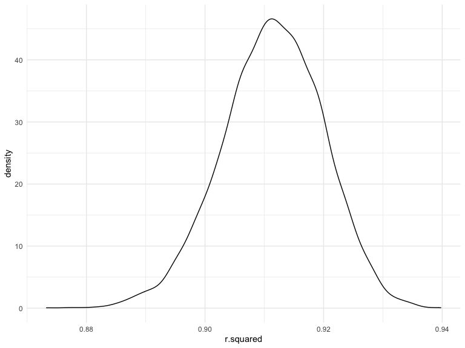
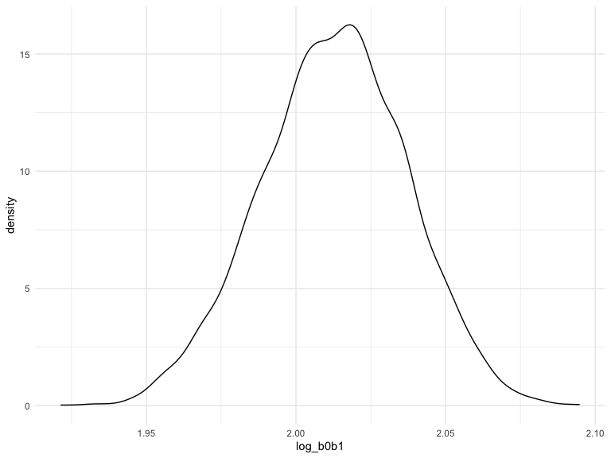

Homework 6
================
Erfan Faridmoayer

### Problem 1

To obtain a distribution for $\hat{r}^2$, we’ll follow basically the
same procedure we used for regression coefficients: draw bootstrap
samples; the a model to each; extract the value I’m concerned with; and
summarize. Here, we’ll use `modelr::bootstrap` to draw the samples and
`broom::glance` to produce `r.squared` values.

``` r
weather_df = 
  rnoaa::meteo_pull_monitors(
    c("USW00094728"),
    var = c("PRCP", "TMIN", "TMAX"), 
    date_min = "2017-01-01",
    date_max = "2017-12-31") %>%
  mutate(
    name = recode(id, USW00094728 = "CentralPark_NY"),
    tmin = tmin / 10,
    tmax = tmax / 10) %>%
  select(name, id, everything())
```

    ## Registered S3 method overwritten by 'hoardr':
    ##   method           from
    ##   print.cache_info httr

    ## using cached file: ~/Library/Caches/R/noaa_ghcnd/USW00094728.dly

    ## date created (size, mb): 2022-10-04 09:44:45 (8.408)

    ## file min/max dates: 1869-01-01 / 2022-10-31

``` r
weather_df %>% 
  modelr::bootstrap(n = 50) %>% 
  mutate(
    models = map(strap, ~lm(tmax ~ tmin, data = .x) ),
    results = map(models, broom::glance)) %>% 
  select(-strap, -models) %>% 
  unnest(results) %>% 
  ggplot(aes(x = r.squared)) + geom_density()
```



In this example, the $\hat{r}^2$ value is high, and the upper bound at 1
may be a cause for the generally skewed shape of the distribution. If we
wanted to construct a confidence interval for $R^2$, we could take the
2.5% and 97.5% quantiles of the estimates across bootstrap samples.
However, because the shape isn’t symmetric, using the mean +/- 1.96
times the standard error probably wouldn’t work well.

We can produce a distribution for $\log(\beta_0 * \beta1)$ using a
similar approach, with a bit more wrangling before we make our plot.

``` r
weather_df %>% 
  modelr::bootstrap(n = 50) %>% 
  mutate(
    models = map(strap, ~lm(tmax ~ tmin, data = .x) ),
    results = map(models, broom::tidy)) %>% 
  select(-strap, -models) %>% 
  unnest(results) %>% 
  select(id = `.id`, term, estimate) %>% 
  pivot_wider(
    names_from = term, 
    values_from = estimate) %>% 
  rename(beta0 = `(Intercept)`, beta1 = tmin) %>% 
  mutate(log_b0b1 = log(beta0 * beta1)) %>% 
  ggplot(aes(x = log_b0b1)) + geom_density()
```



As with $r^2$, this distribution is somewhat skewed and has some
outliers.

The point of this is not to say you should always use the bootstrap –
it’s possible to establish “large sample” distributions for strange
parameters / values / summaries in a lot of cases, and those are great
to have. But it is helpful to know that there’s a way to do inference
even in tough cases.

### Problem 2

``` r
homocide_df = 
read_csv("./data/homicide-data.csv") %>% 
  janitor::clean_names() %>% 
  mutate(
    city_state = str_c(city, ", ", state),
    resolved = ifelse(disposition == "Closed by arrest", 1, 0)
    ) %>%
  filter(!city_state == "Dallas, Tx", !city_state == "Phoenix, AZ", !city_state == "Kansas City, MO", !city_state == "Tulsa, AL", !victim_age == "Unknown") %>% 
    mutate(victim_age = as.numeric(victim_age)) %>% 
  filter(victim_race == c("Black", "White"))
```

    ## Rows: 52179 Columns: 12
    ## ── Column specification ────────────────────────────────────────────────────────
    ## Delimiter: ","
    ## chr (9): uid, victim_last, victim_first, victim_race, victim_age, victim_sex...
    ## dbl (3): reported_date, lat, lon
    ## 
    ## ℹ Use `spec()` to retrieve the full column specification for this data.
    ## ℹ Specify the column types or set `show_col_types = FALSE` to quiet this message.

In the code chunk above, I used the `homocide-data` database to create a
dataframe, added the `city_state` variable, removed Tulsa, Kansas City,
Phoenix, and Dallas using `filter()` function, created a new variable
`solved` to post whether a case was solved or not, with 1 showing
solved, and 0 showing not. The `victim_age` column was converted to
numerical vector after tidy of unknown variables. Lastly, Black and
White races were filtered.

``` r
fit_logistic = 
  homocide_df %>% 
  filter(city_state == "Baltimore, MD") %>% 
  mutate(victim_sex = fct_relevel(victim_sex, "Male")) %>% 
  glm(resolved ~ victim_age + victim_race + victim_sex, data = ., family = binomial()) 
```

In the code chunk above, I filtered out Baltimore, MD from `city_state`
variable. I then used the `glm` function to fit a logistic regression
with resolved vs unresolved as the outcome and victim, age, sex, and
race as predictors. The output of the model was saved as an object in
`fit_logistic`.

``` r
fit_logistic %>% 
  broom::tidy() %>% 
  mutate(OR = exp(estimate)) %>%
  mutate(
    ci_lower = exp(estimate-1.96*std.error),
    ci_upper = exp(estimate+1.96*std.error)
  ) %>% 
  knitr::kable(digits = 3)
```

| term             | estimate | std.error | statistic | p.value |    OR | ci_lower | ci_upper |
|:-----------------|---------:|----------:|----------:|--------:|------:|---------:|---------:|
| (Intercept)      |   -0.639 |     0.149 |    -4.277 |   0.000 | 0.528 |    0.394 |    0.708 |
| victim_age       |   -0.003 |     0.005 |    -0.662 |   0.508 | 0.997 |    0.988 |    1.006 |
| victim_raceWhite |    0.779 |     0.239 |     3.256 |   0.001 | 2.179 |    1.364 |    3.482 |
| victim_sexFemale |    0.758 |     0.196 |     3.869 |   0.000 | 2.133 |    1.453 |    3.132 |

Above, I used the `broom::tidy` package to tidy the object, and obtained
OR based on the estimate, as well as the confidence intervals. Based on
the results, we can tell that female victims had a lower likelihood of
having their case resolved compared to male victims when keeping all
other variables fixed.

``` r
city_glm =
homocide_df %>% 
  nest(data = -city_state) %>% 
  mutate(
    models = map(data, ~glm(resolved ~ victim_age + victim_race + victim_sex, data = ., family = binomial())),
    results = map(models, broom::tidy, conf.int = TRUE)
  ) %>% 
  select(-data, -models) %>% 
  unnest(results)
```
